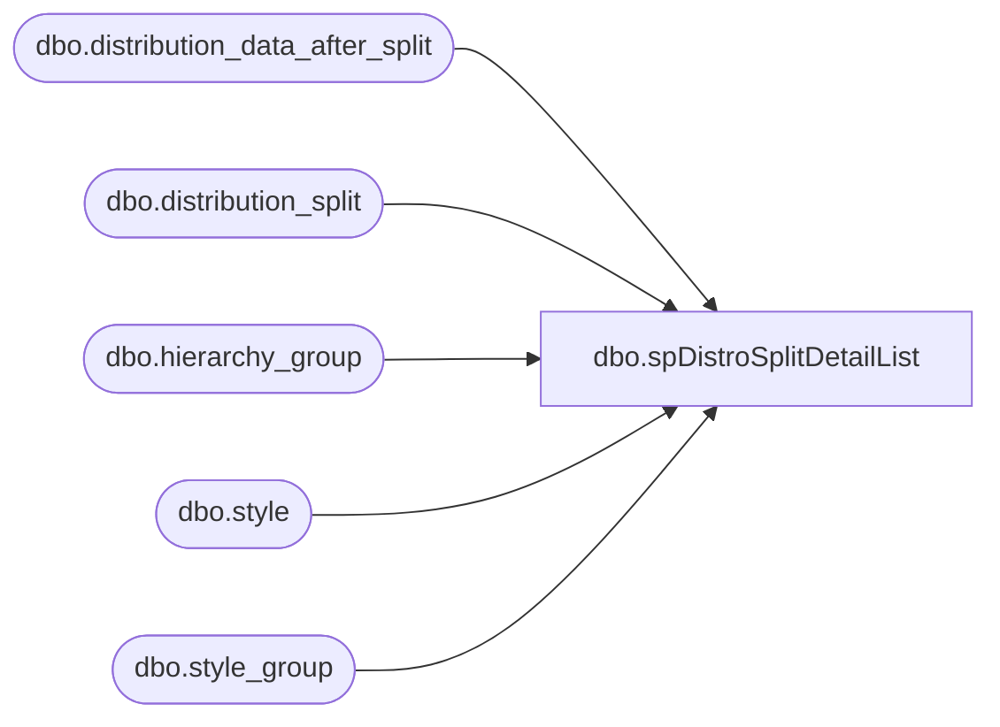

# dbo.spDistroSplitDetailList

**Database:** me_01  
**Server:** bedrockdb02  

## Architecture Diagram



## Table Dependencies

| Referenced Table |
|---|
| dbo.distribution_data_after_split |
| dbo.distribution_split |
| dbo.hierarchy_group |
| dbo.style |
| dbo.style_group |

## Stored Procedure Code

```sql
-- =============================================
-- Author:		Gary Murrish
-- Create date: 9/20/2011
-- Description:	Distro Split Detail Listing
-- =============================================
CREATE procEDURE [dbo].[spDistroSplitDetailList]
-- Add the parameters for the stored procedure here
@selSource AS INT
, @selDestination AS INT
, @forDate AS DATETIME
	WITH RECOMPILE
AS
BEGIN
	-- SET NOCOUNT ON added to prevent extra result sets from
	-- interfering with SELECT statements.
	SET NOCOUNT ON;

	SET @forDate = DATEADD(dd, DATEDIFF(dd, 0, @forDate), 0);
	DECLARE
	   @forDatePlus1 AS DATETIME;
	SET @forDatePlus1 = DATEADD(Second, -1, DATEADD(DAY, 1, @forDate));

	SELECT
		   *
		 , CASE
		   WHEN SortType = 0 THEN 'Active Pick'
		   WHEN SortType = 1 THEN 'Rec TYPE 11'
		   WHEN SortType = 2 THEN 'Merchandise'
		   WHEN SortType = 3 THEN 'Supplies'
			   ELSE '?' + CAST(SortType AS VARCHAR)
		   END AS sortTypeName
	  FROM(
		   SELECT
				  dSplit.distribution_number
				, DATEADD(dd, DATEDIFF(dd, 0, dsplit.release_date), 0)AS release_date
				, DATEADD(dd, DATEDIFF(dd, 0, dafter.release_date), 0)AS after_release_date
				, dSplit.destid
				, dSplit.sourceid
				, dSplit.style_code
				, s.short_desc
				, SortType = CASE
							 WHEN dSplit.active_pick_flag = 'Y' THEN 0
							 WHEN dSplit.rec_type = 11 THEN 1
							 WHEN SUBSTRING(hg.hierarchy_group_code, 7, 2) <> '60' THEN 2
								 ELSE 3
							 END
				, dSplit.quantity AS OriginalQty
				, dAfter.quantity AS SplitDataQty
				, dSplit.rec_type AS OriginalRecType
				, dAfter.rec_type AS SplitDataRecType
				, dSplit.active_pick_flag
				, dSplit.released
				, DATEADD(dd, DATEDIFF(dd, 0, dsplit.exported_date), 0)AS exported_date
			 FROM
				  distribution_split AS dSplit WITH (NOLOCK)
				  INNER JOIN distribution_data_after_split AS dAfter WITH (NOLOCK)
					  ON dAfter.Id = dSplit.id
				  INNER JOIN style s WITH (NOLOCK)
					  ON dSplit.style_code = s.style_code
				  INNER JOIN style_group sg WITH (NOLOCK)
					  ON s.style_id = sg.style_id
				  INNER JOIN hierarchy_group hg WITH (NOLOCK)
					  ON sg.hierarchy_group_id = hg.hierarchy_group_id
			 WHERE CAST(dSplit.destid AS INTEGER) = @selDestination
			   AND CAST(dsplit.sourceid AS INTEGER) = @selSource
			   AND dSplit.exported_date BETWEEN @fordate
			   AND @forDatePlus1)AS base
	  ORDER BY
			   base.destid, base.sourceid, base.SortType, base.OriginalRecType, base.style_code DESC, base.SplitDataRecType;

END;
```

