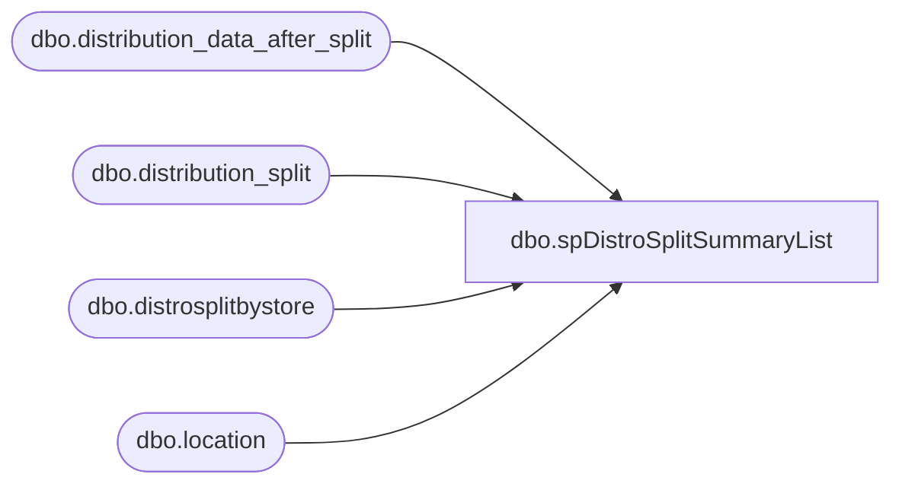

# dbo.spDistroSplitSummaryList

**Database:** me_01  
**Server:** bedrockdb02  

## Architecture Diagram



## Table Dependencies

| Referenced Table |
|---|
| dbo.distribution_data_after_split |
| dbo.distribution_split |
| dbo.distrosplitbystore |
| dbo.location |

## Stored Procedure Code

```sql
-- =============================================
-- Author:		Gary Murrish
-- Create date: 9/20/2011
-- Description:	Distro Split Summary Listing
-- =============================================
CREATE procEDURE [dbo].[spDistroSplitSummaryList]
-- Add the parameters for the stored procedure here
@fromDate AS DATETIME = NULL
, @thruDate AS DATETIME = NULL
, @selDest AS INT = NULL
, @selSource AS INT = NULL
, @selOnlyProblems AS VARCHAR(3) = NULL
	WITH RECOMPILE
AS
BEGIN
	-- SET NOCOUNT ON added to prevent extra result sets from
	-- interfering with SELECT statements.
	SET NOCOUNT ON;

	IF @fromDate IS NULL
		SET @fromDate = DATEADD(dd, DATEDIFF(dd, 0, DATEADD(DAY, -1, GETDATE())), 0);
	IF @thruDate IS NULL
		SET @thruDate = @fromDate;
	DECLARE
	   @thruDatePlus1 DATETIME;
	SET @thruDatePlus1 = DATEADD(Second, -1, DATEADD(DAY, 1, @thruDate));

	IF OBJECT_ID('tempdb..#tmpBeforeSplit')IS NOT NULL
		DROP TABLE
			 #tmpBeforeSplit;
	SELECT
		   destid
		 , sourceid
		 , SUM(quantity)AS totalListedQuantity
		 , COUNT(id)AS LineCount
		 , SUM(quantity)AS CartonsOther
		 , DATEADD(dd, DATEDIFF(dd, 0, exported_date), 0)AS exportedDateOnly INTO
																				  #tmpBeforeSplit
	  FROM distribution_split AS sumActivePick WITH (NOLOCK)
	  WHERE exported_date BETWEEN @fromDate
		AND @thruDatePlus1
		AND (CASE
			 WHEN @selDest IS NULL THEN 1
				 ELSE CASE
					  WHEN destID = @selDest THEN 1
						  ELSE 0
					  END
			 END = 1)
		AND (CASE
			 WHEN @selSource IS NULL THEN 1
				 ELSE CASE
					  WHEN sourceID = @selSource THEN 1
						  ELSE 0
					  END
			 END = 1)
	  GROUP BY
			   destid
			 , sourceid
			 , DATEADD(dd, DATEDIFF(dd, 0, exported_date), 0);

	IF OBJECT_ID('tempdb..#tmpAfterSplit')IS NOT NULL
		DROP TABLE
			 #tmpAfterSplit;
	SELECT
		   COUNT(Id)AS LineCountAfterSplit
		 , SUM(quantity)AS totalQtyAfterSplit
		 , SourceID
		 , DestID
		 , DATEADD(dd, DATEDIFF(dd, 0, release_date), 0)AS releaseDateOnly INTO
																				#tmpAfterSplit
	  FROM distribution_data_after_split WITH (NOLOCK)
	  WHERE release_date BETWEEN @fromDate
		AND @thruDatePlus1
	  GROUP BY
			   SourceID
			 , DestID
			 , DATEADD(dd, DATEDIFF(dd, 0, release_date), 0);
	SELECT
		  *
	  FROM(
		   SELECT
				  dSplit.exportedDateOnly
				, CAST(dSplit.destid AS SMALLINT)AS destID
				, destLocn.location_name AS destName
				, CAST(dSplit.sourceid AS SMALLINT)AS sourceID
				, sourcelocn.location_name AS sourceName
				, CartonsActivePick = CASE
									  WHEN ISNULL(dSplit.CartonsOther, 0) < dSplit.totalListedQuantity THEN 2
										  ELSE 0
									  END
				, ISNULL(dSplit.CartonsOther, 0)AS CartonsOther
				, TotalShippingCartons = CASE
										 WHEN ISNULL(dSplit.CartonsOther, 0) < dSplit.totalListedQuantity THEN ISNULL(dSplit.CartonsOther, 0) + 2
											 ELSE dSplit.CartonsOther
										 END
				, CASE isSmallStockRoom
				  WHEN 1 THEN 'Yes'
					  ELSE 'No'
				  END AS 'Small Stock Room?'
				, CartonsPerSplit
				, NumberOfSplits
				, 'Will Shipment Split' = CASE
										  WHEN isSmallStockRoom = 0 THEN 'NO'
										  WHEN isSmallStockRoom = 1
										   AND NumberOfSplits > 0 THEN 'YES'
										  WHEN isSmallStockRoom = 1
										   AND NumberOfSplits <= 0
										   AND ISNULL(dSplit.CartonsOther, 0) < dSplit.totalListedQuantity
										   AND CartonsOther + 2 > CartonsPerSplit THEN 'YES'
										  WHEN isSmallStockRoom = 1
										   AND NumberOfSplits <= 0
										   AND ISNULL(dSplit.CartonsOther, 0) >= dSplit.totalListedQuantity
										   AND CartonsOther > CartonsPerSplit THEN 'YES'
											  ELSE 'NO'
										  END
				, dSplit.LineCount 'Before Split Line Count'
				, ISNULL(dataAfterSplit.LineCountAfterSplit, 0)AS 'After Split Line Count'
				, dSplit.totalListedQuantity AS 'totalQtyBeforeSplit'
				, dataAfterSplit.totalQtyAfterSplit
				, CASE
				  WHEN dsplit.linecount > ISNULL(dataAfterSplit.LineCountAfterSplit, 0)THEN 1
					  ELSE 0
				  END AS problemSplitLine
				, CASE
				  WHEN dsplit.totalListedQuantity <> dataaftersplit.totalQtyAfterSplit THEN 1
					  ELSE 0
				  END AS problemQuantity
			 FROM
				  #tmpBeforeSplit AS dSplit
				  INNER JOIN dbo.distrosplitbystore AS storeInfo WITH (NOLOCK)
					  ON storeInfo.Store_num = CAST(dSplit.destId AS INT)
					 AND storeInfo.Warehouse_num = CAST(dSplit.sourceId AS INT)
				  LEFT JOIN #tmpAfterSplit AS dataAfterSplit
					  ON dSplit.destid = dataAfterSplit.DestID
					 AND dSplit.sourceid = dataAfterSplit.SourceID
					 AND dSplit.exportedDateOnly = dataAfterSplit.releaseDateOnly
				  INNER JOIN dbo.location AS destLocn WITH (NOLOCK)
					  ON CAST(dSplit.destid AS INT) = CAST(destLocn.location_code AS INT)
				  INNER JOIN dbo.location AS sourceLocn WITH (NOLOCK)
					  ON CAST(dSplit.sourceid AS INT) = CAST(sourceLocn.location_code AS INT))finalQuery
	  WHERE CASE
			WHEN ISNULL(@selOnlyProblems, 'No') = 'Yes' THEN CASE
															 WHEN finalQuery.problemSplitLine + finalquery.problemQuantity > 0 THEN 1
																 ELSE 0
															 END
				ELSE 1
			END = 1
	  ORDER BY
			   exportedDateOnly, destid, sourceid;

END;
```

