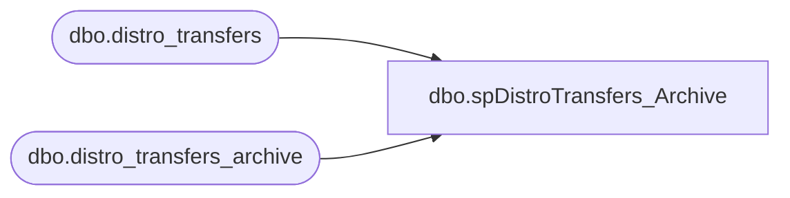

# dbo.spDistroTransfers_Archive

**Database:** me_01  
**Server:** bedrockdb02  

## Architecture Diagram



## Table Dependencies

| Referenced Table |
|---|
| dbo.distro_transfers |
| dbo.distro_transfers_archive |

## Stored Procedure Code

```sql
CREATE procEDURE [dbo].[spDistroTransfers_Archive] AS

declare @LoopCount as integer
declare @i as integer
set @i = 1
set @LoopCount = 10000

while (@i <= @LoopCount)
begin
	print @i

	-- remove any users that haven't placed an order AND are from temporary accounts
	-- we do not want to delete accounts that have wishlists or that have valid account information in case they come back and place an order
	-- these folks are given 13 months by another process and then they are archived
	IF (Object_ID('tempdb..##deleteme') IS NOT NULL) DROP TABLE ##deleteme
	select top 100 id, sourceid, destid, upc_number, quantity, groupinglabel, description, rec_type, loaded_date, documentnumber, linenumber, reasoncode, exported_date, tpm_exported_date
	into ##deleteme
	from distro_transfers u with (nolock)
	where loaded_date < dateadd(mm, -1, getdate())

	if (select count(*) from ##deleteme) = 0 
	begin
		set @i = @LoopCount
	end


	insert into distro_transfers_archive (id, sourceid, destid, upc_number, quantity, groupinglabel, description, rec_type, loaded_date, documentnumber, linenumber, reasoncode, exported_date, tpm_exported_date)
	select id, sourceid, destid, upc_number, quantity, groupinglabel, description, rec_type, loaded_date, documentnumber, linenumber, reasoncode, exported_date, tpm_exported_date
	from ##deleteme
	
	delete from distro_transfers
	from distro_transfers uo
		join ##deleteme t
		on t.id = uo.id

	set @i = @i + 1
end
```

