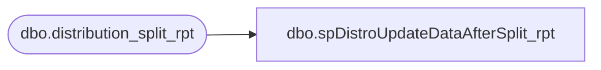

# dbo.spDistroUpdateDataAfterSplit_rpt

**Database:** me_01  
**Server:** bedrockdb02  

## Architecture Diagram



## Table Dependencies

| Referenced Table |
|---|
| dbo.distribution_split_rpt |

## Stored Procedure Code

```sql
CREATE procEDURE [dbo].[spDistroUpdateDataAfterSplit_rpt]
-- =============================================================================================================
-- Name: spDistroUpdateDataAfterSplit
--
-- Description:	
--
-- Input:		@id
--
-- Output: 
--
-- Dependencies: 
--
-- Revision History
--		Name:			Date:			Comments:
--		Keith Missey	5/21/2010		added exported date
-- =============================================================================================================
	(
	@id bigint
	)
	
AS
	/* SET NOCOUNT ON */ 
	UPDATE distribution_split_rpt set released = 1, exported_date = GetDate() where id = @id
```

