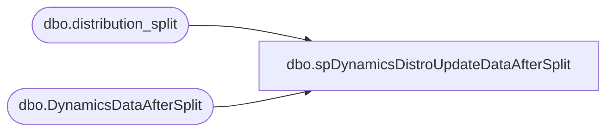

# dbo.spDynamicsDistroUpdateDataAfterSplit

**Database:** me_01  
**Server:** bedrockdb02  

## Architecture Diagram



## Table Dependencies

| Referenced Table |
|---|
| dbo.distribution_split |
| dbo.DynamicsDataAfterSplit |

## Stored Procedure Code

```sql
create procEDURE [dbo].[spDynamicsDistroUpdateDataAfterSplit]
-- =============================================================================================================
-- Name: spDynamicsDistroUpdateDataAfterSplit
--
-- Description:	
--
-- Input:		@id
--
-- Output: 
--
-- Dependencies: 
--
-- Revision History
--		Name:			Date:			Comments:
--		Keith Missey	5/21/2010		added exported date
--		Dan Tweedoe		2022-08-10		added handling to catch orders which got through to the after split table but are still staged for processing
-- =============================================================================================================
	(
	@id bigint
	)
	
AS
	/* SET NOCOUNT ON */ 
	UPDATE distribution_split set released = 1, exported_date = GetDate() where id = @id  

	--updated 2022-08-10	
	UPDATE ds 
	set released = 1
	from distribution_split ds
	where isnumeric(distribution_number)=0
	and released=0
	and exists (select das.distribution_number 
					from DynamicsDataAfterSplit das with (nolock)
					where das.distribution_number =ds.distribution_number
					and das.sourceid=ds.sourceid
					and das.destid=ds.destid
					and das.style_code=ds.style_code
				)
```

