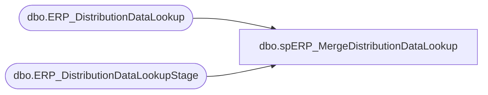

# dbo.spERP_MergeDistributionDataLookup

**Database:** me_01  
**Server:** bedrockdb02  

## Architecture Diagram



## Table Dependencies

| Referenced Table |
|---|
| dbo.ERP_DistributionDataLookup |
| dbo.ERP_DistributionDataLookupStage |

## Stored Procedure Code

```sql
CREATE PROC [dbo].[spERP_MergeDistributionDataLookup] 

as 

Merge into ERP_DistributionDataLookup as target
Using ERP_DistributionDataLookupStage as source
On (
		isnull(target.OrderID, 'xxx') = isnull(source.OrderID, 'xxx')
		AND
		isnull(target.PickListID, 'xxx') = isnull(source.PickListID, 'xxx')
		AND
		isnull(target.Entity,'xxx') = isnull(source.Entity,'xxx')
		and 
		isnull(target.ItemNumber,'xxx') = isnull(source.ItemNumber,'xxx')
	)

When Not Matched By Target 
	Then 
		Insert (
					Entity,
					OrderID,
					PickListID,
					OrderType,
					SequenceNumber,
					ItemNumber,
					UnconvertedQty,
					ConvertedQty,
					SalePrice,
					MerchOrSupply,
					DistributionMultiple,
					ColorCode,
					VendorStyle,
					ShortDescription
				)
		Values (	
					source.Entity,
					source.OrderID,
					source.PickListID,
					source.OrderType,
					source.SequenceNumber,
					source.ItemNumber,
					source.UnconvertedQty,
					source.ConvertedQty,
					source.SalePrice,
					source.MerchOrSupply,
					source.DistributionMultiple,
					source.ColorCode,
					source.VendorStyle,
					source.ShortDescription
				)
;
```

