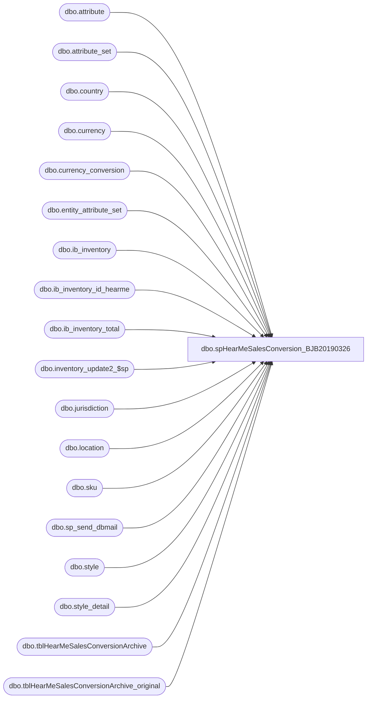

# dbo.spHearMeSalesConversion_BJB20190326

**Database:** me_01  
**Server:** bedrockdb02  

## Architecture Diagram



## Table Dependencies

| Referenced Table |
|---|
| dbo.attribute |
| dbo.attribute_set |
| dbo.country |
| dbo.currency |
| dbo.currency_conversion |
| dbo.entity_attribute_set |
| dbo.ib_inventory |
| dbo.ib_inventory_id_hearme |
| dbo.ib_inventory_total |
| dbo.inventory_update2_$sp |
| dbo.jurisdiction |
| dbo.location |
| dbo.sku |
| dbo.sp_send_dbmail |
| dbo.style |
| dbo.style_detail |
| dbo.tblHearMeSalesConversionArchive |
| dbo.tblHearMeSalesConversionArchive_original |

## Stored Procedure Code

```sql
CREATE procedure [dbo].[spHearMeSalesConversion_BJB20190326]

as

-- =====================================================================================================
-- Name: spHearMeSalesConversion
--
-- Description:	Captures record of Sound sales transactions, negates the transactions in Merch, 
--				inserts new transactions for the physical universal sound sku.
--				Send email to report number of original, negated and universal transactions processed.
--
-- Input:	NA
--			
--
-- Output: 
--			
--
-- Dependencies: 
--
-- Revision History
--		Name:			Date:			Comments:
--		Dan Tweedie		04/25/2012		Created proc.	--based on spHearMeSalesConversion_bak20120425
--		Dan Tweedie		05/04/2012		Added parameter to show max(ib_inventory_id) at beginning of process, for comparison at the end of the process
--		Dan Tweedie		06/08/2012		max(ib_inventory_id) no longer needed, but I'm leaving it there anyway, it's just being captured and not used at this point.
--		Dan Tweedie		06/08/2012		Added input of new data into temp table before prod table, this is used to query from at the end.
--		Dan Tweedie		01/29/2013		Set value to 0 for insert of transaction_valuation_retail and transaction_selling_retail when inserting record for universal sound sku
--		Dan Tweedie		06/24/2013		Removed hard code 0 transaction_valuation_retail and transaction_selling_retail, reversing the change made on 1/29/2013
--      Keith Lee		07/19/2015		Added new columns for ib_inventory Merch 5.0 system.
--		Dan Tweedie		08/18/2015		Added code to stage data for insert into ib_inventory_total, and call Aptos proc. 
--		Keith Lee		02/24/2016		Added these fields to be recorded in the negatation transaction_no,batch_no,register_no
--		Keith Lee		03/08/2016		Added code to build average cost of all blank sounds and then use cost of the blank sound instead of the selling sound.
-- =====================================================================================================


-- Find Sales for new HearMe Sounds, insert into archive table
--- this table can now be our point of reference for historical reference of the original sound transaction
------only good from 04/12/2012 and forward
declare @trans_id int
select @trans_id = max(ib_inventory_id) from ib_inventory (nolock)

truncate table tblHearMeSalesConversionArchive_original


insert tblHearMeSalesConversionArchive_original
select  ii.ib_inventory_id,
		getdate() proc_date,
		ii.sku_id, 
		ii.location_id, 
		ii.price_status_id, 
		ii.transaction_date, 
		ii.transaction_type_code, 
		ii.inventory_status_id, 
		ii.other_location_id, 
		ii.transaction_reason_id, 
		ii.document_number, 
		ii.transaction_units, 
		ii.transaction_cost, 
		ii.transaction_valuation_retail, 
		ii.transaction_selling_retail, 
		ii.price_change_type, 
		ii.units_affected,
		s.style_code,
		s.short_desc,
		l.location_code, 
		ii.transaction_cost_local,
		ii.updated_flag,
		ii.transaction_no,
		ii.batch_no,
		ii.register_no
from	ib_inventory ii
inner join sku sk (nolock) on ii.sku_id = sk.sku_id
inner join style s (nolock) on sk.style_id = s.style_id
inner join location l (nolock) on ii.location_id = l.location_id
inner join entity_attribute_set eas_m (nolock) on s.style_id = eas_m.parent_id
inner join attribute_set ats_m (nolock) on eas_m.attribute_set_id = ats_m.attribute_set_id
inner join attribute a_m (nolock) on eas_m.attribute_id = a_m.attribute_id
where   a_m.attribute_code = 'MSOUND'
and		ii.transaction_type_code in (600,601,603,605,610,615)
and		ii.ib_inventory_id > (select ib_inventory_id from ib_inventory_id_hearme)
order by ii.transaction_date

if (select count(*) from tblHearMeSalesConversionArchive_original) > 0

begin

	---archive data permanently -- -I left this a separate step to make it easier to manually run the process if necessary
	--if we need to investigate later, this table will be helpful.
	insert tblHearMeSalesConversionArchive
	select * 
	from tblHearMeSalesConversionArchive_original
    ------------------------------------------------------------------------------------
    --take snapshot so we can capture the totals at the end
    IF (Object_ID('tempdb..#negated') IS NOT NULL) DROP TABLE #negated
    select  
			t.sku_id, 
			t.location_id, 
			t.price_status_id, 
			t.transaction_date, 
			t.transaction_type_code, 
			t.inventory_status_id, 
			t.other_location_id, 
			t.transaction_reason_id, --tr.transaction_reason_code,
			t.document_number, 
			t.transaction_units * -1 as transaction_units, 
			t.transaction_cost * -1 as transaction_cost, 
			t.transaction_valuation_retail * -1 as transaction_valuation_retail, 
			t.transaction_selling_retail * -1 as transaction_selling_retail, 
			t.price_change_type, 
			t.units_affected *-1 as units_affected,
			t.transaction_cost_local * -1 as transaction_cost_local,
			t.updated_flag,
			t.transaction_no,
			t.batch_no,
			t.register_no
	into #negated
	from	tblHearMeSalesConversionArchive_original t
    
	------------------------------------------------------------------------------------
	------- GRAB AVERAGE COST FOR BLANK SOUND

	IF (Object_ID('tempdb..#blank_sound_average_cost') IS NOT NULL) DROP TABLE #blank_sound_average_cost
 	 SELECT s.style_code,
			l.location_code,
		CASE 
			WHEN  sum(total_on_hand_cost) <= 0 or sum(iit.total_on_hand_units) = 0 
				THEN sd.last_net_final_po_cost
			ELSE sum(iit.total_on_hand_cost) / sum(iit.total_on_hand_units)
			END average_cost,

		CASE 
			WHEN sum(total_on_hand_cost) <= 0 or sum(iit.total_on_hand_units) =0
				THEN round((sd.last_net_final_po_cost) * (1/cc.exchange_rate),2)
			ELSE sum(iit.total_on_hand_cost_local) / sum(iit.total_on_hand_units)
			END average_cost_local
	into #blank_sound_average_cost
	FROM (
		SELECT sku_id,
			location_id,
			total_on_hand_units,
			total_on_hand_cost,
			total_on_hand_cost_local
		FROM ib_inventory_total(NOLOCK)
		) iit
	INNER JOIN sku sk(NOLOCK) ON iit.sku_id = sk.sku_id
	INNER JOIN style s(NOLOCK) ON sk.style_id = s.style_id
	INNER JOIN style_detail sd(NOLOCK) ON s.style_id = sd.style_id
	inner join location l (NOLOCK) ON iit.location_id = l.location_id
	inner join	jurisdiction j (NOLOCK) on l.jurisdiction_id = j.jurisdiction_id
	inner join	country c (NOLOCK) on j.country_id = c.country_id
	inner join	currency cu (NOLOCK) on c.currency_id = cu.currency_id
	inner join	currency_conversion cc (NOLOCK) on cu.currency_id = cc.to_currency_id
	where s.style_code in ('016615','116615','416615')
	and	cc.from_currency_id = 1
	and cc.currency_conversion_type = 1
	and	getdate() between cc.effective_from_date and isnull(cc.effective_to_date,getdate()+1)
	GROUP BY s.style_code, s.short_desc, l.location_code,cc.exchange_rate, sd.last_net_final_po_cost

	IF (Object_ID('tempdb..#sound') IS NOT NULL) DROP TABLE #sound
	select  sk_m.sku_id, 
			t.location_id, 
			t.price_status_id, 
			t.transaction_date, 
			t.transaction_type_code, 
			t.inventory_status_id, 
			t.other_location_id, 
			t.transaction_reason_id, --tr.transaction_reason_code,
			s.style_code as document_number, 
			t.transaction_units, 
			cast ((bsac.average_cost * t.transaction_units) as decimal(10,2)) as transaction_cost,
			t.transaction_valuation_retail, --removed hard coded '0' 06/24/2013 Dan T
			t.transaction_selling_retail, --removed hard coded '0' 06/24/2013 Dan T
			t.price_change_type, 
			t.units_affected  as units_affected,
			cast ((bsac.average_cost_local * t.transaction_units) as decimal(10,2)) as transaction_cost_local,
			t.updated_flag,
			t.transaction_no,
			t.batch_no,
			t.register_no
	into #sound
	from	tblHearMeSalesConversionArchive_original t
	inner join sku sk (nolock) on t.sku_id = sk.sku_id
	inner join style s (nolock) on sk.style_id = s.style_id
	inner join location l (nolock) on t.location_id = l.location_id
	inner join entity_attribute_set eas_m (nolock) on s.style_id = eas_m.parent_id
	inner join attribute_set ats_m (nolock) on eas_m.attribute_set_id = ats_m.attribute_set_id
	inner join attribute a_m (nolock) on eas_m.attribute_id = a_m.attribute_id
	inner join style s_m (nolock) on ats_m.attribute_set_label = s_m.style_code
	inner join sku sk_m (nolock) on s_m.style_id = sk_m.style_id
	inner join #blank_sound_average_cost bsac on s_m.style_code = bsac.style_code and l.location_code = bsac.location_code
	where a_m.attribute_code = 'MSOUND'
	order by t.transaction_date
		
	------------------------------------------------------------------------------------
	-------STAGE DATA FOR INSERT INTO IB_INVENTORY_TOTAL
	
	IF (Object_ID('me_01..tmpStageIb_Inventory_Total') IS NOT NULL) DROP TABLE tmpStageIb_Inventory_Total
	SELECT sku_id, 
		   location_id, 
		   price_status_id,
		   transaction_date,
		   transaction_type_code,
		   inventory_status_id,
		   other_location_id,
		   transaction_reason_id,
		   document_number,
		   transaction_units,
		   transaction_cost,
		   transaction_cost_local,
		   transaction_valuation_retail, 
		   transaction_selling_retail,
		   price_change_type,
		   units_affected,
		   transaction_no,
		   batch_no,
		   register_no
	INTO tmpStageIb_Inventory_Total
	from #negated
	union all
	SELECT sku_id, 
		   location_id, 
		   price_status_id,
		   transaction_date,
		   transaction_type_code,
		   inventory_status_id,
		   other_location_id,
		   transaction_reason_id,
		   document_number,
		   transaction_units,
		   transaction_cost,
		   transaction_cost_local,
		   transaction_valuation_retail, 
		   transaction_selling_retail,
		   price_change_type,
		   units_affected,
		   transaction_no,
		   batch_no,
		   register_no
	from #sound

	--CALL EPICOR PROC TO INSERT STAGED DATA
	EXEC inventory_update2_$sp 'SELECT sku_id, location_id, price_status_id,transaction_date,transaction_type_code,
              inventory_status_id,other_location_id,transaction_reason_id,document_number,transaction_units,transaction_cost,transaction_cost_local,
              transaction_valuation_retail, transaction_selling_retail,price_change_type,units_affected FROM tmpStageIb_Inventory_Total'

-- Update ib_inventory_id so we capture any new transctions next time the code runs.
	update  ib_inventory_id_hearme
	set ib_inventory_id = (select max(ib_inventory_id) as ib_inventory_id from ib_inventory with (nolock))
	--------------------------------------------------------------------------------------------------

	--send email summary
	declare @original int,
			@negate int,
			@sound int
			
	select @original = count(*) from tblHearMeSalesConversionArchive_original
	
	select @negate = count(*) from #negated
			
	select @sound = count(*) from #sound
			

	declare @text nvarchar(max)
	
	 
	set @text = '<font face =arial size = 2></font>' + 
				'<font face =arial size = 2>' + 
				'The HearMe Sales Conversion Process has completed.' +
				'<br>'+
				'Total Sound Transactions: ' + convert(varchar,@original) +
				'<br>' +
				'Total Negated Transactions: ' + convert(varchar,@negate) +
				'<br>' +
				'Total Universal Sound Transactions: ' + convert(varchar,@sound) +
					'</font></p></p> <br><br><br>'
		


	exec msdb.dbo.sp_send_dbmail
	@profile_name = 'merchadmin',
	@recipients = 'merchadmin@buildabear.com', 
	@body = @text,
	@subject = 'HearMe Sales Conversion Process Complete',
	@body_format = 'HTML'


end
```

