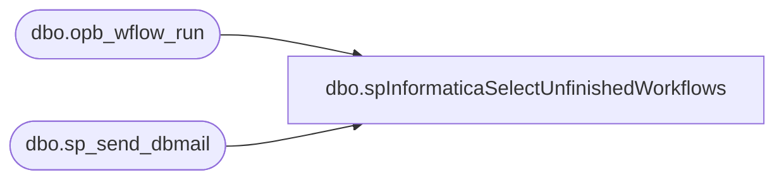

# dbo.spInformaticaSelectUnfinishedWorkflows

**Database:** me_01  
**Server:** bedrockdb02  

## Architecture Diagram



## Table Dependencies

| Referenced Table |
|---|
| dbo.opb_wflow_run |
| dbo.sp_send_dbmail |

## Stored Procedure Code

```sql
CREATE proc [dbo].[spInformaticaSelectUnfinishedWorkflows]

as 

-- =====================================================================================================
-- Name: spInformaticaSelectUnfinishedWorkflows
--
-- Description:	Queries Informatica on wmetl01 to look for workflows that have been running for at least 15 minutes, sends email and text alert.
--
-- Input: 
--
-- Output: 
--
-- Dependencies: 
--
-- Revision History
--		Name:			Date:			Comments:
--		Dan Tweedie		12/17/2012		Created proc.	
-- =====================================================================================================

set nocount on


--look for workflows that are NOT the pipeline processs and are not TPM export

IF (Object_ID('tempdb..#a') IS NOT null) DROP TABLE #a
select workflow_name, start_time, case when run_status_code = 3 then 'failed' else 'running' end as run_status
into #a
from wmetl01.wm_repo.dbo.opb_wflow_run
where end_time is null
and datediff(mi, start_time, getdate()) >= 15
and workflow_name not in ('wf_PIPELINE_SALES_POSTING_V1', 'wf_HOST_to_TPM_PO_Upload_V1')


if (select count(*) from #a) > 0
	begin

		declare @text nvarchar(max)
				set @text = '
				<font face =arial size = 2> ' +
					'<b>Informatica Workflow Incomplete</b>' +
					'<br>The workflow(s) below began at least 15 minutes ago and have not completed. These may be ''hung''.' +
					'<br><br>' +
					'<table border="1">' +
					'<tr><th>NAME</th><th>START TIME</th><th>RUN STATUS</th><th>+FAILURES</th><th>+SUCCESSES</th></tr>'+
					'<font face =arial size = 2>' +
					CAST ( ( SELECT td = workflow_name,'',
									td = convert(varchar, start_time, 100),'',
									td = run_status,''
								from #a
								FOR XML PATH('tr'), TYPE 
					) AS NVARCHAR(MAX) ) +
					'</font></table></font></p></p>
					<br>'

				exec msdb.dbo.sp_send_dbmail
					@profile_name = 'merchadmin',
					@recipients = 'merchadmin@buildabear.com;3143249033@text.att.net;3144526954@text.att.net',
					@body = @text,
					@subject = 'Informatica Workflow(s) Still Running',
					@body_format = 'HTML'
		end
```

