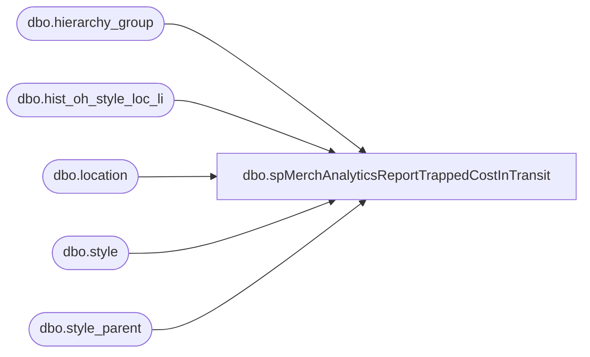

# dbo.spMerchAnalyticsReportTrappedCostInTransit

**Database:** me_01  
**Server:** bedrockdb02  

## Architecture Diagram



## Table Dependencies

| Referenced Table |
|---|
| dbo.hierarchy_group |
| dbo.hist_oh_style_loc_li |
| dbo.location |
| dbo.style |
| dbo.style_parent |

## Stored Procedure Code

```sql
CREATE proc [dbo].[spMerchAnalyticsReportTrappedCostInTransit]
as
-- =====================================================================================================
-- Name: spMerchAnalyticsReportTrappedCostInTransit
--
-- Description:	Looks for styles which have 0 units in transit and <> 0 cost in transit, sends email
--				 
-- Revision History
--		Name:			Date:			Comments:
--		Dan Tweedie		06/13/2012		Created proc.	
-- =====================================================================================================

set nocount on

IF (Object_ID('tempdb..##a') IS NOT NULL) DROP TABLE ##a

SELECT b.location_code,
	   a.style_code,
	   a.short_desc,
	   SUM((c.on_hand_units) * (1 - abs (sign (c.inventory_status_id-2 )))) UnitsInTransit,
	   SUM((c.on_hand_cost) * (1 - abs (sign (c.inventory_status_id-2 )))) CostInTransit
into ##a
FROM ma_01.dbo.style a, ma_01.dbo.location b, ma_01.dbo.hist_oh_style_loc_li c, ma_01.dbo.hierarchy_group d, ma_01.dbo.style_parent e 
WHERE a.style_id=c.style_id  
	AND b.location_id=c.location_id  
	AND a.style_id = e.style_id and e.hierarchy_level_id = 10000005 
	AND e.parent_hierarchy_group_id = d.hierarchy_group_id   
GROUP BY b.location_code,a.style_code,a.short_desc
having SUM((c.on_hand_units) * (1 - abs (sign (c.inventory_status_id-2 )))) = 0
and SUM((c.on_hand_cost) * (1 - abs (sign (c.inventory_status_id-2 )))) <> 0
order by 5 desc

if (select count(*) from ##a) > 0

----output a file for Physical Inventory team, 
begin

	declare @1query varchar(1000),
			@1date varchar(200),
			@1file_name varchar(100),
			@1file_location varchar(100),
			@1server varchar(20),
			@1database varchar(20),
			@1sqlcmd varchar(1000),
			@1query_text varchar(1000),
			@1file varchar(1000),
			@1body varchar(1000),
			@1subj varchar(1000)

			select @1query_text = 'set nocount on select * from ##a'
			set @1date = convert(varchar, datepart(yyyy, getdate())) + '-' + convert(varchar, datepart(mm, getdate())) + '-' + convert(varchar, datepart(dd, getdate())) 
			set @1query = @1query_text
			set @1file_location = '\\sharebear1\shared\Inventory Reports\'  
			set @1file_name = 'TrappedCostInTransit' + @1date + '.csv'
			set @1server = 'bedrockdb02'
			set @1database = 'me_01'
			set @1sqlcmd = 'sqlcmd -S' + @1server + ' -d' + @1database + ' -Q' + '"' + @1query + '"' + ' -o' + '"' + @1file_location + @1file_name + '"' + ' -s"," -w1000 -W'
			exec master..xp_cmdshell @1sqlcmd
end
```

