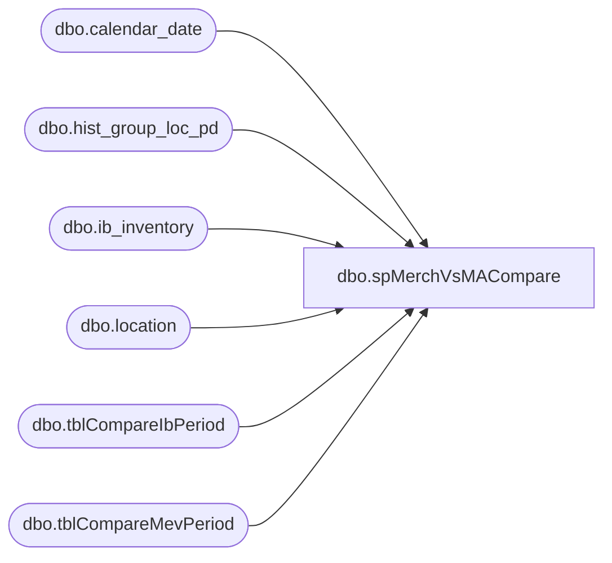

# dbo.spMerchVsMACompare

**Database:** me_01  
**Server:** bedrockdb02  

## Architecture Diagram



## Table Dependencies

| Referenced Table |
|---|
| dbo.calendar_date |
| dbo.hist_group_loc_pd |
| dbo.ib_inventory |
| dbo.location |
| dbo.tblCompareIbPeriod |
| dbo.tblCompareMevPeriod |

## Stored Procedure Code

```sql
create proc spMerchVsMACompare

as

set nocount on


IF (Object_ID('me_01..tblCompareIbPeriod') IS NOT NULL) DROP TABLE tblCompareIbPeriod
	
	CREATE TABLE [tblCompareIbPeriod] (
	[ib_store] [varchar] (20) NOT NULL ,
	[ib_sales] [int] NULL ) 
	ON [PRIMARY]

	declare @mindate datetime, @maxdate datetime

	select @mindate = min(c1.calendar_date), @maxdate = max(c1.calendar_date)
	from me_01.dbo.calendar_date c1 
		inner join me_01.dbo.calendar_date c2 
			on c1.merch_year=c2.merch_year 
				and c1.merch_period=c2.merch_period
	where c2.calendar_date = cast(cast(Month(getdate())
							as varchar(2)) + '/' + cast(Day(getdate()) 
							as varchar(2)) + '/' + cast(Year(getdate()) 
							as varchar(4)) as datetime)
	
	insert into tblCompareIbPeriod
	select l.location_code, isnull(sum(b.transaction_units),0)
	from me_01.dbo.ib_inventory b
		INNER JOIN me_01.dbo.location l
			ON b.location_id = l.location_id
	where b.transaction_date between @mindate and @maxdate
		and b.transaction_type_code in ('600','605','610','615') -- Added Codes 605, 610, 615 on 8/19/2016
		and l.location_type = 2
	group by l.location_code
	order by l.location_code


----------------------------------------------------------------------------------------------
IF (Object_ID('me_01..tblCompareMevPeriod') IS NOT NULL) DROP TABLE tblCompareMevPeriod
	
	CREATE TABLE [tblCompareMevPeriod] (
	mev_store varchar(20) NOT NULL,
	mev_sales int NULL )
	
	insert tblCompareMevPeriod
	select l.location_code, sum(h.sales_total_units) - sum(h.return_units) as sales -- Added subtracting return units on 8/19/2016
	from ma_01.dbo.hist_group_loc_pd h
		INNER JOIN ma_01.dbo.calendar_date c
			ON h.merch_year_pd = (convert(varchar,c.merch_year) + REPLICATE('0', 2 - LEN(convert(varchar,c.merch_period)))+ convert(varchar,c.merch_period))
		INNER JOIN ma_01.dbo.location l
			ON h.location_id = l.location_id
				and l.location_type = 2
	where c.calendar_date =  cast(convert(varchar,getdate(),1) as smalldatetime)
	group by l.location_code
	having sum(h.sales_total_units) > 0
	order by l.location_code
----------------------------------------------------------------------------------------------

				
				
--select count(*) 
--from tblCompareIbPeriod b
--left join tblCompareMevPeriod m on b.ib_store = m.mev_store	
--where m.mev_store is null 
--or ABS(b.ib_sales) <> m.mev_sales
```

