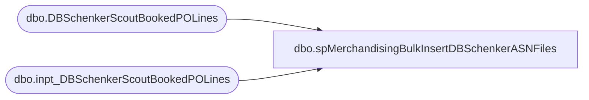

# dbo.spMerchandisingBulkInsertDBSchenkerASNFiles

**Database:** me_01  
**Server:** bedrockdb02  

## Architecture Diagram



## Table Dependencies

| Referenced Table |
|---|
| dbo.DBSchenkerScoutBookedPOLines |
| dbo.inpt_DBSchenkerScoutBookedPOLines |

## Stored Procedure Code

```sql
CREATE proc [dbo].[spMerchandisingBulkInsertDBSchenkerASNFiles]

as 

-- =====================================================================================================
-- Name: spMerchandisingBulkInsertDBSchenkerASNFiles
--
-- Description:	If ASN files exist from DB Schenker (retrieved in another process), this will bulk insert the data and archive the files
--				
-- Input:	NA
--
-- Output: 
--
-- Dependencies: NA
--				 
-- Revision History
--		Name:			Date:			Comments:
--		Dan Tweedie		10/02/2012		Created proc.	
-- =====================================================================================================

set nocount on 

truncate table inpt_DBSchenkerScoutBookedPOLines

IF (Object_ID('tempdb..#files') IS NOT NULL) DROP TABLE #files
create table #files (output varchar(1000))
insert #files exec master..xp_cmdshell 'dir \\kermode\FileRepository\MERCHANDISING\apac\SCOUT\*.csv /B'
delete from #files where output is null or output = 'File Not Found'

if (select count(*) from #files) > 0

BEGIN
		
		declare @files int,
				@filename varchar(52),
				@filepath varchar(100),
				@bulkinsert varchar(4000),
				@del varchar(100),
				@move varchar(1000),
				@query varchar(1000),
				@file_name varchar(100),
				@file_location varchar(100),
				@server varchar(20),
				@database varchar(20),
				@bcp varchar(1000)


		select @filepath = '\\kermode\FileRepository\MERCHANDISING\apac\SCOUT\'
		select @files = count(*) from #files

		while @files > 0
			begin

				select @filename = max(output) from #files
				select @bulkinsert = 'bulk insert inpt_DBSchenkerScoutBookedPOLines from ''' + @filepath + @filename + ''' with (FIELDTERMINATOR = '','', ROWTERMINATOR = ''\n'')'
				exec (@bulkinsert)
				
				select @move = 'move ' + @filepath + @filename + ' \\kermode\FileRepository\MERCHANDISING\apac\SCOUT\HISTORY\'
		
				exec master..xp_cmdshell @move
								
				delete from #files where output = @filename
				select @files = count(*) from #files
								
				if @files < 1
					break
				else
					continue
			end

END


---get rid of invalid POs which may be from our franchisees which we don't need the data for
delete from inpt_DBSchenkerScoutBookedPOLines
where len(po_no) <> 7 --Merch po's are 7 digits
or po_no like '2%'
or po_no like 'de%'

--3) -- Insert ASN data from input table to history table (this is permanently stored and is referenced in our process)

if (select count(*) from inpt_DBSchenkerScoutBookedPOLines) > 0

begin

	insert DBSchenkerScoutBookedPOLines
	select po_no,
		   po_shipment_line, 
		   right(('000000' + style_code), 6) as style_code, 
		   qty,
		   getdate()
	from inpt_DBSchenkerScoutBookedPOLines
	order by po_no, po_shipment_line

end

truncate table inpt_DBSchenkerScoutBookedPOLines
```

