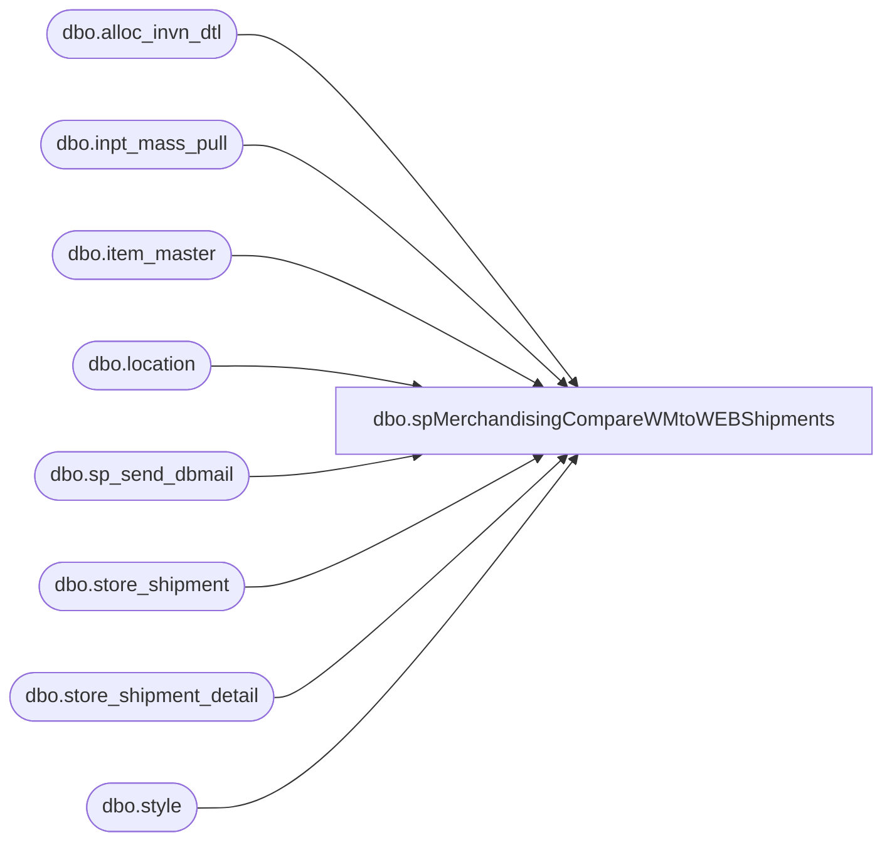

# dbo.spMerchandisingCompareWMtoWEBShipments

**Database:** me_01  
**Server:** bedrockdb02  

## Architecture Diagram



## Table Dependencies

| Referenced Table |
|---|
| dbo.alloc_invn_dtl |
| dbo.inpt_mass_pull |
| dbo.item_master |
| dbo.location |
| dbo.sp_send_dbmail |
| dbo.store_shipment |
| dbo.store_shipment_detail |
| dbo.style |

## Stored Procedure Code

```sql
CREATE procedure [dbo].[spMerchandisingCompareWMtoWEBShipments]

as 

-- =====================================================================================================
-- Name: spMerchandisingCompareWMtoWEBShipments
--
-- Description:	Sends email if WM shipments to the WEB have not posted to merch
--
-- Output: email
--
-- Dependencies: na
--
-- Revision History
--		Name:			Date:			Comments:
--		Dan Tweedie		02/06/2013		Created Proc
--		Lizzy Timm		08/19/2019		Updated recipients to EnterpriseSystemsAlerts@buildabear.com
-- =====================================================================================================

set nocount on

IF (Object_ID('tempdb..#ShipToWeb') IS NOT null) DROP TABLE #ShipToWeb
select	case when im.style between '500000' and '599999'
			then	'24900' + aid.misc_alpha_field_2
		else
				'24000' + aid.misc_alpha_field_2
		end as shipment_nbr,
		convert(varchar, imp.mod_date_time, 101) as shipped_date,
		right('000000' + cast (imp.inpt_mass_pull_id as varchar(10)),6) as distribution_number, 
		(cast(aid.alloc_invn_dtl_id as varchar)+ im.style) as carton_nbr, 
		im.style,
		case when im.store_dept = 'SUP' 
			then isnull(sum(aid.qty_Alloc)/im.std_pack_qty,0) 
		else isnull(sum(aid.qty_Alloc),0) 
		end as sent_qty
into #ShipToWeb
from wmdb01.wmprod.dbo.item_master im 
join wmdb01.wmprod.dbo.inpt_mass_pull imp on im.style = imp.style
join wmdb01.wmprod.dbo.alloc_invn_dtl aid on aid.misc_alpha_field_2 = imp.trans_nbr and aid.sku_id = im.sku_id
where datediff(dd, imp.mod_date_time, getdate()) <= 7
group by im.style, im.store_dept, im.std_pack_qty, imp.inpt_mass_pull_id, aid.alloc_invn_dtl_id, aid.misc_alpha_field_2,
imp.MOD_DATE_TIME, aid.CNTR_NBR
order by aid.misc_alpha_field_2, convert(varchar, imp.mod_date_time, 101)

---------
IF (Object_ID('tempdb..#MerchShipments') IS NOT null) DROP TABLE #MerchShipments
select distinct ss.document_no shipment_nbr,
				convert(varchar, ss.ship_date, 101) ship_date,
				ssd.distribution_no,
				ssd.carton_no,
				s.style_code,
				ssd.units_sent,
				ssd.units_received
into #MerchShipments 
from bedrockdb02.me_01.dbo.store_shipment ss (nolock)
join bedrockdb02.me_01.dbo.store_shipment_detail ssd (nolock) on ss.store_shipment_id = ssd.store_shipment_id
join bedrockdb02.me_01.dbo.style s (nolock) on s.style_id = ssd.style_id
join bedrockdb02.me_01.dbo.location l (nolock) on l.location_id = ss.location_id
join bedrockdb02.me_01.dbo.location l2 (nolock) on l2.location_id = ss.from_location_id
where l2.location_code = '0980' and l.location_code = '0013'
and datediff(dd, ss.ship_date, getdate()) <= 7
order by convert(varchar, ss.ship_date, 101) desc

IF (Object_ID('tempdb..##summary') IS NOT null) DROP TABLE ##summary
select wm.*
into ##summary
from #shiptoweb wm
left join #MerchShipments m on wm.shipment_nbr = m.shipment_nbr
	and wm.distribution_number = m.distribution_no
	and wm.style = m.style_code
where datepart(yyyy, wm.shipped_date) = '2013'
and datediff(dd, wm.shipped_date, getdate()) > 1
and m.shipment_nbr is null
order by wm.shipped_date desc

if (select count(*) from ##summary) > 0

begin
		declare @text nvarchar(max)
		set @text = '
		<font face =arial size = 2> ' +
			'<b>Unposted Shipments (980 to WEB)</b>' +
			'<br><br>' +
			'<table border="1">' +
			'<tr><th>PO</th><th>SHIPMENT</th><th>SHIP DATE</th><th>DISTRO</th><th>CARTON</th><th>STYLE</th><th>QTY</th>' +
			'</tr><font face =arial size = 2>' +
			CAST ( ( SELECT td = shipment_nbr,'',
							td = shipped_date, '',
							td = distribution_number, '',
							td = carton_nbr, '',
							td = style, '',
							td = sent_qty, ''
						from ##summary
						order by shipped_date, shipment_nbr, distribution_number, style, carton_nbr
						FOR XML PATH('tr'), TYPE 
			) AS NVARCHAR(MAX) ) +
			'</font></table></font></p></p>
			<br>
			<font face =arial size = 1>This report was run from bedrockdb02 SQL Agent: Validation - WM to Web Shipments.</font>
			<br>
			<br>
		<font face =arial size = 1><i>The information in this message may be privileged, “confidential” and protected from disclosure and/or intended only for the addressee(s) named above.  If the reader of this message is not the intended recipient, or an employee or agent responsible for delivering this message to the intended recipient, you are hereby notified that any dissemination, distribution or copying of the communication is strictly prohibited.  If you have received this communication in error, please notify us immediately by replying to the message and deleting it from your computer.  Thank you beary much.</i></font>'

		exec msdb.dbo.sp_send_dbmail
			@profile_name = 'merchadmin',
			@recipients = 'EnterpriseSystemsAlerts@buildabear.com',
			@body = @text,
			@subject = 'Unposted WM Shipments (980 to WEB)',
			@body_format = 'HTML'

	END
```

