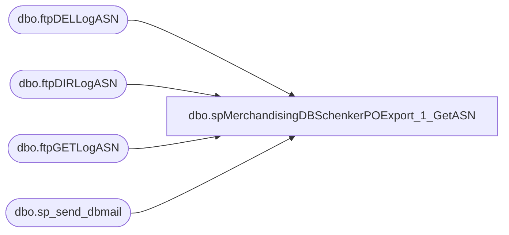

# dbo.spMerchandisingDBSchenkerPOExport_1_GetASN

**Database:** me_01  
**Server:** bedrockdb02  

## Architecture Diagram



## Table Dependencies

| Referenced Table |
|---|
| dbo.ftpDELLogASN |
| dbo.ftpDIRLogASN |
| dbo.ftpGETLogASN |
| dbo.sp_send_dbmail |

## Stored Procedure Code

```sql
CREATE proc [dbo].[spMerchandisingDBSchenkerPOExport_1_GetASN]
as

-- =====================================================================================================
-- Name: spMerchandisingDBSchenkerPOExport_1_GetASN
--
-- Description:	FTP's to DB Schenker server to retrieve ASN files.
--				Captures log, sends email if failure occurs.
--
-- Input:	NA
--
-- Output: log file and emails only if failure occurs
--
-- Dependencies: NA
--				 
-- Revision History
--		Name:			Date:			Comments:
--		Dan Tweedie		12/14/2012		Created proc.	
--		Dan Tweedie		08/29/2013		Exclude code which archives the files the History folder on the FTP server
--		Dan Tweedie		07/14/2015		Pointed to Kermode instead of oursmerchdb01
-- =====================================================================================================

set nocount on

--declare and set ftp variables 
declare @ftpDIR varchar(1000),
		@ftpGET varchar(1000),
		--@ftpPUT varchar(1000), --excluded 08/29/2013
		@ftpDEL varchar(1000),
		@Log_query varchar(1000),
		@Log_filename varchar(100),
		@Log_file_location varchar(100),
		@Log_bcp varchar(1000),
		@body varchar(4000)
		
set @ftpDIR = 'ftp -d -s:\\kermode\FileRepository\MERCHANDISING\APAC\FTP\SCRIPTS\ftpDIR.txt' 
set @ftpGET = 'ftp -d -s:\\kermode\FileRepository\MERCHANDISING\APAC\FTP\SCRIPTS\ftpGET.txt' 
--set @ftpPUT = 'ftp -d -s:\\kermode\FileRepository\MERCHANDISING\APAC\FTP\SCRIPTS\ftpPUT2.txt'  --excluded 08/29/2013
set @ftpDEL = 'ftp -d -s:\\kermode\FileRepository\MERCHANDISING\APAC\FTP\SCRIPTS\ftpDEL.txt'

--create temp tables for ftp logs
IF (Object_ID('me_01..ftpDIRLogASN') IS NOT NULL) DROP TABLE ftpDIRLogASN
create table ftpDIRLogASN
(ftpLog varchar(4000))

IF (Object_ID('me_01..ftpGETLogASN') IS NOT NULL) DROP TABLE ftpGETLogASN
create table ftpGETLogASN
(ftpLog varchar(4000))

			/* --excluded 08/29/2013
			IF (Object_ID('me_01..ftpPUTLogASN') IS NOT NULL) DROP TABLE ftpPUTLogASN
			create table ftpPUTLogASN
			(ftpLog varchar(4000))
			*/

IF (Object_ID('me_01..ftpDELLogASN') IS NOT NULL) DROP TABLE ftpDELLogASN
create table ftpDELLogASN
(ftpLog varchar(4000))

--execute sql/ftpHHH
----connect to ftp server, if connection unsuccessful, send email
insert ftpDIRLogASN exec master..xp_cmdshell @ftpDIR
if (select count(*) from ftpDIRLogASN where ftplog like '%User babw logged in%') < 1
	begin
		set @Log_query = 'select * from bedrockdb02.me_01.dbo.ftpDIRLogASN'
		set @Log_filename = 'ftpDIRLog.txt'
		set @Log_file_location = '\\kermode\FileRepository\MERCHANDISING\APAC\FTP\LOGS\'
		set @Log_bcp = 'bcp "' + @Log_query + '" queryout "' + @Log_file_location + @Log_filename + '" -t, -T -c -Sbedrockdb02'

		exec master..xp_cmdshell @Log_bcp
			
		set @body =	'An attempt to connect to the DB Schenker FTP server failed.' 
					+ char(10) + char(13) + 
					'See the attached log for details.'
					+ char(10) + char(13) + 
					+ char(10) + char(13) + 
					'This process is managed by bedrockdb02.me_01.dbo.spMerchandisingDBSchenkerPOExport_1_GetASN'

		EXEC bedrockdb02.msdb.dbo.sp_send_dbmail
		@profile_name = 'MerchAdmin',
		@recipients = 'EntSysSupport@buildabear.com',
		@subject = 'FTP Failure: Connection Failed',
		@body = @body,
		@file_attachments = '\\kermode\FileRepository\MERCHANDISING\APAC\FTP\LOGS\ftpDIRLog.txt',
		@importance = 'HIGH'
	
	end
--if ASN file is present, continue
declare @files int
select @files = count(*) from ftpDIRLogASN where ftplog like '%%.csv%'

if (select count(*) from ftpDIRLogASN where ftplog like '%%.csv%') > 0 

	BEGIN

		insert ftpGETLogASN exec master..xp_cmdshell @ftpGET
		if (select count(*) from ftpGETLogASN where ftplog like '%Transfer complete%') < @files
			begin
			
				set @Log_query = 'select * from bedrockdb02.me_01.dbo.ftpGETLogASN'
				set @Log_filename = 'ftpGETLog.txt'
				set @Log_file_location = '\\kermode\FileRepository\MERCHANDISING\APAC\FTP\LOGS\'
				set @Log_bcp = 'bcp "' + @Log_query + '" queryout "' + @Log_file_location + @Log_filename + '" -t, -T -c -Sbedrockdb02'

				exec master..xp_cmdshell @Log_bcp
										
				set @body =	'An attempt to FTP ASN files from DB Schenker to BAB failed.' 
							+ char(10) + char(13) + 
							'See the attached log for details.'
							+ char(10) + char(13) + 
							+ char(10) + char(13) + 
							'This process is managed by bedrockdb02.me_01.dbo.spMerchandisingDBSchenkerPOExport_1_GetASN'
		
				EXEC bedrockdb02.msdb.dbo.sp_send_dbmail
				@profile_name = 'MerchAdmin',
				@recipients = 'EntSysSupport@buildabear.com',
				@subject = 'FTP Failure: Adjustments file from DB Schenker to BAB',
				@body = @body,
				@file_attachments = '\\kermode\FileRepository\MERCHANDISING\APAC\FTP\LOGS\ftpGETLog.txt',
				@importance = 'HIGH'
						
			end
		
				/* --excluded 08/29/2013
				insert ftpPUTLogASN exec master..xp_cmdshell @ftpPUT
				if (select count(*) from ftpPUTLogASN where ftplog like '%Transfer complete%') < @files
					begin 
						set @Log_query = 'select * from bedrockdb02.me_01.dbo.ftpPUTLogASN'
						set @Log_filename = 'ftpPUTLog2.txt'
						set @Log_file_location = '\\kermode\FileRepository\MERCHANDISING\APAC\FTP\LOGS\'
						set @Log_bcp = 'bcp "' + @Log_query + '" queryout "' + @Log_file_location + @Log_filename + '" -t, -T -c -Sbedrockdb02'

						exec master..xp_cmdshell @Log_bcp
										
						set @body =	'An attempt to FTP ASN files from BAB to DB Schenker DONE folder failed.' 
									+ char(10) + char(13) + 
									'See the attached log for details.'
									+ char(10) + char(13) + 
									+ char(10) + char(13) + 
									'This process is managed by bedrockdb02.me_01.dbo.spMerchandisingDBSchenkerPOExport_1_GetASN'
		
						EXEC bedrockdb02.msdb.dbo.sp_send_dbmail
						@profile_name = 'MerchAdmin',
						@recipients = 'EntSysSupport@buildabear.com',
						@subject = 'FTP Failure: ASN files from BAB to DB Schenker DONE folder',
						@body = @body,
						@file_attachments = '\\kermode\FileRepository\MERCHANDISING\APAC\FTP\LOGS\ftpPUTLog2.txt',
						@importance = 'HIGH'
					end
				*/

		insert ftpDELLogASN exec master..xp_cmdshell @ftpDEL 
		if (select count(*) from ftpDELLogASN where ftplog like '%DELE command successful%') < @files
			begin
				set @Log_query = 'select * from bedrockdb02.me_01.dbo.ftpDELLogASN'
				set @Log_filename = 'ftpDELLog.txt'
				set @Log_file_location = '\\kermode\FileRepository\MERCHANDISING\APAC\FTP\LOGS\'
				set @Log_bcp = 'bcp "' + @Log_query + '" queryout "' + @Log_file_location + @Log_filename + '" -t, -T -c -Sbedrockdb02'

				exec master..xp_cmdshell @Log_bcp
										
				set @body =	'An attempt to DELETE ASN fils on the DB Schenker server failed.' 
							+ char(10) + char(13) + 
							'See the attached log for details.'
							+ char(10) + char(13) + 
							+ char(10) + char(13) + 
							'This process is managed by bedrockdb02.me_01.dbo.spMerchandisingDBSchenkerPOExport_1_GetASN'
		
				EXEC bedrockdb02.msdb.dbo.sp_send_dbmail
				@profile_name = 'MerchAdmin',
				@recipients = 'EntSysSupport@buildabear.com',
				@subject = 'FTP Failure: Delete ASN file from DB Schenker server',
				@body = @body,
				@file_attachments = '\\kermode\FileRepository\MERCHANDISING\APAC\FTP\LOGS\ftpDELLog.txt',
				@importance = 'HIGH'
			end


END
```

