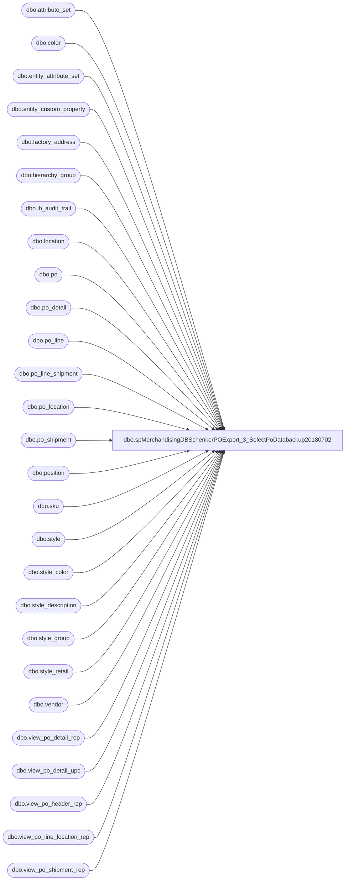

# dbo.spMerchandisingDBSchenkerPOExport_3_SelectPoDatabackup20180702

**Database:** me_01  
**Server:** bedrockdb02  

## Architecture Diagram



## Table Dependencies

| Referenced Table |
|---|
| dbo.attribute_set |
| dbo.color |
| dbo.entity_attribute_set |
| dbo.entity_custom_property |
| dbo.factory_address |
| dbo.hierarchy_group |
| dbo.ib_audit_trail |
| dbo.location |
| dbo.po |
| dbo.po_detail |
| dbo.po_line |
| dbo.po_line_shipment |
| dbo.po_location |
| dbo.po_shipment |
| dbo.position |
| dbo.sku |
| dbo.style |
| dbo.style_color |
| dbo.style_description |
| dbo.style_group |
| dbo.style_retail |
| dbo.vendor |
| dbo.view_po_detail_rep |
| dbo.view_po_detail_upc |
| dbo.view_po_header_rep |
| dbo.view_po_line_location_rep |
| dbo.view_po_shipment_rep |

## Stored Procedure Code

```sql
CREATE proc [dbo].[spMerchandisingDBSchenkerPOExport_3_SelectPoDatabackup20180702]
as
-- =====================================================================================================
-- Name: spMerchandisingDBSchenkerPOExport_3_SelectPoData
--
-- Description:	Captures data set of PO data that needs to export to DB Schenker
--
-- Input: 
--
-- Output: 
--
-- Dependencies: 
--
-- Revision History
--		Name:			Date:			Comments:
--		Dan Tweedie		12/14/2012		Created proc.	
--		Dan Tweedie		05/29/2014		See changes notated by 5/29/2014 in the code - updates made to ensure that updates to po's are exported
--		Dan Tweedie		08/14/2013		Added location 2013 to be included in PO selects
--		Dan Tweedie		09/08/2015		Added location filter for query into #view_temp1, altered join for query into #view_temp3
--		Tim Callahan	02/10/2016		Added 3970 and 3980 Locations - China Warehouses
--		Tim Callahan    02/15/2016		Added Logic for China HTS Codes 
--		Tim Callahan	03/22/2016		Remarked out Where UPC < 000001000000 as this was preventing PO data from exporting with the new "true" UPCs in Merch. 
--		Tim Callahan	10/25/2016		Added Logic to include the export of USBQ to UKBQ transfers and UKBQ to USBQ Transfers 
--										Also added logic to HTS exception chunk of code for these type of transfers 
--		Tim Callahan	05/25/2018		Added 8502 and 8505 Locations - Additional China Warehouses
--										Added at request of Santiago Beltran despite original project scope indicating this wasnt needed. 
-- =====================================================================================================
set nocount on

BEGIN

	IF (Object_ID('tempdb..#po_updates') IS NOT null) DROP TABLE #po_updates
	IF (Object_ID('tempdb..#view_temp1') IS NOT null) DROP TABLE #view_temp1
	IF (Object_ID('tempdb..#view_temp2') IS NOT null) DROP TABLE #view_temp2
	IF (Object_ID('tempdb..#view_temp3') IS NOT null) DROP TABLE #view_temp3
	IF (Object_ID('tempdb..#view_detail_temp') IS NOT null) DROP TABLE #view_detail_temp
	IF (Object_ID('me_01..tmpHoldDBSchenkerPO') IS NOT null) DROP TABLE tmpHoldDBSchenkerPO
		

	--PART ONE - GET LIST OF PO NUMBERS THAT HAVE DOCUMENTED CHANGES OR HAVE STYLE OR COLOR CHANGES
	select distinct po.po_no, po.po_id
	into #po_updates
	from ib_audit_trail iat (nolock)
	join po (nolock) on iat.application_identifier = po.po_no
	join po_location ploc (nolock) on po.po_id = ploc.po_id
	join location l (nolock) on ploc.location_id = l.location_id
	where iat.application = 'POM' 
	and   iat.activity <> 'Canceled'
	and	  (iat.action <> 'Delete' or iat.action is null) -- 5/29/2014 added null because a canceled PO might have null value in action column
	and   po.approval_status in (3,7)
	and   po.po_status in (4,7) 
	and	  l.location_code in ('0980','0960','0013','9999','0975','2970','2999', '2013','1971','1972','3970','3980','8502','8505') -- Added More China Warehouses 5/25/2018
	and	  datediff(dd, getdate(), iat.entry_date) = 0
	UNION ALL
	select distinct po.po_no, po.po_id
	from ib_audit_trail iat (nolock)
	join style s (nolock) on s.style_code = iat.application_identifier
	join sku (nolock) on sku.style_id = s.style_id
	join po_detail pd (nolock) on pd.sku_id = sku.sku_id
	join po (nolock) on pd.po_id = po.po_id
	join po_location ploc (nolock) on po.po_id = ploc.po_id
	join location l (nolock) on ploc.location_id = l.location_id
	where iat.application = 'PROD'
	and   po.approval_status in (3,7)
	and   po.po_status in (4,7) 
	and	  l.location_code in ('0980','0960','0013','9999','0975','2970','2999', '2013','1971','1972','3970','3980','8502','8505') -- Added More China Warehouses 5/25/2018
	and	  datediff(dd, getdate(), iat.entry_date) = 0
	UNION ALL
	select distinct po.po_no, po.po_id
	from ib_audit_trail iat (nolock)
	join attribute_set ats (nolock) on ats.attribute_set_code = iat.application_identifier
	join entity_attribute_set eas (nolock) on ats.attribute_set_id = eas.attribute_set_id
	join style s (nolock) on s.style_id = eas.parent_id
	join sku (nolock) on sku.style_id = s.style_id
	join po_detail pd (nolock) on pd.sku_id = sku.sku_id
	join po (nolock) on pd.po_id = po.po_id
	join po_location ploc (nolock) on po.po_id = ploc.po_id
	join location l (nolock) on ploc.location_id = l.location_id
	where iat.application = 'EDM'
	and   po.approval_status in (3,7)
	and   po.po_status in (4,7) 
	and	  l.location_code in ('0980','0960','0013','9999','0975','2970','2999', '2013','1971','1972','3970','3980','8502','8505') -- Added More China Warehouses 5/25/2018
	and	  datediff(dd, getdate(), iat.entry_date) = 0
	and   iat.action in ('Modify','Add')
	and (iat.field_affected in ('attribute_set_code', 'attribute_set_label')) ---HTS CODES FOR MERCH	
	UNION ALL
	select distinct po.po_no, po.po_id
	from ib_audit_trail iat (nolock)
	join attribute_set ats (nolock) on ats.attribute_set_code = iat.application_identifier
	join entity_attribute_set eas (nolock) on ats.attribute_set_id = eas.attribute_set_id
	join style s (nolock) on s.style_id = eas.parent_id
	join sku (nolock) on sku.style_id = s.style_id
	join po_detail pd (nolock) on pd.sku_id = sku.sku_id
	join po (nolock) on pd.po_id = po.po_id
	join po_location ploc (nolock) on po.po_id = ploc.po_id
	join location l (nolock) on ploc.location_id = l.location_id
	where iat.application = 'POM'
	and   po.approval_status in (3,7)
	and   po.po_status in (4,7) 
	and	  l.location_code in ('0980','0960','0013','9999','0975','2970','2999', '2013','1971','1972','3970','3980','8502','8505') -- Added More China Warehouses 5/25/2018
	and	  datediff(dd, getdate(), iat.entry_date) = 0
	and   iat.action in ('Modify')
	and   iat.application_level = 'Order shipment dates'
	union all
	select distinct po.po_no, po.po_id
	from ib_audit_trail iat (nolock)
	join po (nolock) on iat.application_identifier = po.po_no
	join po_location ploc (nolock) on po.po_id = ploc.po_id
	join location l (nolock) on ploc.location_id = l.location_id
	where iat.application = 'pom'
	and	iat.activity in ('Reapproved', 'Approved')
	and po.approval_status in (3,7)
	and po.po_status in (4,7) 
	and	l.location_code in ('0980','0960','0013','9999','0975','2970','2999', '2013','1971','1972','3970','3980','8502','8505') -- Added More China Warehouses 5/25/2018
	and	datediff(dd, getdate(), iat.entry_date) = 0

	/*
	----->>>>>In the interest of triggering updated PO's to be sent to TPM....
	If (select count(*) from #po_updates) > 0
	begin
		delete from tpm_process_control where po_no in (select po_no from #po_updates)
	end
	*/

	--PART TWO
	-----Capture view data into temp tables to join into the main po query
	select *
	into #view_temp1
	from view_po_line_location_rep a (nolock)  
	where a.po_id in (select po_id from po where po_status IN (4,7) and approval_status in (3,7)) 
	and location_code in ('0980','0960','0013','9999','0975','2970','2999', '2013','1971','1972','3970','3980','8502','8505') -- Location Sepcification added 09/08/2015 -- Added China Warehouses on 2/10/2016 -- Added More China Warehouses 5/25/2018

	select pls.po_line_shipment_id, pls.po_shipment_id, po.po_id, pl.po_line_id, pl.line_no, ps.expected_receipt_date, c.color_code, pls.quantity
	into #view_temp2
	from po (nolock)
	join po_line pl (nolock) on po.po_id = pl.po_id
	join po_shipment ps (nolock) on po.po_id = ps.po_id
	join po_line_shipment pls (nolock) on pls.po_id = po.po_id and pls.po_shipment_id = ps.po_shipment_id and pls.po_line_id = pl.po_line_id
	join style_color sc (nolock) on sc.style_color_id = pl.style_color_id
	join color c (nolock) on c.color_id = sc.color_id
	where po.po_id in (select po_id from po (nolock) where po_status IN (4,7) and approval_status in (3,7)) 
	order by pl.line_no, pls.po_line_shipment_id, pls.po_shipment_id

	select b.po_line_shipment_id, b.po_shipment_id, a.*
	into #view_temp3
	from #view_temp1 a
	join #view_temp2 b on b.po_id = a.po_id
		and b.po_line_id = a.po_line_id
		and b.line_no = a.line_no
		and b.expected_receipt_date = a.expected_receipt_date
		and b.color_code = a.color_code
		--and b.quantity = a.total_line_loc_ordered_units --removed 09/08/2015 - I believe the b.quantity is line shipment level, but a.total_line_loc_ordered_units is line level (not line shipment)

	Select * 
	into #view_detail_temp 
	from view_po_detail_rep (nolock)
	where po_id in (select po_id from po where po_status IN (4,7)and approval_status in (3,7)) 


	--PART THREE
	----Capture PO data -->This is the main query -- Includes PO's captured in first query (changes) and new PO's within ship-date range.
	SELECT 'ICBBW1' as ProjID,
	d.po_no as PurchaseOrder,  
	'Replace' as PurposeCode,
	'' as Division,
	left(hg.hierarchy_group_code,8) as Department,
	'' as Buyer,
	a.vendor_name as SupplierName, 
	a.vendor_code as SupplierCode,
	'' as SupplierAddress1,
	'' as SupplierAddress2,
	'' as SupplierAddress3,
	'' as	SupplierAddress4,
	'' as	UNLOCCodeValue,
	'' as	ScheduleKCode1,
	'' as	SupplierCity,
	'' as	SupplierState,
	'' as SupplierCountry,
	'' as	SupplierPostal,
	'FOB' as OrderPaymentTerms,
	'COLLECT' as FreightPaymentTerms,
	convert(varchar, d.create_date, 101) as OrderDate, 
	d.fob_description as PORef1, 
	'' as PORef2,
	'' as PORef3,
	e.location_name as ShipToName,
	e.location_code as ShipToCode, 
	'' as ShipToEmail,
	'' as	ShipToAddress1,
	'' as ShipToAddress2,
	'' as ShipToAddress3,
	'' as	ShiptoAddress4,
	'' as	UNLOCCode1,
	'' as	ScheduleDorKCode,
	'' as	ShipToCountry,
	'' as	ShipToCity,
	'' as ShipToState,
	'' as	ShipToZipCode,
	isnull((select attribute_set_label from attribute_set where attribute_set_id = easfact.attribute_set_id),'') as FactoryName,
	isnull((select attribute_set_code from attribute_set where attribute_set_id = easfact.attribute_set_id),'') as FactoryCode,
	'' as FactoryAddress1,
	'' as FactoryAddress2,
	'' as FactoryAddress3,
	'' as FactoryAddress4,
	'' as UNLOCCode2,
	'' as ScheduleKCode2,
	'' as FactoryCity,
	'' as FactoryState,
	'' as FactoryCountry,
	'' as FactoryPostal,
	convert(varchar, f.user_defined_date, 101) as ShipWindowStart,  
	convert(varchar, ff.user_defined_date, 101) as ShipWindowEnd, 
	'' as ShipWindowCancelDate,
	e.po_line_shipment_id as ProductDetailID,---line number>>??
	e.style_code as ProductDetailProductCode,
	e.long_desc as ProductDetailProductDesc,
	case 
		when l1.location_code in ('0980','0960','0013','9999','1971','1972') 
		then 
			case 
				when substring(hg.hierarchy_group_code,7,2)= '60'
				then isnull(cp_ht_us.custom_property_value,'')
				else isnull((select top 1 attribute_set_label from attribute_set ats, entity_attribute_set eas where ats.attribute_set_id = eas.attribute_set_id and eas.attribute_id = 152 and s.style_id=eas.parent_id),'')
			end
		else 
			case 
				when l1.location_code in ('3970','3980','8502','8505') -- Changed from = '0975' aka Canada on 2/10/2016 -- Added 8502 and 8505 on 5/25/2018
				then 
					case 
						when substring(hg.hierarchy_group_code,7,2)= '60'
						then isnull(cp_ht_cn.custom_property_value, '') -- Changed from cp_ht_ca.custom_property_value on 02/10/2016
						else isnull((select top 1 attribute_set_label from attribute_set ats, entity_attribute_set eas where ats.attribute_set_id = eas.attribute_set_id and eas.attribute_id = 597 and s.style_id=eas.parent_id),'') -- Changed from attribute id 154 (Canada) on 02/11/2016
					end
		else 
			case 
				when l1.location_code in ('2970','2999','2013')
				then 
					case 
						when substring(hg.hierarchy_group_code,7,2)= '60'
						then isnull(cp_ht_uk.custom_property_value, '')
						else isnull((select top 1 attribute_set_label from attribute_set ats, entity_attribute_set eas where ats.attribute_set_id = eas.attribute_set_id and eas.attribute_id = 156 and s.style_id=eas.parent_id), '')
					end 
			end
		end
	end as ProductDetailHTS,
	j.ordered_units*ISNULL(cp.custom_property_value,1) as ProductDetailOrderQuantity,
	'UN' as QuantityUOM,
	case when a.vendor_code in ('KIDPSHA', 'KIDPREF', 'KIDPIND', 'KIDQING') 
		then 0
		else (e.first_cost * j.ordered_units) / (j.ordered_units*ISNULL(cp.custom_property_value,1)) 
		end as UnitCost, --- excludes KDP vendor from viewing cost
	'OCEAN' as Mode,
	case when ecp.custom_property_value is not null and substring(hg.hierarchy_group_code,7,2)='60'
		then	
			case when ecp.custom_property_value = '0.00' 
			then 1
			else ecp.custom_property_value
			end
		else 	s.order_multiple
		end as ProductDetailMasterPackQty,
	'' as ProductDetailNoOfPackages,
		case when ecp.custom_property_value is not null and substring(hg.hierarchy_group_code,7,2)='60' 
		then	
			case when ecp.custom_property_value = '0.00' 
			then 1
			else ecp.custom_property_value
			end
		else s.distribution_multiple
		end as ProductDetailInnerPackQty,
	'' as ProductDetailTotalVolume,
	'' as ProductDetailTotalWeight,
	'' as ProductDetailProductPriority,	
	'' as ProductDetailManufacturerID,	
	'' as ProductDetailProductRef,
	'' as ProductDetailProductRef2,	
	'' as ProductDetailProductRef3,
	'' as ProductDetailProductRef4,
	'' as ProductDetailProductRef5,
	isnull((select country from factory_address fa, attribute_set ats where easfact.attribute_set_id = ats.attribute_set_id and ats.attribute_set_code = fa.attribute_set_code),'') as OriginCountry, 
	isnull((select city from factory_address fa, attribute_set ats where easfact.attribute_set_id = ats.attribute_set_id and ats.attribute_set_code = fa.attribute_set_code),'') as OriginCity,
	'' as FinalDestination,
	'' as POETA,
	convert(varchar, f.expected_receipt_date, 101) as ProductDate1,
	'' as ProductDate2,
	'' as Consolidator,
	'' as Broker,
	'' as Currency,
	'' as SKUNumber,
	'' as Size,
	e.color_short_description as Color,
	'~' as LineEndIndicator
	into tmpHoldDBSchenkerPO
	FROM view_po_header_rep d (nolock)
	join vendor a (nolock) on a.vendor_id = d.vendor_id 
	join #view_temp3 e (nolock) on d.po_id = e.po_id
	join #view_detail_temp j (nolock) on j.po_line_id=e.po_line_id 
		and e.expected_receipt_date = j.expected_receipt_date
	join view_po_shipment_rep f (nolock) on d.po_id = f.po_id
		and f.po_id = j.po_id
		and f.expected_receipt_date = j.expected_receipt_date
		and f.date_type_code = 100 
		and e.po_shipment_id = f.po_shipment_id
	join view_po_shipment_rep ff (nolock) on ff.po_id = j.po_id
		and ff.expected_receipt_date = j.expected_receipt_date 
		and ff.date_type_code = 200
		and e.po_shipment_id = ff.po_shipment_id 
	join view_po_detail_upc i (nolock) on j.sku_id = i.sku_id
	join location l1 (nolock) on j.location_id=l1.location_id
	join style s (nolock) on e.style_code = s.style_code
	join position p (nolock) on d.position_id=p.position_id
	join style_retail srus (nolock) on s.style_id=srus.style_id
		and srus.jurisdiction_id=1
	join style_group sg (nolock) on s.style_id = sg.style_id
	join hierarchy_group hg (nolock) on sg.hierarchy_group_id = hg.hierarchy_group_id
	LEFT JOIN entity_custom_property cp (nolock) on s.style_id=cp.parent_id
												and isnull(cp.custom_property_id,2)=2
	LEFT JOIN style_description sd (nolock) on s.style_id=sd.style_id
										   and ISnull(sd.language_id,100002)=100002 
	LEFT JOIN style_retail sruk (nolock) on s.style_id=sruk.style_id
										and isnull(sruk.jurisdiction_id,2)=2
	LEFT JOIN style_retail srcd (nolock) on s.style_id=srcd.style_id
										and isnull(srcd.jurisdiction_id,3)=3
	LEFT JOIN style_retail sreu (nolock) on s.style_id=sreu.style_id
										and isnull(sreu.jurisdiction_id,2)=2
	LEFT JOIN entity_attribute_set easfact (nolock) on s.style_id=easfact.parent_id
												   and easfact.attribute_id = 122 
	LEFT JOIN entity_custom_property cp_ht_us (nolock) on s.style_id = cp_ht_us.parent_id
													  and cp_ht_us.custom_property_id = 4
	/*LEFT JOIN entity_custom_property cp_ht_ca (nolock) on s.style_id = cp_ht_ca.parent_id
													  --and cp_ht_ca.custom_property_id = 23
													  */
	LEFT JOIN entity_custom_property cp_ht_cn (nolock) on s.style_id = cp_ht_cn.parent_id -- Added for China Warehouses
														and cp_ht_cn.custom_property_id = 61 -- Added for China Warehouses 
	LEFT JOIN entity_custom_property cp_ht_uk (nolock) on s.style_id = cp_ht_uk.parent_id
													  and cp_ht_uk.custom_property_id = 24
	LEFT JOIN entity_custom_property ecp (nolock) on s.style_id = ecp.parent_id
												 and ecp.custom_property_id = 2
												 and ecp.parent_type = 1

	WHERE e.total_line_loc_ordered_units <> 0
	-- and i.upc_number < '000001000000' -- Removed on 3/22/2016 due to conflict with "true" UPC's
		/* Remarked out and replaced on 10/25/2016
		and (	
				a.import_flag = 1 --ensures we only capture non-domestic vendors)
				and l1.location_code in ('0980','0960','0013','9999','0975','2970','2999','2013','1971','1972','3970','3980') -- Added China Warehouses on 2/10/2016
			)
		*/
		and (	a.import_flag = 1 --ensures we only capture non-domestic vendors
				and l1.location_code in ('0980','0960','0013','9999','0975','2970','2999','2013','1971','1972','3970','3980','8502','8505') -- Added China Warrhouses on 5/25/2018
			or (a.import_flag = 0 and a.vendor_code = 'BABWORK' and l1.location_code in ('2970')) -- Added 10/25/2016
			or (a.import_flag = 0 and a.vendor_code = 'BABWUKK' and l1.location_code in ('0980')) -- Added 10/25/2016
			)		
		and (
			(
				(d.po_id in (select distinct po_id from view_po_shipment_rep (nolock) where date_type_code = 100 and datediff(dd, getdate()+60, user_defined_date) = 0)
				OR d.po_id in (select distinct po_id from #po_updates)
				or d.po_id in (select po_id from po where datediff(dd, create_date, getdate()) = 0))
			AND ((getdate() < f.user_defined_date and datediff(dd, getdate(), f.user_defined_date) <= 60)
				 OR (getdate() > f.user_defined_date and datediff(dd, f.user_defined_date, getdate()) <= 60)) --05/29/2014 - Changed from 30 to 60
			)
			)
	order by d.po_no, e.style_code, f.user_defined_date

END
---END PART THREE

begin
		---capture records without factory or hts
		IF (Object_ID('me_01..TMP_StylesWithoutFactoryOrHTS') IS NOT null) DROP TABLE TMP_StylesWithoutFactoryOrHTS

					select distinct style_code STYLE, 
									long_desc DESCRIPTION, 
									department,
									factorycode FACTORY_CODE, 
									origincity FACTORY_CITY, 
									origincountry FACTORY_COUNTRY, 
									productdetailhts HTS, 
									PO_Country
					into TMP_StylesWithoutFactoryOrHTS
					from 
							(SELECT distinct e.style_code, e.long_desc, left(hg.hierarchy_group_code,8) department,
								isnull((select attribute_set_code from attribute_set (nolock) where attribute_set_id = easfact.attribute_set_id),'') as FactoryCode,
								isnull((select country from factory_address fa, attribute_set ats where easfact.attribute_set_id = ats.attribute_set_id and ats.attribute_set_code = fa.attribute_set_code),'') as OriginCountry, 
								isnull((select city from factory_address fa, attribute_set ats where easfact.attribute_set_id = ats.attribute_set_id and ats.attribute_set_code = fa.attribute_set_code),'') as OriginCity,
								case 
									when l1.location_code in ('0980','0960','0013','9999','1971','1972') 
									then 
										case 
											when substring(hg.hierarchy_group_code,7,2)= '60'
											then isnull(cp_ht_us.custom_property_value,'')
											else isnull((select top 1 attribute_set_label from attribute_set ats (nolock), entity_attribute_set eas where ats.attribute_set_id = eas.attribute_set_id and eas.attribute_id = 152 and s.style_id=eas.parent_id),'')
										end
									else 
										case 
											when l1.location_code in ('3970','3980','8502','8505') -- Changed from 0975 aka Canada on 2/11/2016 -- Added 8502 and 8505 on 5/25/2018
											then 
												case 
													when substring(hg.hierarchy_group_code,7,2)= '60'
													then isnull(cp_ht_cn.custom_property_value, '')
													else isnull((select top 1 attribute_set_label from attribute_set ats (nolock), entity_attribute_set eas where ats.attribute_set_id = eas.attribute_set_id and eas.attribute_id = 597 and s.style_id=eas.parent_id),'') -- Changed from 154 on 2/11/201
												end
									else 
										case 
											when l1.location_code in ('2970','2999','2013')
											then 
												case 
													when substring(hg.hierarchy_group_code,7,2)= '60'
													then isnull(cp_ht_uk.custom_property_value, '')
													else isnull((select top 1 attribute_set_label from attribute_set ats (nolock), entity_attribute_set eas where ats.attribute_set_id = eas.attribute_set_id and eas.attribute_id = 156 and s.style_id=eas.parent_id), '')
												end 
										end
									end
								end as ProductDetailHTS,
								case 
										when l1.location_code in ('0980','0960','0013','9999','1971','1972') 
										then 'U.S.'
									else 
										case when l1.location_code in ('3970','3980','8502','8505') -- Changed from = '0975'  on 2/10/2016 --Added 8502 and 8505 on 5/25/2018
											 then 'China' -- Changed from Canada on 2/10/2016
									else
										case 
											when l1.location_code in ('2970','2999','2013')
											then 'UK'
									end 
									end 
									end 
								as 'PO_Country'
								FROM view_po_header_rep d (nolock)
								join vendor a (nolock) on a.vendor_id = d.vendor_id 
								join #view_temp3 e (nolock) on d.po_id = e.po_id
								join #view_detail_temp j (nolock) on j.po_line_id=e.po_line_id 
									and e.expected_receipt_date = j.expected_receipt_date
								join view_po_shipment_rep f (nolock) on d.po_id = f.po_id
									and f.po_id = j.po_id
									and f.expected_receipt_date = j.expected_receipt_date
									and f.date_type_code = 100 
									and e.po_shipment_id = f.po_shipment_id
								join view_po_shipment_rep ff (nolock) on ff.po_id = j.po_id
									and ff.expected_receipt_date = j.expected_receipt_date 
									and ff.date_type_code = 200
									and e.po_shipment_id = ff.po_shipment_id 
								join view_po_detail_upc i (nolock) on j.sku_id = i.sku_id
								join location l1 (nolock) on j.location_id=l1.location_id
								join style s (nolock) on e.style_code = s.style_code
								join position p (nolock) on d.position_id=p.position_id
								join style_retail srus (nolock) on s.style_id=srus.style_id
									and srus.jurisdiction_id=1
								join style_group sg (nolock) on s.style_id = sg.style_id
								join hierarchy_group hg (nolock) on sg.hierarchy_group_id = hg.hierarchy_group_id
								LEFT JOIN entity_custom_property cp (nolock) ON s.style_id=cp.parent_id
								LEFT JOIN style_retail srcd (nolock) ON s.style_id=srcd.style_id
																	AND isnull(srcd.jurisdiction_id,3)=3 
								LEFT JOIN style_description sd (nolock) ON s.style_id=sd.style_id 
								LEFT JOIN style_retail sruk (nolock) ON s.style_id=sruk.style_id
																	AND isnull(sruk.jurisdiction_id,2)=2
								LEFT JOIN entity_custom_property cp_ht_us (nolock) ON s.style_id = cp_ht_us.parent_id
																				  AND cp_ht_us.custom_property_id = 4 
								/*LEFT JOIN entity_custom_property cp_ht_ca (nolock) ON s.style_id = cp_ht_ca.parent_id 
																				  AND cp_ht_ca.custom_property_id = 23
																			  */
								LEFT JOIN entity_custom_property cp_ht_cn (nolock) on s.style_id = cp_ht_cn.parent_id -- Added for China Warehouses
																				and cp_ht_cn.custom_property_id = 61 -- Added for China Warehouses 
								LEFT JOIN entity_custom_property cp_ht_uk (nolock) ON s.style_id = cp_ht_uk.parent_id
																				  AND cp_ht_uk.custom_property_id = 24
								LEFT JOIN entity_custom_property ecp (nolock) ON s.style_id = ecp.parent_id
																			 AND ecp.custom_property_id = 2 
																			 AND ecp.parent_type = 1 
								LEFT JOIN style_retail sreu (nolock) ON s.style_id=sreu.style_id 
																	AND isnull(sreu.jurisdiction_id,2)=2 
								LEFT JOIN entity_attribute_set easfact (nolock) ON s.style_id=easfact.parent_id
																			   AND easfact.attribute_id = 122 
								WHERE (a.import_flag = 1 
									or (a.import_flag = 0 and a.vendor_code = 'BABWORK' and l1.location_code in ('2970'))
									or (a.import_flag = 0 and a.vendor_code = 'BABWUKK' and l1.location_code in ('0980'))
									) -- Added on 10/25/2016
									-- a.import_flag = 1 -- Remarked out on 10/25/2016
									-- and i.upc_number < '000001000000' -- Removed on 3/22/2016 due to conflict with "true" UPC's
									and s.active_flag = 1
									and l1.location_code in ('0980','0960','0013','9999', '0975', '2970','2999','2013','1971','1972','3970','3980','8502','8505') -- Added 8502 and 8505 on 5/25/2018
									and (getdate() < f.user_defined_date 
										OR (getdate() > f.user_defined_date and datediff(dd, f.user_defined_date, getdate()) <= 30))
									) styles
					where (FactoryCode = '' or FactoryCode = 'NONE' or OriginCountry = '' or OriginCity = '')
					or ProductDetailHTS = ''
					order by style_code
end
```

