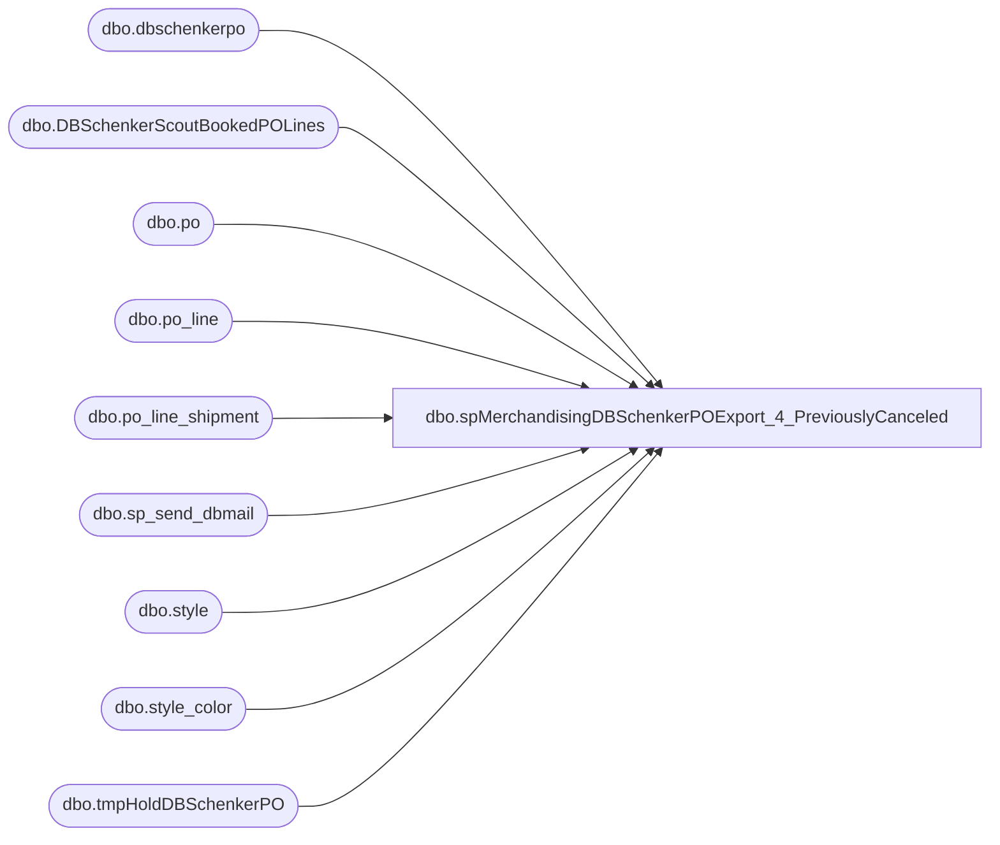

# dbo.spMerchandisingDBSchenkerPOExport_4_PreviouslyCanceled

**Database:** me_01  
**Server:** bedrockdb02  

## Architecture Diagram



## Table Dependencies

| Referenced Table |
|---|
| dbo.dbschenkerpo |
| dbo.DBSchenkerScoutBookedPOLines |
| dbo.po |
| dbo.po_line |
| dbo.po_line_shipment |
| dbo.sp_send_dbmail |
| dbo.style |
| dbo.style_color |
| dbo.tmpHoldDBSchenkerPO |

## Stored Procedure Code

```sql
CREATE proc [dbo].[spMerchandisingDBSchenkerPOExport_4_PreviouslyCanceled]
as 
-- =====================================================================================================
-- Name: spMerchandisingDBSchenkerPOExport_4_PreviouslyCanceled
--
-- Description:	Imports file from DB Schenker to show BOOKED po ship lines from the Scout system (DB Schenker system)
--				For booked po ship lines, we find if the ship line is cancelled in Merch, then if a new line is created.
--				Using the original DB Schenker po export query data (that proc calls this one) we can see if the new line is trying to export, then send the original line
--				Sends email summary
-- Input: NA
--
-- Output: spMerchandisingSelectDBSchenkerPOExport executes this procedure.
--
-- Dependencies: na
--
-- Revision History
--		Name:			Date:			Comments:
--		Dan Tweedie		6/14/2012		Created proc.	
--		Dan Tweedie		05/20/2013		Modified first query to do aleft join on po_line_shipment and po_line instead of an inner join
--		Dan Tweedie		06/11/2014		Modified query for finding new lines for cancelled lines, to remove join based on po_line, added joins to style and style_color, removed pls.quantity = b.quantity -- see notes in code
--		Dan Tweedie 	09/15/2014		Added Having filter to 2nd query to ensure that 'new' line is > original line
--		Dan Tweedie		10/17/2014		Added removal of duplicate lines to prevent them from exporting, added email/sms alert for these po's.
--		Tim Callahan    12/09/2015		Removed Santiago Beltran, Mike Schmitz and Linda Becker from e-mail, this is an IT alert 
--		Lizzy Timm		08/19/2019		Updated recipients to EnterpriseSystemsAlerts@buildabear.com
--		Paul Koudelis	06/11/2024		Updated recipients to Entsyssupport@buildabear.com
-- =====================================================================================================


---find booked lines that have cancelled lines in merch
IF (Object_ID('tempdb..#booked') IS NOT NULL) DROP TABLE #booked
select  distinct s.po_no, s.po_shipment_line ship_line, s.style_code, s.qty,
		po.po_id, 
		pl.line_no po_line,
		pl.po_line_id
into #booked
from DBSchenkerScoutBookedPOLines s
join po (nolock) on s.po_no = po.po_no
left join po_line_shipment pls (nolock) on pls.po_id = po.po_id and s.po_shipment_line = pls.po_line_shipment_id --added left join 05/20/2013
left join po_line pl (nolock) on pl.po_id = po.po_id and pls.po_line_id = pl.po_line_id --added left join 05/20/2013
where (pls.quantity = 0 or pls.quantity is null)
and s.po_no in (select purchaseorder from tmpHoldDBSchenkerPO)


--for the booked lines that are cancelled in merch, find lines in merch that are not cancelled
--(finding the new lines that replace the cancelled lines)
IF (Object_ID('tempdb..#booked_newLines') IS NOT NULL) DROP TABLE #booked_newLines
select distinct b.po_no, max(b.ship_line) ship_line, b.style_code, b.qty, b.po_line,
pls.po_line_shipment_id ship_line_NEW, pls.quantity
into #booked_newLines
from #booked b
join po (nolock) on b.po_no = po.po_no
join po_line pl (nolock) on pl.po_id = po.po_id --and pl.line_no = b.po_line --removed 06/11/2014
join style_color sc (nolock) on pl.style_color_id = sc.style_color_id --added 06/11/2014
join style s (nolock) on sc.style_id = s.style_id and sc.reorder_flag = 1 and b.style_code = s.style_code --added 06/11/2014
join po_line_shipment pls (nolock) on pls.po_id = po.po_id 
	and pls.po_line_id = pl.po_line_id 
	and pls.quantity <> 0 
	and pls.po_line_shipment_id <> b.ship_line
--where pls.quantity = b.qty --removed 06/11/2014
group by b.po_no, b.style_code, b.qty, b.po_line,
pls.po_line_shipment_id, pls.quantity
having max(b.ship_line) < pls.po_line_shipment_id
order by 1, 5, 2


---select all data from the dbs export, replacing the ship line where it is a match with the above data
IF (Object_ID('me_01..DBSchenkerPO') IS NOT null) DROP TABLE DBSchenkerPO
select dbs.ProjID,dbs.PurchaseOrder,dbs.PurposeCode,dbs.Division,dbs.Department,dbs.Buyer,dbs.SupplierName,dbs.SupplierCode,
dbs.SupplierAddress1,dbs.SupplierAddress2,dbs.SupplierAddress3,dbs.SupplierAddress4,dbs.UNLOCCodeValue,dbs.ScheduleKCode1,dbs.SupplierCity,dbs.SupplierState,dbs.SupplierCountry,dbs.SupplierPostal,dbs.
OrderPaymentTerms,dbs.FreightPaymentTerms,dbs.OrderDate,dbs.PORef1,dbs.PORef2,dbs.PORef3,dbs.ShipToName,dbs.ShipToCode,dbs.ShipToEmail,dbs.ShipToAddress1,dbs.
ShipToAddress2,dbs.ShipToAddress3,dbs.ShiptoAddress4,dbs.UNLOCCode1,dbs.ScheduleDorKCode,dbs.ShipToCountry,dbs.ShipToCity,dbs.ShipToState,dbs.ShipToZipCode,dbs.
FactoryName,dbs.FactoryCode,dbs.FactoryAddress1,dbs.FactoryAddress2,dbs.FactoryAddress3,dbs.FactoryAddress4,dbs.UNLOCCode2,dbs.ScheduleKCode2,dbs.FactoryCity,dbs.
FactoryState,dbs.FactoryCountry,dbs.FactoryPostal,dbs.ShipWindowStart,dbs.ShipWindowEnd,dbs.ShipWindowCancelDate,
case when nl.ship_line is not null then nl.ship_line else dbs.productdetailid end as productdetailid,
ProductDetailProductCode,dbs.ProductDetailProductDesc,dbs.ProductDetailHTS,dbs.ProductDetailOrderQuantity,dbs.QuantityUOM,dbs.UnitCost,dbs.Mode,dbs.
ProductDetailMasterPackQty,dbs.ProductDetailNoOfPackages,dbs.ProductDetailInnerPackQty,dbs.ProductDetailTotalVolume,dbs.
ProductDetailTotalWeight,dbs.ProductDetailProductPriority,dbs.ProductDetailManufacturerID,dbs.ProductDetailProductRef,dbs.
ProductDetailProductRef2,dbs.ProductDetailProductRef3,dbs.ProductDetailProductRef4,dbs.ProductDetailProductRef5,dbs.
OriginCountry,dbs.OriginCity,dbs.FinalDestination,dbs.POETA,dbs.ProductDate1,dbs.ProductDate2,dbs.Consolidator,dbs.Broker,dbs.Currency,dbs.
SKUNumber,dbs.Size,dbs.Color,dbs.LineEndIndicator
into dbschenkerpo
from tmpHoldDBSchenkerPO dbs
left join #booked_newLines nl on dbs.purchaseorder = nl.po_no
							and dbs.productdetailid = nl.ship_line_NEW
order by dbs.purchaseorder, dbs.productdetailid
----------------------------------------------------------------------------------


truncate table tmpHoldDBSchenkerPO

---remove dupes, send alert
IF (Object_ID('tempdb..##dupes') IS NOT null) DROP TABLE ##dupes
select distinct purchaseorder
into ##dupes
from dbschenkerpo
group by purchaseorder, productdetailid
having count(*) > 1

if (select count(*) from ##dupes) > 0

begin

	delete from dbschenkerpo
	where purchaseorder in (select purchaseorder from ##dupes)

	declare @text nvarchar(max)
			set @text = '
			<font face =arial size = 2> ' +
				'<b>DBS PO Duplicate Lines</b>' +
				'<br>These PO''s did not export to DB Schenker tonight due to duplicate lines.' +
				'<br><br>' +
				'<table border="1">' +
				'<tr><th>PO</th>' +
				'</tr><font face =arial size = 2>' +
				CAST ( ( SELECT td = PurchaseOrder,''
							from ##dupes 
							FOR XML PATH('tr'), TYPE 
				) AS NVARCHAR(MAX) ) +
				'</font></table></font></p></p>
				<br>'

			exec msdb.dbo.sp_send_dbmail
				@profile_name = 'merchadmin',
				--@recipients = 'EnterpriseSystemsAlerts@buildabear.com',
				@recipients = 'Entsyssupport@buildabear.com',
				--@blind_copy_recipients = 'EnterpriseSystemsAlerts@buildabear.com',
				@body = @text,
				@subject = 'DBS PO Duplicate Lines',
				@body_format = 'HTML'

end
```

