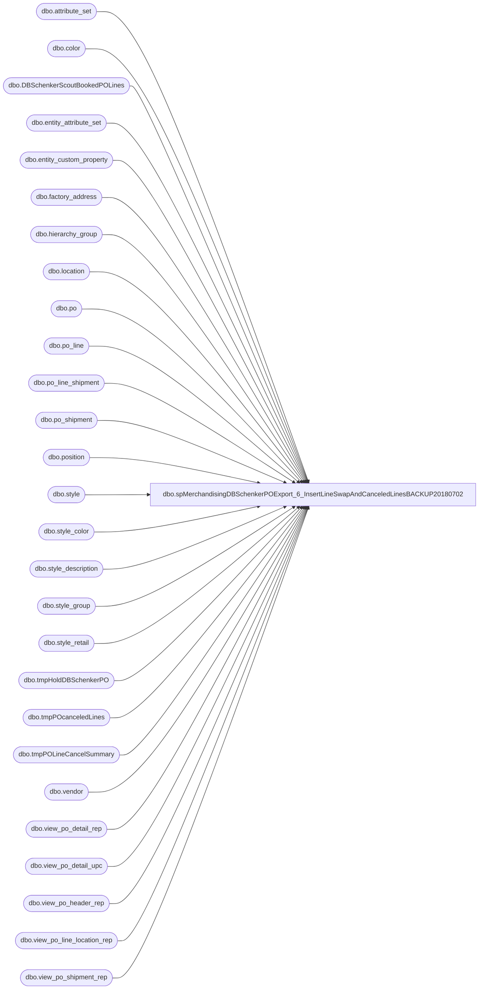

# dbo.spMerchandisingDBSchenkerPOExport_6_InsertLineSwapAndCanceledLinesBACKUP20180702

**Database:** me_01  
**Server:** bedrockdb02  

## Architecture Diagram



## Table Dependencies

| Referenced Table |
|---|
| dbo.attribute_set |
| dbo.color |
| dbo.DBSchenkerScoutBookedPOLines |
| dbo.entity_attribute_set |
| dbo.entity_custom_property |
| dbo.factory_address |
| dbo.hierarchy_group |
| dbo.location |
| dbo.po |
| dbo.po_line |
| dbo.po_line_shipment |
| dbo.po_shipment |
| dbo.position |
| dbo.style |
| dbo.style_color |
| dbo.style_description |
| dbo.style_group |
| dbo.style_retail |
| dbo.tmpHoldDBSchenkerPO |
| dbo.tmpPOcanceledLines |
| dbo.tmpPOLineCancelSummary |
| dbo.vendor |
| dbo.view_po_detail_rep |
| dbo.view_po_detail_upc |
| dbo.view_po_header_rep |
| dbo.view_po_line_location_rep |
| dbo.view_po_shipment_rep |

## Stored Procedure Code

```sql
CREATE proc [dbo].[spMerchandisingDBSchenkerPOExport_6_InsertLineSwapAndCanceledLinesBACKUP20180702]
as
-- =====================================================================================================
-- Name: spMerchandisingDBSchenkerPOExport_6_InsertLineSwapAndCanceledLines
--
-- Description:	Captures data set of PO data that needs to export to DB Schenker
--
-- Input: 
--
-- Output: 
--
-- Dependencies: 
--
-- Revision History
--		Name:			Date:			Comments:
--		Dan Tweedie		12/14/2012		Created proc.	
--		Dan Tweedie		08/04/2014		Added location 2013 to selects
--		Tim Callahan	02/15/2016		Updated code to account for China Warehouses
--		Tim Callahan	03/22/2016		Remarked out Where UPC < 000001000000 as this was preventing PO data from exporting with the new "true" UPCs in Merch.
--		Tim Callahan	10/25/2016		Added logic to include USBQ to UKBQ Transfers and UKBQ to USBQ Transfers  
--		Tim Callahan	05/25/2018		Updated code to account for additional China Warehouses 8502 and 8505 at request of Santiago Beltran 
-- =====================================================================================================

set nocount on

---capture the PO data and perform the line swap
if (select count(*) from tmpPOLineCancelSummary where booked = 'YES') > 0
begin
	IF (Object_ID('tempdb..#view_temp1') IS NOT null) DROP TABLE #view_temp1
	IF (Object_ID('tempdb..#view_temp2') IS NOT null) DROP TABLE #view_temp2
	IF (Object_ID('tempdb..#view_temp3') IS NOT null) DROP TABLE #view_temp3
	IF (Object_ID('tempdb..#view_detail_temp') IS NOT null) DROP TABLE #view_detail_temp
	IF (Object_ID('tempdb..#lineswap1') IS NOT null) DROP TABLE #lineswap1
	IF (Object_ID('tempdb..#lineswap2') IS NOT null) DROP TABLE #lineswap2
			

	-----Capture view data into temp tables to join into the main po query
	select *
	into #view_temp1
	from view_po_line_location_rep a (nolock)  
	where po_id in (select po_id from po where po_status IN (4,7) and approval_status in (3,7) and po_no in (select po_no from tmpPOLineCancelSummary where booked = 'YES'))

	select pls.po_line_shipment_id, pls.po_shipment_id, po.po_id, pl.po_line_id, pl.line_no, ps.expected_receipt_date, c.color_code, pls.quantity
	into #view_temp2
	from po (nolock)
	join po_line pl (nolock) on po.po_id = pl.po_id
	join po_shipment ps (nolock) on po.po_id = ps.po_id
	join po_line_shipment pls (nolock) on pls.po_id = po.po_id and pls.po_shipment_id = ps.po_shipment_id and pls.po_line_id = pl.po_line_id
	join style_color sc (nolock) on sc.style_color_id = pl.style_color_id
	join color c (nolock) on c.color_id = sc.color_id
	where po.po_id in (select po_id from po where po_status IN (4,7) and approval_status in (3,7) and po_no in (select po_no from tmpPOLineCancelSummary where booked = 'YES'))
	order by pl.line_no, pls.po_line_shipment_id, pls.po_shipment_id

	select b.po_line_shipment_id, b.po_shipment_id, a.*
	into #view_temp3
	from #view_temp1 a
	join #view_temp2 b on b.po_id = a.po_id
		and b.po_line_id = a.po_line_id
		and b.line_no = a.line_no
		and b.expected_receipt_date = a.expected_receipt_date
		and b.color_code = a.color_code
		and b.quantity = a.total_line_loc_ordered_units

	Select * 
	into #view_detail_temp 
	from view_po_detail_rep (nolock)
	where po_id in (select po_id from po where po_status IN (4,7) and approval_status in (3,7) and po_no in (select po_no from tmpPOLineCancelSummary where booked = 'YES'))

	----Capture PO data 
	SELECT 'ICBBW1' as ProjID,
	d.po_no as PurchaseOrder,  
	'Replace' as PurposeCode,
	'' as Division,
	left(hg.hierarchy_group_code,8) as Department,
	'' as Buyer,
	a.vendor_name as SupplierName, 
	a.vendor_code as SupplierCode,
	'' as SupplierAddress1,
	'' as SupplierAddress2,
	'' as SupplierAddress3,
	'' as	SupplierAddress4,
	'' as	UNLOCCodeValue,
	'' as	ScheduleKCode1,
	'' as	SupplierCity,
	'' as	SupplierState,
	'' as SupplierCountry,
	'' as	SupplierPostal,
	'FOB' as OrderPaymentTerms,
	'COLLECT' as FreightPaymentTerms,
	convert(varchar, d.create_date, 101) as OrderDate, 
	d.fob_description as PORef1, 
	'' as PORef2,
	'' as PORef3,
	e.location_name as ShipToName,
	e.location_code as ShipToCode, 
	'' as ShipToEmail,
	'' as	ShipToAddress1,
	'' as ShipToAddress2,
	'' as ShipToAddress3,
	'' as	ShiptoAddress4,
	'' as	UNLOCCode1,
	'' as	ScheduleDorKCode,
	'' as	ShipToCountry,
	'' as	ShipToCity,
	'' as ShipToState,
	'' as	ShipToZipCode,
	isnull((select attribute_set_label from attribute_set where attribute_set_id = easfact.attribute_set_id),'') as FactoryName,
	isnull((select attribute_set_code from attribute_set where attribute_set_id = easfact.attribute_set_id),'') as FactoryCode,
	'' as FactoryAddress1,
	'' as FactoryAddress2,
	'' as FactoryAddress3,
	'' as FactoryAddress4,
	'' as UNLOCCode2,
	'' as ScheduleKCode2,
	'' as FactoryCity,
	'' as FactoryState,
	'' as FactoryCountry,
	'' as FactoryPostal,
	convert(varchar, f.user_defined_date, 101) as ShipWindowStart,  
	convert(varchar, ff.user_defined_date, 101) as ShipWindowEnd, 
	'' as ShipWindowCancelDate,
	e.po_line_shipment_id as ProductDetailID,---line number>>??
	e.style_code as ProductDetailProductCode,
	e.long_desc as ProductDetailProductDesc,
	case 
		when l1.location_code in ('0980','0960','0013','9999','1971','1972') 
		then 
			case 
				when substring(hg.hierarchy_group_code,7,2)= '60'
				then isnull(cp_ht_us.custom_property_value,'')
				else isnull((select top 1 attribute_set_label from attribute_set ats, entity_attribute_set eas where ats.attribute_set_id = eas.attribute_set_id and eas.attribute_id = 152 and s.style_id=eas.parent_id),'')
			end
		else 
			case 
				when l1.location_code in ('3970','3980','8502','8505') -- Changed from = '0975' aka Canada on 2/15/2016
				then 
					case 
						when substring(hg.hierarchy_group_code,7,2)= '60'
						then isnull(cp_ht_cn.custom_property_value, '') -- Changed from cp_ht_ca.custom_property_value on 02/15/2016
						else isnull((select top 1 attribute_set_label from attribute_set ats, entity_attribute_set eas where ats.attribute_set_id = eas.attribute_set_id and eas.attribute_id = 597 and s.style_id=eas.parent_id),'') -- Changed from attribute id 154 (Canada) on 02/11/2016
					end
		else 
			case 
				when l1.location_code in ('2970','2999','2013')
				then 
					case 
						when substring(hg.hierarchy_group_code,7,2)= '60'
						then isnull(cp_ht_uk.custom_property_value, '')
						else isnull((select top 1 attribute_set_label from attribute_set ats, entity_attribute_set eas where ats.attribute_set_id = eas.attribute_set_id and eas.attribute_id = 156 and s.style_id=eas.parent_id), '')
					end 
			end
		end
	end as ProductDetailHTS,
	j.ordered_units*ISNULL(cp.custom_property_value,1) as ProductDetailOrderQuantity,
	'UN' as QuantityUOM,
	case when a.vendor_code in ('KIDPSHA', 'KIDPREF', 'KIDPIND', 'KIDQING') 
		then 0
		else (e.first_cost * j.ordered_units) / (j.ordered_units*ISNULL(cp.custom_property_value,1)) 
		end as UnitCost, --- excludes KDP vendor from viewing cost
	'OCEAN' as Mode,
	case when ecp.custom_property_value is not null and substring(hg.hierarchy_group_code,7,2)='60'
		then	
			case when ecp.custom_property_value = '0.00' 
			then 1
			else ecp.custom_property_value
			end
		else 	s.order_multiple
		end as ProductDetailMasterPackQty,
	'' as ProductDetailNoOfPackages,
		case when ecp.custom_property_value is not null and substring(hg.hierarchy_group_code,7,2)='60' 
		then	
			case when ecp.custom_property_value = '0.00' 
			then 1
			else ecp.custom_property_value
			end
		else s.distribution_multiple
		end as ProductDetailInnerPackQty,
	'' as ProductDetailTotalVolume,
	'' as ProductDetailTotalWeight,
	'' as ProductDetailProductPriority,	
	'' as ProductDetailManufacturerID,	
	'' as ProductDetailProductRef,
	'' as ProductDetailProductRef2,	
	'' as ProductDetailProductRef3,
	'' as ProductDetailProductRef4,
	'' as ProductDetailProductRef5,
	isnull((select country from factory_address fa, attribute_set ats where easfact.attribute_set_id = ats.attribute_set_id and ats.attribute_set_code = fa.attribute_set_code),'') as OriginCountry, 
	isnull((select city from factory_address fa, attribute_set ats where easfact.attribute_set_id = ats.attribute_set_id and ats.attribute_set_code = fa.attribute_set_code),'') as OriginCity,
	'' as FinalDestination,
	'' as POETA,
	convert(varchar, f.expected_receipt_date, 101) as ProductDate1,
	'' as ProductDate2,
	'' as Consolidator,
	'' as Broker,
	'' as Currency,
	'' as SKUNumber,
	'' as Size,
	e.color_short_description as Color,
	'~' as LineEndIndicator
	into #lineswap1
FROM view_po_header_rep d (nolock)
	join vendor a (nolock) on a.vendor_id = d.vendor_id 
	join #view_temp3 e (nolock) on d.po_id = e.po_id
	join #view_detail_temp j (nolock) on j.po_line_id=e.po_line_id 
		and e.expected_receipt_date = j.expected_receipt_date
	join view_po_shipment_rep f (nolock) on d.po_id = f.po_id
		and f.po_id = j.po_id
		and f.expected_receipt_date = j.expected_receipt_date
		and f.date_type_code = 100 
		and e.po_shipment_id = f.po_shipment_id
	join view_po_shipment_rep ff (nolock) on ff.po_id = j.po_id
		and ff.expected_receipt_date = j.expected_receipt_date 
		and ff.date_type_code = 200
		and e.po_shipment_id = ff.po_shipment_id 
	join view_po_detail_upc i (nolock) on j.sku_id = i.sku_id
	join location l1 (nolock) on j.location_id=l1.location_id
	join style s (nolock) on e.style_code = s.style_code
	join position p (nolock) on d.position_id=p.position_id
	join style_retail srus (nolock) on s.style_id=srus.style_id
		and srus.jurisdiction_id=1
	join style_group sg (nolock) on s.style_id = sg.style_id
	join hierarchy_group hg (nolock) on sg.hierarchy_group_id = hg.hierarchy_group_id
	LEFT JOIN entity_custom_property cp (nolock) on s.style_id=cp.parent_id
												and isnull(cp.custom_property_id,2)=2
	LEFT JOIN style_description sd (nolock) on s.style_id=sd.style_id
										   and ISnull(sd.language_id,100002)=100002 
	LEFT JOIN style_retail sruk (nolock) on s.style_id=sruk.style_id
										and isnull(sruk.jurisdiction_id,2)=2
	LEFT JOIN style_retail srcd (nolock) on s.style_id=srcd.style_id
										and isnull(srcd.jurisdiction_id,3)=3
	LEFT JOIN style_retail sreu (nolock) on s.style_id=sreu.style_id
										and isnull(sreu.jurisdiction_id,2)=2
	LEFT JOIN entity_attribute_set easfact (nolock) on s.style_id=easfact.parent_id
												   and easfact.attribute_id = 122 
	LEFT JOIN entity_custom_property cp_ht_us (nolock) on s.style_id = cp_ht_us.parent_id
													  and cp_ht_us.custom_property_id = 4
	/*LEFT JOIN entity_custom_property cp_ht_ca (nolock) on s.style_id = cp_ht_ca.parent_id
													  --and cp_ht_ca.custom_property_id = 23
													  */
	LEFT JOIN entity_custom_property cp_ht_cn (nolock) on s.style_id = cp_ht_cn.parent_id -- Added for China Warehouses
														and cp_ht_cn.custom_property_id = 61 -- Added for China Warehouses 
	LEFT JOIN entity_custom_property cp_ht_uk (nolock) on s.style_id = cp_ht_uk.parent_id
													  and cp_ht_uk.custom_property_id = 24
	LEFT JOIN entity_custom_property ecp (nolock) on s.style_id = ecp.parent_id
												 and ecp.custom_property_id = 2
												 and ecp.parent_type = 1

	WHERE e.total_line_loc_ordered_units <> 0
	-- and i.upc_number < '000001000000' -- Removed on 3/22/2016 due to conflict with "true" UPC's
		/* -- Remarked out on 10/25/2016
		and (	
				a.import_flag = 1 --ensures we only capture non-domestic vendors)
				and l1.location_code in ('0980','0960','0013','9999','0975','2970','2999','2013','1971','1972','3970','3980') -- Added China Warehouses on 2/15/2016
			)	
		*/
		and (	a.import_flag = 1 --ensures we only capture non-domestic vendors
				and l1.location_code in ('0980','0960','0013','9999','0975','2970','2999','2013','1971','1972','3970','3980','8502','8505')
			or (a.import_flag = 0 and a.vendor_code = 'BABWORK' and l1.location_code in ('2970'))
			or (a.import_flag = 0 and a.vendor_code = 'BABWUKK' and l1.location_code in ('0980'))
			) -- Added on 10/25/2016			
		and (
			d.po_no in (select po_no from tmpPOLineCancelSummary where booked = 'YES' and e.po_line_shipment_id = new_line)
			)
	order by d.po_no, e.style_code, f.user_defined_date

--the actual swap is performed here 
select distinct ls1.ProjID,ls1.PurchaseOrder, 'Replace' as PurposeCode, ls1.Division,ls1.Department,ls1.Buyer,ls1.SupplierName,ls1.SupplierCode,
ls1.SupplierAddress1,ls1.SupplierAddress2,ls1.SupplierAddress3,ls1.SupplierAddress4,ls1.UNLOCCodeValue,ls1.ScheduleKCode1,ls1.SupplierCity,ls1.SupplierState,ls1.SupplierCountry,ls1.SupplierPostal,ls1.
OrderPaymentTerms,ls1.FreightPaymentTerms,ls1.OrderDate,ls1.PORef1,ls1.PORef2,ls1.PORef3,ls1.ShipToName,ls1.ShipToCode,ls1.ShipToEmail,ls1.ShipToAddress1,ls1.
ShipToAddress2,ls1.ShipToAddress3,ls1.ShiptoAddress4,ls1.UNLOCCode1,ls1.ScheduleDorKCode,ls1.ShipToCountry,ls1.ShipToCity,ls1.ShipToState,ls1.ShipToZipCode,ls1.
FactoryName,ls1.FactoryCode,ls1.FactoryAddress1,ls1.FactoryAddress2,ls1.FactoryAddress3,ls1.FactoryAddress4,ls1.UNLOCCode2,ls1.ScheduleKCode2,ls1.FactoryCity,ls1.
FactoryState,ls1.FactoryCountry,ls1.FactoryPostal,ls1.ShipWindowStart,ls1.ShipWindowEnd,ls1.ShipWindowCancelDate,
lcs.canceled_line as ProductDetailID,
ProductDetailProductCode,ls1.ProductDetailProductDesc,ls1.ProductDetailHTS,ls1.ProductDetailOrderQuantity,ls1.QuantityUOM,ls1.UnitCost,ls1.Mode,ls1.
ProductDetailMasterPackQty,ls1.ProductDetailNoOfPackages,ls1.ProductDetailInnerPackQty,ls1.ProductDetailTotalVolume,ls1.
ProductDetailTotalWeight,ls1.ProductDetailProductPriority,ls1.ProductDetailManufacturerID,ls1.ProductDetailProductRef,ls1.
ProductDetailProductRef2,ls1.ProductDetailProductRef3,ls1.ProductDetailProductRef4,ls1.ProductDetailProductRef5,ls1.
OriginCountry,ls1.OriginCity,ls1.FinalDestination,ls1.POETA,ls1.ProductDate1,ls1.ProductDate2,ls1.Consolidator,ls1.Broker,ls1.Currency,
ls1.SKUNumber,ls1.Size,ls1.Color,ls1.LineEndIndicator
into #lineswap2
from #lineswap1 ls1
join tmpPOLineCancelSummary lcs on ls1.purchaseorder = lcs.po_no and ls1.productdetailid = lcs.new_line
join DBSchenkerScoutBookedPOLines b on ls1.purchaseorder = b.po_no and lcs.canceled_line = b.po_shipment_line and ls1.ProductDetailOrderQuantity = b.qty


insert tmpHoldDBSchenkerPO
select * from #lineswap2
order by purchaseorder, productdetailid 

end


---
if (select count(*) from tmpPOcanceledLines) > 0
begin
	insert tmpHoldDBSchenkerPO
	select * from tmpPOcanceledLines 
	order by purchaseorder, productdetailid
end
```

