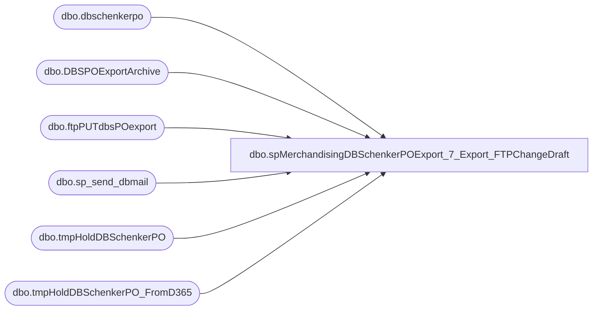

# dbo.spMerchandisingDBSchenkerPOExport_7_Export_FTPChangeDraft

**Database:** me_01  
**Server:** bedrockdb02  

## Architecture Diagram



## Table Dependencies

| Referenced Table |
|---|
| dbo.dbschenkerpo |
| dbo.DBSPOExportArchive |
| dbo.ftpPUTdbsPOexport |
| dbo.sp_send_dbmail |
| dbo.tmpHoldDBSchenkerPO |
| dbo.tmpHoldDBSchenkerPO_FromD365 |

## Stored Procedure Code

```sql
CREATE proc [dbo].[spMerchandisingDBSchenkerPOExport_7_Export_FTPChangeDraft]

as
-- =====================================================================================================
-- Name: spMerchandisingDBSchenkerPOExport_7_Export
--
-- Description:	Exports PO file to DB Schenker, sends email summary to BQ group, sends email for exceptions (factories without addresses, styles without HTS)
-- Input: NA
--
-- Output: Resultset formatted to meet DB Schenker requirements for PO Receipt Import. (tab delimited text file)
--
-- Dependencies: na
--
-- Revision History
--		Name:			Date:			Comments:
--		Dan Tweedie		12/14/2012		created proc
--		Dan Tweedie		02/05/2013		Added dynamic FTP script generator
--		Dan Tweedie		07/14/2015		Pointed to Kermode instead of Oursmerchdb01
--		Tim Callahan	04/26/2017		Added logic to modify ProductDate1 field in table tmpHoldDBSchenkerPO for China POs
--		Tim Callahan	06/09/2017		Modified logic to modify ProductDate1 field in dbschenkerpo table rather than tmpHoldDBSchenkerPO table. 
--		Dan Tweedie		11-08-2017		Added union to get D365 PO data, commented out until D365 is live
--		Dan Tweedie		2018-07-02		Enabled additional sql for Dynamics data
-- =====================================================================================================

set nocount on 

--enable this section when dynamics goes live

if (
	select sum(Rowz)
	from
		(
			select count(*) as Rowz from tmpHoldDBSchenkerPO 
			UNION
			select count(*) as Rowz from tmpHoldDBSchenkerPO_FromD365 
		) as a
	) > 0 

begin
	insert dbschenkerpo
	select * from tmpHoldDBSchenkerPO
	UNION
	select * from tmpHoldDBSchenkerPO_FromD365

end

----get rid of this section when dynamics goes live
--if (select count(*) from tmpHoldDBSchenkerPO) > 0 
--begin
--	insert dbschenkerpo
--	select * from tmpHoldDBSchenkerPO
--end

-- 
-- Update ProductDate1 Field for China Orders
-- The business requested we modify the ProductDate1 Field for all POs fulfilling from China (CN) only
-- Rather than date that comes from the Merchandising PO, they want to subtract 7 days from this date 
-- Part of the request was only for POs with a ShipWindowStart after 4/22/2017
-- Originally Added Apr 26, 2017, however the it was accounting for previous steps in the code. 
-- The table dbschenkerpo is the last table before export, so makes the most sense for it to be where the date change is made 


 if (select count(*) from dbschenkerpo where OriginCountry = 'CN' and convert(date,ShipWindowStart,101) > '04-22-2017') > 0 

	Begin

		update dbschenkerpo
		set ProductDate1 = convert(VarChar(30), dateadd(d,-7,ProductDate1), 101)
		where OriginCountry = 'CN'
		and convert(date,ShipWindowStart,101) > '04-22-2017'
 
	End 

	----Export data into text file
	----Only proceed if there is data from query above
	---export data to file
	if (select count(*) from dbschenkerpo where ProductDetailHTS <> '' and origincountry <> '' and origincity <> '') > 0 
	begin
	------Archive Exported Data into table for Future Reference
			insert DBSPOExportArchive
			select getdate() ExportDate, *
			from dbschenkerpo
			where ProductDetailHTS <> '' and origincountry <> '' and origincity <> '' --we won't send records without these fields populated, as seen in the export code below

			declare @query varchar(1000),
					@date varchar(52),
					@file_name varchar(100),
					@file_location varchar(100),
					@server varchar(20),
					@username varchar(20),
					@password varchar(20),
					@database varchar(20),
					@bcp varchar(1000)

			set @query = 'select distinct * from me_01.dbo.DBSchenkerPO where ProductDetailHTS <> '''' and origincountry <> '''' and origincity <> '''' order by PurchaseOrder, ProductDetailProductCode, ProductDetailID, ShipWindowStart '
			select @date = convert(varchar, datepart(yyyy, getdate())) + convert(varchar, datepart(mm, getdate())) + convert(varchar, datepart(dd, getdate())) + convert(varchar, datepart(hh, getdate())) + convert(varchar, datepart(mi, getdate())) + convert(varchar, datepart(ss, getdate())) + convert(varchar, datepart(ms, getdate()))
			set @file_location = '\\kermode\FileRepository\MERCHANDISING\APAC\'
			set @file_name = 'BABBQPO' + @date --NO LONGER USING FILE EXTENSION, INSTEAD ADDING THAT IN THE BCP SCRIPT AND AGAIN DURING THE FTP RENAME
			set @server = 'bedrockdb02'
			set @database = 'me_01'
			--set @bcp = 'bcp "' + @query + '" queryout "' + @file_location + @file_name + '.tmp' + '"  -T -c -S' + @server 
			set @bcp = 'bcp "' + @query + '" queryout "' + @file_location + @file_name + '.TXT' + '"  -T -c -S' + @server 

			exec master..xp_cmdshell @bcp

			----FTP text file to DB Schenker server
			--------------
					--declare and set ftp variables 
	------DYNAMIC FTP SCRIPT TO USE SPECIFIC FILENAMES (ALLOWS FOR FILE UPLOADED, THEN RENAMED)
				
				declare @FTPquery varchar(1000),
						@FTPfile_location varchar(1000),
						@FTPfile_name varchar(52),
						@FTPbcp varchar(1000)

				IF (Object_ID('tempdb..##ftpFile') IS NOT NULL) DROP TABLE ##ftpFile
				create table ##ftpFile
				(ftpString varchar(4000))

				insert ##ftpFile
				select 'verbose'
				insert ##ftpFile
				select 'open ftp.sword.schenker.com'
				insert ##ftpFile
				select 'babw'
				insert ##ftpFile
				select 'B3arbu1ld'
				insert ##ftpFile
				select 'prompt n'
				insert ##ftpFile
				select 'cd from_babw'
				insert ##ftpFile
				--select 'mput \\kermode\FileRepository\MERCHANDISING\APAC\' + @file_name + '.tmp'
				select 'mput \\kermode\FileRepository\MERCHANDISING\APAC\' + @file_name + '.TXT'
				---insert ##ftpFile
				--select 'rename ' + @file_name + '.tmp ' + @file_name + '.TXT'
				insert ##ftpFile
				select 'quit'

				set @FTPquery = 'set nocount on select * from ##ftpFile'
				set @FTPfile_location = '\\kermode\FileRepository\MERCHANDISING\APAC\FTP\SCRIPTS\'
				set @FTPfile_name = 'ftpPUTnew.TXT'
				set @FTPbcp = 'bcp "' + @FTPquery + '" queryout "' + @FTPfile_location + @FTPfile_name + '"  -T -c -S' + @server

				exec master..xp_cmdshell @FTPbcp
				
			-----ftp upload
			declare @ftpPUT varchar(1000),
							@Log_query varchar(1000),
							@Log_filename varchar(100),
							@Log_file_location varchar(100),
							@Log_bcp varchar(1000),
							@body varchar(4000)
							
					set @ftpPUT = 'ftp -d -s:\\kermode\FileRepository\MERCHANDISING\APAC\FTP\SCRIPTS\ftpPUTnew.txt' 

					--create temp tables for ftp logs
					IF (Object_ID('me_01..ftpPUTdbsPOexport') IS NOT NULL) DROP TABLE ftpPUTdbsPOexport
					create table ftpPUTdbsPOexport
					(ftpLog varchar(4000))

					--execute sql/ftp
					----connect to ftp server, if connection unsuccessful, send email
							insert ftpPUTdbsPOexport exec master..xp_cmdshell @ftpPUT
							if (select count(*) from ftpPUTdbsPOexport where ftplog like '%Transfer complete%') < 1
								begin
									set @Log_query = 'select * from bedrockdb02.me_01.dbo.ftpPUTdbsPOexport'
									set @Log_filename = 'ftpPUTLog.txt'
									set @Log_file_location = '\\kermode\FileRepository\MERCHANDISING\APAC\FTP\LOGS\'
									set @Log_bcp = 'bcp "' + @Log_query + '" queryout "' + @Log_file_location + @Log_filename + '" -t, -T -c -Sbedrockdb02'

									exec master..xp_cmdshell @Log_bcp
															
									set @body =	'An attempt to FTP a PO Export file from BAB to DB Schenker failed.' 
												+ char(10) + char(13) + 
												'See the attached log for details.'
												+ char(10) + char(13) + 
												+ char(10) + char(13) + 
												'This process is managed by bedrockdb02.me_01.dbo.spMerchandisingDBSchenkerPOExport_7_Export'
							
									EXEC bedrockdb02.msdb.dbo.sp_send_dbmail
									@profile_name = 'MerchAdmin',
									@recipients = 'EntSysSupport@buildabear.com',
									@subject = 'FTP Failure: PO Export from BAB to DB Schenker',
									@body = @body,
									@file_attachments = '\\kermode\FileRepository\MERCHANDISING\APAC\FTP\LOGS\ftpPUTLog.txt',
									@importance = 'HIGH'
								end
							else
								begin
									--EXEC master..xp_cmdshell 'move \\kermode\FileRepository\MERCHANDISING\APAC\* \\kermode\FileRepository\MERCHANDISING\APAC\done'
									EXEC master..xp_cmdshell 'cmd /c ren "\\kermode\FileRepository\MERCHANDISING\APAC\*.TXT" *.tmp & move /Y "\\kermode\FileRepository\MERCHANDISING\APAC\*.tmp" "\\kermode\FileRepository\MERCHANDISING\APAC\done\"'
								end

			
	END
```

