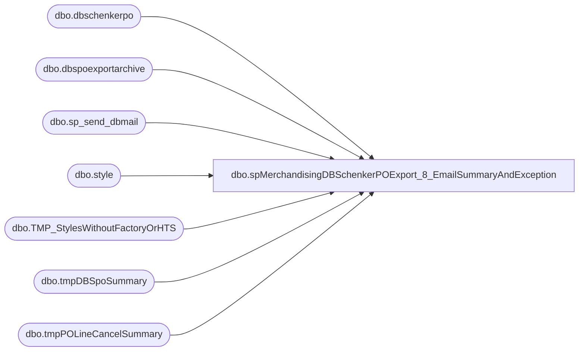

# dbo.spMerchandisingDBSchenkerPOExport_8_EmailSummaryAndException

**Database:** me_01  
**Server:** bedrockdb02  

## Architecture Diagram



## Table Dependencies

| Referenced Table |
|---|
| dbo.dbschenkerpo |
| dbo.dbspoexportarchive |
| dbo.sp_send_dbmail |
| dbo.style |
| dbo.TMP_StylesWithoutFactoryOrHTS |
| dbo.tmpDBSpoSummary |
| dbo.tmpPOLineCancelSummary |

## Stored Procedure Code

```sql
CREATE proc [dbo].[spMerchandisingDBSchenkerPOExport_8_EmailSummaryAndException]
as 
-- =====================================================================================================
-- Name: spMerchandisingDBSchenkerPOExport_8_EmailSummaryAndException
--
-- Description:	Exports PO file to DB Schenker, sends email summary to BQ group, sends email for exceptions (factories without addresses, styles without HTS)
-- Input: NA
--
-- Output: Resultset formatted to meet DB Schenker requirements for PO Receipt Import. (tab delimited text file)
--
-- Dependencies: na
--
-- Revision History
--		Name:			Date:			Comments:
--		Dan Tweedie		12/14/2012		created proc
--		Dan Tweedie		02/25/2014		added style.create_date to email for styles without factory or hts
--		Tim Callahan	05/25/2018		Removed MikeS from emails (no longer employed by BAB) 
--		Dan Tweedie		09/25/2018		Added insert into tmp_StylesWithoutFactoryorHTS from staged Dynamics PO data
--		Lizzy Timm		01/10/2025		Added bonded China Warehouses 9942 to be included	
-- =====================================================================================================
set nocount on

if (select count(*) from me_01.dbo.dbspoexportarchive where datediff(dd, ExportDate, getdate()) = 0) > 0 

BEGIN
----Send exported summary via email
	begin
		declare @text nvarchar(max)
		set @text = '
		<font face =arial size = 2> ' +
			'<b>DBS PO Export Summary</b>' +
			'<br>The POs listed below were exported to DB Schenker today.' +
			'<br><br>' +
			'<table border="1">' +
			'<tr><th>PO</th><th>STYLE</th><th>STYLE DESCRIPTION</th><th>START-SHIP-DATE</th><th>ORDER QTY</th><th>UPDATE OR CANCEL</th>' +
			'</tr><font face =arial size = 2>' +
			CAST ( ( SELECT td = PurchaseOrder,'',
							td = ProductDetailProductCode, '',
							td = ProductDetailProductDesc, '',
							td = ShipWindowStart, '',
							td = ProductDetailOrderQuantity, '',
							td = case when purposecode = 'Cancel' then 'CANCEL' else 'UPDATE' end, ''
						from me_01.dbo.dbspoexportarchive where datediff(dd, ExportDate, getdate()) = 0 
						order by PurchaseOrder,ProductDetailProductCode,ShipWindowStart  
						FOR XML PATH('tr'), TYPE 
			) AS NVARCHAR(MAX) ) +
			'</font></table></font></p></p>
			<br>
			<font face =arial size = 1>This report was run from bedrockdb02.me_01.dbo.spMerchandisingDBSchenkerPOExport_8_EmailSummaryAndException.</font>
			<br>
			<br>
		<font face =arial size = 1><i>The information in this message may be privileged, “confidential” and protected from disclosure and/or intended only for the addressee(s) named above.  If the reader of this message is not the intended recipient, or an employee or agent responsible for delivering this message to the intended recipient, you are hereby notified that any dissemination, distribution or copying of the communication is strictly prohibited.  If you have received this communication in error, please notify us immediately by replying to the message and deleting it from your computer.  Thank you beary much.</i></font>'

		exec msdb.dbo.sp_send_dbmail
			@profile_name = 'merchadmin',
			@recipients = 'santiagob@buildabear.com;mikesc@buildabear.com;DorisM@buildabear.com',
			--@blind_copy_recipients = 'EntSysSupport@buildabear.com',
			@body = @text,
			@subject = 'DBS PO Export Summary',
			@body_format = 'HTML'

	END

----Send exception email for styles without HTS or Factory
--this table has already been pre-populated
if (select count(*) from dbschenkerpo where left(PurchaseOrder, 2) = 'PO' and (isnull(ProductDetailHTS, '') = '' or isnull(origincountry,'') = '' or isnull(origincity,'') = '')) > 0 --these are Dynamics PO's
begin
	insert TMP_StylesWithoutFactoryOrHTS 
	select 
		ProductDetailProductCode,
		ProductDetailProductDesc,
		Department, 
		FactoryCode,
		origincity, 
		origincountry,
		ProductDetailHTS,
		case 
				when ShipToCode in ('0980','0960','0013','9999','1971','1972')  then 'U.S.'
				when ShipToCode in ('3970','3980','9942','8502','8505') then 'China'
				when ShipToCode in ('2970','2999','2013') then 'UK'
			end
	from dbschenkerpo 
	where left(PurchaseOrder, 2) = 'PO' -- DYNAMICS PO
	and (isnull(ProductDetailHTS, '') = '' or isnull(origincountry,'') = '' or isnull(origincity,'') = '')
end

if (select count(*) from me_01.dbo.TMP_StylesWithoutFactoryOrHTS) > 0
	begin

		declare @text2 nvarchar(max)
		set @text2 = '
		<font face =arial size = 2> ' +
			'<b>STYLES WITHOUT HTS AND/OR FACTORY DATA</b>' +
			'<br>The styles listed below do not have valid HTS and/or Factory definitions.' +
			'<br>If a PO line is missing information it will not be sent to our freight forwarder and the vendor will not be able to place a booking so it is important the missing information is entered at least 3-4 weeks before the shipping window starts.' +
			'<br>Please review and enter the missing information in the merchandising system.' +
			'<br><br>' +
			'<table border="1">' +
			'<tr><th>STYLE</th><th>STYLE DESCRIPTION</th><th>STYLE CREATED<th>DEPARTMENT</th><th>FACTORY CODE</th><th>FACTORY CITY</th><th>FACTORY COUNTRY</th><th>HTS</th><th>PO COUNTRY</th>' +
			'</tr><font face =arial size = 2>' +
			CAST ( ( SELECT td = t.style,'',
							td = t.description, '',
							td = convert(varchar, isnull(s.create_date,getdate()), 101), '',
							td = T.department, '',
							td = T.Factory_Code, '',
							td = T.Factory_City, '',
							td = T.Factory_Country, '',
							td = T.HTS, '',
							td = T.PO_Country, ''
						from me_01.dbo.TMP_StylesWithoutFactoryOrHTS t
						left join me_01.dbo.style s (nolock) on t.style = s.style_code
						order by style
						FOR XML PATH('tr'), TYPE 
			) AS NVARCHAR(MAX) ) +
			'</font></table></font></p></p>
			<br>
			<font face =arial size = 1>This report was run from bedrockdb02.me_01.dbo.spMerchandisingDBSchenkerPOExport_8_EmailSummaryAndException.</font>
			<br>
			<br>
		<font face =arial size = 1><i>The information in this message may be privileged, “confidential” and protected from disclosure and/or intended only for the addressee(s) named above.  If the reader of this message is not the intended recipient, or an employee or agent responsible for delivering this message to the intended recipient, you are hereby notified that any dissemination, distribution or copying of the communication is strictly prohibited.  If you have received this communication in error, please notify us immediately by replying to the message and deleting it from your computer.  Thank you beary much.</i></font>'

		exec msdb.dbo.sp_send_dbmail
			@profile_name = 'merchadmin',
			@recipients = 'helenh@buildabear.com;seanw@buildabear.com;karid@buildabear.com;michelleh@buildabear.com;tracyf@buildabear.com;santiagob@buildabear.com;DorisM@buildabear.com',
			--@recipients = 'dant@buildabear.com',
			--@blind_copy_recipients = 'EntSysSupport@buildabear.com',
			@body = @text2,
			@subject = 'Styles Without HTS and/or Factory Data',
			@body_format = 'HTML'

	end

----------------------
---send line swap summary

---output line swap and canceled summary

----dump summary into table for reporting
IF (Object_ID('me_01..tmpDBSpoSummary') IS NOT NULL) DROP TABLE tmpDBSpoSummary
select og.purchaseorder, 
	   og.productdetailproductcode style,
	   og.productdetailproductdesc as 'description',
	   og.productdetailorderquantity qty,
	   lcs.new_line as 'NewShipLine (not exported)', 
	   og.productdetailid as 'OriginalLine (exported)',
	   og.shipwindowstart shipDate
into tmpDBSpoSummary
from dbspoexportarchive og
join tmpPOLineCancelSummary lcs on og.purchaseorder = lcs.po_no and og.productdetailid = lcs.canceled_line
where datediff(dd, ExportDate, getdate()) = 0
order by 1,2


if (select count(*) from tmpDBSpoSummary) > 0

	begin
			declare @text3 nvarchar(max)
			set @text3 = '
			<font face =arial size = 2> ' +
				'<b>DBS PO Export Line Swap Summary</b>' +
				'<br>The data below represents the following:' +
				'<br>The po ship line was booked in Scout.' +
				'<br>The po ship line was cancelled in Merch, and new line was generated and ready to export today.' +
				'<br>The new ship line was sent to Scout with the original ship line number' +
				'<br><br>' +
				'<table border="1">' +
				'<tr><th>PO</th><th>STYLE</th><th>DESCRIPTION</th><th>QTY</th><th>NewShipLine (not exported)</th><th>OriginalLine (exported)</th><th>Ship Date</th>' +
				'</tr><font face =arial size = 2>' +
				CAST ( ( SELECT td = PurchaseOrder,'',
								td = Style, '',
								td = Description, '',
								td = Qty, '',
								td = [NewShipLine (not exported)], '',
								td = [OriginalLine (exported)], '',
								td = shipdate, ''
						  from me_01.dbo.tmpDBSpoSummary
						  order by 1,2
						  FOR XML PATH('tr'), TYPE 
				) AS NVARCHAR(MAX) ) +
				'</font></table></font></p></p>
				<br>
				<font face =arial size = 1>This report was run from bedrockdb02.me_01.dbo.spMerchandisingDBSchenkerPOExport_8_EmailSummaryAndException.</font>
				<br>
				<br>
			<font face =arial size = 1><i>The information in this message may be privileged, “confidential” and protected from disclosure and/or intended only for the addressee(s) named above.  If the reader of this message is not the intended recipient, or an employee or agent responsible for delivering this message to the intended recipient, you are hereby notified that any dissemination, distribution or copying of the communication is strictly prohibited.  If you have received this communication in error, please notify us immediately by replying to the message and deleting it from your computer.  Thank you beary much.</i></font>'

			exec msdb.dbo.sp_send_dbmail
				@profile_name = 'merchadmin',
				@recipients = 'santiagob@buildabear.com;',
				--@copy_recipients = 'EntSysSupport@buildabear.com',
				@body = @text3,
				@subject = 'DBS PO Export - LINE SWAP SUMMARY',
				@body_format = 'HTML'
	end

END
```

