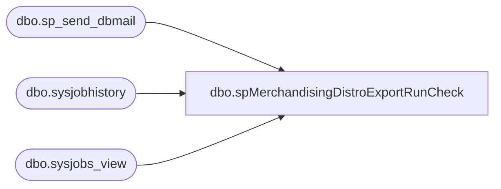

# dbo.spMerchandisingDistroExportRunCheck

**Database:** me_01  
**Server:** bedrockdb02  

## Architecture Diagram



## Table Dependencies

| Referenced Table |
|---|
| dbo.sp_send_dbmail |
| dbo.sysjobhistory |
| dbo.sysjobs_view |

## Stored Procedure Code

```sql
CREATE proc [dbo].[spMerchandisingDistroExportRunCheck]
as 
-- =====================================================================================================
-- Name: spMerchandisingDistroExportRunCheck
--
-- Description:	Checks for the last time that MERCHANDISING - Process - Merch to Whse Distro Export completed and sends an alert if it has not run for over an hour.
--		If the job is not running, there may be an issue with DISTRO EXPORT - DYNAMICS AND MERCH.  If this is the case, the Data Bear team will likely need to be contacted.
--
-- Revision History
--		Name:			Date:			Comments:
--		Lizzy Timm		02/25/2021		Created proc.
-- =====================================================================================================
SET NOCOUNT ON
DECLARE @recip VARCHAR(1000), 
		@subj VARCHAR(1000), 
		@query VARCHAR(2000),
		@text VARCHAR(8000),
		@day VARCHAR(8), 
		@time VARCHAR(4)
DECLARE @JOB_NAME SYSNAME = 'MERCHANDISING - Process - Merch to Whse Distro Export'; 
SET @recip = 'EnterpriseSystemsAlerts@buildabear.com'
SET @subj = 'Distro Export Job NOT Running'
SET @day = convert(varchar, getdate(), 112)
SET @time = LEFT(REPLACE(CONVERT(varchar(8), GETDATE(), 108), ':', ''),4)

if (object_id('tempdb..#TempHistory') is not null) drop table #TempHistory
SELECT TOP 1 j.Name,
	jh.Run_Date,
	CASE
		WHEN LEFT(jh.Run_Time,1) <> '1'
			THEN CONCAT('0',LEFT(jh.Run_Time,3))
		ELSE LEFT(jh.Run_Time,4)
	  END AS [Run_Time],
		CASE
		WHEN LEFT(jh.Run_Time,1) <> '1'
			THEN CONCAT('0',LEFT(jh.Run_Time,1))
		ELSE LEFT(jh.Run_Time,2)
	  END AS [Run_Hour],
		CASE
		WHEN LEFT(jh.Run_Time,1) <> '1'
			THEN RIGHT(LEFT(jh.Run_Time,3),2)
		ELSE RIGHT(LEFT(jh.Run_Time,4),2)
	  END AS [Run_Minute]
  INTO #TempHistory
  FROM msdb.dbo.sysjobs_view j
	LEFT JOIN msdb.dbo.sysjobhistory jh ON j.job_id = jh.job_id
  WHERE j.name = @JOB_NAME
	AND jh.Step_id = '0'
  ORDER BY 2 desc,4 desc, 5 desc

if (object_id('tempdb..#TempCompare') is not null) drop table #TempCompare
SELECT @time [Time],
	Run_Time,
	DATEDIFF(minute, CONCAT(LEFT(Run_Date,4),'-',RIGHT(LEFT(Run_Date,6),2),'-',RIGHT(Run_Date,2), ' ', Run_Hour, ':',Run_Minute,':00.00'), getdate()) [TimeDiff]
  INTO #TempCompare
  FROM #TempHistory

--SELECT * FROM #TempHistory
IF (SELECT COUNT(*) FROM #TempHistory WHERE Run_Date = @day) > 0
	BEGIN
		IF (SELECT TimeDiff FROM #TempCompare) > 30
			BEGIN
				SET @text = '<html><p style="font-family: Arial; font-size: 1em; margin: 0% 3%;">The SQL Server Agent Job MERCHANDISING - Process - Merch to Whse Distro Export has not run in over 30 minutes.' + 
						'<br/>  Check the status and recent history of this job.  If it is not running, there may be issues with the job DISTRO EXPORT - DYNAMICS AND MERCH.' +
						'</p><br/>' +
						'<font face =arial size = 1 color="#C0C0C0">' +
						'<br>' +
						'Server:  BEDROCKDB02 <br>' +
						'Job Name:  Merch Admin - Check Distro Export <br>' +
						'Stored Proc:  [BEDROCKDB02].[me_01].[dbo].[spMerchandisingDistroExportRunCheck] <br>' +
						'Created by:  Lizzy Timm <br>' +
						'Team Ownership:  Enterprise Systems <br>' +
						'</p>' +
						'</html>'
				EXEC msdb.dbo.sp_send_dbmail
					@profile_name = 'MerchAdmin',
					@recipients = @recip,
					@body = @text,
					@subject = @subj,
					@body_format = 'HTML'
			END
	END
	ELSE BEGIN
		SET @text = '<html><p style="font-family: Arial; font-size: 1em; margin: 0% 3%;">The SQL Server Agent Job MERCHANDISING - Process - Merch to Whse Distro Export has not run today.' + 
				'<br/>  Check the status and recent history of this job.  If it is not running, there may be issues with the job DISTRO EXPORT - DYNAMICS AND MERCH.' +
				'</p><br/>' +
				'<font face =arial size = 1 color="#C0C0C0">' +
				'<br>' +
				'Server:  BEDROCKDB02<br>' +
				'Job Name:  Merch Admin - Check Distro Export<br>' +
				'Stored Proc:  [BEDROCKDB02].[me_01].[dbo].[spMerchandisingDistroExportRunCheck]<br>' +
				'Created by:  Lizzy Timm<br>' +
				'Team Ownership:  Enterprise Systems<br>' +
				'</p>' +
				'</html>'
		EXEC msdb.dbo.sp_send_dbmail
			@profile_name = 'MerchAdmin',
			@recipients = @recip,
			@body = @text,
			@subject = @subj,
			@body_format = 'HTML'
	END
```

