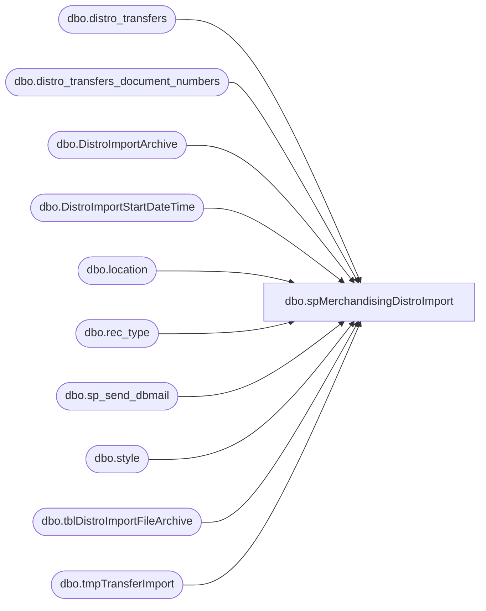

# dbo.spMerchandisingDistroImport

**Database:** me_01  
**Server:** bedrockdb02  

## Architecture Diagram



## Table Dependencies

| Referenced Table |
|---|
| dbo.distro_transfers |
| dbo.distro_transfers_document_numbers |
| dbo.DistroImportArchive |
| dbo.DistroImportStartDateTime |
| dbo.location |
| dbo.rec_type |
| dbo.sp_send_dbmail |
| dbo.style |
| dbo.tblDistroImportFileArchive |
| dbo.tmpTransferImport |

## Stored Procedure Code

```sql
CREATE proc [dbo].[spMerchandisingDistroImport]

as

-- =====================================================================================================
-- Name: spMerchandisingDistroImport
--
-- Description:	After the Distribution team saves a distro .CSV file to \\kermode\FileRepository\MERCHANDISING\DistroExport\, 
--				this procedure will bulk insert and archive the file data, and insert the distro records into distro_transfers table, a few transformations occur.
--				After the data has been inserted into distro_transfers, the pre-existing distro import procedures will run to get it into Merch.
--				 
-- Revision History
--		Name:			Date:			Comments:
--		Dan Tweedie		06/26/2013		Created proc.	
--		Dan Tweedie		07/17/2013		Added code to capture duplicates (based on destid, sourceid, style, invtype), send email to Distro team, then exclude these from sending to Merch
--		Dan Tweedie		07/17/2013		Added code to capture 'junk data' (based on the data from the CSV file not complying with the distro_transfers column definitions --if the data from the file is not INT, it is 'junk' ---sends email, excludes from sending to Merch
--		Dan Tweedie		08/01/2013		Added code to remove file from the process if the same filename has already been logged
--		Dan Tweedie		09/16/2013		Added another filter to the 'junk data' removal, to remove records that are not for our warehouses --in case they key 80 instead of 980, etc.
--		Dan Tweedie		01/15/2014		Added another filter to the 'junk data' removal, to remove records for destinations which are Inactive in Merch, based on location.active_flag being 0
--		Dan Tweedie		05/12/2014		Added handling for pool point source locations, to create a transfer instead of a distro
--		Dan Tweedie		07/16/2014      Added improved handling of 'junk data' records with invalid sourceid, to ensure a transfer isn't attempted and that the bad records are included in 'junk records removed' email.
--		Dan Tweedie		07/17/2014		Added invalid style check to the 'junk data' check
--		Dan Tweedie		08/04/2014		Added waitfor delay to allow 1 minute to pass before beginning the import
--		Dan Tweedie		1/29/2015		FYI - SUPPLIES ARE KEYED IN UNITS - INFORMATICA IMPORT PROCESS CONVERTS TO 'NUMBER OF CASES'
--		Dan Tweedie		03/31/2016		Added 3970 and 3980 where lists include the other warehouses (980, 960, 2970)
--		Tim Callahan	07/06/2016		Changed Rename File Extension from .csv to .Done, Also changed Move file from .csv to .Done
--		Tim Callahan	05/02/2018		Moved MerchAdmin to CC line of e-mails to illustrate that this is an alert for Distro Team action not MerchAdmin
--		Tim Callahan	06/07/2018		Added 8502 and 8505 where lists include the other warehouses
--		Tim Callahan	11/20/2018		Updated this proc to remove lines keyed in invalid distribution multiples and send alert to Distro Team and CC MerchAdmin 
--		Tim Callahan	04/24/2019		Updated this proc to remove lines keyed that do link to valid rec type in rec_type table, included in junk records e-mail
--		Tim Callahan	05/14/2019		Updated Junk record code for logic to be NOT IN as that was a miskey when this proce was written 
--		Tim Callahan	07/09/2019		Updated Rec Type Junk Logic 
-- =====================================================================================================
if (object_id('me_01..tmpTransferImport') is not null) truncate table tmpTransferImport

--log the datetime of process start, so we can validate later in the procedure to look for distros created after this time
insert DistroImportStartDateTime
select getdate()

--check the directory to see if there are distro CSV files ready to import
-------------do a DIR command and store the results in a temp table
IF (Object_ID('tempdb..#DIR') IS NOT NULL) DROP TABLE #DIR
create table #DIR (output varchar(1000))
insert #DIR exec master..xp_cmdshell 'dir \\kermode\FileRepository\MERCHANDISING\DistroExport\*.csv /B'
delete from #DIR where output is null or output = 'File Not Found'

------------query temp table to see if there are CSV files
if (select count(*) from #DIR) > 0

BEGIN 
---EXECUTE SCHEDULED TASK ON KERMODE CALLED DistroImportHelper WHICH RUNS RENAME.BAT TO REMOVE SPACES FROM IMPORT FILENAMES
		EXEC master..xp_cmdshell 'schtasks /run /s kermode.buildabear.com /TN "DistroImportHelper"'

		WAITFOR DELAY '00:01:00' --allow time for task to execute
END 

--Since we may have renamed files to remove the spaces, do another dir command to get filenames
IF (Object_ID('tempdb..#files') IS NOT NULL) DROP TABLE #files
create table #files (output varchar(1000))
insert #files exec master..xp_cmdshell 'dir \\kermode\FileRepository\MERCHANDISING\DistroExport\*.csv /B'
delete from #files where output is null or output = 'File Not Found'
or output in (select archivedFile from tblDistroImportFileArchive)
or output in (select distinct importfile from DistroImportArchive)


if (select count(*) from #files) > 0
-----------If CSV files are found, bulk insert the CSV files into a temp table
-----------create temp table to import the distro CSV files into

BEGIN
		insert tblDistroImportFileArchive
		select output from #files


		if (object_id('tempdb..#DistroImport1') is not null) drop table #DistroImport1
		create table #DistroImport1
		(DestID varchar(52),
		style_code varchar(52),
		quantity varchar(52),
		InvType varchar(52),
		Sourceid varchar(52))

		if (object_id('tempdb..#DistroImport2') is not null) drop table #DistroImport2
		create table #DistroImport2
		(DestID varchar(52),
		style_code varchar(52),
		quantity varchar(52),
		InvType varchar(52),
		Sourceid varchar(52),
		ImportFile varchar(1000),
		DocumentNumber varchar(52),
		ImportTime datetime)

				
		declare @files int,
				@filename varchar(100),
				@filepath varchar(100),
				@bulkinsert varchar(4000),
				@bulkinsertArchive varchar(4000),
				@del varchar(100),
				@move varchar(1000),
				@query varchar(1000),
				@file_name varchar(100),
				@file_location varchar(100),
				@server varchar(20),
				@database varchar(20),
				@bcp varchar(1000),
				@timestamp varchar(52),
				@rename varchar(1000),
				@nameage varchar(104),
				@documentNumber varchar(9)

		select @filepath = '\\kermode\FileRepository\MERCHANDISING\DistroExport\'
		select @files = count(*) from #files
		select @documentnumber = max(documentnumber) +1 from distro_transfers_document_numbers

		
---------Bulk Insert Loop
		while @files > 0
			begin
			    select @timestamp = cast(datepart(yyyy, getdate()) as varchar) + cast(datepart(mm, getdate()) as varchar) + cast(datepart(dd, getdate()) as varchar) + cast(datepart(hh, getdate()) as varchar) + cast(datepart(mi, getdate()) as varchar) + cast(datepart(ss, getdate()) as varchar)
				select @filename = max(output) from #files
								
				select @bulkinsert = 'bulk insert #DistroImport1 from ''' + @filepath + @filename + ''' with (FIRSTROW = 2, FIELDTERMINATOR = '','', ROWTERMINATOR = ''\n'')'
				exec (@bulkinsert)
				
				select @rename = 'ren ' + @filepath + @filename + ' ' + @filename + '.' + @timestamp + '.Done' -- Modified on 7/6/2016
				exec master..xp_cmdshell @rename

				select @nameage = @filename + '.' + @timestamp + '.csv'
				select @bulkinsertArchive = 'insert #DistroImport2 select *, ''' + @nameage + ''',''' + @documentnumber + ''', getdate() from #distroImport1'
				exec (@bulkinsertArchive)

				select @move = 'move ' + @filepath + @filename + '.' + @timestamp + '.Done' + ' \\kermode\FileRepository\MERCHANDISING\DistroExport\History\' -- Modified on 7/6/2016
		        exec master..xp_cmdshell @move
				
				insert distro_transfers_document_numbers 
				select @documentnumber				

				delete from #files where output = @filename
				select @files = count(*) from #files
				
				truncate table #distroImport1
								
				if @files < 1
					break
				else
					continue
			end
---------------------------------------------------------------------------
---------------------------------------------------------------------------
---------------------------------------------------------------------------
---------------------------------------------------------------------------
--NEW CODE TO REMOVE DUPLICATES - ADDED 07.17.2013

		-----CAPTURE DUPLICATES ->SEND THEM IN AN EMAIL
		if (object_id('tempdb..#dupes') is not null) drop table #dupes
		select sourceid, style_code, destid, invType, count(*) records
		into #dupes
		from #DistroImport2
		group by sourceid, style_code, destid, invType
		having count(*) > 1

		if (object_id('tempdb..#dupesDetail') is not null) drop table #dupesDetail
		select d2.sourceid, d2.style_code, d2.quantity, d2.destid, d2.invType, d2.ImportFile
		into #dupesDetail
		from #DistroImport2 d2
		join #dupes d on d2.sourceid = d.sourceid
			and d2.style_code = d.style_code
			and d2.destid = d.destid
			and d2.invtype = d.invType

		if (select count(*) from #dupesDetail) > 0
			begin
			declare @text2 nvarchar(max)
	
			set @text2 = '
			<font face =arial size = 2> '  +
				'</b><H1>DUPLICATES REMOVED FROM DISTRO IMPORT FILE</H1>' +
				'<table border="1">' +
				'<tr><th> SourceID </th><th> Style </th><th> Qty </th><th> DestID </th><th> InvType </th><th> ImportFile </th></tr>' +
				CAST ( ( SELECT td = SOURCEID,'',
								td = style_code, '',
								td = quantity, '',
								td = destid, '',
								td = invtype, '',
								td = importfile, ''
						  from #dupesDetail
						  FOR XML PATH('tr'), TYPE 
				) AS NVARCHAR(MAX) ) +
				'</font></table></font></p></p><br>'

				exec msdb.dbo.sp_send_dbmail
				@profile_name = 'merchadmin',
				@recipients = 'distrobears@buildabear.com',
				--@copy_recipients = 'EntSysSupport@buildabear.com',
				@body = @text2,
				@subject = 'Distro Import Log - *DUPLICATES REMOVED*',
				@body_format = 'HTML'

------------------->REMOVE DUPLICATES BEFORE SENDING TO IMPORT TABLE
				delete #DistroImport2
				from #DistroImport2 d2
				join #dupes d on d2.sourceid = d.sourceid
					and d2.style_code = d.style_code
					and d2.destid = d.destid
					and d2.invtype = d.invType

			end

--END NEW CODE (duplicates) 07.17.2013
---------------------------------------------------------------------------
---------------------------------------------------------------------------
---------------------------------------------------------------------------
---------------------------------------------------------------------------
---------------------------------------------------------------------------
--NEW CODE TO REMOVE JUNK DATA - ADDED 07.17.2013

		-----CAPTURE JUNK RECORDS ->SEND THEM IN AN EMAIL

		if (object_id('tempdb..#JUNKDetail') is not null) drop table #JUNKDetail
		select sourceid, style_code, quantity, destid, invType, ImportFile
		into #JUNKDetail
		from #DistroImport2
		where IsNumeric(sourceid) <> 1
		or IsNumeric(destid) <> 1
		or IsNumeric(style_code) <> 1
		or IsNumeric(invType) <> 1
		or IsNumeric(quantity) <> 1
		or quantity < 1
		or (sourceid = destid)
		or sourceid not in (960,980,975,2970,9913,9914,9915,9916,9917,9918,9919,9920,9921,9922,3970,3980,8502,8505)
		or right('0000' + cast(destid as varchar), 4) not in (select location_code from location (nolock) where active_flag = 1) --added 01/15/2014 --modified 07/16/2014
		or right('000000' + cast(style_code as varchar), 6) not in (select style_code from style where active_flag = 1) --added 07/17/2014
		or invType not in (select rectype from rec_type) -- Added 04/24/2019
		
		---if records captured above are not from a specified whse location and the sourceid and destid are both active locations in Merch...
		if (select count(*) from #JUNKDetail
			where sourceid not in (960,980,975,2970, 9913,9914,9915,9916,9917,9918,9919,9920,9921,9922,3970,3980,8502,8505)
			and right('0000' + cast(destid as varchar), 4) in (select location_code from location (nolock) where active_flag = 1) --added 07/16/2014
			and right('0000' + cast(sourceid as varchar), 4) in (select location_code from location (nolock) where active_flag = 1) --added 07/16/2014
			and right('000000' + cast(style_code as varchar), 6) in (select style_code from style where active_flag = 1) --added 07/17/2014
			or invType not in (select rectype from rec_type) -- Added 07/09/2019
			) > 0
				begin
		
					--insert records not from valid whse, but to/from valid locations in Merch into staging table to generate transfer file
					---added 05/12/2014 to put the pool point location data into a staging table, a proc will use it later
					if (object_id('me_01..tmpTransferImport') is not null) drop table tmpTransferImport
					select * 
					into tmpTransferImport
					from #JUNKDetail
					where sourceid not in (960,980,975,2970, 9913,9914,9915,9916,9917,9918,9919,9920,9921,9922,3970,3980,8502,8505)
					and right('0000' + cast(destid as varchar), 4) in (select location_code from location (nolock) where active_flag = 1) --added 07/16/2014
					and right('0000' + cast(sourceid as varchar), 4) in (select location_code from location (nolock) where active_flag = 1) --added 07/16/2014
					and right('000000' + cast(style_code as varchar), 6) in (select style_code from style where active_flag = 1) --added 07/17/2014
					or invType not in (select rectype from rec_type) -- Added 07/09/2019
				end
		
		if (select count(*) from #JUNKDetail 
				where sourceid not in (960,980,975,2970,9913,9914,9915,9916,9917,9918,9919,9920,9921,9922,3970,3980,8502,8505) -- Changed to NOT IN on  5/4/2019
				or right('0000' + cast(sourceid as varchar), 4) not in (select location_code from location (nolock) where active_flag = 1) --added 07/16/2014
				or invType not in (select rectype from rec_type) -- Added 07/09/2019
				) > 0
			begin
				declare @text3 nvarchar(max)
	
				set @text3 = '
				<font face =arial size = 2> '  +
					'</b><H1>JUNK DATA REMOVED FROM DISTRO IMPORT FILE</H1>' +
					'<table border="1">' +
					'<tr><th> SourceID </th><th> Style </th><th> Qty </th><th> DestID </th><th> InvType </th><th> ImportFile </th></tr>' +
					CAST ( ( SELECT td = SOURCEID,'',
									td = style_code, '',
									td = quantity, '',
									td = destid, '',
									td = invtype, '',
									td = importfile, ''
							  from #JUNKDetail
							  --added 05/12 so we don't include the pool point locations in the exception email, we remove these later
							  where sourceid not in (960,980,975,2970,9913,9914,9915,9916,9917,9918,9919,9920,9921,9922,3970,3980,8502,8505) --we don't want to report on these since we're going to create transfers with these instead -- -- Changed to NOT IN on  5/4/2019
							  or right('0000' + cast(sourceid as varchar), 4) not in (select location_code from location (nolock) where active_flag = 1) --added 07/16/2014
							  or invType not in (select rectype from rec_type) -- Added 07/09/2019
							  FOR XML PATH('tr'), TYPE 
					) AS NVARCHAR(MAX) ) +
					'</font></table></font></p></p><br>'

					exec msdb.dbo.sp_send_dbmail
					@profile_name = 'merchadmin',
					@recipients = 'distrobears@buildabear.com',
					--@copy_recipients = 'EntSysSupport@buildabear.com',
					@body = @text3,
					@subject = 'Distro Import Log - *JUNK RECORDS REMOVED*',
					@body_format = 'HTML'

											
					delete 
					from #DistroImport2
					where IsNumeric(sourceid) <> 1
					or IsNumeric(destid) <> 1
					or IsNumeric(style_code) <> 1
					or IsNumeric(invType) <> 1
					or IsNumeric(quantity) <> 1
					or quantity < 1
					or (sourceid = destid)
					or sourceid not in (960,980,975,2970,9913,9914,9915,9916,9917,9918,9919,9920,9921,9922,3970,3980,8502,8505)
					or right('0000' + cast(destid as varchar), 4) not in (select location_code from location (nolock) where active_flag = 1) --added 01/15/2014 --modified 07/16/2014
					or right('0000' + cast(sourceid as varchar), 4) not in (select location_code from location (nolock) where active_flag = 1) --added 07/15/2014
					or right('000000' + cast(style_code as varchar), 6) not in (select style_code from style (nolock) where active_flag = 1) --added 07/17/2014
					or invType not in (select rectype from rec_type) -- Added 04/24/2019
			end


--END NEW CODE (junk data) 07.17.2013
-----------------------------------------------------------------------------------------
-----------------------------------------------------------------------------------------
-----------------------------------------------------------------------------------------
-----------------------------------------------------------------------------------------
-----------------------------------------------------------------------------------------


-- New Code added 11/20/2018
-- Alert Distro Team of Distro Upload files keyed in invalid multiples and remove lines for import to Aptos 


if (object_id('tempdb..#DistroImport3') is not null) drop table #DistroImport3
select DestID,
D2.style_code,
Quantity,
s.distribution_multiple, 
InvType,
Sourceid,
ImportFile,
DocumentNumber,
ImportTime,
convert (numeric,D2.quantity)/s.distribution_multiple as Multiple_check
into #DistroImport3
from #DistroImport2 D2
join style s on s.style_code= right('00000'+D2.style_code,6) -- had to add this due to how US styles import as 5 digit due to nature of CSV file


if (select count (*) from #DistroImport3 where right(multiple_check,11) <> '00000000000') > 0

	Begin 
		declare @text4 nvarchar(max)
	
				set @text4 = '
				<font face =arial size = 2> '  +
					'</b><H1>INVALID DISTRIBUTION MULTIPLE DATA REMOVED FROM DISTRO IMPORT FILE</H1>' +
					'<table border="1">' +
					'<tr><th> SourceID </th><th> Style </th><th> Qty Keyed</th><th>Style Distro Multiple</th><th>Resulting Distro Qty</th><th> DestID </th><th> InvType </th><th> ImportFile </th></tr>' +
					CAST ( ( SELECT td = SOURCEID,'',
									td = style_code, '',
									td = quantity, '',
									td = distribution_multiple, '',
									td = Multiple_check,'',
									td = destid, '',
									td = invtype, '',
									td = importfile, ''
							  from #DistroImport3
							  where right(multiple_check,11) <> '00000000000'
							  FOR XML PATH('tr'), TYPE 
					) AS NVARCHAR(MAX) ) +
					'</font></table></font></p></p><br>'

					exec msdb.dbo.sp_send_dbmail
					@profile_name = 'merchadmin',
					@recipients = 'distrobears@buildabear.com',
					--@copy_recipients = 'EntSysSupport@buildabear.com',
					@body = @text4,
					@subject = 'Distro Import Log - *Invalid Distro Multiple Lines Removed*',
					@body_format = 'HTML'


					delete 
					from #DistroImport3
					where right(multiple_check,11) <> '00000000000'

		End 
--After removing invalid multiple lines, insert into new temp table 
	if (object_id('tempdb..#DistroImport4') is not null) drop table #DistroImport4
	select DestID,
	style_code,
	Quantity,					
	InvType,
	Sourceid,
	ImportFile,
	DocumentNumber,
	ImportTime				
	into #DistroImport4
	from #DistroImport3

----End of Nov 20 2018 Exception Code 
-----------------------------------------------------------------------------------------
-----------------------------------------------------------------------------------------
-----------------------------------------------------------------------------------------
-----------------------------------------------------------------------------------------


-----------------archive the import data with filename and timestamp
	insert DistroImportArchive
	select * 
	from #DistroImport4 -- Updated on 11/20/2018


----Insert the records into #import_disto_transfers
if (object_id('tempdb..#import_distro_transfers') is not null) drop table #import_distro_transfers
create table #import_distro_transfers
(sourceid int,
destid int,
upc_number int,
quantity int,
groupinglabel varchar(20),
description varchar(20),
rec_type varchar(52),
loaded_date datetime,
documentnumber varchar(9),
linenumber int,
reasoncode varchar(5),
exported_date datetime,
tpm_exported_date datetime)

insert #import_distro_transfers
select d.sourceid, 
	   d.destid, 
	   d.style_code upc_number, 
	   d.quantity, 
	   ' ' groupinglabel,
	   ' ' description, 
	   case when d.InvType = '11' then cast(d.InvType as varchar) else rt.rectype end as rec_type, 
	   getdate() loaded_date, 
	   'DMT' + cast((d.documentnumber + dense_rank() over (order by sourceid, style_code, invtype)) as varchar) as documentnumber,
	   ROW_NUMBER () OVER (PARTITION BY sourceid, style_code, invtype ORDER BY destid) AS linenumber,
	   case when d.InvType = '11' then cast(d.InvType as varchar) else rt.reasoncode end as reasoncode,
	   NULL exported_date,
	   NULL tpm_exported_date
from #distroimport4 d -- Updated on 11/20/2018
left join rec_type rt (nolock) on d.invtype = rt.rectype


---insert into distro_transfers
insert distro_transfers
select *
from #import_distro_transfers
order by documentnumber, sourceid, upc_number, rec_type, linenumber

insert distro_transfers_document_numbers
select max(right(documentnumber,6))
from #import_distro_transfers

END

--ADDED 05/12/2014 TO OUTPUT TRANSFER FILE
---if we staged pool point data, then execute the proc to generate the transfer file
if (select count(*) from tmpTransferImport) > 0
BEGIN
			declare @query52 varchar(1000),
					@date52 varchar(200),
					@file_name52 varchar(100),
					@file_location52 varchar(100),
					@server52 varchar(20),
					@database52 varchar(20),
					@sqlcmd52 varchar(1000),
					@query_text52 varchar(1000)

			select @query_text52 = 'exec bedrockdb02.me_01.dbo.spMerchandisingSelectPoolPointTransfer'

			set @date52 = convert(varchar, datepart(yyyy, getdate())) + convert(varchar, datepart(mm, getdate())) + convert(varchar, datepart(dd, getdate()))
			set @query52 = @query_text52
			set @file_location52 = '\\pipeapp01\Company01\Text File to IM Import Tables - Import Outbound Xfers\' -- LT 03/04/20 - Updated from \\pipeapp01\E$\Company01\Text File to IM Import Tables - Import Outbound Xfers\
			set @file_name52 = 'STSIMOUTBOUNDTRANSFER.DISTRO_TRANSFERS' + convert(varchar, @date52) +'.GO'
			set @server52 = 'bedrockdb02'
			set @database52 = 'me_01'
			set @sqlcmd52 = 'sqlcmd -S' + @server52 + ' -d' + @database52 + ' -Q' + '"' + @query52 + '"' + ' -o' + '"' + @file_location52 + @file_name52 + '"' + ' -s"," -w100 -W'
			exec master..xp_cmdshell @sqlcmd52

	EXEC pipeapp01.master..xp_cmdshell 'PipelineScheduleClient Start 16002 0'
END
```

