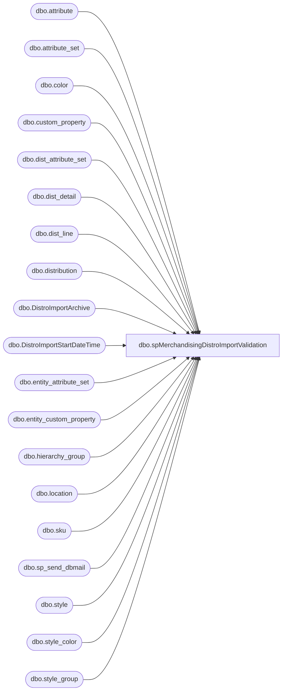

# dbo.spMerchandisingDistroImportValidation

**Database:** me_01  
**Server:** bedrockdb02  

## Architecture Diagram



## Table Dependencies

| Referenced Table |
|---|
| dbo.attribute |
| dbo.attribute_set |
| dbo.color |
| dbo.custom_property |
| dbo.dist_attribute_set |
| dbo.dist_detail |
| dbo.dist_line |
| dbo.distribution |
| dbo.DistroImportArchive |
| dbo.DistroImportStartDateTime |
| dbo.entity_attribute_set |
| dbo.entity_custom_property |
| dbo.hierarchy_group |
| dbo.location |
| dbo.sku |
| dbo.sp_send_dbmail |
| dbo.style |
| dbo.style_color |
| dbo.style_group |

## Stored Procedure Code

```sql
CREATE proc [dbo].[spMerchandisingDistroImportValidation]

as

-- =====================================================================================================
-- Name: spMerchandisingDistroImportValidation
--
-- Description:	After the proc spMerchandisingDistroImport has run, as part of the Informatica workflow wf_Host_to_WM_Multiple, and the other steps of the workflow have completed,
--				This procedure will compare to confirm that what was attempted to import actually made it into Merch
--				 
-- Revision History
--		Name:			Date:			Comments:
--		Dan Tweedie		06/26/2013		Created proc.	
--		Dan Tweedie		07/03/2013		Added email & text alert for detected failure to import - Archived detail from import file, not found as distro data in Merch
--		Dan Tweedie		03/31/2016		Added 3970,3980 where list includes 980, 960, 2970
--		Tim Callahan	06/14/2017		Remarked out line regarding Style Color reorder flag being checked (1)
--										This was causing false failure to import alerts, no where in the import code are we exluding style\color code, seems unnecessary
--		Tim Callahan	05/02/2018		Moved MerchAdmin to CC line of e-mails to illustrate that this is an alert for Distro Team action not MerchAdmin
--		Tim Callahan	06/07/2018		Added 8502,8505 where list includes 980, 960, 2970
--		Lizzy Timm		08/19/2019		Updated blind copy recipients to EnterpriseSystemsAlerts@buildabear.com
-- =====================================================================================================

------------------------------------
---validation to be run after the dps_to_host_distro_import and pipeline 65000 has run 
--

---GET LIST OF STYLES THAT ARE SUPPLIES AND THEIR CASE QTY CUSTOM PROPERTY
--custom properties
if (object_id('tempdb..#supplies') is not null) drop table #supplies
select s.style_code, ecp.custom_property_value case_qty
into #supplies
from style s (nolock) 
join style_group sg (nolock) on s.style_id = sg.style_id
join hierarchy_group hg (nolock) on sg.hierarchy_group_id = hg.hierarchy_group_id
left join entity_custom_property ecp on s.style_id = ecp.parent_id and ecp.parent_type = 1
left join custom_property cp (nolock) on cp.custom_property_id = ecp.custom_property_id 
where substring(hg.hierarchy_group_code,7,2) = '60' --supplies
and cp.cust_prop_code = 'FRCSTM' --ensures we only capture hts related custom properties
order by s.style_code, cp.cust_prop_code


if (object_id('tempdb..#a') is not null) drop table #a
select *
into #a
from DistroImportArchive
where importtime > (select max(start) from DistroImportStartDateTime) --when the import process runs, the first step is to log getdate() into DistroImportStartDateTime
order by importtime desc


if (select count(*) from #a) > 0 

begin

	if (object_id('tempdb..#b') is not null) drop table #b
	select	l2.location_code as destid,
			s.style_code,
			case when substring(hg.hierarchy_group_code,7,2) = '60' 
				then dd.quantity * sup.case_qty
			else dd.quantity end as quantity,
			ats.attribute_set_code rec_type,
			l1.location_code as sourceid,
			d.distribution_number,
			d.create_date,
			d.document_source
	into #b
	from 	distribution d with (nolock)
	join	location l1 with (nolock) on		d.location_id = l1.location_id
	join	dist_line dl with (nolock) on		d.distribution_id = dl.distribution_id
	join	style_color sc with (nolock) on		dl.style_color_id = sc.style_color_id
	join	style s with (nolock) on 		sc.style_id = s.style_id
	join	style_group sg with (nolock) on		s.style_id = sg.style_id
	join	hierarchy_group hg with (nolock) on		sg.hierarchy_group_id = hg.hierarchy_group_id
	join	color c with (nolock) on		sc.color_id = c.color_id
	join	sku sk with (nolock) on		s.style_id = sk.style_id
	join	dist_detail dd with (nolock) on		sk.sku_id = dd.sku_id and		d.distribution_id = dd.distribution_id
	join	location l2 with (nolock) on		dd.location_id = l2.location_id
	join  entity_attribute_set easwc on          l2.location_id = easwc.parent_id and         easwc.parent_type  = 2
	join  attribute_set atswc on          easwc.attribute_set_id = atswc.attribute_set_id
	join  attribute awc on          atswc.attribute_id = awc.attribute_id and         awc.attribute_code= 'DC'
	left outer join	dist_attribute_set das with (nolock) on		d.distribution_id = das.distribution_id
	left outer join	entity_custom_property ecp with (nolock) on		s.style_id = ecp.parent_id and		ecp.parent_type = 1 and		ecp.custom_property_id = 2
	left join attribute_set ats on		das.attribute_set_id = ats.attribute_set_id and		ats.attribute_id = 112
	left join #supplies sup on s.style_code = sup.style_code
	where	d.distribution_status in (6,7) -- 2 = Preliminary 5 = Open 6 = Release 9 = Cancelled
	--and		sc.reorder_flag = 1 -- Remarked out on 6/14/2017 -TC
	and d.document_source = 10 -- external source (pipeline)
	and d.create_date >= (select max(start) from DistroImportStartDateTime)
	order by d.distribution_number, l2.location_code

	if (object_id('tempdb..##DistroImportLog') is not null) drop table ##DistroImportLog
	select a.sourceid warehouse,
		   a.invtype,
		   a.style_code,
		   a.destid,
		   a.quantity,
		   a.importfile,
		   a.importtime fileImportTime,
		   b.distribution_number distribution_number,
		   b.create_date DistroCreated
	into ##DistroImportLog
	from #a a
	left join #b b on right(('0000' + a.destid), 4) = b.destid
	and			 right(('000000' + a.style_code), 6) = b.style_code
	and			 a.quantity = b.quantity
	and			 a.invtype = b.rec_type
	and			 right(('0000' + a.sourceid),4) = b.sourceid
	order by a.sourceid, a.invtype, a.style_code
	--------

	declare @text nvarchar(max)
	
	set @text = '
	<font face =arial size = 2> '  +
		'</b><H1>Distribution Import Log</H1>' +
		'<table border="1">' +
		'<tr><th>Whse</th><th>RecType</th><th>Style</th><th>Store</th><th>Qty</th><th>ImportFile</th><th>FileImportTime</th><th>MerchDistro</th><th>DistroCreateTime</th></tr>' +
		CAST ( ( SELECT td = warehouse,'',
						td = invtype, '',
						td = style_code, '',
						td = destid, '',
						td = quantity, '',
						td = importfile, '',
						td = fileimporttime, '',
						td = distribution_number, '',
						td = distrocreated, ''
				  from ##DistroImportLog
				  where warehouse in (960,980,975,2970,9913,9914,9915,9916,9917,9918,9919,9920,9921,9922,3970,3980,8502,8505)
				  order by importfile, style_code, warehouse, destid, invtype
				  FOR XML PATH('tr'), TYPE 
		) AS NVARCHAR(MAX) ) +
		'</font></table></font></p></p><br>'
    
   
	exec msdb.dbo.sp_send_dbmail
	@profile_name = 'merchadmin',
    @recipients = 'distrobears@buildabear.com',
	--@copy_recipients = 'EntSysSupport@buildabear.com',
    @body = @text,
	@subject = 'Distro Import Log',
	@body_format = 'HTML'


--added email & text alert for detected failure to import
if (select count(*)
		from #a a
		left join #b b on right(('0000' + a.destid), 4) = b.destid
		and			 right(('000000' + a.style_code), 6) = b.style_code
		and			 a.quantity = b.quantity
		and			 a.invtype = b.rec_type
		and			 right(('0000' + a.sourceid),4) = b.sourceid
		where b.destid is null
		and a.sourceid in (960,980,975,2970,9913,9914,9915,9916,9917,9918,9919,9920,9921,9922,3970,3980,8502,8505)) > 0

	begin
		declare @text2 nvarchar(max)
	
		set @text2 = '
		<font face =arial size = 2> '  +
			'</b><H1>Distribution Import Log</H1>' +
			'<table border="1">' +
			'<tr><th>Whse</th><th>RecType</th><th>Style</th><th>Store</th><th>Qty</th><th>ImportFile</th><th>FileImportTime</th><th>MerchDistro</th><th>DistroCreateTime</th></tr>' +
			CAST ( ( SELECT td = A.SOURCEID,'',
							td = A.invtype, '',
							td = A.style_code, '',
							td = A.destid, '',
							td = A.quantity, '',
							td = A.importfile, '',
							td = A.importtime, '',
							td = B.distribution_number, '',
							td = b.CREATE_DATE, ''
					  from #a a
						left join #b b on right(('0000' + a.destid), 4) = b.destid
						and			 right(('000000' + a.style_code), 6) = b.style_code
						and			 a.quantity = b.quantity
						and			 a.invtype = b.rec_type
						and			 right(('0000' + a.sourceid),4) = b.sourceid
						where b.destid is null
						and a.sourceid in (960,980,975,2970,9913,9914,9915,9916,9917,9918,9919,9920,9921,9922,3970,3980,8502,8505)
					  FOR XML PATH('tr'), TYPE 
			) AS NVARCHAR(MAX) ) +
			'</font></table></font></p></p><br>'

			exec msdb.dbo.sp_send_dbmail
			@profile_name = 'merchadmin',
			@recipients = 'distrobears@buildabear.com;',
			@blind_copy_recipients = 'EntSysSupport@buildabear.com;',
			--@blind_copy_recipients = 'EnterpriseSystemsAlerts@buildabear.com;',
			@body = @text2,
			@subject = 'Distro Import Log - *FAILURE TO IMPORT*',
			@body_format = 'HTML'

	end

end
```

