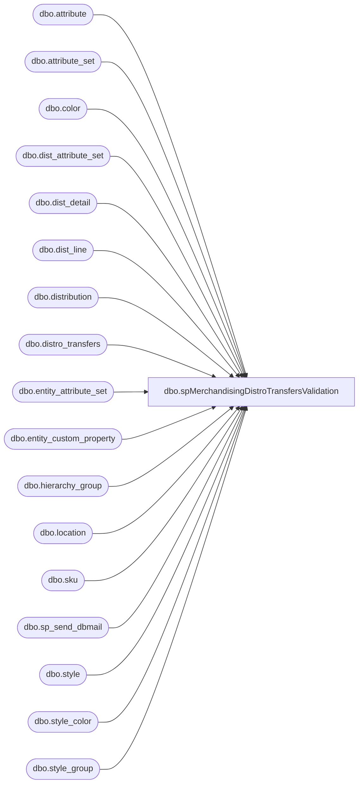

# dbo.spMerchandisingDistroTransfersValidation

**Database:** me_01  
**Server:** bedrockdb02  

## Architecture Diagram



## Table Dependencies

| Referenced Table |
|---|
| dbo.attribute |
| dbo.attribute_set |
| dbo.color |
| dbo.dist_attribute_set |
| dbo.dist_detail |
| dbo.dist_line |
| dbo.distribution |
| dbo.distro_transfers |
| dbo.entity_attribute_set |
| dbo.entity_custom_property |
| dbo.hierarchy_group |
| dbo.location |
| dbo.sku |
| dbo.sp_send_dbmail |
| dbo.style |
| dbo.style_color |
| dbo.style_group |

## Stored Procedure Code

```sql
CREATE proc [dbo].[spMerchandisingDistroTransfersValidation]

as

-- =====================================================================================================
-- Name: spMerchandisingDistroTransfersValidation
--
-- Description:	Compares distros in distro_transfers with loade_date = today, 
--				with distros created in Merch today via the pipeline import.
--				Sends email if distros didn't load into Merch.
--				 
-- Revision History
--		Name:			Date:			Comments:
--		Dan Tweedie		03/10/2014		Created proc.	
--		Dan Tweedie		03/31/2016		Added 3970,3980
--		Tim Callahan	06/07/2018		Added 8502,8505
--		Lizzy Timm		08/19/2019		Updated recipients to EnterpriseSystemsAlerts@buildabear.com
-- =====================================================================================================

set nocount on


if (object_id('tempdb..#a') is not null) drop table #a
select *
into #a
from distro_transfers (nolock)
where datediff(dd, exported_date, getdate()) = 0
and documentnumber not like 'dmt%' --excludes the distro import process that I setup for Corie and Tami, since there's another validation for that
and sourceid in (960,980,975,2970, 9913,9914,9915,9916,9917,9918,9919,9920,9921,9922,3970,3980,8502,8505) -- includes only the main warehouses since that's what goes into Merch
and	rec_type not in (33, 34, 35, 36, 37) --excludes costco since we don't import those into Merch
and quantity > 0
and documentnumber <> '11029028'

if (object_id('tempdb..#b') is not null) drop table #b
select	l2.location_code as destid,
	s.style_code,
	dd.quantity,
	case when substring(hg.hierarchy_group_code,7,2) = '60'
			then dd.quantity * ecp.custom_property_value
		else dd.quantity
		end as unconverted_qty,
	ats.attribute_set_code rec_type,
	l1.location_code as sourceid,
	d.distribution_number,
	d.create_date,
	d.document_source
into #b
from 	distribution d with (nolock)
join	location l1 with (nolock) on		d.location_id = l1.location_id
join	dist_line dl with (nolock) on		d.distribution_id = dl.distribution_id
join	style_color sc with (nolock) on		dl.style_color_id = sc.style_color_id
join	style s with (nolock) on 		sc.style_id = s.style_id
join	style_group sg with (nolock) on		s.style_id = sg.style_id
join	hierarchy_group hg with (nolock) on		sg.hierarchy_group_id = hg.hierarchy_group_id
join	color c with (nolock) on		sc.color_id = c.color_id
join	sku sk with (nolock) on		s.style_id = sk.style_id
join	dist_detail dd with (nolock) on		sk.sku_id = dd.sku_id and		d.distribution_id = dd.distribution_id
join	location l2 with (nolock) on		dd.location_id = l2.location_id
join  entity_attribute_set easwc on          l2.location_id = easwc.parent_id and         easwc.parent_type  = 2
join  attribute_set atswc on          easwc.attribute_set_id = atswc.attribute_set_id
join  attribute awc on          atswc.attribute_id = awc.attribute_id and         awc.attribute_code= 'DC'
left outer join	dist_attribute_set das with (nolock) on		d.distribution_id = das.distribution_id
left outer join	entity_custom_property ecp with (nolock) on		s.style_id = ecp.parent_id and		ecp.parent_type = 1 and		ecp.custom_property_id = 2
left join attribute_set ats on		das.attribute_set_id = ats.attribute_set_id and		ats.attribute_id = 112
/* -- commented out and replaced to resolve issue of this query taking hours to execute; distribution_id = 2742196 does not exist; LT 08/07/2025
where	d.distribution_id = 2742196
OR (sc.reorder_flag = 1
--and d.distribution_status in (6,7) -- 2 = Preliminary 5 = Open 6 = Release 9 = Cancelled
and d.document_source = 10 -- external source (pipeline)
and datediff(dd, d.create_date, getdate()) = 0)
*/
where	sc.reorder_flag = 1
--and d.distribution_status in (6,7) -- 2 = Preliminary 5 = Open 6 = Release 9 = Cancelled
and d.document_source = 10 -- external source (pipeline)
and datediff(dd, d.create_date, getdate()) = 0
-- end comment LT 08/07/2025
order by d.distribution_number, l2.location_code

if (object_id('tempdb..##c') is not null) drop table ##c
select a.*
into ##c
from #a a
left join #b b on right(('0000' + cast(a.destid as varchar)), 4) = b.destid
and			 right(('000000' + cast(a.upc_number as varchar)), 6) = b.style_code
--and			 a.quantity = b.unconverted_qty
--and			 a.rec_type = b.rec_type
and			 right(('0000' + cast(a.sourceid as varchar)),4) = b.sourceid
where b.distribution_number is null
order by a.sourceid, a.rec_type, a.upc_number


if (select count(*) from ##c) > 0 

begin

	declare @text nvarchar(max)
	
		set @text = '
		<html><font face =arial size = 2> '  +
			'</b><H1>Distro Transfers Distros Not In Merch</H1>' +
			'<table border="1">' +
			'<tr><th>ID</th><th>Loaded Date</th><th>Whse</th><th>Store</th><th>Rec Type</th><th>Style</th><th>Qty</th></tr>' +
			CAST ( ( SELECT td = id, '',
							td = loaded_date, '',
							td = sourceid,'',
							td = destid, '',
							td = rec_type, '',
							td = upc_number, '',
							td = quantity, ''
					  from ##c
					  order by loaded_date, sourceid, upc_number
					  FOR XML PATH('tr'), TYPE 
			) AS NVARCHAR(MAX) ) +
			'</font></table></font></p></p><br>'+
			'<p><font face =arial size = 1 color="#C0C0C0">' +
			'<br>' +
			'Server:  BEDROCKDB02 <br>' +
			'Job Name:  MERCHANDISING - Process - Merch to Whse Distro Export <br>' +
			'Stored Proc:  [BEDROCKDB02].[me_01].[dbo].[spMerchandisingDistroTransfersValidation] <br>' +
			'Team Ownership:  Enterprise Systems <br>' +
			'</p></font>'+
			'</html>'
			
    
		exec msdb.dbo.sp_send_dbmail
		@profile_name = 'merchadmin',
		@recipients = 'EnterpriseSystemsAlerts@buildabear.com;',
		@body = @text,
		@subject = 'Distro_Transfers to Merch Import Problem', --'Distro Transfers Not In Merch',
		@body_format = 'HTML'

end
```

