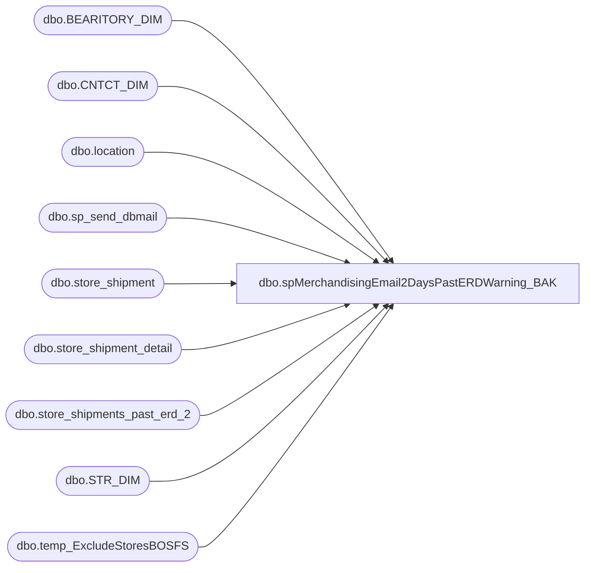

# dbo.spMerchandisingEmail2DaysPastERDWarning_BAK

**Database:** me_01  
**Server:** bedrockdb02  

## Architecture Diagram



## Table Dependencies

| Referenced Table |
|---|
| dbo.BEARITORY_DIM |
| dbo.CNTCT_DIM |
| dbo.location |
| dbo.sp_send_dbmail |
| dbo.store_shipment |
| dbo.store_shipment_detail |
| dbo.store_shipments_past_erd_2 |
| dbo.STR_DIM |
| dbo.temp_ExcludeStoresBOSFS |

## Stored Procedure Code

```sql
CREATE proc [dbo].[spMerchandisingEmail2DaysPastERDWarning_BAK]

as

-- =====================================================================================================
-- Name: spMerchandisingEmail2DaysPastERDWarning
--
-- Description:	Captures summary of unreceived store shipments, 2 days past expected receipt date, sends email to store and BL
--
-- Input: NA
--
-- Output: Email w/text file
--
-- Dependencies: na
--
-- Revision History
--		Name:			Date:			Comments:
--		Dan Tweedie		10/01/2012		Created proc
--		Dan Tweedie		12/13/2012		Temporarily changed the day threshold from 2 to 5
--		Dan Tweedie		01/03/2013		Set threshold back to 2
--		Dan Tweedie		08/26/2013		Changed the source for getting the BL email addresses...now getting from store master repository per Keith Missey
--		Dan Tweedie		10/16/2013		Exclude store 0111 per Distro team
--		Dan Tweedie		11/13/2014		Exclude locations '0630','0631','0632','0633','0634' per Distro team
--		Tim Callahan	11/10/2015		Exclude Location 0322 per Distro Team 
--		Tim Callahan	09/27/2016		Exclude Location 2065 per Tami Barrieau (Distro Team Manager)
--		Tim Callahan	09/28/2016		Exclude Location 2019 per Tami Barrieau (Distro Team Manager)
--		Tim Callahan	10/05/2016		Added 2019 and 2065 per Tami Barrieau (Distro Team Manager)
--		Lizzy Timm		05/14/2020		Modified proc to reference for dbo.temp_ExcludeStoresBOSFS locations that will temporarily need to be excluded for the BOSFS process; changes are marked with "05/14/2020 LT"
-- =====================================================================================================

set nocount on 


--get store list and email addresses
IF (Object_ID('tempdb..#stores') IS NOT null) DROP TABLE #stores
SELECT 
distinct right('0000' + cast(s.STR_NUM as varchar(4)), 4) location,
case when right('0000' + cast(s.STR_NUM as varchar(4)), 4) like '0%' 
		then 'store' + right('0000' + cast(s.STR_NUM as varchar(4)), 3) + '@buildabear.com'
	else 'store' + right('0000' + cast(s.STR_NUM as varchar(4)), 4) + '@buildabear.com'
	end	as store_email,
case when right('0000' + cast(s.STR_NUM as varchar(4)), 4) in ('2022','2023','2024','2025','2026','2036','2041','2046','2052','2054','2056','2059')
		then 'lynnm@buildabear.com'
	when right('0000' + cast(s.STR_NUM as varchar(4)), 4) in ('2010','2020','2038','2044','2045','2047','2048','2051','2058','2061','2063')
		then 'justinc@buildabear.com'
	when right('0000' + cast(s.STR_NUM as varchar(4)), 4) in ('2002','2007','2012','2014','2015','2018','2035','2040','2049','2060')
		then 'paulahe@buildabear.com'
	when right('0000' + cast(s.STR_NUM as varchar(4)), 4) in ('2004','2006','2009','2011','2017','2019','2050','2057')
		then 'virginiale@buildabear.com'
	when right('0000' + cast(s.STR_NUM as varchar(4)), 4) in ('2001','2003','2021','2027','2028','2029','2030','2031','2053','2062')
		then 'claireb@buildabear.com'
	when right('0000' + cast(s.STR_NUM as varchar(4)), 4) in ('2013','2016','2032','2033','2034','2037','2039','2042','2043','2055')
		then 'garyr@buildabear.com'
	else c.EMAIL
	end as bl_email
into #stores
FROM kodiak.BABWMstrData.dbo.STR_DIM s
LEFT JOIN kodiak.BABWMstrData.dbo.BEARITORY_DIM b ON b.BEARITORY_ID = s.BEARITORY_ID
LEFT JOIN kodiak.BABWMstrData.dbo.CNTCT_DIM c ON c.CNTCT_ID = b.CNTCT_ID
join location l (nolock) on right('0000' + cast(s.STR_NUM as varchar(4)), 4) = l.location_code
where right('0000' + cast(s.STR_NUM as varchar(4)), 4) not in ('0311','0322','0630','0631','0632','0633','0634')
	AND right('0000' + cast(s.STR_NUM as varchar(4)), 4) not in (SELECT DISTINCT ExStore FROM dbo.temp_ExcludeStoresBOSFS) -- 05/14/2020 LT
ORDER BY 1

---
IF (Object_ID('tempdb..##shipments') IS NOT null) DROP TABLE ##shipments
select	ss.document_no shipment,
		convert(varchar, ss.ship_date, 101) ship_date,
		convert(varchar, ss.expected_receipt_date, 101) expected_receipt_date,
		tl.location_code as store,
		fl.location_code as warehouse,
		count(distinct ssd.carton_no) cartons,
		s.store_email,
		s.bl_email
into	##shipments
from 	store_shipment ss (nolock)
join	location tl (nolock) on ss.location_id = tl.location_id
join 	location fl (nolock) on ss.from_location_id = fl.location_id 
join	store_shipment_detail ssd (nolock) on ss.store_shipment_id = ssd.store_shipment_id
join	#stores s on tl.location_code = s.location
where	ss.document_status = 3 --in transit
and		fl.location_code in ('0980', '0960','2970') --from bearhouse, west coast dc, uk dc
and		tl.location_code < '2500' --not sure where this cutoff comes from
and		tl.location_code not in ('0247', '0305', '0306') --fedex locations - do we still exclude these locations?
and		tl.location_code in (select location from #stores) --master store list from kodiak query on top
--and     convert(varchar, ss.expected_receipt_date, 101) = convert(varchar, getdate()-2, 101) --2 days past ERD
and		datediff(dd, ss.expected_receipt_date, getdate()-2) = 0 --2 days past ERD --un comment after testing
group by ss.document_no, convert(varchar, ss.ship_date, 101),convert(varchar, ss.expected_receipt_date, 101),tl.location_code,fl.location_code, s.store_email, s.bl_email
order by tl.location_code, ss.document_no
-----------
if (select count(*) from ##shipments) > 0
BEGIN
	--insert into history table for future reference
	insert into store_shipments_past_erd_2 
	select	shipment as "document_no",
			ship_date as "ship_date",
			expected_receipt_date as "expected_receipt_date",
			store as "location_code",
			warehouse as "warehouse",
			cartons as "total_cartons"
	from	##shipments -- Comment out section for testing


	declare @stores int,
			@counter int,
			@store varchar(4),
			@filename varchar(1000),
			@emailsubject varchar(1000),
			@erd varchar(11),
			@query varchar(8000),
			@text varchar(8000),
			@store_email varchar(100),
			@bl_email varchar(100),
			@query1 varchar(8000)

	select @erd = convert(varchar, getdate()-2, 101)
	select @stores = count(distinct store) from ##shipments
	select @counter = 0
	select @store = max(store) from ##shipments 

	while @counter < @stores
		begin
			
			select @store_email = store_email from ##shipments where store = @store
			select @bl_email = bl_email from ##shipments where store = @store
			select @filename = 'Store ' + @store + ' Open Shipments 2 Days Past Expected Receipt Date Report' + '.txt'
			select @emailsubject = 'Open Shipments 2 Days Past Expected Receipt Date Report for Store ' + @store + ', ' + cast(getdate() as varchar(11))
			select @query1 = 'select shipment as "Document #", ship_date as "Ship Date", expected_receipt_date as "Expected Receipt Date", store as "Store #", warehouse as "Warehouse", cartons as "# of Cartons" from ##shipments where store = ' + @store
			select @query = @query1

			-- Body message which was drafted by Heather Barksdale 10/25/2012
			select @text = '<font face =arial size = 3>
			Store Manager,</P>
			Your warehouse shipment that was expected to arrive in your store on ' + @erd + ' is still in “sent” status, which means that you have not 
			completed the receiving process.  Please review your Inbound Worklist in Merchandising and complete your receiving process for this transfer <i><b>immediately</b></i>. 
			If the status is not changed within 24 hours, it will be automatically changed to ''''received as sent''''.
			  If you are having any system issues that are preventing you from completing your receiving process, please contact the Service Desk right away.</P>
			<u>Please remember:</u></p>
			<ul>
			<li>All transfers must be received in your system on the day of arrival. </li>
			<li>You must enter quantities for all items received – you can do this pressing ''''receive as sent'''' OR by manually entering quantities for each item.  </li>
			<li>To completely update the status to ''''received'''' you must press ''''Save/Receive''''.</li>   
			<li>Refer to the Merchandising system instructions, located on Bearnet under Resources/Inventory/Merchandising Inventory Management Instructions. </li>
			</ul> 
			</P>

			<i><b>This e-mail is generated from an automated job. Please do NOT reply to this e-mail</b></i>. 
			<br>
			<br>

			If you have any questions about using the Merchandising system, please contact Store Operations.</p>

			Thank you for your attention.</p>

			BQ Bears</font>
			<br>
			<br>
			<br>
			=================================================================================
			<br>
			Technical Reference: bedrockdb02.me_01.spMerchandisingEmail2DaysPastERDWarning
			<br>
			================================================================================='
						
			exec msdb.dbo.sp_send_dbmail
			@profile_name = 'merchadmin',
		--	@recipients = 'lizzyt@buildabear.com', -- used for testing
 			@recipients = @store_email,
			@copy_recipients = @bl_email,
			@body = @text,
			@subject = @emailsubject,
			@query = @query,
			@importance = high,
			@query_attachment_filename = @filename,
			@attach_query_result_as_file = '1',
			@body_format = 'HTML'

			select @store = max(store) from ##shipments where store < @store
		    select @counter = @counter + 1
			if @counter > @stores
				break
			else
				continue
		end
END

/*
-- BOSFS; 05/14/2020 LT
--get BOSFS store list and email addresses
IF (Object_ID('tempdb..#bosfs') IS NOT null) DROP TABLE #bosfs
SELECT 
distinct right('0000' + cast(s.STR_NUM as varchar(4)), 4) location,
case when right('0000' + cast(s.STR_NUM as varchar(4)), 4) like '0%' 
		then 'store' + right('0000' + cast(s.STR_NUM as varchar(4)), 3) + '@buildabear.com'
	else 'store' + right('0000' + cast(s.STR_NUM as varchar(4)), 4) + '@buildabear.com'
	end	as store_email,
case when right('0000' + cast(s.STR_NUM as varchar(4)), 4) in ('2022','2023','2024','2025','2026','2036','2041','2046','2052','2054','2056','2059')
		then 'lynnm@buildabear.com'
	when right('0000' + cast(s.STR_NUM as varchar(4)), 4) in ('2010','2020','2038','2044','2045','2047','2048','2051','2058','2061','2063')
		then 'justinc@buildabear.com'
	when right('0000' + cast(s.STR_NUM as varchar(4)), 4) in ('2002','2007','2012','2014','2015','2018','2035','2040','2049','2060')
		then 'paulahe@buildabear.com'
	when right('0000' + cast(s.STR_NUM as varchar(4)), 4) in ('2004','2006','2009','2011','2017','2019','2050','2057')
		then 'virginiale@buildabear.com'
	when right('0000' + cast(s.STR_NUM as varchar(4)), 4) in ('2001','2003','2021','2027','2028','2029','2030','2031','2053','2062')
		then 'claireb@buildabear.com'
	when right('0000' + cast(s.STR_NUM as varchar(4)), 4) in ('2013','2016','2032','2033','2034','2037','2039','2042','2043','2055')
		then 'garyr@buildabear.com'
	else c.EMAIL
	end as bl_email
into #bosfs
FROM kodiak.BABWMstrData.dbo.STR_DIM s
LEFT JOIN kodiak.BABWMstrData.dbo.BEARITORY_DIM b ON b.BEARITORY_ID = s.BEARITORY_ID
LEFT JOIN kodiak.BABWMstrData.dbo.CNTCT_DIM c ON c.CNTCT_ID = b.CNTCT_ID
join location l (nolock) on right('0000' + cast(s.STR_NUM as varchar(4)), 4) = l.location_code
where right('0000' + cast(s.STR_NUM as varchar(4)), 4) in (SELECT DISTINCT ExStore FROM dbo.temp_ExcludeStoresBOSFS)
or right('0000' + cast(s.STR_NUM as varchar(4)), 4) = '0234' -- For Testing only
ORDER BY 1

---
IF (Object_ID('tempdb..##bosfsShipments') IS NOT null) DROP TABLE ##bosfsShipments
select	ss.document_no shipment,
		convert(varchar, ss.ship_date, 101) ship_date,
		convert(varchar, ss.expected_receipt_date, 101) expected_receipt_date,
		tl.location_code as store,
		fl.location_code as warehouse,
		count(distinct ssd.carton_no) cartons,
		s.store_email,
		s.bl_email
into	##bosfsShipments
from 	store_shipment ss (nolock)
join	location tl (nolock) on ss.location_id = tl.location_id
join 	location fl (nolock) on ss.from_location_id = fl.location_id 
join	store_shipment_detail ssd (nolock) on ss.store_shipment_id = ssd.store_shipment_id
join	#bosfs s on tl.location_code = s.location
where	ss.document_status = 3 
and		tl.location_code in (select location from #bosfs) --master store list from kodiak query on top
--and		datediff(dd, ss.expected_receipt_date, getdate()-2) = 0 --2 days past ERD
group by ss.document_no, convert(varchar, ss.ship_date, 101),convert(varchar, ss.expected_receipt_date, 101),tl.location_code,fl.location_code, s.store_email, s.bl_email
order by tl.location_code, ss.document_no
-----------
if (select count(*) from ##bosfsShipments) > 0

BEGIN
	/*insert into history table for future reference
	insert into store_shipments_past_erd_2 
	select	shipment as "document_no",
			ship_date as "ship_date",
			expected_receipt_date as "expected_receipt_date",
			store as "location_code",
			warehouse as "warehouse",
			cartons as "total_cartons"
	from	##bosfsShipments*/ -- uncomment after testing


	/* declare @stores int,
			@counter int,
			@store varchar(4),
			@filename varchar(1000),
			@emailsubject varchar(1000),
			@erd varchar(11),
			@query varchar(8000),
			@text varchar(8000),
			@store_email varchar(100),
			@bl_email varchar(100),
			@query1 varchar(8000) */ -- Uncomment for testing

	select @erd = convert(varchar, getdate()-2, 101)
	select @stores = count(distinct store) from ##bosfsShipments
	select @counter = 0
	select @store = max(store) from ##bosfsShipments

	while @counter < @stores
		begin
			
			select @store_email = store_email from ##bosfsShipments where store = @store
			select @bl_email = bl_email from ##bosfsShipments where store = @store
			select @filename = 'Store ' + @store + ' Open Shipments 2 Days Past Expected Receipt Date Report' + '.txt'
			--select @emailsubject = 'Open Shipments 2 Days Past Expected Receipt Date Report for Store ' + @store + ', ' + cast(getdate() as varchar(11)) -- Comment out for testing
			select @emailsubject = '**TEST** Open Shipments 2 Days Past Expected Receipt Date Report for Store ' + @store + ', ' + cast(getdate() as varchar(11)) -- Uncomment for testing
			select @query1 = 'set nocount on  select shipment as "Document #", ship_date as "Ship Date", expected_receipt_date as "Expected Receipt Date", store as "Store #", warehouse as "Warehouse", cartons as "# of Cartons" from ##bosfsShipments where store = ' + @store
			select @query = @query1

			-- Body message which was drafted by Heather Barksdale 10/25/2012
			select @text = '<font face =arial size = 3>
			Store Manager,</P>
			Your warehouse shipment that was expected to arrive in your store on ' + @erd + ' is still in “sent” status, which means that you have not 
			completed the receiving process.  Please review your Inbound Worklist in Merchandising and complete your receiving process for this transfer <i><b>immediately</b></i>. 
			  If you are having any system issues that are preventing you from completing your receiving process, please contact the Service Desk right away.</P>
			<u>Please remember:</u></p>
			<ul>
			<li>All transfers must be received in your system on the day of arrival. </li>
			<li>You must enter quantities for all items received – you can do this pressing ''''receive as sent'''' OR by manually entering quantities for each item.  </li>
			<li>To completely update the status to ''''received'''' you must press ''''Save/Receive''''.</li>   
			<li>Refer to the Merchandising system instructions, located on Bearnet under Resources/Inventory/Merchandising Inventory Management Instructions. </li>
			</ul> 
			</P>

			<i><b>This e-mail is generated from an automated job. Please do NOT reply to this e-mail</b></i>. 
			<br>
			<br>

			If you have any questions about using the Merchandising system, please contact Store Operations.</p>

			Thank you for your attention.</p>

			BQ Bears</font>
			<br>
			<br>
			<br>
			=================================================================================
			<br>
			Technical Reference: bedrockdb02.me_01.spMerchandisingEmail2DaysPastERDWarning
			<br>
			================================================================================='
						
			exec msdb.dbo.sp_send_dbmail
			@profile_name = 'merchadmin',
			@recipients = 'lizzyt@buildabear.com',
 		--	@recipients = @store_email,
			--@copy_recipients = @bl_email,
			@body = @text,
			@subject = @emailsubject,
			@query = @query,
			@importance = high,
			@query_attachment_filename = @filename,
			@attach_query_result_as_file = '1',
			@body_format = 'HTML'

			select @store = max(store) from ##bosfsShipments where store < @store
		    select @counter = @counter + 1
			if @counter > @stores
				break
			else
				continue
		end
END*/
```

