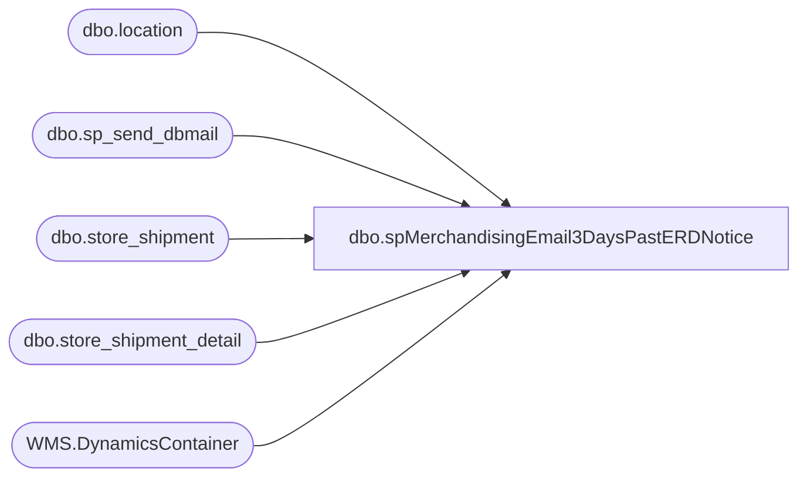

# dbo.spMerchandisingEmail3DaysPastERDNotice

**Database:** me_01  
**Server:** bedrockdb02  

## Architecture Diagram



## Table Dependencies

| Referenced Table |
|---|
| dbo.location |
| dbo.sp_send_dbmail |
| dbo.store_shipment |
| dbo.store_shipment_detail |
| WMS.DynamicsContainer |

## Stored Procedure Code

```sql
CREATE proc [dbo].[spMerchandisingEmail3DaysPastERDNotice]

as

-- =====================================================================================================
-- Name: spMerchandisingEmail3DaysPastERDNotice
--
-- Description:	Captures summary of unreceived store shipments, 3 days past expected receipt date, sends email to store and BL AND generates automated receipt of shipment via pipeline carton batch receipt file
--
-- Input: NA
--
-- Output: Email w/text file
--
-- Dependencies: na
--
-- Revision History
--		Name:			Date:			Comments:
--		Dan Tweedie		10/01/2012		Created proc
--		Dan Tweedie		12/13/2012		Changed day threshold from 3 to 6
--		Dan Tweedie		01/03/2013		Set threshold back to 3
--		Dan Tweedie		08/26/2013		Changed the source for getting the BL email addresses...now getting from store master repository per Keith Missey
--		Dan Tweedie		10/16/2013		Exclude store 0311 per Distro team
--		Dan Tweedie		11/13/2014		Exclude locations '0630','0631','0632','0633','0634' per Distro team
--		Dan Tweedie		07/27/2015		Added extra check w/email for unreceived shipments from 980 to 960
--		Tim Callahan	11/10/2015		Exclude Location 0322 per Distro Team 
--		Tim Callahan	09/27/2016		Exclude Location 2065 per Tami Barrieau (Distro Team Manager)
--		Tim Callahan	09/28/2016		Exclude Location 2019 per Tami Barrieau (Distro Team Manager)
--		Tim Callahan	10/05/2016		Added 2019 and 2065 per Tami Barrieau (Distro Team Manager)
--		Tim Callahan	10/19/2016		Excluded Location 0107 per Tami Barrieau (Distro Team Manager)
--		Tim Callahan	10/24/2016		Added Location 0107 per Tami Barrieau (Distro Team Manager)
--		Lizzy Timm		04/29/2020		Modified proc to create a temp table populated with locations that will temporarily need to be excluded for the BOSFS process; changes are marked with "04/29/2020 LT"
--		Lizzy Timm		05/14/2020		Removed temp table and replaced with dbo.temp_ExcludeStoresBOSFS
--		Lizzy Timm		05/21/2021		Replaced WMDB01 logic with STL-SSIS-P-01 for #Shipment table
--		Lizzy Timm		03/21/2022		Modified proc to only send BOSFS alerts and not create CBR file because receive as sent is temporarily disabled
-- =====================================================================================================

set nocount on 
/* -- Commented out 3/21/22, uncomment to re-enable usual receive as sent alerts and CBR file generation; LT
--get store list and email addresses
IF (Object_ID('tempdb..#stores') IS NOT null) DROP TABLE #stores
SELECT 
distinct right('0000' + cast(s.STR_NUM as varchar(4)), 4) location,
case when right('0000' + cast(s.STR_NUM as varchar(4)), 4) like '0%' 
		then 'store' + right('0000' + cast(s.STR_NUM as varchar(4)), 3) + '@buildabear.com'
	else 'store' + right('0000' + cast(s.STR_NUM as varchar(4)), 4) + '@buildabear.com'
	end	as store_email,
case when right('0000' + cast(s.STR_NUM as varchar(4)), 4) in ('2022','2023','2024','2025','2026','2036','2041','2046','2052','2054','2056','2059')
		then 'lynnm@buildabear.com'
	when right('0000' + cast(s.STR_NUM as varchar(4)), 4) in ('2010','2020','2038','2044','2045','2047','2048','2051','2058','2061','2063')
		then 'justinc@buildabear.com'
	when right('0000' + cast(s.STR_NUM as varchar(4)), 4) in ('2002','2007','2012','2014','2015','2018','2035','2040','2049','2060')
		then 'paulahe@buildabear.com'
	when right('0000' + cast(s.STR_NUM as varchar(4)), 4) in ('2004','2006','2009','2011','2017','2019','2050','2057')
		then 'virginiale@buildabear.com'
	when right('0000' + cast(s.STR_NUM as varchar(4)), 4) in ('2001','2003','2021','2027','2028','2029','2030','2031','2053','2062')
		then 'claireb@buildabear.com'
	when right('0000' + cast(s.STR_NUM as varchar(4)), 4) in ('2013','2016','2032','2033','2034','2037','2039','2042','2043','2055')
		then 'garyr@buildabear.com'
	else c.EMAIL
	end as bl_email
into #stores
FROM kodiak.BABWMstrData.dbo.STR_DIM s
LEFT JOIN kodiak.BABWMstrData.dbo.BEARITORY_DIM b ON b.BEARITORY_ID = s.BEARITORY_ID
LEFT JOIN kodiak.BABWMstrData.dbo.CNTCT_DIM c ON c.CNTCT_ID = b.CNTCT_ID
join location l (nolock) on right('0000' + cast(s.STR_NUM as varchar(4)), 4) = l.location_code
where right('0000' + cast(s.STR_NUM as varchar(4)), 4) not in ('0311','0322','0630','0631','0632','0633','0634')
	AND right('0000' + cast(s.STR_NUM as varchar(4)), 4) not in (SELECT DISTINCT ExStore FROM dbo.temp_ExcludeStoresBOSFS) -- Added 04/29/2020 LT
ORDER BY 1


---
IF (Object_ID('tempdb..##shipments') IS NOT null) DROP TABLE ##shipments
select	ss.document_no shipment,
		convert(varchar, ss.ship_date, 101) ship_date,
		convert(varchar, ss.expected_receipt_date, 101) expected_receipt_date,
		tl.location_code as store,
		fl.location_code as warehouse,
		count(distinct ssd.carton_no) cartons,
		s.store_email,
		s.bl_email
into	##shipments
from 	store_shipment ss (nolock)
join	location tl (nolock) on ss.location_id = tl.location_id
join 	location fl (nolock) on ss.from_location_id = fl.location_id 
join	store_shipment_detail ssd (nolock) on ss.store_shipment_id = ssd.store_shipment_id
join	#stores s on tl.location_code = s.location
where	ss.document_status = 3 --in transit
and		fl.location_code in ('0980', '0960','2970') --from bearhouse, west coast dc, uk dc
and		tl.location_code < '2500' --not sure where this cutoff comes from
and		tl.location_code not in ('0247', '0305', '0306') --fedex locations - do we still exclude these locations?
and		tl.location_code in (select location from #stores) --master store list from kodiak query on top
--and     convert(varchar, ss.expected_receipt_date, 101) = convert(varchar, getdate()-2, 101) --2 days past ERD
and		datediff(dd, ss.expected_receipt_date, getdate()-3) = 0 --3 days past ERD --CHANGED TO 5 FOR THE HOLIDAYS
	AND tl.location_code not in (SELECT DISTINCT ExStore FROM dbo.temp_ExcludeStoresBOSFS) -- Added 04/29/2020 LT
group by ss.document_no, convert(varchar, ss.ship_date, 101),convert(varchar, ss.expected_receipt_date, 101),tl.location_code,fl.location_code, s.store_email, s.bl_email
order by tl.location_code, ss.document_no
-----------

if (select count(*) from ##shipments) > 0

BEGIN
	--insert into history table for future reference
	insert into store_shipments_past_erd_3 
	select	shipment as "document_no",
			ship_date as "ship_date",
			expected_receipt_date as "expected_receipt_date",
			store as "location_code",
			warehouse as "warehouse",
			cartons as "total_cartons"
	from	##shipments


	declare @stores int,
			@counter int,
			@store varchar(4),
			@filename varchar(1000),
			@emailsubject varchar(1000),
			@erd varchar(11),
			@query varchar(8000),
			@text varchar(8000),
			@store_email varchar(100),
			@bl_email varchar(100),
			@query1 varchar(8000)

	select @erd = convert(varchar, getdate()-3, 101)
	select @stores = count(distinct store) from ##shipments
	select @counter = 0
	select @store = max(store) from ##shipments 

	while @counter < @stores
		begin
			
			select @store_email = store_email from ##shipments where store = @store
			select @bl_email = bl_email from ##shipments where store = @store
			select @filename = 'Store ' + @store + ' Open Shipments 3 Days Past Expected Receipt Date Report' + '.txt'
			select @emailsubject = 'Open Shipments 3 Days Past Expected Receipt Date Report for Store ' + @store + ', ' + cast(getdate() as varchar(11))
			select @query1 = 'select shipment as "Document #", ship_date as "Ship Date", expected_receipt_date as "Expected Receipt Date", store as "Store #", warehouse as "Warehouse", cartons as "# of Cartons" from ##shipments where store = ' + @store
			select @query = @query1

			-- Body message which was drafted by Heather Barksdale 10/25/2012
			select @text = '<font face =arial size = 3>
			Bearitory Leader,</P>

			This is an automated email to alert you that the store/s listed on this report have not yet completed the receiving process for their
			warehouse shipment which was expected to arrive in their store on  ' + @erd + '. The store team received an email reminder 2 days after
			the expected delivery date but has still not completed the receiving process.  <br><br>
			
			Failure to complete the process causes potential incorrect
			merchandise and supply distributions and accounting delays, <b><u>please note the system has automatically changed the transfer to ''''received as sent''</u></b>, using the same quantity/quantities shown in the transfer document.</P><br><br>

			When changing the transfer status from ''''sent'''' to ''''received'''' it’s important to note a few things - 
				<ul>
				<li>Teams can use “receive as sent” to automatically enter quantities into all line items in the transfer or they can manually enter quantities for each.
				<li>The teams must press “receive” or “receive as sent” to change the status to “received” and they MUST press “save/receive” for this to take affect.
				<li>If there is an actual variance from the quantity received, the teams should enter the actual quantity received.
				<li>At the completion of any action in the transfer document, the teams must press “save” or their work will be lost.
				<li>The store can manually correct any transfer document for up to 60 days, such as if they later find the merchandise or can verify that it never arrived.</p>
				</ul>
			<br><br>
			If there are any questions about how to complete this process, please have the store team review the Merchandising instructions found on Bearnet and/or contact Store Operations for support.
			<br>
			If there are system issues preventing the team from completing their process, please contact the Service Desk right away.
			<br>
			Finally, if you are able to confirm that the shipment or package did not actually arrive at the store, please contact TruckingServices@buildabear.com for assistance.</p>
			<br><br>
			
			<i><b>This e-mail is generated from an automated job. Please do NOT reply to this e-mail</b></i>. 
			<br>
			<br>

			Thank you for your attention.</p>

			BQ Bears</font>

			<br>
			<br>
			<br>
			=================================================================================
			<br>
			Technical Reference: bedrockdb02.me_01.spMerchandisingEmail3DaysPastERDWarning
			<br>
			================================================================================='
						
			exec msdb.dbo.sp_send_dbmail
			@profile_name = 'merchadmin',
 			@recipients = @store_email,
			@copy_recipients = @bl_email,
			@body = @text,
			@subject = @emailsubject,
			@query = @query,
			@importance = high,
			@query_attachment_filename = @filename,
			@attach_query_result_as_file = '1',
			@body_format = 'HTML'

			select @store = max(store) from ##shipments where store < @store
		    select @counter = @counter + 1
			if @counter > @stores
				break
			else
				continue
		end

--GENERATE CARTON BATCH RECEIPT FILE
	IF (Object_ID('tempdb..##cartonReceipts') IS NOT null) DROP TABLE ##cartonReceipts
	select	'BC' a,
			'A' b,
			ssd.carton_no c,
			tl.location_code d,
			'099060199' e
	into ##cartonReceipts
	from 	store_shipment ss (nolock)
	join	location tl (nolock) on ss.location_id = tl.location_id
	join 	location fl (nolock) on ss.from_location_id = fl.location_id 
	join	store_shipment_detail ssd (nolock) on ss.store_shipment_id = ssd.store_shipment_id
	join	#stores s on tl.location_code = s.location
	where	ss.document_status = 3 --in transit
	and		fl.location_code in ('0980', '0960','2970') --from bearhouse, west coast dc, uk dc
	and		tl.location_code < '2500' --not sure where this cutoff comes from
	and		tl.location_code not in ('0247', '0305', '0306') --fedex locations - do we still exclude these locations?
	and		tl.location_code in (select location from #stores) --master store list from kodiak query on top
	--and     convert(varchar, ss.expected_receipt_date, 101) = convert(varchar, getdate()-2, 101) --2 days past ERD
	and		datediff(dd, ss.expected_receipt_date, getdate()-3) = 0 --3 days past ERD --CHANGED TO 5 FOR THE HOLIDAYS
	AND		tl.location_code not in (SELECT DISTINCT ExStore FROM dbo.temp_ExcludeStoresBOSFS) -- Added 04/29/2020 LT
	order by tl.location_code, ssd.carton_no


	declare @query2 varchar(1000),
			@date2 varchar(52),
			@file_name2 varchar(100),
			@file_location2 varchar(100),
			@server2 varchar(20),
			@database2 varchar(20),
			@bcp2 varchar(1000)


			set @query2 = 'select * from bedrockdb02.me_01.dbo.##cartonReceipts order by d'
			select @date2 = convert(varchar, datepart(yyyy, getdate())) + convert(varchar, datepart(mm, getdate())) + convert(varchar, datepart(dd, getdate())) + convert(varchar, datepart(hh, getdate())) + convert(varchar, datepart(mi, getdate())) + convert(varchar, datepart(ss, getdate())) + convert(varchar, datepart(ms, getdate()))
			set @file_location2 = '\\pipeapp01\Company01\Text File to IM Import Tables  - Batch Carton\'
			set @file_name2 = 'STSIMCTN.3DayERDReceipts.' + @date2 + '.GO'
			set @server2 = 'bedrockdb02'
			set @database2 = 'me_01'
			set @bcp2 = 'bcp "' + @query2 + '" queryout "' + @file_location2 + @file_name2 + '"  -T -c -S' + @server2

			exec master..xp_cmdshell @bcp2

END

*/


--------------------------------------------------
---CHECK FOR UNRECEIVED SHIPMENTS FROM 980 TO 960
--------------------------------------------------
IF (Object_ID('tempdb..#shipments') IS NOT null) DROP TABLE #shipments
select	ss.document_no shipment,
		convert(varchar, ss.ship_date, 101) ship_date,
		convert(varchar, ss.expected_receipt_date, 101) erd,
		--ch.plt_id BearhousePallet,
		--count(ch.carton_nbr) Cartons
		ch.LicensePlateId BearhousePallet,		
		count(ch.containerID) Cartons
into	#shipments
from 	store_shipment ss (nolock)
join	location tl (nolock) on ss.location_id = tl.location_id
join 	location fl (nolock) on ss.from_location_id = fl.location_id 
join	store_shipment_detail ssd (nolock) on ss.store_shipment_id = ssd.store_shipment_id
-- join	wmdb01.wmprod.dbo.carton_hdr ch on ssd.carton_no = ch.carton_nbr
join	[STL-SSIS-P-01].IntegrationStaging.WMS.DynamicsContainer ch on ssd.carton_no = ch.containerID
where	fl.location_code = '0980'
and		tl.location_code = '0960'
and		datediff(dd, ss.expected_receipt_date, getdate()-3) = 0 --3 days past ERD 
and		ss.document_status = 3 --in transit
group by ss.document_no, convert(varchar, ss.ship_date, 101), convert(varchar, ss.expected_receipt_date, 101), ch.LicensePlateId --ch.plt_id


if (select count(*) from #shipments) > 0

begin

declare @textWC nvarchar(max)
set @textWC = 
'<font face =arial>The following shipments from the Bearhouse to DDC were expected to have been received 3 days ago.</font> <br> <br>'+
'<font face =arial size = 2><B>Bearhouse to DDC Shipments</B><br>' +
'</font>' +
	'<table border="1">' +
		'<tr><th><font face =arial size = 2>SHIPMENT</font></th>' +
			'<th><font face =arial size = 2>SHIP DATE</font></th>' +
			'<th><font face =arial size = 2>ERD</font></th>' +
			'<th><font face =arial size = 2>BEARHOUSE PALLET</font></th>' +
			'<th><font face =arial size = 2>CARTONS</font></th></tr>' +
'<font face =arial size = 2>' +
    CAST ( ( SELECT td = shipment,'',
                    td = ship_date, '',
                    td = erd, '',
                    td = bearhousepallet, '',
                    td = cartons, ''
              from #shipments
			  order by ship_date, bearhousepallet
              FOR XML PATH('tr'), TYPE 
    ) AS NVARCHAR(MAX) ) +
    '</font></table></font></p></p>
    <br>
	<br>
	<br>' +
    '<font face =arial size = 1><B>
	Technical Reference: bedrockdb02.me_01.spMerchandisingEmail3DaysPastERDWarning
	</B></font>
    <br>
    <br>
<font face =arial size = 1><i>The information in this message may be privileged, “confidential” and protected from disclosure and/or intended only for the addressee(s) named above.  If the reader of this message is not the intended recipient, or an employee or agent responsible for delivering this message to the intended recipient, you are hereby notified that any dissemination, distribution or copying of the communication is strictly prohibited.  If you have received this communication in error, please notify us immediately by replying to the message and deleting it from your computer.  Thank you beary much.</i></font>'


	exec msdb.dbo.sp_send_dbmail
	@profile_name = 'MerchAdmin',
	@recipients = 'danl@buildabear.com;SantiagoB@buildabear.com;Maria.Carrillo@godependable.com;Keith.Corsi@godependable.com', -- Modified users per HEAT SR # 20538
	@body = @textWC,
	@subject = 'Bearhouse to DDC Unreceived Shipments 3 Days Past ERD',
	@body_format = 'html'

end
```

