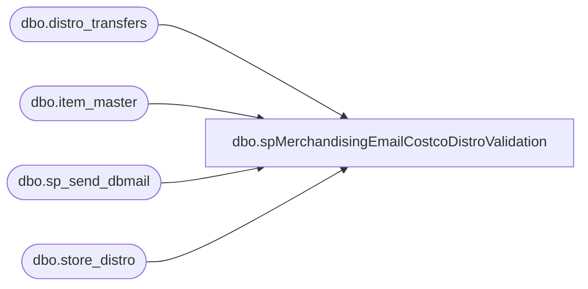

# dbo.spMerchandisingEmailCostcoDistroValidation

**Database:** me_01  
**Server:** bedrockdb02  

## Architecture Diagram



## Table Dependencies

| Referenced Table |
|---|
| dbo.distro_transfers |
| dbo.item_master |
| dbo.sp_send_dbmail |
| dbo.store_distro |

## Stored Procedure Code

```sql
CREATE proc [dbo].[spMerchandisingEmailCostcoDistroValidation]

as

if (select count(*)
	from distro_transfers dt
	left join wmdb01.wmprod.dbo.store_distro sd on dt.groupinglabel = sd.po_nbr
			and sd.sku_id in (select sku_id from item_master where style = right(('000000' + cast(dt.upc_number as varchar)), 6))
	where dt.rec_type in (33, 34, 35, 36, 37)
	and dt.exported_date is not null
	and sd.po_nbr is null 
	and dt.groupinglabel <> '') > 0

begin

	declare @text nvarchar(max)

	set @text = 
		'<font face =arial size = 2><B>COSTCO Distros Not In WM</B><br></font>' +
			'<table border="1">' +
				'<tr><th><font face =arial size = 2>LOCATION</font></th>' +
					'<th><font face =arial size = 2>STYLE</font></th>' +
					'<th><font face =arial size = 2>QUANTITY</font></th>' +
					'<th><font face =arial size = 2>COSTCO PO</font></th>' +
					'<th><font face =arial size = 2>LOADED DATE</font></th>' +
					'<th><font face =arial size = 2>EXPORTED DATE</font></th></tr>' +
		'<font face =arial size = 2>' +
			CAST ( ( SELECT td = dt.destid,'',
							td = right(('000000' + cast(dt.upc_number as varchar)), 6), '',
							td = dt.quantity, '',
							td = dt.groupinglabel, '',
							td = dt.loaded_date, '',
							td = dt.exported_date, ''
					  from distro_transfers dt
						left join wmdb01.wmprod.dbo.store_distro sd on dt.groupinglabel = sd.po_nbr
							and sd.sku_id in (select sku_id from item_master where style = right(('000000' + cast(dt.upc_number as varchar)), 6))
						where dt.rec_type in (33, 34, 35, 36, 37)
						and dt.exported_date is not null 
						and sd.po_nbr is null
						and dt.groupinglabel <> '' --had to add because there was an instance where Purchasing entered a distro without a PO number on purpose, so we have to exclude that from the validation because it will return a false alarm otherwise
					  FOR XML PATH('tr'), TYPE 
					) AS NVARCHAR(MAX) ) +
			'</font></table></font></p></p>
			<br>
			<font face =arial size = 1><B>This report was run from bedrockdb02.me_01.dbo.spMerchandisingEmailCostcoDistroValidation.</B></font>
			<br>
			<br>
		<font face =arial size = 1><i>The information in this message may be privileged, “confidential” and protected from disclosure and/or intended only for the addressee(s) named above.  If the reader of this message is not the intended recipient, or an employee or agent responsible for delivering this message to the intended recipient, you are hereby notified that any dissemination, distribution or copying of the communication is strictly prohibited.  If you have received this communication in error, please notify us immediately by replying to the message and deleting it from your computer.  Thank you beary much.</i></font>'

		exec msdb.dbo.sp_send_dbmail
		@profile_name = 'merchadmin',
		@recipients = 'EnterpriseSystemsAlerts@buildabear.com;',
		@body = @text,
		@subject = 'Costco Distros Not In WM',
		@body_format = 'HTML'


end
```

