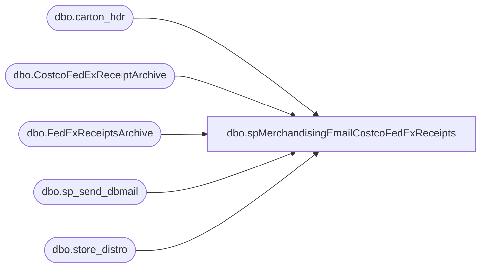

# dbo.spMerchandisingEmailCostcoFedExReceipts

**Database:** me_01  
**Server:** bedrockdb02  

## Architecture Diagram



## Table Dependencies

| Referenced Table |
|---|
| dbo.carton_hdr |
| dbo.CostcoFedExReceiptArchive |
| dbo.FedExReceiptsArchive |
| dbo.sp_send_dbmail |
| dbo.store_distro |

## Stored Procedure Code

```sql
CREATE proc [dbo].[spMerchandisingEmailCostcoFedExReceipts]

as

-- =====================================================================================================
-- Name: spMerchandisingEmailCostcoFedExReceipts
--
-- Description:	Sends an email to Linda K if cartons shipped to Costco via FedEx have been received
--
--				
-- Revision History
--		Name:			Date:			Comments:
--		Dan Tweedie		09/04/2013		Created proc.	
-- =====================================================================================================

set nocount on

IF (Object_ID('tempdb..#fedex') IS NOT NULL) DROP TABLE #fedex
select sd.po_nbr, fera.tracking, ch.carton_nbr, fera.delivery_date
into #fedex
from FedExReceiptsArchive fera 
join wmdb01.wmprod.dbo.carton_hdr ch on fera.tracking = ch.trkg_nbr
join wmdb01.wmprod.dbo.store_distro sd on ch.pkt_ctrl_nbr = sd.pkt_ctrl_nbr
where sd.dsgnated_serv_lvl in (33, 34, 35)
and ch.carton_nbr not in (select carton_nbr from CostcoFedExReceiptArchive)

if (select count(*) from #fedex) > 0

begin

	insert CostcoFedExReceiptArchive
	select * from #fedex

	declare @text nvarchar(max)
	
	set @text = '
	<font face =arial size = 2> '  +
		'</b><H1>Costco FedEx Receipts</H1>' +
		'<table border="1">' +
		'<tr><th>PO Number</th><th>Tracking</th><th>Carton</th><th>Delivery Date</th></tr>' +
		CAST ( ( SELECT td = po_nbr,'',
						td = tracking, '',
						td = carton_nbr, '',
						td = delivery_date 
				  from #fedex
				  order by delivery_date, po_nbr, tracking
				  FOR XML PATH('tr'), TYPE 
		) AS NVARCHAR(MAX) ) +
		'</font></table></font></p></p><br>'
    
   
	exec msdb.dbo.sp_send_dbmail
	@profile_name = 'merchadmin',
    @recipients = 'lindak@buildabear.com',
	@copy_recipients = 'merchadmin@buildabear.com',
    @body = @text,
	@subject = 'Costco FedEx Receipts',
	@body_format = 'HTML'

end
```

