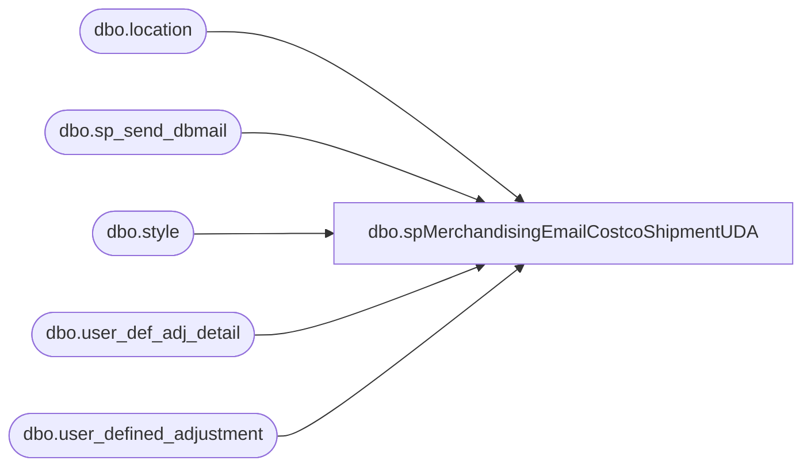

# dbo.spMerchandisingEmailCostcoShipmentUDA

**Database:** me_01  
**Server:** bedrockdb02  

## Architecture Diagram



## Table Dependencies

| Referenced Table |
|---|
| dbo.location |
| dbo.sp_send_dbmail |
| dbo.style |
| dbo.user_def_adj_detail |
| dbo.user_defined_adjustment |

## Stored Procedure Code

```sql
CREATE proc [dbo].[spMerchandisingEmailCostcoShipmentUDA]

as

-- =====================================================================================================
-- Name: spMerchandisingEmailCostcoShipmentUDA
--
-- Description:	Sends an email to Jack M if a UDA posted to Merch today based on a shipment from WM to a Costco location
--
--				
-- Revision History
--		Name:			Date:			Comments:
--		Dan Tweedie		09/04/2013		Created proc.	
-- =====================================================================================================

set nocount on

IF (Object_ID('tempdb..#UDA') IS NOT NULL) DROP TABLE #UDA
select uda.document_no, uda.grouping_label, convert(varchar, uda.create_date, 101) create_date,
l.location_code, s.style_code, sum(udad.units_to_adjust) units
into #UDA
from user_defined_adjustment uda (nolock)
join user_def_adj_detail udad (nolock) on uda.user_defined_adjustment_id = udad.user_defined_adjustment_id
join style s (nolock) on udad.style_id = s.style_id
join location l (nolock) on udad.location_id = l.location_id
where datediff(dd, uda.create_date, getdate()-1) = 0
and l.location_code = '0980'
and grouping_label = 'CostcoShipment'
group by uda.document_no, uda.grouping_label, convert(varchar, uda.create_date, 101), l.location_code, s.style_code

if (select count(*) from #UDA) > 0

begin
	
	declare @text nvarchar(max)
	
	set @text = '
	<font face =arial size = 2> '  +
		'</b><H1>Costco Shipment UDA(s) Posted Today</H1>' +
		'<table border="1">' +
		'<tr><th>Document Number</th><th>Grouping Label</th><th>Create Date</th><th>Location</th><th>Style</th><th>Units</th></tr>' +
		CAST ( ( SELECT td = document_no,'',
						td = grouping_label, '',
						td = create_date, '',
						td = location_code, '',
						td = style_code, '',
						td = units, ''
				  from #UDA
				  order by create_date, style_code
				  FOR XML PATH('tr'), TYPE 
		) AS NVARCHAR(MAX) ) +
		'</font></table></font></p></p><br>'
    
   
	exec msdb.dbo.sp_send_dbmail
	@profile_name = 'merchadmin',
    @recipients = 'jackm@buildabear.com;physicalinventory@buildabear.com',
	@copy_recipients = 'merchadmin@buildabear.com',
    @body = @text,
	@subject = 'Costco Shipment UDA Summary',
	@body_format = 'HTML'


end
```

