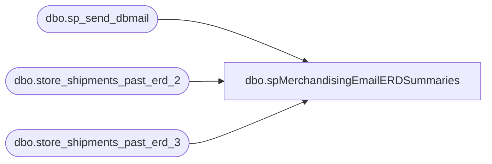

# dbo.spMerchandisingEmailERDSummaries

**Database:** me_01  
**Server:** bedrockdb02  

## Architecture Diagram



## Table Dependencies

| Referenced Table |
|---|
| dbo.sp_send_dbmail |
| dbo.store_shipments_past_erd_2 |
| dbo.store_shipments_past_erd_3 |

## Stored Procedure Code

```sql
CREATE proc [dbo].[spMerchandisingEmailERDSummaries]
as
-- =====================================================================================================
-- Name: spMerchandisingEmailERDSummaries
--
-- Description:	Sends email summary of information that has been reported to the stores and BL's over the past 7 days for store shipments not received within 2 or 3 days past ERD		
--				
-- Input:	NA
--			
-- Output: 
--		
-- Dependencies: 
--				 
-- Revision History
--		Name:			Date:			Comments:
--		Dan Tweedie		11/25/2012		Created proc.	
-- =====================================================================================================
IF (Object_ID('tempdb..##erd2') IS NOT NULL) DROP TABLE ##erd2
select	distinct
		location_code, 
		convert(varchar, ship_date, 101) ship_date,
		convert(varchar, expected_receipt_date, 101) erd,
		count(document_no) shipments,
		sum(total_cartons) cartons
into ##erd2
from store_shipments_past_erd_2 (nolock)
where datediff(dd, expected_receipt_date, getdate()) <= 7
group by location_code, convert(varchar, ship_date, 101), convert(varchar, expected_receipt_date, 101) 
order by location_code, convert(varchar, expected_receipt_date, 101)

IF (Object_ID('tempdb..##erd3') IS NOT NULL) DROP TABLE ##erd3
select	distinct
		location_code, 
		convert(varchar, ship_date, 101) ship_date,
		convert(varchar, expected_receipt_date, 101) erd,
		count(document_no) shipments,
		sum(total_cartons) cartons
into ##erd3
from store_shipments_past_erd_3 (nolock)
where datediff(dd, expected_receipt_date, getdate()) <= 7
group by location_code, convert(varchar, ship_date, 101), convert(varchar, expected_receipt_date, 101) 
order by location_code, convert(varchar, expected_receipt_date, 101)

if	(select count(*) from ##erd2) > 0
	or
	(select count(*) from ##erd3) > 0


begin

declare @text nvarchar(max)
set @text = 
'The following information summarizes the data communicated to stores over the past 7 days, due to the store shipments not having been received by 2 and/or 3 days past ERD. <br> <br>'+
'<font face =arial size = 2><B>NOTIFICATION FOR 2 DAYS PAST ERD</B><br>' +
'</font>' +
	'<table border="1">' +
		'<tr><th><font face =arial size = 2>LOCATION</font></th>' +
			'<th><font face =arial size = 2>SHIP-DATE</font></th>' +
			'<th><font face =arial size = 2>ERD</font></th>' +
			'<th><font face =arial size = 2>SHIPMENTS</font></th>' +
			'<th><font face =arial size = 2>CARTONS</font></th></tr>' +
'<font face =arial size = 2>' +
    CAST ( ( SELECT td = location_code,'',
                    td = ship_date, '',
                    td = erd, '',
                    td = shipments, '',
                    td = cartons, ''
              from ##erd2
			  order by location_code, erd
              FOR XML PATH('tr'), TYPE 
    ) AS NVARCHAR(MAX) ) +
    '</font></table></font></p></p>
    <br>
	<br>
	<br>' +
'<font face =arial size = 2><B>NOTIFICATION FOR 3 DAYS PAST ERD</B><br>' +
'</font>' +
	'<table border="1">' +
		'<tr><th><font face =arial size = 2>LOCATION</font></th>' +
			'<th><font face =arial size = 2>SHIP-DATE</font></th>' +
			'<th><font face =arial size = 2>ERD</font></th>' +
			'<th><font face =arial size = 2>SHIPMENTS</font></th>' +
			'<th><font face =arial size = 2>CARTONS</font></th></tr>' +
'<font face =arial size = 2>' +
    CAST ( ( SELECT td = location_code,'',
                    td = ship_date, '',
                    td = erd, '',
                    td = shipments, '',
                    td = cartons, ''
              from ##erd3
			  order by location_code, erd
              FOR XML PATH('tr'), TYPE 
    ) AS NVARCHAR(MAX) ) +
    '</font></table></font></p></p>
    <br>
	<br>
	<br>' +

    '<font face =arial size = 1><B>This report was run from bedrockdb02 SQL Agent: Report - ERD Summaries.</B></font>
    <br>
    <br>
<font face =arial size = 1><i>The information in this message may be privileged, “confidential” and protected from disclosure and/or intended only for the addressee(s) named above.  If the reader of this message is not the intended recipient, or an employee or agent responsible for delivering this message to the intended recipient, you are hereby notified that any dissemination, distribution or copying of the communication is strictly prohibited.  If you have received this communication in error, please notify us immediately by replying to the message and deleting it from your computer.  Thank you beary much.</i></font>'


	exec msdb.dbo.sp_send_dbmail
	@profile_name = 'MerchAdmin',
	@recipients = 'dant@buildabear.com',
	@body = @text,
	@subject = 'ERD 7 Day Summary',
	@body_format = 'html'

end
```

