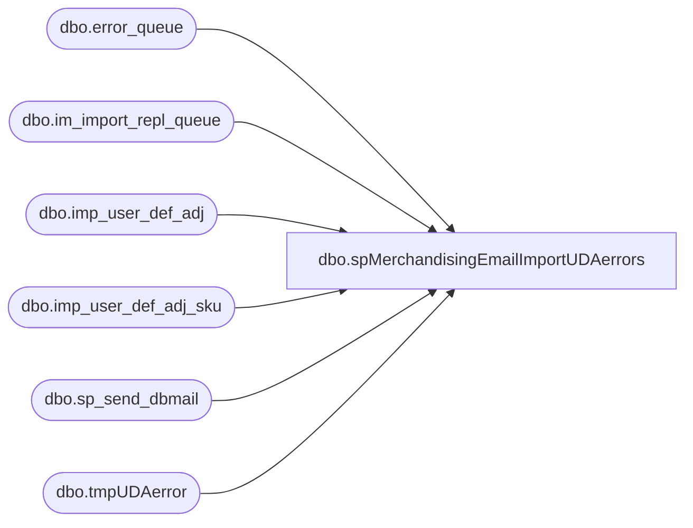

# dbo.spMerchandisingEmailImportUDAerrors

**Database:** me_01  
**Server:** bedrockdb02  

## Architecture Diagram



## Table Dependencies

| Referenced Table |
|---|
| dbo.error_queue |
| dbo.im_import_repl_queue |
| dbo.imp_user_def_adj |
| dbo.imp_user_def_adj_sku |
| dbo.sp_send_dbmail |
| dbo.tmpUDAerror |

## Stored Procedure Code

```sql
CREATE proc [dbo].[spMerchandisingEmailImportUDAerrors]
as
-- =====================================================================================================
-- Name: spMerchandisingEmailImportUDAerrors
--
-- Description:	Captures Pipeline error log data for UDA import errors, sends email
--
-- Input: N/A
--
-- Output: 
--
-- Dependencies: 
--
-- Revision History
--		Name:			Date:			Comments:
--		Dan Tweedie		06/05/2012		Created proc.	
-- =====================================================================================================


set nocount on
IF (Object_ID('me_01..tmpUDAerror') IS NOT NULL) DROP TABLE tmpUDAerror
select isa.submit_date, isa.document_no, isa.transaction_reason_code, isa.external_system_name,
isas.location_code, isas.upc_number, isas.units_to_adjust,
substring(eq.error,59,125) error_msg
into tmpUDAerror
from pipeapp01.PipelineRepository.dbo.error_queue eq (nolock)
join im_import_repl_queue iirq (nolock) 
	on substring(eq.entity_key,1,CHARINDEX('~', substring(eq.entity_key,1,30),1)-1) = iirq.entity_id
	and iirq.entity_code = eq.entity_code
join imp_user_def_adj isa (nolock) 
	on substring(eq.entity_key,1,CHARINDEX('~', substring(eq.entity_key,1,30),1)-1) = isa.imp_user_def_adj_id
join imp_user_def_adj_sku isas (nolock) on isa.imp_user_def_adj_id = isas.imp_user_def_adj_id
where eq.segment_id = 19000
	and eq.entity_code = 112 --uda
order by iirq.action_date

if (select count(*) from tmpUDAerror) > 0
begin
declare @text nvarchar(max)
		
	set @text = '<font face =arial size = 2>' + 
	'</b><H1>UDA Import Errors Logged</H1>' +
		'<table border="1">' +
		'<tr><th>DATE</th><th>DOCUMENT</th><th>REASON</th><th>EXTERNAL SYSTEM</th><th>LOCATION</th><th>UPC</th><th>UNITS</th><th>ERROR MESSAGE</th></tr>' +
		CAST ( ( SELECT td = convert(varchar, submit_date, 101),'',
						td = document_no, '',
						td = transaction_reason_code, '',
						td = external_system_name, '',
						td = location_code, '',
						td = upc_number, '',
						td = units_to_adjust, '',
						td = error_msg, ''
				  from tmpUDAerror
				  order by convert(varchar, submit_date, 101)
				  FOR XML PATH('tr'), TYPE 
		) AS NVARCHAR(MAX) ) +
		'</font></table></font></p></p>
		<br>
		<font face =arial size = 1>This report was run from bedrockdb02.me_01.dbo.spMerchandisingEmailImportUDAerrors.</font>
		<br>
		<br>
	<font face =arial size = 1><i>The information in this message may be privileged, “confidential” and protected from disclosure and/or intended only for the addressee(s) named above.  If the reader of this message is not the intended recipient, or an employee or agent responsible for delivering this message to the intended recipient, you are hereby notified that any dissemination, distribution or copying of the communication is strictly prohibited.  If you have received this communication in error, please notify us immediately by replying to the message and deleting it from your computer.  Thank you beary much.</i></font>'


	exec msdb.dbo.sp_send_dbmail
		@profile_name = 'merchadmin',
		--@recipients = 'physicalinventory@buildabear.com',
		@copy_recipients = 'EntSysSupport@buildabear.com;',
		@body = @text,
		@subject = 'Import UDA Errors',
		@body_format = 'HTML'


end
```

