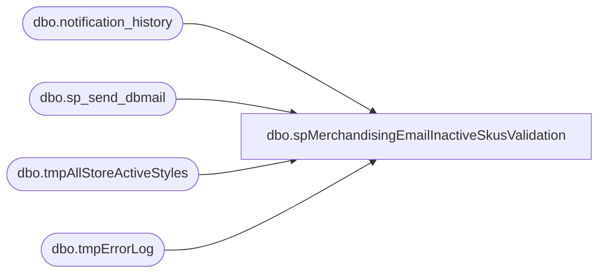

# dbo.spMerchandisingEmailInactiveSkusValidation

**Database:** me_01  
**Server:** bedrockdb02  

## Architecture Diagram



## Table Dependencies

| Referenced Table |
|---|
| dbo.notification_history |
| dbo.sp_send_dbmail |
| dbo.tmpAllStoreActiveStyles |
| dbo.tmpErrorLog |

## Stored Procedure Code

```sql
CREATE proc [dbo].[spMerchandisingEmailInactiveSkusValidation]

as

set nocount on

-- =====================================================================================================
-- Name: spMerchandisingEmailInactiveSkusValidation
-- Description: An SSIS package runs to compare Merch Inactive SKUs to every store's Active SKUs. This proc is executed from that SSIS package.
--				 
-- Revision History
--		Name:			Date:			Comments: 
--		Dan Tweedie	    09/11/2015		Created proc.
--		Paul Beckman	10/24/2019		Updated to use notification_history table	
--		Dan Tweedie		2019-01-16		Discovered that in the SSIS, if the store does not have transactions in retail_transaction table, 
--											the location code will be NULL in tmpAllStoreActiveStyles, so I updated this proc to remove those records
--											-->much easier than updating the SSIS
-- =====================================================================================================

if (select count(*) from tmpAllStoreActiveStyles (nolock) where location_code is null) > 0
	begin
		delete 
		from tmpAllStoreActiveStyles
		where location_code is null
	end


if (select count(*) from tmpAllStoreActiveStyles (nolock)) > 0


BEGIN
-----------------------
declare @subj varchar(52),
		@text nvarchar(max),
		@recip varchar(1000),
		@cc varchar(100)


set @subj = 'ALERT - Inactive SKUs at POS'
set @recip = 'EntSysSupport@buildabear.com'
set @text = 
'<font face =arial size = 2><B>Inactive SKU Count - - SKUs which are inactive in Merch, but active at POS</B><br>' +
'</font>' +
'(For more details, select * from bedrockdb02.me_01.dbo.tmpAllStoreActiveStyles)<br><br>'+
	'<table border="1">' +
		'<tr><th><font face =arial size = 2>LOCATION</font></th>' +
			'<th><font face =arial size = 2>NAME</font></th>' +
			'<th><font face =arial size = 2>STYLES</font></th></tr>' +
'<font face =arial size = 2>' +
    CAST ( ( SELECT td = location_code,'',
                    td = location_name, '',
                    td = count(style), ''
              from tmpAllStoreActiveStyles
			  group by location_code, location_name
				order by location_code
              FOR XML PATH('tr'), TYPE 
    ) AS NVARCHAR(MAX) ) +
    '</font></table></font></p></p>
    <br><br>' +
'<font face =arial size = 2><B>Errors logged while connecting to store server to perform inactive sku validation</B><br>' +
'</font>' +
	'<table border="1">' +
		'<tr><th><font face =arial size = 2>ERRORS</font></th></tr>' +
'<font face =arial size = 2>' +
    CAST ( ( SELECT td = errors,''
              from tmpErrorLog
              FOR XML PATH('tr'), TYPE 
    ) AS NVARCHAR(MAX) ) +
    '</font></table></font></p></p>
    <br><br>' +
	'<font face =arial size = 1><B>This report was run from bedrockdb02.me_01.dbo.spMerchandisingEmailInactiveSkusValidation</B></font><br><br>' + 
'<font face =arial size = 1><i>The information in this message may be privileged, “confidential” and protected from disclosure and/or intended only for the addressee(s) named above.  If the reader of this message is not the intended recipient, or an employee or agent responsible for delivering this message to the intended recipient, you are hereby notified that any dissemination, distribution or copying of the communication is strictly prohibited.  If you have received this communication in error, please notify us immediately by replying to the message and deleting it from your computer.  Thank you beary much.</i></font>' 


		exec msdb.dbo.sp_send_dbmail
			@profile_name = 'MerchAdmin',
			@recipients = @recip,
			@body = @text,
			@subject = @subj,
			@body_format = 'HTML'
				
	INSERT INTO notification_history
	(stored_proc_name,
	record_logged_datetime,
	issues_found,
	action_required,
	notification_sent,
	email_type,
	email_to,
	email_cc,
	email_subject,
	comment
	)
	VALUES (
	'spMerchandisingEmailInactiveSkusValidation', --<< Stored Proc name
	GETDATE(),
	'Yes', --<< Issues found - Yes / No
	'No', --<< Action required - Yes / No
	'Yes', --<< Notification sent - Yes / No
	'Alert', --<< Email type - Notification Only / Alert / Warning
	@recip, --<< Email TO
	NULL, --<< Email CC
	@subj, --<< Email Subject
	'SKUs which are inactive in Merch, but active at POS' --<< Comment
	)

END
```

