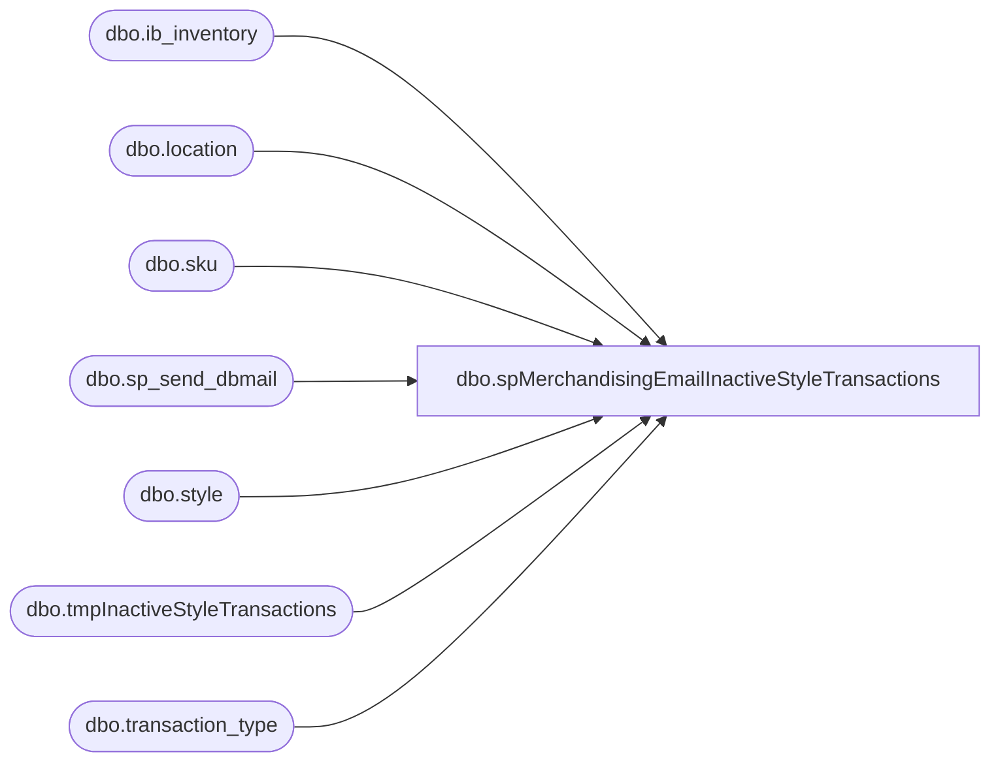

# dbo.spMerchandisingEmailInactiveStyleTransactions

**Database:** me_01  
**Server:** bedrockdb02  

## Architecture Diagram



## Table Dependencies

| Referenced Table |
|---|
| dbo.ib_inventory |
| dbo.location |
| dbo.sku |
| dbo.sp_send_dbmail |
| dbo.style |
| dbo.tmpInactiveStyleTransactions |
| dbo.transaction_type |

## Stored Procedure Code

```sql
CREATE proc [dbo].[spMerchandisingEmailInactiveStyleTransactions]

as

-- =====================================================================================================
-- Name: spMerchandisingEmailInactiveStyleTransactions
--
-- Description: Reports all transactions logged in ib_inventory over past 7 days for styles with Inactive flag. Sends email to Physical Inventory.
--
-- Input:	NA
--
-- Output: CSV & Email
--
-- Dependencies: 
--				 
--
-- Revision History
--		Name:			Date:			Comments:
--		Dan Tweedie		09/12/2012		Created proc.	
-- =====================================================================================================

set nocount on


IF (Object_ID('me_01..tmpInactiveStyleTransactions') IS NOT NULL) DROP TABLE me_01..tmpInactiveStyleTransactions
select s.style_code, 
	   s.short_desc,
	   convert(varchar, ii.transaction_date, 101) transaction_date,
	   l.location_code,
	   tt.transaction_type_desc transaction_type,
	   ii.transaction_units,
	   ii.transaction_cost,
	   ii.transaction_valuation_retail,
	   ii.transaction_selling_retail
into tmpInactiveStyleTransactions
from style s (nolock) 
join sku (nolock) on s.style_id = sku.style_id
join ib_inventory ii (nolock) on sku.sku_id = ii.sku_id
join location l (nolock) on ii.location_id = l.location_id
join transaction_type tt (nolock) on ii.transaction_type_code = tt.transaction_type_code
where s.active_flag = 0
and datediff(dd, ii.transaction_date, getdate()) <= 7
order by s.style_code, ii.transaction_date, l.location_code

if (select count(*) from tmpInactiveStyleTransactions) > 0

Begin

	declare @query varchar(1000),
			@date varchar(200),
			@file_name varchar(100),
			@file_location varchar(100),
			@attach varchar(200),
			@server varchar(20),
			@username varchar(20),
			@password varchar(20),
			@database varchar(20),
			@sqlcmd varchar(1000),
			@query_text varchar(1000)

		select @query_text = 'set nocount on select * from tmpInactiveStyleTransactions'

		set @date = convert(varchar, datepart(yyyy, getdate())) + '-' + convert(varchar, datepart(mm, getdate())) + '-' + convert(varchar, datepart(dd, getdate()))
		set @query = @query_text
		set @file_location = '\\kermode\FileRepository\MERCHANDISING\InactiveStyleTransactions\' 
		set @file_name = 'InactiveStyleTransactions-' + @date + '.CSV'
		set @attach = @file_location + @file_name
		set @server = 'bedrockdb02'
		set @database = 'me_01'
		set @sqlcmd = 'sqlcmd -S' + @server + ' -d' + @database + ' -Q' + '"' + @query + '"' + ' -o' + '"' + @file_location + @file_name + '"' + ' -s"," -w1000 -W'
		exec master..xp_cmdshell @sqlcmd

	exec msdb.dbo.sp_send_dbmail
	@profile_name = 'merchadmin',
	@recipients = 'physicalinventory@buildabear.com',
	@body = 'See attached records of Inactive styles with inventory transactions from the past 7 days.
		

	Process: bedrockdb02.SQLAgent.Email-InactiveStyleTransactions',
	@subject = 'Inactive Style Transactions',
	@file_attachments = @attach
	--@body_format = 'HTML'

End

if (select count(*) from tmpInactiveStyleTransactions) = 0

Begin

	exec msdb.dbo.sp_send_dbmail
	@profile_name = 'merchadmin',
	@recipients = 'physicalinventory@buildabear.com',
	@body = 'No records of Inactive styles with inventory transactions were found from the past 7 days.
		

	Process: bedrockdb02.SQLAgent.Email-InactiveStyleTransactions',
	@subject = 'Inactive Style Transactions'
	--@body_format = 'HTML'

End
```

