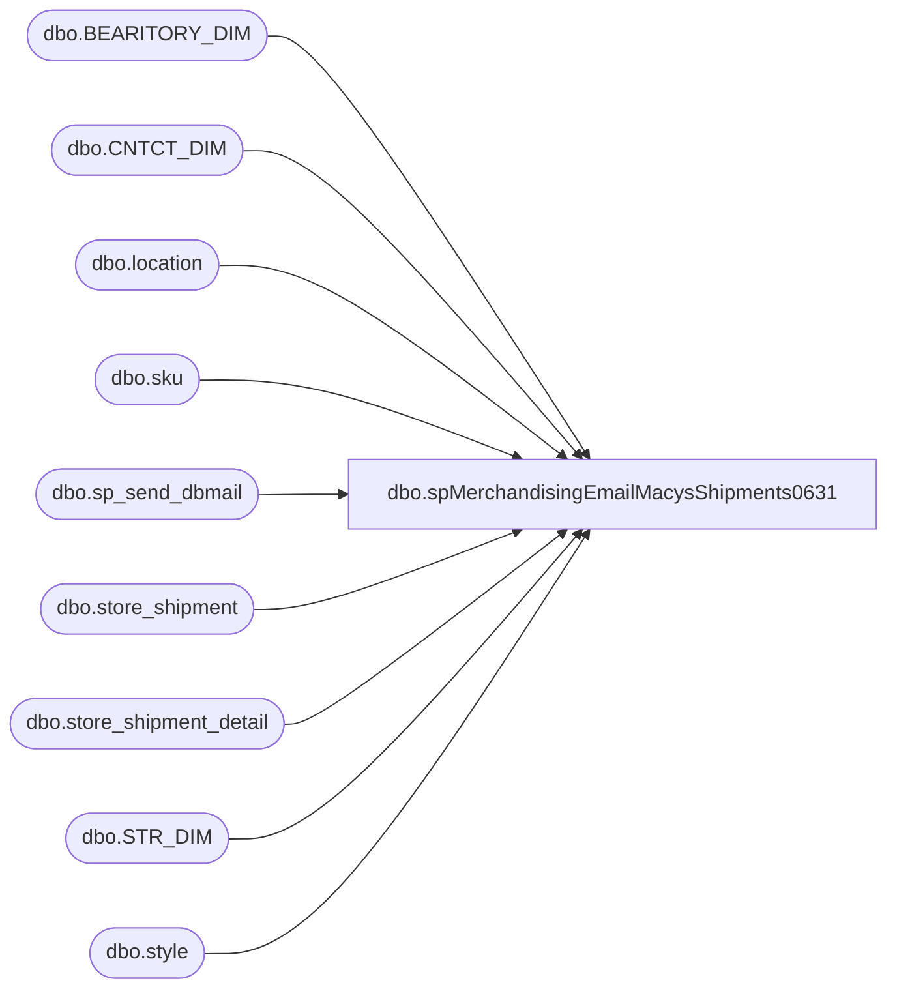

# dbo.spMerchandisingEmailMacysShipments0631

**Database:** me_01  
**Server:** bedrockdb02  

## Architecture Diagram



## Table Dependencies

| Referenced Table |
|---|
| dbo.BEARITORY_DIM |
| dbo.CNTCT_DIM |
| dbo.location |
| dbo.sku |
| dbo.sp_send_dbmail |
| dbo.store_shipment |
| dbo.store_shipment_detail |
| dbo.STR_DIM |
| dbo.style |

## Stored Procedure Code

```sql
CREATE proc [dbo].[spMerchandisingEmailMacysShipments0631]

as 


-- =====================================================================================================
-- Name: spMerchandisingEmailMacysShipments0631
--
-- Description:	Sends a daily running log of unrecived shipments to store 0631 
--
-- Input: NA
--
-- Output: Email w/text file
--
-- Dependencies: na
--
-- Revision History
--		Name:			Date:			Comments:
--		Dan Tweedie		11/13/2014		Created proc as replica of proc spMerchandisingEmailFAOShipments (which is for location 0311)
-- =====================================================================================================


set nocount on

--get store list and email addresses
IF (Object_ID('tempdb..#stores') IS NOT null) DROP TABLE #stores
SELECT 
distinct right('0000' + cast(s.STR_NUM as varchar(4)), 4) location,
case when right('0000' + cast(s.STR_NUM as varchar(4)), 4) like '0%' 
		then 'store' + right('0000' + cast(s.STR_NUM as varchar(4)), 3) + '@buildabear.com'
	else 'store' + right('0000' + cast(s.STR_NUM as varchar(4)), 4) + '@buildabear.com'
	end	as store_email,
c.EMAIL as bl_email
into #stores
FROM kodiak.BABWMstrData.dbo.STR_DIM s
LEFT JOIN kodiak.BABWMstrData.dbo.BEARITORY_DIM b ON b.BEARITORY_ID = s.BEARITORY_ID
LEFT JOIN kodiak.BABWMstrData.dbo.CNTCT_DIM c ON c.CNTCT_ID = b.CNTCT_ID
join location l (nolock) on right('0000' + cast(s.STR_NUM as varchar(4)), 4) = l.location_code
where right('0000' + cast(s.STR_NUM as varchar(4)), 4) = '0631'
ORDER BY 1

---
IF (Object_ID('tempdb..#FAOshipments') IS NOT null) DROP TABLE #FAOshipments
select	fl.location_code as warehouse,
		ss.document_no shipment,
		convert(varchar, ss.ship_date, 101) ship_date,
		s.style_code,
		s.short_desc,
		count(distinct ssd.carton_no) cartons,
		sum(ssd.units_sent) units_shipped,
		sum(ssd.units_received) units_received,
		st.store_email,
		st.bl_email,
		ss.external_system_name rec_type
into	#FAOshipments
from 	store_shipment ss (nolock)
join	store_shipment_detail ssd (nolock) on ss.store_shipment_id = ssd.store_shipment_id
join    sku (nolock) on ssd.sku_id = sku.sku_id
join    style s (nolock) on sku.style_id = s.style_id
join	location tl (nolock) on ss.location_id = tl.location_id
join 	location fl (nolock) on ss.from_location_id = fl.location_id 
join	#stores st on tl.location_code = st.location
where	ss.document_status = 3 --in transit
group by fl.location_code, ss.document_no, convert(varchar, ss.ship_date, 101), s.style_code, s.short_desc, st.store_email, st.bl_email, ss.external_system_name
order by convert(varchar, ss.ship_date, 101), s.style_code
-----------
if (select count(*) from #FAOshipments) > 0

begin
	declare @text nvarchar(max),
			@total int,
			@maxDate datetime,
			@shipment varchar(52),
			@shipments varchar(52)
	
	select @total = count(distinct shipment) from #FAOshipments
	
	set @text = '<font face =arial size = 2> ' +
					 
					'THE FOLLOWING STORE SHIPMENTS ARE PENDING RECEIPT AT YOUR STORE LOCATION, SORTED BY EARLIEST SHIP DATE.' + 
					'<BR>' +
					'<B>Total Shipments: ' + cast(@total as varchar) + '</B>' +
					'<BR>' +
					'<BR>' +
					'IT IS AT YOUR DISCRETION TO MANAGE THE ORDER IN WHICH YOU RECEIVE THE SHIPMENTS, BUT REMEMBER THAT YOU MUST RECEIVE AN ENTIRE SHIPMENT AT ONCE, AND YOU CANNOT PICK AND CHOOSE FROM MULTIPLE SHIPMENTS.' +
					'<BR>' + 
					'<BR>'+

					'<table border="1">' +
					'<tr><th>SHIPMENT</th><th>SHIP DATE</th><th>STYLE</th><th>DESCRIPTION</th><th>CARTONS</th><th>UNITS SHIPPED</th><th>UNITS RECEIVED</th><th>Rec Type</th>' +
						'</tr><font face =arial size = 2>' +
						CAST ( ( SELECT td = shipment, '',
										td = ship_date, '',
										td = style_code, '',
										td = short_desc, '',
										td = cartons, '',
										td = units_shipped, '',
										td = units_received, '',
										td = rec_type, ''
								 from #FAOshipments
								 order by ship_date, shipment, style_code
								  FOR XML PATH('tr'), TYPE 
						) AS NVARCHAR(MAX) ) +
						'</font></table></font></p></p>
						<br>
						<br>
						<br>'

	declare @storeEmail varchar(52)
	select @storeEmail = store_email from #stores
	
	exec msdb.dbo.sp_send_dbmail
	@profile_name = 'merchadmin',
	@recipients = @storeEmail,
	@copy_recipients = 'distrobears@buildabear.com;purchasing@buildabear.com',
	@body = @text,
	@subject= 'STORE SHIPMENTS FOR 0631', 
	@body_format = 'HTML'

END
```

