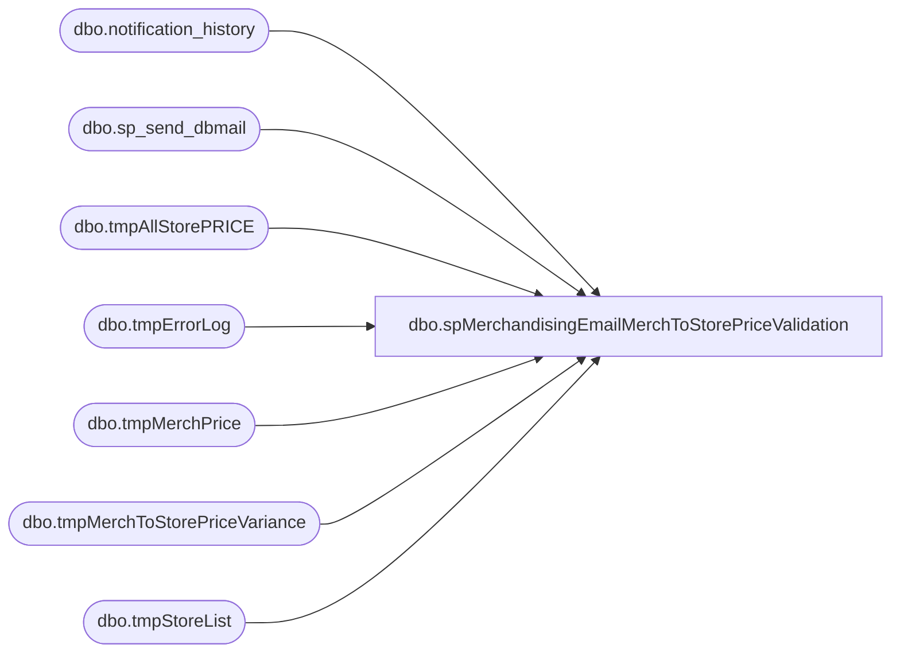

# dbo.spMerchandisingEmailMerchToStorePriceValidation

**Database:** me_01  
**Server:** bedrockdb02  

## Architecture Diagram



## Table Dependencies

| Referenced Table |
|---|
| dbo.notification_history |
| dbo.sp_send_dbmail |
| dbo.tmpAllStorePRICE |
| dbo.tmpErrorLog |
| dbo.tmpMerchPrice |
| dbo.tmpMerchToStorePriceVariance |
| dbo.tmpStoreList |

## Stored Procedure Code

```sql
CREATE proc [dbo].[spMerchandisingEmailMerchToStorePriceValidation]

as

set nocount on

-- =====================================================================================================
-- Name: spMerchandisingEmailMerchToStorePriceValidation
-- Description: An SSIS package runs to compare Merch Prices to every store's Prices. This proc is executed from that SSIS package.
--				 
-- Revision History
--		Name:			Date:			Comments: 
--		Dan Tweedie	    10/14/2015		Created proc.	
--		Dan Tweedie		10/31/2015		Exclude styles where Ownership = NOSEND, as these will not receive updated price from Merch
--		Paul Beckman	10/24/2019		Updated to use notification_history table
-- =====================================================================================================

IF (Object_ID('me_01..tmpMerchToStorePriceVariance') IS NOT NULL) DROP TABLE me_01..tmpMerchToStorePriceVariance
select distinct m.*, s.price, s.promotion_no
into tmpMerchToStorePriceVariance
from tmpMerchPrice m
join tmpAllStorePRICE s on m.location_code = s.location_code
	and m.style_code = s.style
where m.location_code in (select right('0000' + cast(STR_NUM as varchar(4)), 4) from tmpStoreList)
and (m.currentsellingretail <> s.price)
and m.OWNRSP <> 'NOSEND'
order by m.location_code, m.style_code


if (select count(*) from tmpMerchToStorePriceVariance (nolock)) > 0


BEGIN
-----------------------
declare @subj varchar(52),
		@text nvarchar(max),
		@recip varchar(1000),
		@cc varchar(100)


set @subj = 'ALERT - Merch to Store Price Comparison'
set @recip = 'posadmin@buildabear.com'
set @text = 
'<font face =arial size = 2><B>Merch to Store Price Comparison</B><br>' +
'</font>' +
'<br><br>'+
	'<table border="1">' +
		'<tr><th><font face =arial size = 2>LOCATION</font></th>' +
			'<th><font face =arial size = 2>STYLE</font></th>' +
			'<th><font face =arial size = 2>DESCRIPTION</font></th>' +
			'<th><font face =arial size = 2>MERCH PRICE</font></th>' +
			'<th><font face =arial size = 2>STORE PRICE</font></th>' +
			'<th><font face =arial size = 2>STORE PROMOTION</font></th>' +
			'<th><font face =arial size = 2>OWNERSHIP</font></th></tr>' +
'<font face =arial size = 2>' +
    CAST ( ( SELECT td = m.location_code,'',
                    td = m.style_code, '',
					td = m.short_desc, '',
                    td = m.currentsellingretail, '',
					td = m.price, '',
					td = isnull(m.promotion_no, 'NA'), '',
					td = m.OWNRSP, ''
              from tmpMerchToStorePriceVariance m
			   order by m.location_code, m.style_code
              FOR XML PATH('tr'), TYPE 
    ) AS NVARCHAR(MAX) ) +
    '</font></table></font></p></p>
    <br><br>' +
'<font face =arial size = 2><B>Errors logged while connecting to store server to perform validation</B><br>' +
'</font>' +
	'<table border="1">' +
		'<tr><th><font face =arial size = 2>ERRORS</font></th></tr>' +
'<font face =arial size = 2>' +
    CAST ( ( SELECT td = errors,''
              from tmpErrorLog
              FOR XML PATH('tr'), TYPE 
    ) AS NVARCHAR(MAX) ) +
    '</font></table></font></p></p>
    <br><br>' +
	'<font face =arial size = 1><B>This report was run from bedrockdb02.me_01.dbo.spMerchandisingEmailMerchToStorePriceValidation</B></font><br><br>' + 
'<font face =arial size = 1><i>The information in this message may be privileged, “confidential” and protected from disclosure and/or intended only for the addressee(s) named above.  If the reader of this message is not the intended recipient, or an employee or agent responsible for delivering this message to the intended recipient, you are hereby notified that any dissemination, distribution or copying of the communication is strictly prohibited.  If you have received this communication in error, please notify us immediately by replying to the message and deleting it from your computer.  Thank you beary much.</i></font>' 


		exec msdb.dbo.sp_send_dbmail
			@profile_name = 'MerchAdmin',
			@recipients = @recip,
			@body = @text,
			@subject = @subj,
			@body_format = 'HTML'
	
	INSERT INTO notification_history
	(stored_proc_name,
	record_logged_datetime,
	issues_found,
	action_required,
	notification_sent,
	email_type,
	email_to,
	email_cc,
	email_subject,
	comment
	)
	VALUES (
	'spMerchandisingEmailMerchToStorePriceValidation', --<< Stored Proc name
	GETDATE(),
	'Yes', --<< Issues found - Yes / No
	'Yes', --<< Action required - Yes / No
	'Yes', --<< Notification sent - Yes / No
	'Alert', --<< Email type - Notification Only / Alert / Warning
	@recip, --<< Email TO
	NULL, --<< Email CC
	@subj, --<< Email Subject
	'Merchandising To Store Price Validation issues found' --<< Comment
	)
END
```

