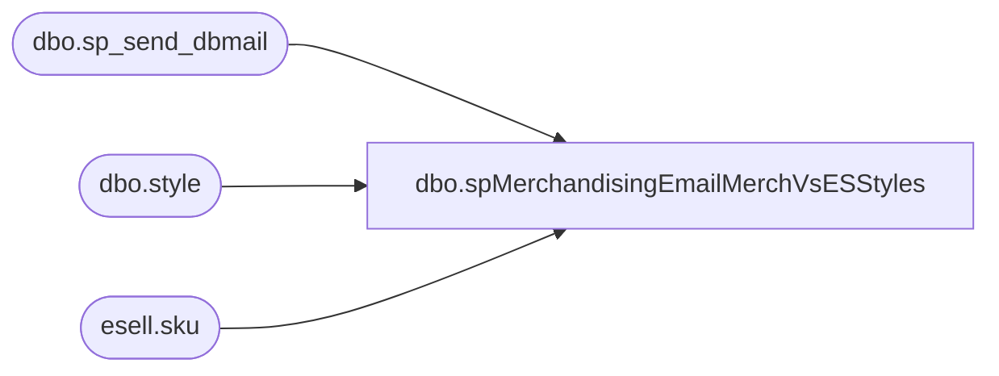

# dbo.spMerchandisingEmailMerchVsESStyles

**Database:** me_01  
**Server:** bedrockdb02  

## Architecture Diagram



## Table Dependencies

| Referenced Table |
|---|
| dbo.sp_send_dbmail |
| dbo.style |
| esell.sku |

## Stored Procedure Code

```sql
CREATE proc [dbo].[spMerchandisingEmailMerchVsESStyles]

as 
-- =============================================================================================================
-- Name: spMerchandisingEmailMerchVsESStyles
--
-- Description:	Identifies and sends email when styles in Merch/MA have Allow Customer Order Flag turned on but 
--				not turned on within ES system.
-- Input:		
--
-- Output: 
--
-- Dependencies: 
--
-- Revision History
--		Name:			Date:			Comments:
--		Keith Lee		09/19/2016		Created Proc
-- =============================================================================================================


set nocount on

if (select count(*)
	from ma_01.dbo.style with (nolock)
	where active_flag = 1 
	and  (style_code between '000000' and '099999' 
	or style_code between '300000' and '399999') 
	and allow_customer_order_flag = 1
	and style_code not in (
						select sk.product_id--,s.short_desc 
						from esell.esell.sku sk with (nolock)
						where search_allowed_cd = 'Y' 
						and (product_id between '000000' and '099999' 
						or product_id between '300000' and '399999')
)) > 0


begin
	
	declare @sql varchar(8000)
	set @SQL= '
		select	style_code,
				short_desc, 
				allow_customer_order_flag, 
				threshold 
		from ma_01.dbo.style with (nolock)
		where active_flag = 1 
		and  (style_code between ''000000'' and ''099999'' 
		or style_code between ''300000'' and ''399999'') 
		and allow_customer_order_flag = 1
		and style_code not in (
					select sk.product_id--,s.short_desc 
					from esell.esell.sku sk with (nolock)
					where search_allowed_cd = ''Y'' 
					and (product_id between ''000000'' and ''099999'' 
					or product_id between ''300000'' and ''399999'')
)
order by 1
		print ''''
		print ''This was run from bedrockdb02.me_01.dbo.spMerchandisingEmailMerchVsESStyles''
		print ''''
		'

	exec msdb.dbo.sp_send_dbmail
	@profile_name = 'merchadmin',
	@recipients = 'EntSysSupport@buildabear.com',
	@body = 'Please be advised. The following in Merch/MA Styles DO NOT Match Enterprise Selling (Allow Customer Order Flag).',
	@subject= 'Merch Styles DO NOT Match Enterprise Selling', 
	@query= @SQL
	--@body_format = 'HTML'
	
end
```

