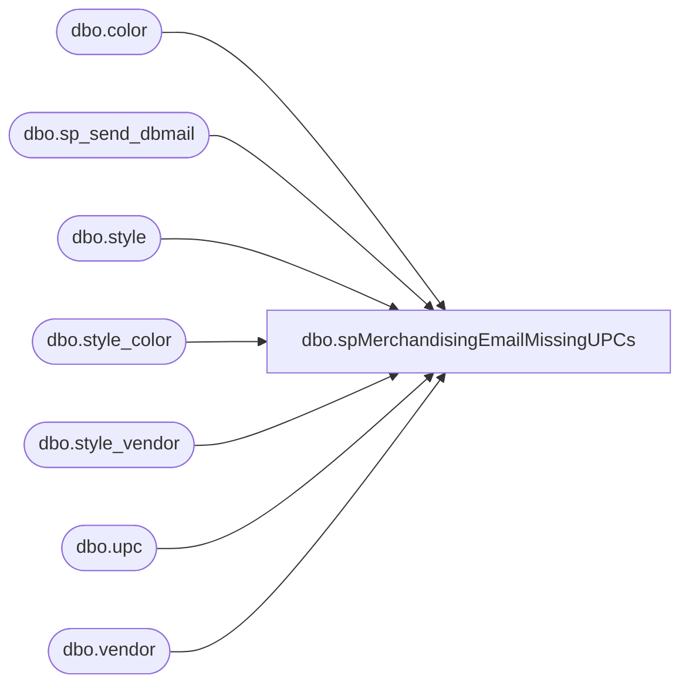

# dbo.spMerchandisingEmailMissingUPCs

**Database:** me_01  
**Server:** bedrockdb02  

## Architecture Diagram



## Table Dependencies

| Referenced Table |
|---|
| dbo.color |
| dbo.sp_send_dbmail |
| dbo.style |
| dbo.style_color |
| dbo.style_vendor |
| dbo.upc |
| dbo.vendor |

## Stored Procedure Code

```sql
CREATE proc [dbo].[spMerchandisingEmailMissingUPCs]

as 
-- =============================================================================================================
-- Name: spMerchandisingEmailMissingUPCs
--
-- Description:	sends email about eligible styles which don't have UPCs assigned.
--
-- Input:		
--
-- Output: 
--
-- Dependencies: 
--
-- Revision History
--		Name:			Date:			Comments:
--		Dan Tweedie		08/22/2012		Created Proc
--		Dan Tweedie		06/11/2013		Added filter to only include Active styles in the results (s.active_flag = 1)
-- =============================================================================================================


set nocount on

if (Select count(*)
	from me_01.dbo.style s WITH (NOLOCK) 
	join me_01.dbo.style_color sc WITH (NOLOCK) on s.style_id = sc.style_id 
	join me_01.dbo.style_vendor sv WITH (NOLOCK) on s.style_id = sv.style_id 
	join me_01.dbo.color c WITH (NOLOCK) on sc.color_id = c.color_id 
	join me_01.dbo.vendor v WITH (NOLOCK) on sv.vendor_id = v.vendor_id 
	where sc.reorder_flag = 1
	and s.active_flag = 1 
	and s.style_code in (select s.style_code from me_01.dbo.style s where not exists 
							(select * from me_01.dbo.upc u where '000000' + s.style_code = u.upc_number))) > 0


begin
	
	declare @sql varchar(8000)
	set @SQL= '
		Select distinct s.style_code, s.short_desc
		from me_01.dbo.style s WITH (NOLOCK) 
		join me_01.dbo.style_color sc WITH (NOLOCK) on s.style_id = sc.style_id 
		join me_01.dbo.style_vendor sv WITH (NOLOCK) on s.style_id = sv.style_id 
		join me_01.dbo.color c WITH (NOLOCK) on sc.color_id = c.color_id 
		join me_01.dbo.vendor v WITH (NOLOCK) on sv.vendor_id = v.vendor_id 
		where sc.reorder_flag = 1 
		and s.active_flag = 1 
		and s.style_code in (select s.style_code from me_01.dbo.style s where not exists 
								(select * from me_01.dbo.upc u where ''000000'' + s.style_code = u.upc_number))
		print ''''
		print ''This was run from bedrockdb02.me_01.dbo.spMerchandisingEmailMissingUPCs''
		print ''''
		'

	exec msdb.dbo.sp_send_dbmail
	@profile_name = 'merchadmin',
	@recipients = 'EntSysSupport@buildabear.com',
	@body = 'Please be advised. The following styles do not have a UPC.',
	@subject= 'Styles missing UPCs', 
	@query= @SQL
	--@body_format = 'HTML'
	
end
```

