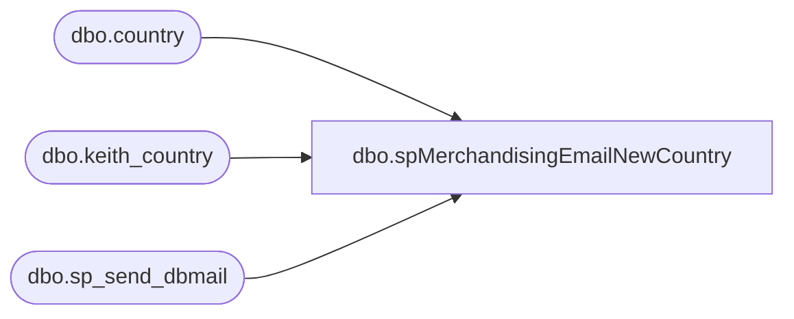

# dbo.spMerchandisingEmailNewCountry

**Database:** me_01  
**Server:** bedrockdb02  

## Architecture Diagram



## Table Dependencies

| Referenced Table |
|---|
| dbo.country |
| dbo.keith_country |
| dbo.sp_send_dbmail |

## Stored Procedure Code

```sql
CREATE proc [dbo].[spMerchandisingEmailNewCountry]
as 
set nocount on 

-- =====================================================================================================
-- Name: spMerchandisingEmailNewCountry
--
-- Description:	Looks for new country records which exist in country table but not in keith_country table, sends email.
--
-- Input:	
--
-- Output: 
--
-- Dependencies:
--
-- Revision History
--		Name:			Date:			Comments:
--		Dan Tweedie		01/19/2011		Created proc.	
-- =====================================================================================================

declare @recip varchar(500),
		@cc varchar(500),
		@subj varchar(100),
		@body varchar(4000),
		@query varchar(4000),
		@total int
		
set @recip = 'jackm@buildabear.com'
set @cc = 'christh@buildabear.com;chuckw@buildabear.com;larryw@buildabear.com;'
set @subj = 'New Countries in Merch'
set @body = 'The following new countries were added to the Merchandising Country table. Please contact EntSysSupport@buildabear.com ASAP to express what the 2 digit country code should be.'
			+ char(10) + char(13)
			
set @query = 'set nocount on select c.country_description Country from me_01.dbo.country c left join me_01.dbo.keith_country kc on c.country_id = kc.country_id where kc.country_id is null'

select @total = count(distinct c.country_description)
				from me_01.dbo.country c 
				left join me_01.dbo.keith_country kc on c.country_id = kc.country_id 
				where kc.country_id is null
if @total > 0

begin

	exec msdb.dbo.sp_send_dbmail
	@profile_name = 'MerchAdmin',
	@recipients = @recip,
	@copy_recipients = @cc,
	@body = @body,
	@subject = @subj,
	@query = @query,
	@query_result_header = 0

end
```

