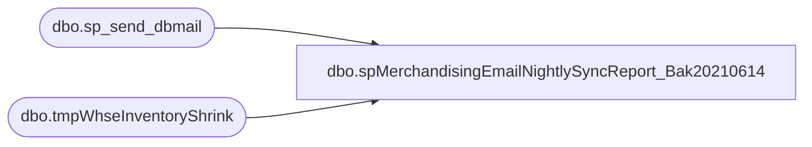

# dbo.spMerchandisingEmailNightlySyncReport_Bak20210614

**Database:** me_01  
**Server:** bedrockdb02  

## Architecture Diagram



## Table Dependencies

| Referenced Table |
|---|
| dbo.sp_send_dbmail |
| dbo.tmpWhseInventoryShrink |

## Stored Procedure Code

```sql
CREATE proc [dbo].[spMerchandisingEmailNightlySyncReport_Bak20210614]
as
-- =====================================================================================================
-- Name: spMerchandisingEmailNightlySyncReport
--
-- Description:	Sends emails to report nightly sync discrepancies between the warehouses and merchandising system.
--
-- Input: N/A
--
-- Output: 
--
-- Dependencies: 
--
-- Revision History
--		Name:			Date:			Comments:
--		Dan Tweedie		04/03/2012		Created proc.	
--		Dan Tweedie		05/20/2015		Altered proc to include 0920 Outlet warehouse
--		Dan Tweedie		03/01/2016		Altered proc to include Shanghai warehouse
--		Tim Callahan	05/10/2016		Altered proc to include BearAP@buildabear.com for All E-mails
--		Tim Callahan	04/04/2018		Altered proc to include sharonp@buildabear.com for all e-mails.
--		Lizzy Timm		04/24/2019		Altered proc to exclude donnar@buildabear.com for all e-mails
--		Keith Lee		05/01/2020		Altered proc to include brysona@buildabear.com for all emails and removed tamib from all emails
--		Juan Peterson   05/04/2020		Altered proc to include sherir@buildabear.com and valeriec@buildabear.com for all emails
--		Lizzy Timm		11/20/2020		Altered proc to include DawnGo@buildabear.com for 0013 and 980 emails
--		Lizzy Timm		01/14/2020		Altered proc to include send emails when there are no 0013 and 0980 discrepancies
-- =====================================================================================================

set nocount on

----output a file for Physical Inventory team, 
begin

	declare @1query varchar(1000),
			@1date varchar(200),
			@1file_name varchar(100),
			@1file_location varchar(100),
			@1server varchar(20),
			@1database varchar(20),
			@1sqlcmd varchar(1000),
			@1query_text varchar(1000),
			@1file varchar(1000),
			@1body varchar(1000),
			@1subj varchar(1000)

			select @1query_text = 'set nocount on select * from tmpWhseInventoryShrink'
			set @1date = convert(varchar, datepart(yyyy, getdate())) + '-' + convert(varchar, datepart(mm, getdate())) + '-' + convert(varchar, datepart(dd, getdate())) 
			set @1query = @1query_text
			set @1file_location = '\\sharebear1\shared\Inventory Reports\TESTING\'  
			set @1file_name = 'NightlySyncs' + @1date + '.csv'
			set @1server = 'bedrockdb02'
			set @1database = 'me_01'
			set @1sqlcmd = 'sqlcmd -S' + @1server + ' -d' + @1database + ' -Q' + '"' + @1query + '"' + ' -o' + '"' + @1file_location + @1file_name + '"' + ' -s"," -w1000 -W'
			exec master..xp_cmdshell @1sqlcmd
end


declare @loc varchar(4),
		@text nvarchar(max),
		@recip varchar(4000),
		@copy varchar(4000),
		@subj varchar(4000)
--/* Start comment out here for PI - Temp web disable 
--0013
-- Updated code, 01/14/20 LT
begin
				
	select @loc = '0013'
	select @recip = 'brysona@buildabear.com;BearAP@buildabear.com;sharonp@buildabear.com;sherir@buildabear.com;valeriec@buildabear.com;DawnGo@buildabear.com'
	select @copy = 'larryw@buildabear.com;dennish@buildabear.com;christh@buildabear.com;bryanw@buildabear.com;candaces@buildabear.com'
	select @subj = 'Nightly Sync Summary for ' + @loc

	if (select count(*) from tmpWhseInventoryShrink where location_code = '0013') > 0
	BEGIN
		set @text = '<font face =arial size = 2>' + 
		'</b><H1>Nightly Sync Summary for ' + @loc + '</H1>' +
			'<table border="1">' +
			'<tr><th>STYLE</th><th>DESCRIPTION</th><th>WHSE QTY</th><th>MERCH QTY</th><th>DIFFERENCE</th></tr>' +
			CAST ( ( SELECT td = style_code,'',
							td = short_desc, '',
							td = whseqty, '',
							td = merchqty, '',
							td = shrinkqty, ''
					  from tmpWhseInventoryShrink
					  where location_code = @loc
					  order by style_code
					  FOR XML PATH('tr'), TYPE 
			) AS NVARCHAR(MAX) ) +
			'</font></table></font></p></p>
			<br>
			<font face =arial size = 1>This report was run from bedrockdb02.me_01.dbo.spMerchandisingEmailNightlySyncReport.</font>
			<br>
			<br>
		<font face =arial size = 1><i>The information in this message may be privileged, “confidential” and protected from disclosure and/or intended only for the addressee(s) named above.  If the reader of this message is not the intended recipient, or an employee or agent responsible for delivering this message to the intended recipient, you are hereby notified that any dissemination, distribution or copying of the communication is strictly prohibited.  If you have received this communication in error, please notify us immediately by replying to the message and deleting it from your computer.  Thank you beary much.</i></font>'
	END

	if (select count(*) from tmpWhseInventoryShrink where location_code = '0013') = 0
	begin
		set @text = 'NO DISCREPANCIES FOUND'
	end

	exec msdb.dbo.sp_send_dbmail
		@profile_name = 'merchadmin',
		@recipients = @recip,
		@copy_recipients = @copy,
		@body = @text,
		@subject = @subj,
		@body_format = 'HTML'

end
--*/ -- End comment out - Temp WEB disable for PI
/* -- OLD LOGIC, REPLACED 01/14/21 LT
if (select count(*) from tmpWhseInventoryShrink where location_code = '0013') > 0
begin
				
	select @loc = '0013'
	select @recip = 'brysona@buildabear.com;merchadmin@buildabear.com;BearAP@buildabear.com;sharonp@buildabear.com;sherir@buildabear.com;valeriec@buildabear.com;DawnGo@buildabear.com'
	select @copy = 'larryw@buildabear.com;dennish@buildabear.com;christh@buildabear.com;bryanw@buildabear.com;candaces@buildabear.com'
	select @subj = 'Nightly Sync Summary for ' + @loc
	
	set @text = '<font face =arial size = 2>' + 
	'</b><H1>Nightly Sync Summary for ' + @loc + '</H1>' +
		'<table border="1">' +
		'<tr><th>STYLE</th><th>DESCRIPTION</th><th>WHSE QTY</th><th>MERCH QTY</th><th>DIFFERENCE</th></tr>' +
		CAST ( ( SELECT td = style_code,'',
						td = short_desc, '',
						td = whseqty, '',
						td = merchqty, '',
						td = shrinkqty, ''
				  from tmpWhseInventoryShrink
				  where location_code = @loc
				  order by style_code
				  FOR XML PATH('tr'), TYPE 
		) AS NVARCHAR(MAX) ) +
		'</font></table></font></p></p>
		<br>
		<font face =arial size = 1>This report was run from bedrockdb02.me_01.dbo.spMerchandisingEmailNightlySyncReport.</font>
		<br>
		<br>
	<font face =arial size = 1><i>The information in this message may be privileged, “confidential” and protected from disclosure and/or intended only for the addressee(s) named above.  If the reader of this message is not the intended recipient, or an employee or agent responsible for delivering this message to the intended recipient, you are hereby notified that any dissemination, distribution or copying of the communication is strictly prohibited.  If you have received this communication in error, please notify us immediately by replying to the message and deleting it from your computer.  Thank you beary much.</i></font>'

if (select count(*) from tmpWhseInventoryShrink where location_code = '0013') = 0
begin
set @text = 'NO DISCREPANCIES FOUND'
end
	exec msdb.dbo.sp_send_dbmail
		@profile_name = 'merchadmin',
		@recipients = @recip,
		@copy_recipients = @copy,
		@body = @text,
		@subject = @subj,
		@body_format = 'HTML'

end
*/ 


--0980 
--/* -- Temp 980 disable for PI
-- Updated code, 01/14/20 LT
begin
		
	select @loc = '0980'
	select @recip = 'brysona@buildabear.com;BearAP@buildabear.com;sharonp@buildabear.com;sherir@buildabear.com;valeriec@buildabear.com;DawnGo@buildabear.com'
	select @copy = 'larryw@buildabear.com;dennish@buildabear.com;MelissaB@buildabear.com;bryanw@buildabear.com;candaces@buildabear.com'
	select @subj = 'Nightly Sync Summary for ' + @loc
	
	if (select count(*) from tmpWhseInventoryShrink where location_code = '0980') > 0
	BEGIN
		set @text = '<font face =arial size = 2>' + 
		'</b><H1>Nightly Sync Summary for ' + @loc + '</H1>' +
			'<table border="1">' +
			'<tr><th>STYLE</th><th>DESCRIPTION</th><th>WHSE QTY</th><th>MERCH QTY</th><th>DIFFERENCE</th><th>CONVERTED (SUPPLIES) SHRINK</th></tr>' +
			CAST ( ( SELECT td = style_code,'',
							td = short_desc, '',
							td = whseqty, '',
							td = merchqty, '',
							td = shrinkqty, '',
							td = shrinkqty_distribution_multiple, ''
					  from tmpWhseInventoryShrink
					  where location_code = @loc
					  order by style_code
					  FOR XML PATH('tr'), TYPE 
			) AS NVARCHAR(MAX) ) +
			'</font></table></font></p></p>
			<br>
			<font face =arial size = 1>This report was run from bedrockdb02.me_01.dbo.spMerchandisingEmailNightlySyncReport.</font>
			<br>
			<br>
		<font face =arial size = 1><i>The information in this message may be privileged, “confidential” and protected from disclosure and/or intended only for the addressee(s) named above.  If the reader of this message is not the intended recipient, or an employee or agent responsible for delivering this message to the intended recipient, you are hereby notified that any dissemination, distribution or copying of the communication is strictly prohibited.  If you have received this communication in error, please notify us immediately by replying to the message and deleting it from your computer.  Thank you beary much.</i></font>'
	END

	if (select count(*) from tmpWhseInventoryShrink where location_code = '0980') = 0
	begin
	set @text = 'NO DISCREPANCIES FOUND'
	end

	exec msdb.dbo.sp_send_dbmail
		@profile_name = 'merchadmin',
		@recipients = @recip,
		@copy_recipients = @copy,
		@body = @text,
		@subject = @subj,
		@body_format = 'HTML'

end
--*/  -- Temp 980 disable for PI

/* -- OLD LOGIC, REPLACED 01/14/21 LT
if (select count(*) from tmpWhseInventoryShrink where location_code = '0980') > 0

begin
		
	select @loc = '0980'
	select @recip = 'brysona@buildabear.com;merchadmin@buildabear.com;BearAP@buildabear.com;sharonp@buildabear.com;sherir@buildabear.com;valeriec@buildabear.com;DawnGo@buildabear.com'
	select @copy = 'larryw@buildabear.com;dennish@buildabear.com;MelissaB@buildabear.com;bryanw@buildabear.com;candaces@buildabear.com'
	select @subj = 'Nightly Sync Summary for ' + @loc
	
	set @text = '<font face =arial size = 2>' + 
	'</b><H1>Nightly Sync Summary for ' + @loc + '</H1>' +
		'<table border="1">' +
		'<tr><th>STYLE</th><th>DESCRIPTION</th><th>WHSE QTY</th><th>MERCH QTY</th><th>DIFFERENCE</th><th>CONVERTED (SUPPLIES) SHRINK</th></tr>' +
		CAST ( ( SELECT td = style_code,'',
						td = short_desc, '',
						td = whseqty, '',
						td = merchqty, '',
						td = shrinkqty, '',
						td = shrinkqty_distribution_multiple, ''
				  from tmpWhseInventoryShrink
				  where location_code = @loc
				  order by style_code
				  FOR XML PATH('tr'), TYPE 
		) AS NVARCHAR(MAX) ) +
		'</font></table></font></p></p>
		<br>
		<font face =arial size = 1>This report was run from bedrockdb02.me_01.dbo.spMerchandisingEmailNightlySyncReport.</font>
		<br>
		<br>
	<font face =arial size = 1><i>The information in this message may be privileged, “confidential” and protected from disclosure and/or intended only for the addressee(s) named above.  If the reader of this message is not the intended recipient, or an employee or agent responsible for delivering this message to the intended recipient, you are hereby notified that any dissemination, distribution or copying of the communication is strictly prohibited.  If you have received this communication in error, please notify us immediately by replying to the message and deleting it from your computer.  Thank you beary much.</i></font>'

if (select count(*) from tmpWhseInventoryShrink where location_code = '0980') = 0
begin
set @text = 'NO DISCREPANCIES FOUND'
end

	exec msdb.dbo.sp_send_dbmail
		@profile_name = 'merchadmin',
		@recipients = @recip,
		@copy_recipients = @copy,
		@body = @text,
		@subject = @subj,
		@body_format = 'HTML'

end
*/


-----------------------------------------------------------------------------------------------------------
--0960
--
--/* -- - Temp 960 disable for PI
begin
			
	select @loc = '0960'
	select @recip = 'BearAP@buildabear.com;sharonp@buildabear.com'
	select @copy = 'wcdclogistics@buildabear.com'
	select @subj = 'Nightly Sync Summary for ' + @loc
	
	set @text = '<font face =arial size = 2>' + 
	'</b><H1>Nightly Sync Summary for ' + @loc + '</H1>' +
		'<table border="1">' +
		'<tr><th>STYLE</th><th>DESCRIPTION</th><th>WHSE QTY</th><th>MERCH QTY</th><th>DIFFERENCE</th><th>CONVERTED (SUPPLIES) SHRINK</th></tr>' +
		CAST ( ( SELECT td = style_code,'',
						td = short_desc, '',
						td = whseqty, '',
						td = merchqty, '',
						td = shrinkqty, '',
						td = shrinkqty_distribution_multiple, ''
				  from tmpWhseInventoryShrink
				  where location_code = @loc
				  order by style_code
				  FOR XML PATH('tr'), TYPE 
		) AS NVARCHAR(MAX) ) +
		'</font></table></font></p></p>
		<br>
		<font face =arial size = 1>This report was run from bedrockdb02.me_01.dbo.spMerchandisingEmailNightlySyncReport.</font>
		<br>
		<br>
	<font face =arial size = 1><i>The information in this message may be privileged, “confidential” and protected from disclosure and/or intended only for the addressee(s) named above.  If the reader of this message is not the intended recipient, or an employee or agent responsible for delivering this message to the intended recipient, you are hereby notified that any dissemination, distribution or copying of the communication is strictly prohibited.  If you have received this communication in error, please notify us immediately by replying to the message and deleting it from your computer.  Thank you beary much.</i></font>'

if (select count(*) from tmpWhseInventoryShrink where location_code = '0960' and style_code = 'n/a') <> 0
begin
set @text = 'NO FILE FOUND'
end

if (select count(*) from tmpWhseInventoryShrink where location_code = '0960' and style_code = 'n/a') = 0
and (select count(*) from tmpWhseInventoryShrink where location_code = '0960') = 0

begin
set @text = 'NO DISCREPANCIES FOUND'
end

	exec msdb.dbo.sp_send_dbmail
		@profile_name = 'merchadmin',
		@recipients = @recip,
		@copy_recipients = @copy,
		@body = @text,
		@subject = @subj,
		@body_format = 'HTML'

end
--*/ -- - Temp 960 disable for PI
-----------------------------------------------------------------------------------------------------------
--2970
--if (select count(*) from tmpWhseInventoryShrink where location_code = '2970') > 0
--/* -- - Temp 2970 disable for PI
begin

	select @loc = '2970'
	select @recip = 'UKLogistics@buildabear.com;BearAP@buildabear.com;sharonp@buildabear.com'
	select @subj = 'Nightly Sync Summary for ' + @loc
	
	set @text = '<font face =arial size = 2>' + 
	'</b><H1>Nightly Sync Summary for ' + '2970' + '</H1>' +
		'<table border="1">' +
		'<tr><th>STYLE</th><th>DESCRIPTION</th><th>WHSE QTY</th><th>MERCH QTY</th><th>DIFFERENCE</th><th>CONVERTED (SUPPLIES) SHRINK</th></tr>' +
		CAST ( ( SELECT td = style_code,'',
						td = short_desc, '',
						td = whseqty, '',
						td = merchqty, '',
						td = shrinkqty, '',
						td = shrinkqty_distribution_multiple, ''
				  from tmpWhseInventoryShrink
				  where location_code = @loc
				  order by style_code
				  FOR XML PATH('tr'), TYPE 
		) AS NVARCHAR(MAX) ) +
		'</font></table></font></p></p>
		<br>
		<font face =arial size = 1>This report was run from bedrockdb02.me_01.dbo.spMerchandisingEmailNightlySyncReport.</font>
		<br>
		<br>
	<font face =arial size = 1><i>The information in this message may be privileged, “confidential” and protected from disclosure and/or intended only for the addressee(s) named above.  If the reader of this message is not the intended recipient, or an employee or agent responsible for delivering this message to the intended recipient, you are hereby notified that any dissemination, distribution or copying of the communication is strictly prohibited.  If you have received this communication in error, please notify us immediately by replying to the message and deleting it from your computer.  Thank you beary much.</i></font>'

if (select count(*) from tmpWhseInventoryShrink where location_code = '2970' and style_code = 'n/a') <> 0
begin
set @text = 'NO FILE FOUND'
end

if (select count(*) from tmpWhseInventoryShrink where location_code = '2970' and style_code = 'n/a') = 0
and (select count(*) from tmpWhseInventoryShrink where location_code = '2970') = 0

begin
set @text = 'NO DISCREPANCIES FOUND'
end

	exec msdb.dbo.sp_send_dbmail
		@profile_name = 'merchadmin',
		@recipients = @recip,
		@copy_recipients = 'merchadmin@buildabear.com',
		@body = @text,
		@subject = @subj,
		@body_format = 'HTML'

end
--*/ -- - Temp 2970 disable for PI
--------------------
--3970

begin

	select @loc = '3970'
	select @recip = 'BearAP@buildabear.com;sharonp@buildabear.com'
	select @subj = 'Nightly Sync Summary for ' + @loc
	
	set @text = '<font face =arial size = 2>' + 
	'</b><H1>Nightly Sync Summary for ' + '3970' + '</H1>' +
		'<table border="1">' +
		'<tr><th>STYLE</th><th>DESCRIPTION</th><th>WHSE QTY</th><th>MERCH QTY</th><th>DIFFERENCE</th><th>CONVERTED (SUPPLIES) SHRINK</th></tr>' +
		CAST ( ( SELECT td = style_code,'',
						td = short_desc, '',
						td = whseqty, '',
						td = merchqty, '',
						td = shrinkqty, '',
						td = shrinkqty_distribution_multiple, ''
				  from tmpWhseInventoryShrink
				  where location_code = @loc
				  order by style_code
				  FOR XML PATH('tr'), TYPE 
		) AS NVARCHAR(MAX) ) +
		'</font></table></font></p></p>
		<br>
		<font face =arial size = 1>This report was run from bedrockdb02.me_01.dbo.spMerchandisingEmailNightlySyncReport.</font>
		<br>
		<br>
	<font face =arial size = 1><i>The information in this message may be privileged, “confidential” and protected from disclosure and/or intended only for the addressee(s) named above.  If the reader of this message is not the intended recipient, or an employee or agent responsible for delivering this message to the intended recipient, you are hereby notified that any dissemination, distribution or copying of the communication is strictly prohibited.  If you have received this communication in error, please notify us immediately by replying to the message and deleting it from your computer.  Thank you beary much.</i></font>'

if (select count(*) from tmpWhseInventoryShrink where location_code = '3970' and style_code = 'n/a') <> 0
begin
set @text = 'NO FILE FOUND'
end

if (select count(*) from tmpWhseInventoryShrink where location_code = '3970' and style_code = 'n/a') = 0
and (select count(*) from tmpWhseInventoryShrink where location_code = '3970') = 0

begin
set @text = 'NO DISCREPANCIES FOUND'
end

	exec msdb.dbo.sp_send_dbmail
		@profile_name = 'merchadmin',
		@recipients = @recip,
		@copy_recipients = 'merchadmin@buildabear.com',
		@body = @text,
		@subject = @subj,
		@body_format = 'HTML'

end

-------------
--------------------
--3980

begin

	select @loc = '3980'
	select @recip = 'BearAP@buildabear.com;sharonp@buildabear.com'
	select @subj = 'Nightly Sync Summary for ' + @loc
	
	set @text = '<font face =arial size = 2>' + 
	'</b><H1>Nightly Sync Summary for ' + '3980' + '</H1>' +
		'<table border="1">' +
		'<tr><th>STYLE</th><th>DESCRIPTION</th><th>WHSE QTY</th><th>MERCH QTY</th><th>DIFFERENCE</th><th>CONVERTED (SUPPLIES) SHRINK</th></tr>' +
		CAST ( ( SELECT td = style_code,'',
						td = short_desc, '',
						td = whseqty, '',
						td = merchqty, '',
						td = shrinkqty, '',
						td = shrinkqty_distribution_multiple, ''
				  from tmpWhseInventoryShrink
				  where location_code = @loc
				  order by style_code
				  FOR XML PATH('tr'), TYPE 
		) AS NVARCHAR(MAX) ) +
		'</font></table></font></p></p>
		<br>
		<font face =arial size = 1>This report was run from bedrockdb02.me_01.dbo.spMerchandisingEmailNightlySyncReport.</font>
		<br>
		<br>
	<font face =arial size = 1><i>The information in this message may be privileged, “confidential” and protected from disclosure and/or intended only for the addressee(s) named above.  If the reader of this message is not the intended recipient, or an employee or agent responsible for delivering this message to the intended recipient, you are hereby notified that any dissemination, distribution or copying of the communication is strictly prohibited.  If you have received this communication in error, please notify us immediately by replying to the message and deleting it from your computer.  Thank you beary much.</i></font>'

if (select count(*) from tmpWhseInventoryShrink where location_code = '3980' and style_code = 'n/a') <> 0
begin
set @text = 'NO FILE FOUND'
end

if (select count(*) from tmpWhseInventoryShrink where location_code = '3980' and style_code = 'n/a') = 0
and (select count(*) from tmpWhseInventoryShrink where location_code = '3980') = 0

begin
set @text = 'NO DISCREPANCIES FOUND'
end

	exec msdb.dbo.sp_send_dbmail
		@profile_name = 'merchadmin',
		@recipients = @recip,
		@copy_recipients = 'merchadmin@buildabear.com',
		@body = @text,
		@subject = @subj,
		@body_format = 'HTML'

end
```

