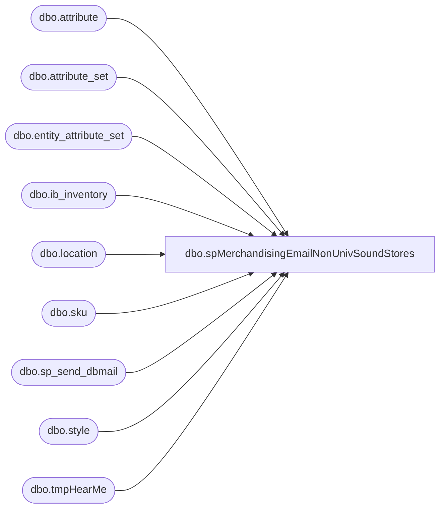

# dbo.spMerchandisingEmailNonUnivSoundStores

**Database:** me_01  
**Server:** bedrockdb02  

## Architecture Diagram



## Table Dependencies

| Referenced Table |
|---|
| dbo.attribute |
| dbo.attribute_set |
| dbo.entity_attribute_set |
| dbo.ib_inventory |
| dbo.location |
| dbo.sku |
| dbo.sp_send_dbmail |
| dbo.style |
| dbo.tmpHearMe |

## Stored Procedure Code

```sql
CREATE proc [dbo].[spMerchandisingEmailNonUnivSoundStores]
as
-- =====================================================================================================
-- Name: spMerchandisingEmailNonUnivSoundStores
--
-- Description:	Sends emails to report stores without UNIVSO location attribute, which are selling MSOUND skus
--
-- Input: N/A
--
-- Output: 
--
-- Dependencies: 
--
-- Revision History
--		Name:			Date:			Comments:
--		Dan Tweedie		07/30/2012		Created proc.	
-- =====================================================================================================
set nocount on


IF (Object_ID('tempdb..#univso') IS NOT NULL) DROP TABLE #univso
select l.location_code
into #univso
from location l (nolock)
join entity_attribute_set eas_m (nolock) on l.location_id = eas_m.parent_id
join attribute_set ats_m (nolock) on eas_m.attribute_set_id = ats_m.attribute_set_id
join attribute a_m (nolock) on eas_m.attribute_id = a_m.attribute_id
where a_m.attribute_code = 'UNIVSO'
order by l.location_code


IF (Object_ID('me_01..tmpHearMe') IS NOT NULL) DROP TABLE tmpHearMe
select  l.location_code,
		ii.transaction_date,
		s.style_code,
		s.short_desc,
		sum(ii.transaction_units) units
into tmpHearMe
from	ib_inventory ii (nolock)
inner join sku sk (nolock) on ii.sku_id = sk.sku_id
inner join style s (nolock) on sk.style_id = s.style_id
inner join location l (nolock) on ii.location_id = l.location_id
inner join entity_attribute_set eas_m (nolock) on s.style_id = eas_m.parent_id
inner join attribute_set ats_m (nolock) on eas_m.attribute_set_id = ats_m.attribute_set_id
inner join attribute a_m (nolock) on eas_m.attribute_id = a_m.attribute_id
where   a_m.attribute_code = 'MSOUND'
and		ii.transaction_type_code in (600,601,603,605,610,615)
--and		ii.ib_inventory_id > (select ib_inventory_id from ib_inventory_id_hearme)
and datediff(dd, ii.transaction_date, getdate()) <= 1
and l.location_code not in (select location_code from #univso)
group by l.location_code,ii.transaction_date,s.style_code,s.short_desc
having sum(ii.transaction_units) <> 0 
order by ii.transaction_date, l.location_code, s.style_code

if (select count(*) from tmpHearMe) > 0

begin

	declare @text nvarchar(max)

	set @text = '<font face =arial size = 2>' + 
		'<b>This email is to inform you that the Universal Sound sku was recently sold at a store not designated to sell the sku.<br>' +
		'This is determined by the UNIVSO attribute on the location, and the MSOUND attribute on the style.<br>' +
		'In this case, the location(s) below do not have the UNIVSO attribute, but have sold style(s) with the MSOUND attribute.</b><br><br>' +
			'<table border="1">' +
			'<tr><th>LOCATION</th><th>TRANSACTION DATE</th><th>STYLE</th><th>DESCRIPTION</th><th>UNITS</th></tr>' +
			CAST ( ( SELECT td = location_code,'',
							td = transaction_date, '',
							td = style_code, '',
							td = short_desc, '',
							td = units, ''
					  from	tmpHearMe
					  order by location_code
					  FOR XML PATH('tr'), TYPE 
			) AS NVARCHAR(MAX) ) +
			'</font></table></font></p></p>
			<br>
			<font face =arial size = 1>This report was run from bedrockdb02.me_01.dbo.spMerchandisingEmailNonUnivSoundStores.</font>
			<br>
			<br>
		<font face =arial size = 1><i>The information in this message may be privileged, “confidential” and protected from disclosure and/or intended only for the addressee(s) named above.  If the reader of this message is not the intended recipient, or an employee or agent responsible for delivering this message to the intended recipient, you are hereby notified that any dissemination, distribution or copying of the communication is strictly prohibited.  If you have received this communication in error, please notify us immediately by replying to the message and deleting it from your computer.  Thank you beary much.</i></font>'


		exec msdb.dbo.sp_send_dbmail
			@profile_name = 'merchadmin',
			@recipients = 'distrobears@buildabear.com;physicalinventory@buildabear.com',
			--@copy_recipients = 'EntSysSupport@buildabear.com',
			@body = @text,
			@subject = 'Universal Sound Sold at Non *UNIVSO* Location',
			@body_format = 'HTML'

end
```

