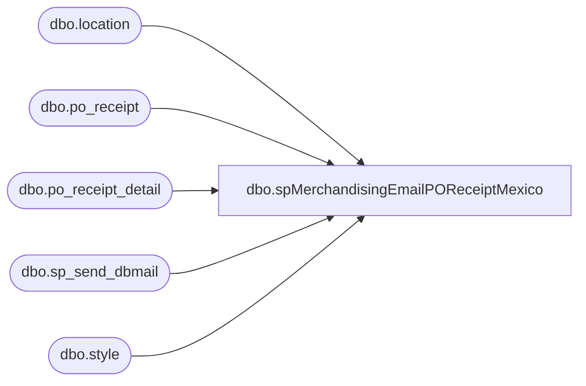

# dbo.spMerchandisingEmailPOReceiptMexico

**Database:** me_01  
**Server:** bedrockdb02  

## Architecture Diagram



## Table Dependencies

| Referenced Table |
|---|
| dbo.location |
| dbo.po_receipt |
| dbo.po_receipt_detail |
| dbo.sp_send_dbmail |
| dbo.style |

## Stored Procedure Code

```sql
CREATE procedure [dbo].[spMerchandisingEmailPOReceiptMexico]
as
set nocount on
-- =====================================================================================================
-- Name: spMerchandisingEmailPOReceiptMexico
--
-- Description: Emails Notification to Users that a PO receipt has occurred at location 0980 for Mexico 
--				Styles which is determined by the style code beginning '9'.
--				 
-- Revision History
--		Name:			Date:			Comments: 
--		Keith Lee		01/18/2017		Created proc.
--		Tim Callahan	01/24/2017		Modified Proc to CC MerchAdmin rather than To line, also corrected technical details from kermode to bedrockdb02
-- =====================================================================================================


if (select	count(*)
	from	po_receipt pr
	join	po_receipt_detail prd on pr.po_receipt_id = prd.po_receipt_id
	join	style s on prd.style_id = s.style_id
	join	location l on pr.location_id = l.location_id
	where	left(s.style_code,1) = '9'
	and		l.location_code = '0980'
	and		convert(varchar, pr.receive_date, 101) = convert(varchar, getdate(), 101)
) > 0

	
BEGIN 
             
			EXEC   msdb.dbo.sp_send_dbmail
					@profile_name = 'MerchAdmin',
					@recipients = 'physicalinventory@buildabear.com;JuliaValencia@buildabear.com;chuckw@buildabear.com',
					--@copy_recipients = 'EntSysSupport@buildabear.com',
					@body = 'The BearHouse (location 0980) has received Mexico inventory today.  Please send an invoice to the Mexico franchise.


Technical Details:
Bedrockdb02 SQL Agent - MERCHANDISING - Email - PO Receipt Mexico',
					@subject = 'ACTION REQUIRED: PO Receipt for Mexico Franchise'
	
END
```

