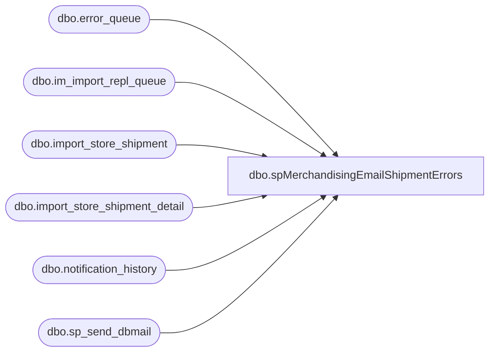

# dbo.spMerchandisingEmailShipmentErrors

**Database:** me_01  
**Server:** bedrockdb02  

## Architecture Diagram



## Table Dependencies

| Referenced Table |
|---|
| dbo.error_queue |
| dbo.im_import_repl_queue |
| dbo.import_store_shipment |
| dbo.import_store_shipment_detail |
| dbo.notification_history |
| dbo.sp_send_dbmail |

## Stored Procedure Code

```sql
CREATE proc [dbo].[spMerchandisingEmailShipmentErrors]
as

-- =====================================================================================================
-- Name: spMerchandisingEmailShipmentErrors
--
-- Description:	Sends email/sms text alert if errors are logged in pipeline error queue for store shipments
--
-- Input:	NA
--
-- Output: 			
--
-- Dependencies: 
--
-- Revision History
--		Name:			Date:			Comments:
--		Dan Tweedie		11/26/2012		Created proc.
--		Paul Beckman	02/24/2020		Updated to not run on Weekends
--		Paul Beckman	02/24/2020		Updated email message and recipient based on record count
--		Lizzy Timm		08/20/2021		Added Sean W. to email
--		
-- =====================================================================================================


IF (SELECT CAST(LEFT(DATENAME(dw,DATEADD(DAY,-0,GETDATE())),3) AS VARCHAR(3))) IN ('Sat','Sun')
GOTO FINISH

--####################################

--Pipeline Errors -- if there is an error during the posting to the production tables, it is written in the error table
IF (Object_ID('tempdb..##sh_errors') IS NOT NULL) DROP TABLE ##sh_errors
SELECT DISTINCT CONVERT(VARCHAR(11), iss.ship_date, 101) AS ship_date,
	   iss.from_location_code from_location,
	   iss.location_code to_location,
	   iss.document_no shipment,
	   substring(eq.error,166,CHARINDEX('.', substring(eq.error,167,500),1)+1) error_msg,
	   iss.imp_file_name
INTO ##sh_errors
FROM import_store_shipment iss (NOLOCK)
JOIN import_store_shipment_detail issd (NOLOCK) ON iss.import_store_shipment_id = issd.import_store_shipment_id
JOIN im_import_repl_queue iirq (NOLOCK) ON iirq.entity_id = iss.import_store_shipment_id AND iirq.entity_code = 70
JOIN pipeapp01.PipelineRepository.dbo.error_queue eq ON iirq.im_import_repl_queue_id = eq.sequence_id 
WHERE iirq.entity_id IN (SELECT SUBSTRING(entity_key,1,CHARINDEX('~', SUBSTRING(entity_key,1,30),1)-1)
							FROM pipeapp01.PipelineRepository.dbo.error_queue
							WHERE segment_id = 19000 AND entity_code = 70)

--####################################

DECLARE @recipients VARCHAR(8000),
		@alertrecipients VARCHAR(8000),
		@Subject VARCHAR(80),
		@query VARCHAR(8000),
		@text NVARCHAR(MAX)

--####################################

IF (SELECT COUNT(*) FROM ##sh_errors) = 0
BEGIN

	INSERT INTO notification_history
	(stored_proc_name,
	record_logged_datetime,
	issues_found,
	action_required,
	notification_sent,
	email_type,
	email_to,
	email_cc,
	email_subject,
	comment
	)
	VALUES (
	'spMerchandisingEmailShipmentErrors', --<< Stored Proc name
	GETDATE(),
	'No', --<< Issues found - Yes / No
	'No', --<< Action required - Yes / No
	'No', --<< Notification sent - Yes / No
	NULL, --<< Email type - Notification Only / Alert / Warning
	NULL, --<< Email TO
	NULL, --<< Email CC
	NULL, --<< Email Subject
	'No Store Shipment Errors found' --<< Comment
	)

END

--####################################

IF (SELECT COUNT(*) FROM ##sh_errors) BETWEEN 1 AND 5
BEGIN

SET @Subject = 'ALERT - ' + CONVERT(VARCHAR(4),(SELECT COUNT(*) FROM ##sh_errors)) + ' Store Shipment Errors'
SET @recipients = 'EntSysSupport@buildabear.com;SeanW@buildabear.com'
SET @text = 
		'<font face =arial size = 2>' +
		'Bad information in a store shipment file caused pipeline segment 19000 errors.  These errors generally result from duplicate information (e.g. a single carton is associated with multiple shipments and multiple stores or a shipment number already exists in Merchandising). <br>' +
		'<br>' +
		'The Store Shipments listed below need to be corrected. <br>' +
		'<a href="https://build-a-bear.atlassian.net/wiki/spaces/ES/pages/306085897/Store+Shipment+Error">Click here for the Confluence knowlede document</a><br>' +
		'<br>' +
		'<table border="1">' + 
		'<font face =arial size = 2>' +
		'<tr bgcolor=#D5D5F7><th>Ship Date</th><th>WHSE</th><th>Store</th><th>Shipment</th><th>Error Message</th><th>Import File</th></tr>' +
		CAST ( ( SELECT td = ship_date,'',
                    td = from_location, '',
                    td = to_location, '',
                    td = shipment, '',
                    td = error_msg, '',
                    td = imp_file_name, ''
              FROM ##sh_errors
				ORDER BY imp_file_name, from_location, shipment
              FOR XML PATH('tr'), TYPE 
		) AS NVARCHAR(MAX) ) +
		'</table>' +
		'<br>' +
		'Store shipment files found in "\\pipeapp01\Company01\Text File to IM Import Tables - Import Store Shipment" <br>' +
		'<font face =arial size = 1 color="#C0C0C0">' +
		'<br><br><br><br>' +
		'Server:  BEDROCKDB02 <br>' +
		'Job Name:  MERCHANDISING - Email - Store Shipment Error <br>' +
		'Stored Proc:  BEDROCKDB02.me_01.dbo.spMerchandisingEmailShipmentErrors. <br>' +
		'Created by:  Paul Beckman <br>' +
		'Team Ownership:  Enterprise Systems <br>' +
		'<br><br>' +
		'<font face =arial size = 1><i>The information in this message may be privileged, “confidential” and protected from disclosure and/or intended only for the addressee(s) named above.  If the reader of this message is not the intended recipient, or an employee or agent responsible for delivering this message to the intended recipient, you are hereby notified that any dissemination, distribution or copying of the communication is strictly prohibited.  If you have received this communication in error, please notify us immediately by replying to the message and deleting it from your computer.  Thank you beary much.</i></font>'

		exec msdb.dbo.sp_send_dbmail
			@profile_name = 'EntSysSupport',
			@recipients = @recipients,
			@body = @text,
			@subject = @Subject,
			@body_format = 'HTML'

	INSERT INTO notification_history
	(stored_proc_name,
	record_logged_datetime,
	issues_found,
	action_required,
	notification_sent,
	email_type,
	email_to,
	email_cc,
	email_subject,
	comment
	)
	VALUES (
	'spMerchandisingEmailShipmentErrors', --<< Stored Proc name
	GETDATE(),
	'Yes', --<< Issues found - Yes / No
	'Yes', --<< Action required - Yes / No
	'Yes', --<< Notification sent - Yes / No
	'Alert', --<< Email type - Notification Only / Alert / Warning
	@recipients, --<< Email TO
	NULL, --<< Email CC
	@Subject, --<< Email Subject
	CONVERT(VARCHAR(4),(SELECT COUNT(*) FROM ##sh_errors)) + ' Store Shipment Errors found' --<< Comment
	)

END

--####################################

IF (SELECT COUNT(*) FROM ##sh_errors) > 5
BEGIN

SET @Subject = 'WARNING - ' + CONVERT(VARCHAR(4),(SELECT COUNT(*) FROM ##sh_errors)) + ' Store Shipment Errors'
SET @recipients = 'EnterpriseSystemsAlerts@buildabear.com'
SET @text = 
		'<font face =arial size = 2>' +
		'Bad information in a store shipment file caused pipeline segment 19000 errors.  These errors generally result from duplicate information (e.g. a single carton is associated with multiple shipments and multiple stores or a shipment number already exists in Merchandising). <br>' +
		'The Store Shipments listed below need to be corrected. <br>' +
		'<a href="https://build-a-bear.atlassian.net/wiki/spaces/ES/pages/306085897/Store+Shipment+Error">Click here for the Confluence knowlede document</a><br>' +
		'<br>' +
		'<table border="1">' + 
		'<font face =arial size = 2>' +
		'<tr bgcolor=#D5D5F7><th>Ship Date</th><th>WHSE</th><th>Store</th><th>Shipment</th><th>Error Message</th><th>Import File</th></tr>' +
		CAST ( ( SELECT td = ship_date,'',
                    td = from_location, '',
                    td = to_location, '',
                    td = shipment, '',
                    td = error_msg, '',
                    td = imp_file_name, ''
              FROM ##sh_errors
				ORDER BY imp_file_name, from_location, shipment
              FOR XML PATH('tr'), TYPE 
		) AS NVARCHAR(MAX) ) +
		'</table>' +
		'<br>' +
		'Store shipment files found in "\\pipeapp01\Company01\Text File to IM Import Tables - Import Store Shipment" <br>' +
		'<font face =arial size = 1 color="#C0C0C0">' +
		'<br><br><br><br>' +
		'Server:  BEDROCKDB02 <br>' +
		'Job Name:  MERCHANDISING - Email - Store Shipment Error <br>' +
		'Stored Proc:  BEDROCKDB02.me_01.dbo.spMerchandisingEmailShipmentErrors. <br>' +
		'Created by:  Paul Beckman <br>' +
		'Team Ownership:  Enterprise Systems <br>' +
		'<br><br>' +
		'<font face =arial size = 1><i>The information in this message may be privileged, “confidential” and protected from disclosure and/or intended only for the addressee(s) named above.  If the reader of this message is not the intended recipient, or an employee or agent responsible for delivering this message to the intended recipient, you are hereby notified that any dissemination, distribution or copying of the communication is strictly prohibited.  If you have received this communication in error, please notify us immediately by replying to the message and deleting it from your computer.  Thank you beary much.</i></font>'

		exec msdb.dbo.sp_send_dbmail
			@profile_name = 'EntSysSupport',
			@recipients = @recipients,
			@body = @text,
			@subject = @Subject,
			@body_format = 'HTML'

	INSERT INTO notification_history
	(stored_proc_name,
	record_logged_datetime,
	issues_found,
	action_required,
	notification_sent,
	email_type,
	email_to,
	email_cc,
	email_subject,
	comment
	)
	VALUES (
	'spMerchandisingEmailShipmentErrors', --<< Stored Proc name
	GETDATE(),
	'Yes', --<< Issues found - Yes / No
	'Yes', --<< Action required - Yes / No
	'Yes', --<< Notification sent - Yes / No
	'Warning', --<< Email type - Notification Only / Alert / Warning
	@recipients, --<< Email TO
	NULL, --<< Email CC
	@Subject, --<< Email Subject
	CONVERT(VARCHAR(4),(SELECT COUNT(*) FROM ##sh_errors)) + ' Store Shipment Errors found' --<< Comment
	)

END


--####################################
FINISH:
--####################################
IF (Object_ID('tempdb..##sh_errors') IS NOT NULL) DROP TABLE ##sh_errors
```

