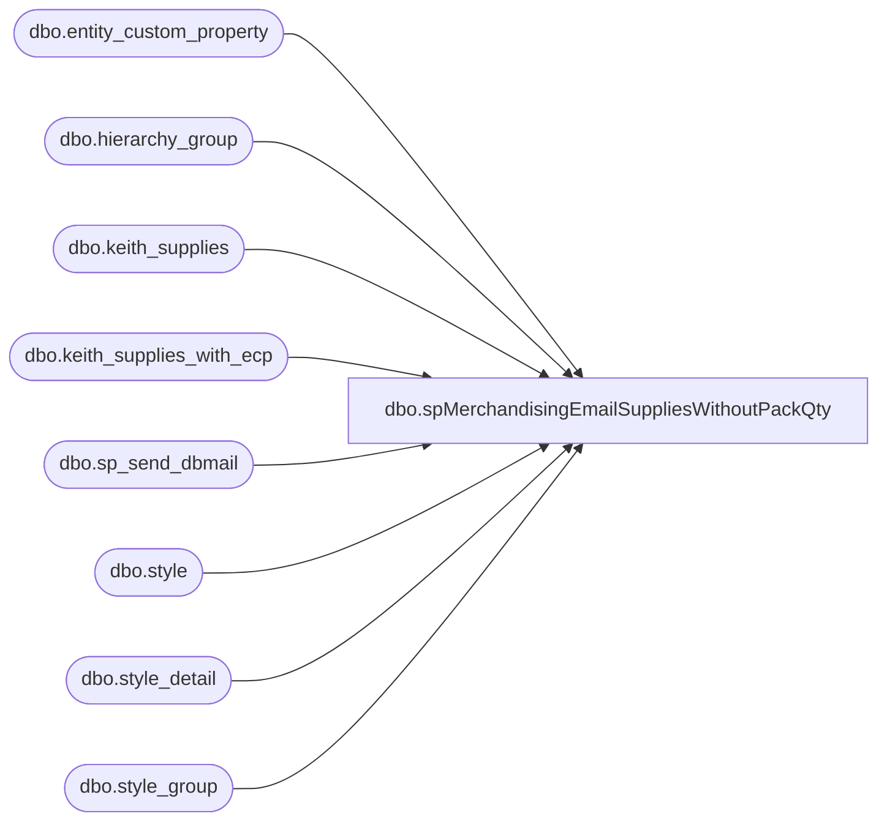

# dbo.spMerchandisingEmailSuppliesWithoutPackQty

**Database:** me_01  
**Server:** bedrockdb02  

## Architecture Diagram



## Table Dependencies

| Referenced Table |
|---|
| dbo.entity_custom_property |
| dbo.hierarchy_group |
| dbo.keith_supplies |
| dbo.keith_supplies_with_ecp |
| dbo.sp_send_dbmail |
| dbo.style |
| dbo.style_detail |
| dbo.style_group |

## Stored Procedure Code

```sql
CREATE proc [dbo].[spMerchandisingEmailSuppliesWithoutPackQty]
as 

-- =====================================================================================================
-- Name: spMerchandisingEmailSuppliesWithoutPackQty
--
-- Description:	Reports styles in Merch which do not have a standard pack qty defined, emails purchasing team members
--				
--
-- Input:	
--
-- Output: email
--
-- Dependencies: NA
--				 
-- Revision History
--		Name:			Date:			Comments:
--		Dan Tweedie		03/08/2012		created proc
-- =====================================================================================================


set nocount on

truncate table keith_supplies
truncate table keith_supplies_with_ecp


insert into	keith_supplies
select s.style_code as STYLE
from style s (nolock)
join style_detail sd (nolock) on sd.style_id = s.style_id
join style_group sg (nolock) on s.style_id = sg.style_id
join hierarchy_group hg (nolock) on sg.hierarchy_group_id = hg.hierarchy_group_id
where substring(hg.hierarchy_group_code,7,2)='60'
order by s.style_code

insert into	keith_supplies_with_ecp
select s.style_code as STYLE
from style s (nolock)
join style_detail sd (nolock) on s.style_id = sd.style_id
join style_group sg (nolock) on s.style_id = sg.style_id
join hierarchy_group hg (nolock) on sg.hierarchy_group_id = hg.hierarchy_group_id
join entity_custom_property ecp (nolock) on s.style_id = ecp.parent_id
	and	custom_property_id = 2
	and	parent_type = 1
where substring(hg.hierarchy_group_code,7,2)='60'
order by s.style_code


if (select count(*)
	from keith_supplies ks (nolock)
	join style s (nolock) on ks.STYLE = s.style_code
	where STYLE not in (select * from keith_supplies_with_ecp)) > 0
	
BEGIN

declare @text nvarchar(max),
		@subj varchar(100),
		@recip varchar(1000)

select @recip = 'karid@buildabear.com;tracyf@buildabear.com'
select @subj = 'Supplies without STD PACK QTY'

set @text = '
<font face =arial><H1>Supplies without STD PACK QTY</H1>' +
    '<table border="1">' +
    '<tr><th>STYLE</th><th>DESCRIPTION</th></tr>' +
    '<font face =arial size = 2>' +
    CAST ( ( SELECT td = s.style_code,'',
                    td = s.short_desc, ''
             from keith_supplies ks
             join style s (nolock) on ks.STYLE = s.style_code
             where STYLE not in (select * from keith_supplies_with_ecp)
             order by style
              FOR XML PATH('tr'), TYPE 
    ) AS NVARCHAR(MAX) ) +
    '</font></table></font></p></p>
    <br>
    <font face =arial size = 1>This report was run from bedrockdb02.me_01.dbo.spMerchandisingEmailSuppliesWithoutPackQty</font>
    <br>
    <br>
<font face =arial size = 1><i>The information in this message may be privileged, “confidential” and protected from disclosure and/or intended only for the addressee(s) named above.  If the reader of this message is not the intended recipient, or an employee or agent responsible for delivering this message to the intended recipient, you are hereby notified that any dissemination, distribution or copying of the communication is strictly prohibited.  If you have received this communication in error, please notify us immediately by replying to the message and deleting it from your computer.  Thank you beary much.</i></font>'


exec msdb.dbo.sp_send_dbmail
@profile_name = 'MerchAdmin',
@recipients = @recip,
@body = @text,
@subject = @subj,
@body_format = 'HTML'
	
END
```

