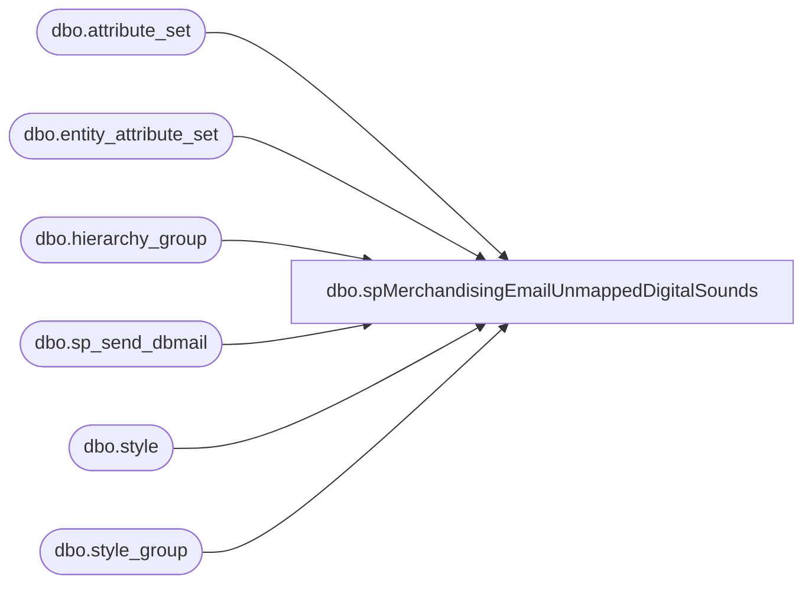

# dbo.spMerchandisingEmailUnmappedDigitalSounds

**Database:** me_01  
**Server:** bedrockdb02  

## Architecture Diagram



## Table Dependencies

| Referenced Table |
|---|
| dbo.attribute_set |
| dbo.entity_attribute_set |
| dbo.hierarchy_group |
| dbo.sp_send_dbmail |
| dbo.style |
| dbo.style_group |

## Stored Procedure Code

```sql
CREATE proc [dbo].[spMerchandisingEmailUnmappedDigitalSounds]

as 
-- =============================================================================================================
-- Name: spMerchandisingEmailUnmappedDigitalSounds
--
-- Description:	sends email for digital sounds not unmapped to an MSOUND attribute
--
-- Input:		
--
-- Output: 
--
-- Dependencies: 
--
-- Revision History
--		Name:			Date:			Comments:
--		Keith Lee		01/31/2017		Created Proc
-- =============================================================================================================


set nocount on

if (Select count(*)
	from	me_01.dbo.style s
	join	me_01.dbo.style_group sg on s.style_id = sg.style_id
	join	me_01.dbo.hierarchy_group hg on sg.hierarchy_group_id = hg.hierarchy_group_id
	left join	me_01.dbo.entity_attribute_set eas on s.style_id = eas.parent_id  and eas.parent_type = 1 and eas.attribute_id = 448
	left join	me_01.dbo.attribute_set ats on eas.attribute_set_id = ats.attribute_set_id
	where	substring(hg.hierarchy_group_code, 7,5) = '12-01'
	and		s.style_code not between '900000' and '999999'
	and		left(s.short_desc,3) = 'UNV'
	and		ats.attribute_set_code is NULL
	) > 0


begin
	
	declare @sql varchar(8000)
	set @SQL= '
		select	s.style_code,
		s.short_desc,
		hg.hierarchy_group_code,
		ats.attribute_set_code
		from	me_01.dbo.style s
		join	me_01.dbo.style_group sg on s.style_id = sg.style_id
		join	me_01.dbo.hierarchy_group hg on sg.hierarchy_group_id = hg.hierarchy_group_id
		left join	me_01.dbo.entity_attribute_set eas on s.style_id = eas.parent_id  and eas.parent_type = 1 and eas.attribute_id = 448
		left join	me_01.dbo.attribute_set ats on eas.attribute_set_id = ats.attribute_set_id
		where	substring(hg.hierarchy_group_code, 7,5) = ''12-01''
		and		left(s.short_desc,3) = ''UNV''
		and		ats.attribute_set_code is NULL
		and		s.style_code not between ''900000'' and ''999999''
		order by 1
		print ''''
		print ''This was run from bedrockdb02.me_01.dbo.spMerchandisingEmailUnmappedDigitalSounds''
		print ''''
		'

	exec msdb.dbo.sp_send_dbmail
	@profile_name = 'merchadmin',
	@recipients = 'shelih@buildabear.com;markd@buildabear.com',
	@body = 'Please be advised, the following digital styles are not to mapped to the style attribute MSOUND:',
	@subject= 'Unmapped Digital Styles', 
	@query= @SQL
	--@body_format = 'HTML'
	
end
```

