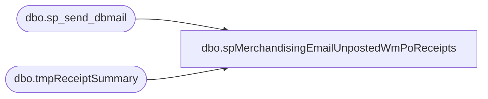

# dbo.spMerchandisingEmailUnpostedWmPoReceipts

**Database:** me_01  
**Server:** bedrockdb02  

## Architecture Diagram



## Table Dependencies

| Referenced Table |
|---|
| dbo.sp_send_dbmail |
| dbo.tmpReceiptSummary |

## Stored Procedure Code

```sql
CREATE proc [dbo].[spMerchandisingEmailUnpostedWmPoReceipts]
as

-- =====================================================================================================
-- Name: spMerchandisingEmailUnpostedWmPoReceipts
--
-- Description:	Sends email for data captured from WM to show unposted PO receipts
-----the original proc runs in WM and is more efficient, but I had to put the email script on me_01 for usability
-- Input:	n/a
--
-- Output: email
--
-- Dependencies: Is called from wmdb01.wmprod.dbo.spWMselectPOreceiptsUnposted, otherwise there is no data to email
--
-- Revision History
--		Name:			Date:			Comments:
--		Dan Tweedie		5/22/2012		Created proc.	
-- =====================================================================================================

set nocount on


declare @text nvarchar(max)


set @text = '
<font face =arial size = 2> '  +
	'</b><H1>Unposted Bearhouse PO Receipts</H1>' +
    '<table border="1">' +
    '<tr><th>PO</th><th>ASN</th>' +
    '<th>STYLE</th><th>UNITS RCVD</th><th>IMPORTED</th><th>POSTED</th>'+
    '<th>IMPORT DIFF</th><th>POST DIFF</th><th>POST ERROR</th></tr>' +
    CAST ( ( SELECT td = po,'',
                    td = asn, '',
                    td = style, '',
                    td = units_rcvd, '',
                    td = units_imported, '',
                    td = units_posted, '',
                    td = wm_import_diff, '',
                    td = wm_post_diff, '',
                    td = error_msg, ''
              from wmdb01.wmprod.dbo.tmpReceiptSummary order by po, asn, style
              FOR XML PATH('tr'), TYPE 
    ) AS NVARCHAR(MAX) ) +
    '</font></table></font></p></p><br>'
    
   
exec msdb.dbo.sp_send_dbmail
	@profile_name = 'merchadmin',
    @recipients = 'EnterpriseSystemsAlerts@buildabear.com;',
    @body = @text,
	@subject = 'Bearhouse PO Receipts - PROBLEM',
	@body_format = 'HTML'
```

