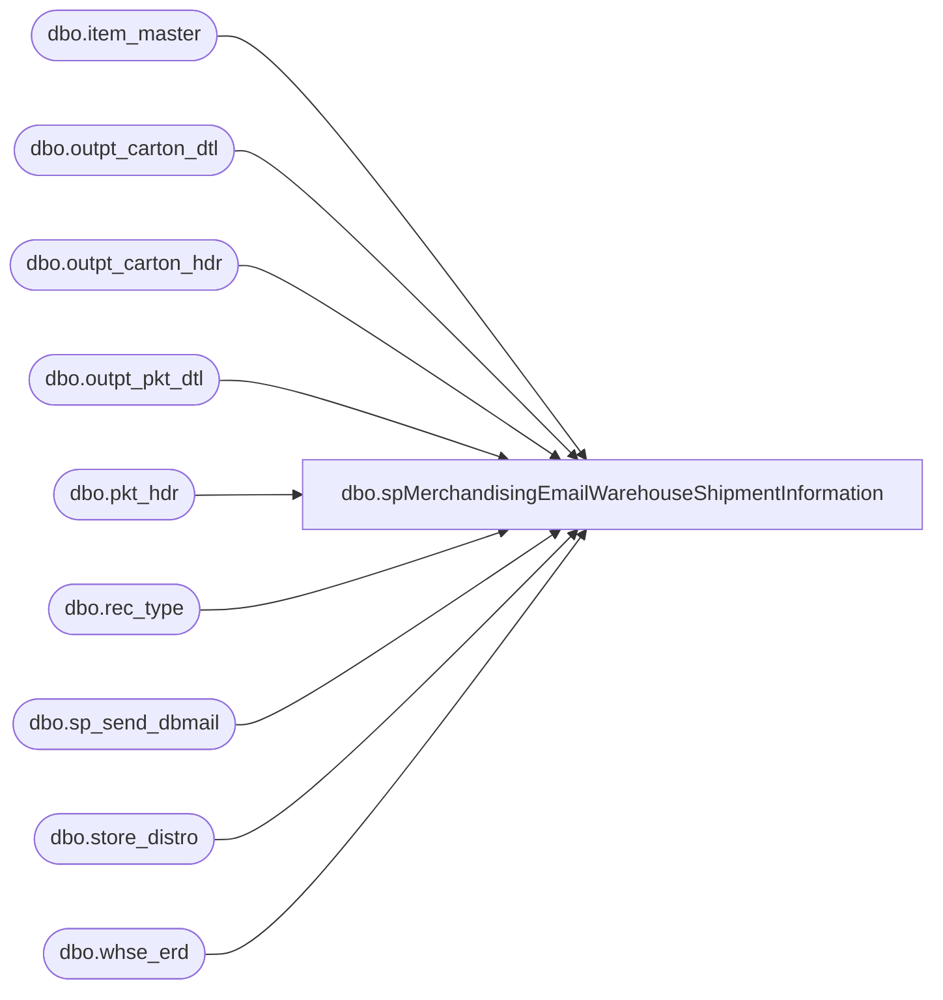

# dbo.spMerchandisingEmailWarehouseShipmentInformation

**Database:** me_01  
**Server:** bedrockdb02  

## Architecture Diagram



## Table Dependencies

| Referenced Table |
|---|
| dbo.item_master |
| dbo.outpt_carton_dtl |
| dbo.outpt_carton_hdr |
| dbo.outpt_pkt_dtl |
| dbo.pkt_hdr |
| dbo.rec_type |
| dbo.sp_send_dbmail |
| dbo.store_distro |
| dbo.whse_erd |

## Stored Procedure Code

```sql
CREATE proc [dbo].[spMerchandisingEmailWarehouseShipmentInformation]
as

-- =====================================================================================================
-- Name: spMerchandisingEmailWarehouseShipmentInformation
--
-- Description:	Captures and emails shipment information from the Bearhouse to the CA stores
--
-- Input: NA
--
-- Output:
--
-- Dependencies: 
--
-- Revision History
--		Name:			Date:			Comments:
--		Dan Tweedie		04/11/2010		Created proc.	
--		Dan Tweedie		11/26/2012		Updated to exclude FedEx from pallet counts. Per Larry White, the FedEx cartons aren't palletized, so in WM they may still be assigned to the receiving pallet and would thus show a false number of pallets to expect. 
--		Dan Tweedie		08/04/2015		Updated to use new whse_erd table for expected receipt date calculation
-- =====================================================================================================

set nocount on

declare @count int

select @count = count(*)
				from wmdb01.wmprod.dbo.outpt_carton_hdr och 
				join wmdb01.wmprod.dbo.pkt_hdr ph on ph.pkt_ctrl_nbr = och.pkt_ctrl_nbr
				where datediff(dd, och.create_date_time, getdate()) = 0
				and ph.shipto_cntry = 'CA'
				and ph.ord_type is null
				
if @count > 0

BEGIN

	if (object_id('tempdb..#b') is not null) drop table #b
	select left(sd.store_nbr, 4) store_nbr,
		  case when ph.dsgnated_serv_lvl in ('1','6','8','9','56','61','1006') then isnull(we.truck_980,7)--truck
					when ph.dsgnated_serv_lvl in ('54','58','80','81','82','83','84','1004') then isnull(we.ground_980,7)--ground
					when ph.dsgnated_serv_lvl in ('51','52','73','85','86','1001','1002') then '1'--1 day
					when ph.dsgnated_serv_lvl in ('53','74','87','1003','57','1007','62') then '2'--2 day -- includes courier and intnl priority
					when ph.dsgnated_serv_lvl in ('60','88','1010') then '3'--3 day
					when ph.dsgnated_serv_lvl in ('55','89','1005') then datediff(dd, datepart(dw, och.create_date_time),7) -- saturday
					when ph.dsgnated_serv_lvl in ('63') then isnull(we.intnl_econ_980,5)--Intl Economy -- santiago will provide list by store, what's not provided will be 5 days
					when ph.dsgnated_serv_lvl in ('64','65') then '30'--30
					when ph.dsgnated_serv_lvl = '3' then isnull(we.supplySecond_980,7)
					when ph.dsgnated_serv_lvl = '7' then isnull(we.supplyThird_980,7)
					else 7
				end as transit_days,
		  och.plt_id, 
		  och.carton_nbr,
		  och.ship_via,
		  im.style,
		  im.sku_desc,
		  case when im.commodity_level_desc = 'Corrugated Cardboard' then 'Condos'
				when im.commodity_level_desc = 'Animal Stuffing' then 'Bales'
				else 'Merchandise/Supplies'
			end as carton_type,
	convert(varchar, och.create_date_time, 101) create_date_time
	into #b
	from wmdb01.wmprod.dbo.outpt_carton_hdr och
	join wmdb01.wmprod.dbo.outpt_carton_dtl ocd on och.carton_nbr = ocd.carton_nbr
	join wmdb01.wmprod.dbo.pkt_hdr ph on och.pkt_ctrl_nbr = ph.pkt_ctrl_nbr
	join wmdb01.wmprod.dbo.outpt_pkt_dtl opd on ph.pkt_ctrl_nbr = opd.pkt_ctrl_nbr
		and ocd.pkt_seq_nbr = opd.pkt_seq_nbr	
	join wmdb01.wmprod.dbo.store_distro sd on sd.pkt_ctrl_nbr = och.pkt_ctrl_nbr and sd.pkt_seq_nbr = ocd.pkt_seq_nbr
	join wmdb01.wmprod.dbo.item_master im on im.sku_id = ocd.sku_id
	join rec_type rt (nolock) on ph.dsgnated_serv_lvl = rt.rectype
	left join whse_erd we (nolock) on left(sd.store_nbr, 4) = we.location_code
	where datediff(dd, och.create_date_time, getdate()) = 0
	and ph.shipto_cntry = 'CA'
	and ph.ord_type is null
	order by left(sd.store_nbr, 4), im.style

	if (object_id('tempdb..#a') is not null) drop table #a
	select store_nbr,
		   plt_id,
		   carton_nbr,
		   ship_via,
		   style,
		   sku_desc,
		   carton_type, 
			case when (datepart(dw, create_date_time) = 2 and transit_days > 4)
							or (datepart(dw, create_date_time) = 3 and transit_days > 3)
							or (datepart(dw, create_date_time) = 4 and transit_days > 2)
							or (datepart(dw, create_date_time) = 5 and transit_days > 1)
							or (datepart(dw, create_date_time) = 6)
						then convert(varchar, dateadd(day, (transit_days + 2), cast(create_date_time as datetime)), 101)
					when transit_days is NULL then convert(varchar, dateadd(day, (7), cast(create_date_time as datetime)), 101)
					else convert(varchar, dateadd(day, (transit_days), cast(create_date_time as datetime)), 101)
				end as expected_receipt_date
	into #a
	from #b

	
	declare @stores int,
			@store varchar(4),
			@plts int,
			@cartons int,
			@merch int,
			@condos int,
			@bales int,
			@email varchar(52),
			@erd varchar(52),
			@query nvarchar(max)

	select @stores = count(distinct store_nbr) from #a

	while @stores > 0

	begin
		select @store = min(store_nbr) from #a
		select @erd = max(expected_receipt_date) from #a where store_nbr = @store
		select @plts = count(distinct plt_id) from #a where store_nbr = @store and ship_via = 'DFLT'
		select @cartons = count(distinct carton_nbr) from #a where store_nbr = @store and carton_type = 'Merchandise/Supplies'
		select @merch = count(distinct plt_id) from #a where store_nbr = @store and carton_type = 'Merchandise/Supplies' and ship_via = 'DFLT'
		select @condos = count(distinct plt_id) from #a where store_nbr = @store and carton_type = 'Condos' and ship_via = 'DFLT'
		select @bales = count(distinct plt_id) from #a where store_nbr = @store and carton_type = 'Bales' and ship_via = 'DFLT'
		select @email = case when @store like '0%' then 'store' + right(@store, 3) + '@buildabear.com'
						else 'store' + @store + '@buildabear.com'
					end
		
		select @query = 'Build-A-Bear Workshop Store ' + @store + ',' +
		char(10) + char(13) +
		char(10) + char(13) +
		'The purpose of this email is to let you know that a truck or warehouse shipment containing a total of ' + convert(varchar,@plts) + ' pallet(s) is on the way to your store with an estimated delivery date of ' + convert(varchar,cast(@erd as datetime), 101) + '. This load contains ' + convert(varchar,@merch) + ' pallets of merchandise/supplies (' + convert(varchar,@cartons) + ' cartons), ' + convert(varchar,@condos) + ' pallet(s) of condos, and ' + convert(varchar,@bales) + ' bale(s) of stuffing.' + 
		char(10) + char(13) +
		char(10) + char(13) +
		char(10) + char(13) +
		char(10) + char(13) +
		'This email was automatically generated. Replies will not be monitored.' +
		char(10) + char(13) +
		'Process managed by SQL Agent Job on Kermode: MERCHANDISING - Process - Email Warehouse Shipment Information' + 
		char(10) + char(13) +
		char(10) + char(13) 
		
		--select @email = 'dant@buildabear.com'
		
		EXEC bedrockdb02.msdb.dbo.sp_send_dbmail
		@recipients = @email,
		@subject = 'Warehouse Shipment Information',
		--@query = @query,
		@body = @query,
		@profile_name = 'MerchAdmin'
		
		delete from #a where store_nbr = @store
		select @stores = count(distinct store_nbr) from #a
		if @stores < 1
			break
		else
			continue
			
	end
		
	
END
```

