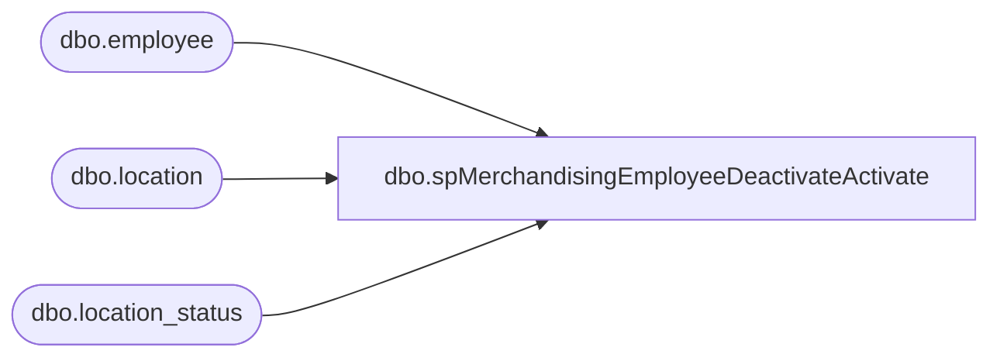

# dbo.spMerchandisingEmployeeDeactivateActivate

**Database:** me_01  
**Server:** bedrockdb02  

## Architecture Diagram



## Table Dependencies

| Referenced Table |
|---|
| dbo.employee |
| dbo.location |
| dbo.location_status |

## Stored Procedure Code

```sql
CREATE proc [dbo].[spMerchandisingEmployeeDeactivateActivate]

as

-- =====================================================================================================
-- Name: spMerchandisingEmployeeDeactivateActivate
--
-- Description:	This job finds store locations in merch that have the status of 'closed',
--				and have the employee record as 'active', generates an Employee file for the pipeline so the employee record
--				will be updated to 'inactive'. It also finds stores in merch that have a status of 'open' and has an employee record
--				that is 'inactive', generates an Employee file for the pipeline so the employee record
--				will be updated to 'active'.
--
-- Input:
--
-- Output: file is located to \\pipeapp01\Company01\Text File to EDM & PROD Import Tables - Imp Master Entities\
--
-- Dependencies:
--				
--
-- Revision History
--		Name:			Date:			Comments:
--		Dan Tweedie		03/11/2013		Created proc.	
-- =====================================================================================================

set nocount on


--DEACTIVATE
IF (Object_ID('tempdb..##Deactivate') IS NOT NULL) DROP TABLE ##Deactivate
select 'EE' as RecordType,
	   'M' as Actiontype,
	   e.employee_code, 
	   e.employee_firstname, 
	   e.employee_lastname, 
	   e.nt_user_name,
	   'oursmerchapp01' as ServerName,
	   e.domain_name,
	   'N' as ActiveStatus,
	   '' as Status,
	   '' as WorkSchedule,
	   convert(varchar, e.employee_hired_date, 101) date_hired, 
	   '' as SSN,
	   '' as HouseAccountNo,
	   '' as AlternateEmployeeNo,
	   '' as DiscountPercentage,
	   '' as MaxDiscountPercentage,
	   l.location_code as position_code,
	   l2.location_code as EmployeeHomeLocation
into ##Deactivate
from location l (nolock)
join location_status ls (nolock) on l.location_status_id = ls.location_status_id
join employee e (nolock) on l.location_code = e.employee_lastname
join location l2 (nolock) on e.employee_home_location = l2.location_id
where l.location_type = 2 --store
and ls.location_status_label = 'Closed'
and e.active_flag = 1


if (select count(*) from ##Deactivate) > 0

begin
	---generate the file
	declare @Dquery2 varchar(1000),
			@Dfile_location2 varchar(100),
			@Dfile_name2 varchar(100),
			@Dserver2 varchar(52),
			@Ddatabase2 varchar(52),
			@Dbcp varchar(1000)

	set @Dquery2 = 'set nocount on select * from ##Deactivate'
	set @Dfile_location2 = '\\pipeapp01\Company01\Text File to EDM & PROD Import Tables - Imp Master Entities\'
	set @Dfile_name2 = 'STSIM.EmployeeDeactivate.' + convert(varchar, datepart(yyyy, getdate())) + convert(varchar, datepart(mm, getdate())) + convert(varchar, datepart(dd, getdate())) + '.GO'
	set @Dserver2 = 'bedrockdb02'
	set @Ddatabase2 = 'me_01'
	set @Dbcp = 'bcp "' + @Dquery2 + '" queryout "' + @Dfile_location2 + @Dfile_name2 + '" -T -c -Sbedrockdb02'

	exec master..xp_cmdshell @Dbcp


end

-----ACTIVATE
IF (Object_ID('tempdb..##Activate') IS NOT NULL) DROP TABLE ##Activate
select 'EE' as RecordType,
	   'M' as Actiontype,
	   e.employee_code, 
	   e.employee_firstname, 
	   e.employee_lastname, 
	   e.nt_user_name,
	   'oursmerchapp01' as ServerName,
	   e.domain_name,
	   'Y' as ActiveStatus,
	   '' as Status,
	   '' as WorkSchedule,
	   convert(varchar, e.employee_hired_date, 101) date_hired, 
	   '' as SSN,
	   '' as HouseAccountNo,
	   '' as AlternateEmployeeNo,
	   '' as DiscountPercentage,
	   '' as MaxDiscountPercentage,
	   l.location_code as position_code,
	   l2.location_code as EmployeeHomeLocation
into ##Activate
from location l (nolock)
join location_status ls (nolock) on l.location_status_id = ls.location_status_id
join employee e (nolock) on l.location_code = e.employee_lastname
join location l2 (nolock) on e.employee_home_location = l2.location_id
where l.location_type = 2 --store
and ls.location_status_label = 'Open'
and e.active_flag = 0


if (select count(*) from ##Activate) > 0

begin
	---generate the file
	declare @Aquery2 varchar(1000),
			@Afile_location2 varchar(100),
			@Afile_name2 varchar(100),
			@Aserver2 varchar(52),
			@Adatabase2 varchar(52),
			@Abcp varchar(1000)

	set @Aquery2 = 'set nocount on select * from ##Activate'
	set @Afile_location2 = '\\pipeapp01\Company01\Text File to EDM & PROD Import Tables - Imp Master Entities\'
	set @Afile_name2 = 'STSIM.EmployeeActivate.' + convert(varchar, datepart(yyyy, getdate())) + convert(varchar, datepart(mm, getdate())) + convert(varchar, datepart(dd, getdate())) + '.GO'
	set @Aserver2 = 'bedrockdb02'
	set @Adatabase2 = 'me_01'
	set @Abcp = 'bcp "' + @Aquery2 + '" queryout "' + @Afile_location2 + @Afile_name2 + '" -T -c -Sbedrockdb02'

	exec master..xp_cmdshell @Abcp


end
```

