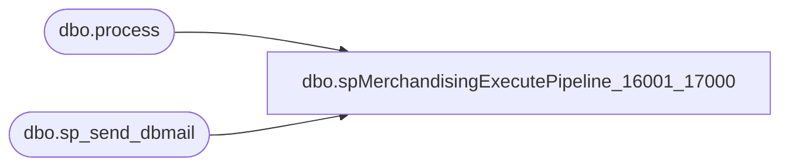

# dbo.spMerchandisingExecutePipeline_16001_17000

**Database:** me_01  
**Server:** bedrockdb02  

## Architecture Diagram



## Table Dependencies

| Referenced Table |
|---|
| dbo.process |
| dbo.sp_send_dbmail |

## Stored Procedure Code

```sql
CREATE proc [dbo].[spMerchandisingExecutePipeline_16001_17000]

as 

-- =====================================================================================================
-- Name: spMerchandisingExecutePipeline_16001_17000
--
-- Description:	Executes Pipeline segments 16001 and 17000, runs checks to confirm completion, sends alert if segments are not reporting completion after 10 attempts.
--				If the @count ever gets to 10, it is probably because the 17000 segment is still running from another process and is taking a long time to complete. 
--					Otherwise the pipeline might be experiencing a technical issue.
--				 
-- Revision History
--		Name:			Date:			Comments:
--		Dan Tweedie		07/14/2014		Created proc.	
--		Dan Tweedie		07/27/2015		Tweaked the loops to allow for escape after 5 failed attempts
-- =====================================================================================================
set nocount on

--BEGIN
--exec msdb.dbo.sp_send_dbmail
--		@profile_name = 'merchadmin',						
--		@recipients = 'lizzyt@buildabear.com',
--		@body = 'Pipeline skipped as expected.

--This message was brought to you by Bedrockdb02.me_01.dbo.spMerchandisingExecutePipeline_16001_17000',
--		@subject = 'Pipeline Skippped'
--END

BEGIN

		declare @start datetime, @finish datetime, @count int

		select @count = 0

		while (1 = 1)

			begin 
					
				select @count = @count + 1

				IF (Object_ID('tempdb..#a') IS NOT NULL) DROP TABLE #a
				create table #a
				(outpt_msg varchar(4000))

				insert #a
				EXEC pipeapp01.master..xp_cmdshell 'PipelineScheduleClient Start 16001 0'

				if (select count(*) from #a where outpt_msg like '%Segment 16001 completed%') < 1
					begin
						WAITFOR DELAY '00:00:30' ---wait 1 minute if the pipeline does not return successful completion, this should mean it is already running
					end

				if (select count(*) from #a where outpt_msg like '%Segment 16001 completed%') > 0
					or @count = 5

				break
					else
				continue

			end

		--If the loop above did not result in 'segment 16001 completed', check the finish timestamp on the process, if it is before the start time of this process, send alert
		if (select count(*) from #a where outpt_msg like '%Segment 16001 completed%') < 1
		begin

				select @finish = max(end_datetime) 
									FROM pipeapp01.PipelineRepository.dbo.process
									WHERE segment_id = 16001
		

				if @finish < @start
					or (select count(*) from #a where outpt_msg like '%fail%') > 0

						begin
							exec msdb.dbo.sp_send_dbmail
							@profile_name = 'merchadmin',
							@recipients = 'EnterpriseSystemsAlerts@buildabear.com;',
							@body = 'The Pipeline segment 16001 does not appear to be completing successfully. 
				This may need to be checked on.

				This message was brought to you by Bedrockdb01.me_02.dbo.spMerchandisingExecutePipeline_16001_17000',
							@subject = 'Pipeline 16001 *WARNING*'
						end

		end
	
END

------------------------------------------------------------------------------------------------------------------------
------------------------------------------------------------------------------------------------------------------------	
BEGIN

		declare @start2 datetime, @finish2 datetime, @count2 int

		select @count2 = 0

		while (1 = 1)

			begin 
					
				select @count2 = @count2 + 1

				IF (Object_ID('tempdb..#b') IS NOT NULL) DROP TABLE #b
				create table #b
				(outpt_msg varchar(4000))

				insert #b
				EXEC pipeapp01.master..xp_cmdshell 'PipelineScheduleClient Start 17000 0'

				if (select count(*) from #b where outpt_msg like '%Segment 17000 completed%') < 1
					begin
						WAITFOR DELAY '00:00:30' ---wait 1 minute if the pipeline does not return successful completion, this should mean it is already running
					end

				if (select count(*) from #b where outpt_msg like '%Segment 17000 completed%') > 0
					or @count2 = 5

				break
					else
				continue

			end

		--If the loop above did not result in 'segment 16001 completed', check the finish timestamp on the process, if it is before the start time of this process, send alert
		if (select count(*) from #b where outpt_msg like '%Segment 17000 completed%') < 1
		begin
		
				select @finish2 = max(end_datetime) 
									FROM pipeapp01.PipelineRepository.dbo.process
									WHERE segment_id = 17000
		

				if @finish2 < @start2
					or (select count(*) from #b where outpt_msg like '%fail%') > 0

						begin
							exec msdb.dbo.sp_send_dbmail
							@profile_name = 'merchadmin',
							@recipients = 'EnterpriseSystemsAlerts@buildabear.com;',			
							@body = 'The Pipeline segment 17000 does not appear to be completing successfully. 
				This may need to be checked on.

				This message was brought to you by Bedrockdb02.me_01.dbo.spMerchandisingExecutePipeline_16001_17000',
							@subject = 'Pipeline 17000 *WARNING*'
						end

		end
	
END
```

