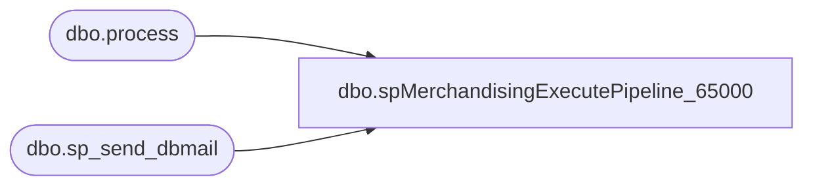

# dbo.spMerchandisingExecutePipeline_65000

**Database:** me_01  
**Server:** bedrockdb02  

## Architecture Diagram



## Table Dependencies

| Referenced Table |
|---|
| dbo.process |
| dbo.sp_send_dbmail |

## Stored Procedure Code

```sql
CREATE proc [dbo].[spMerchandisingExecutePipeline_65000]

as 

-- =====================================================================================================
-- Name: spMerchandisingExecutePipeline_65000
--
-- Description:	Executes Pipeline segment 65000, runs checks to confirm completion, sends alert if segments are not reporting completion after 10 attempts.
--		
--				 
-- Revision History
--		Name:			Date:			Comments:
--		Dan Tweedie		07/14/2014		Created proc.	
-- =====================================================================================================

set nocount on


declare @start datetime, @finish datetime, @count int

select @count = 0

while (1 = 1)

	begin 
					
		select @count = @count + 1

		IF (Object_ID('tempdb..#a') IS NOT NULL) DROP TABLE #a
		create table #a
		(outpt_msg varchar(4000))

		insert #a
		EXEC pipeapp01.master..xp_cmdshell 'PipelineScheduleClient Start 65000 0'

		if (select count(*) from #a where outpt_msg like '%Segment 65000 completed%') < 1
			begin
				WAITFOR DELAY '00:01:00' ---wait 1 minute if the pipeline does not return successful completion, this should mean it is already running
			end

		if (select count(*) from #a where outpt_msg like '%Segment 65000 completed%') > 0
			or @count = 5

		break
			else
		continue

	end

--If the loop above did not result in 'segment 65000 completed', check the finish timestamp on the process, if it is before the start time of this process, send alert
if (select count(*) from #a where outpt_msg like '%Segment 65000 completed%') < 1
begin

		select @finish = max(end_datetime) 
							FROM pipeapp01.PipelineRepository.dbo.process
							WHERE segment_id = 65000
		

		if @finish < @start
				begin
					exec msdb.dbo.sp_send_dbmail
					@profile_name = 'merchadmin',
					@recipients = 'EnterpriseSystemsAlerts@buildabear.com;',
					@body = 'The Pipeline segment 65000 does not appear to be completing successfully. 
		This may need to be checked on.

		This message was brought to you by Bedrockdb02.me_01.dbo.spMerchandisingExecutePipeline_65000',
					@subject = 'Pipeline 65000 *WARNING*'
				end

end
```

