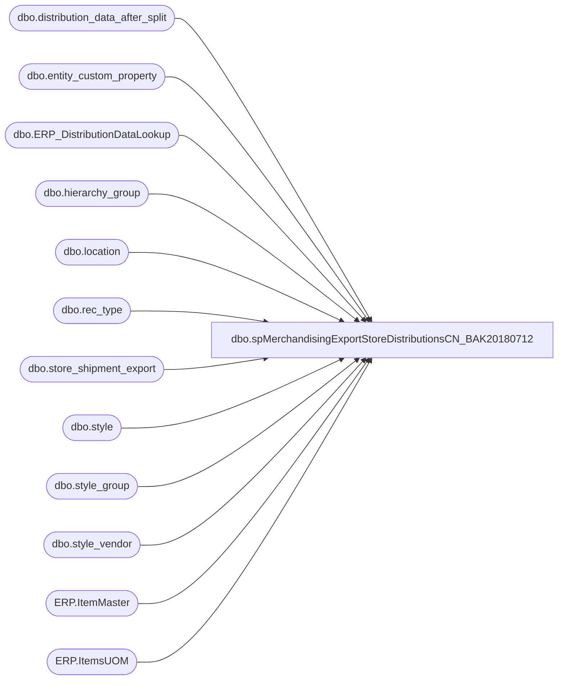

# dbo.spMerchandisingExportStoreDistributionsCN_BAK20180712

**Database:** me_01  
**Server:** bedrockdb02  

## Architecture Diagram



## Table Dependencies

| Referenced Table |
|---|
| dbo.distribution_data_after_split |
| dbo.entity_custom_property |
| dbo.ERP_DistributionDataLookup |
| dbo.hierarchy_group |
| dbo.location |
| dbo.rec_type |
| dbo.store_shipment_export |
| dbo.style |
| dbo.style_group |
| dbo.style_vendor |
| ERP.ItemMaster |
| ERP.ItemsUOM |

## Stored Procedure Code

```sql
CREATE proc [dbo].[spMerchandisingExportStoreDistributionsCN_BAK20180712]

as


-- =====================================================================================================
-- Name: spMerchandisingExportStoreDistributionsCN
--
-- Description:	Exports CN Distros to CSV, generates shipment number, inserts into store_shipment_export table
--				 
-- Revision History
--		Name:			Date:			Comments:
--		Dan Tweedie		03/31/2016		Created proc.	
--		Dan Tweedie		05/31/2016		We have a new concept called 'expected ship date', Means we release on Day 1, expect to ship on Day X.
--										Based on a predetermined number of 'handling days' per rec type,
--										with handling days different if release day is Sun-Tues vs release day Wed-Sat.
--										The warehouse does not work or ship on Sundays, 
--										so if the handling days carries over a Sunday, an extra day is added to determine the final 'expected ship date'.
--		Tim Callahan	06/11/2018		Updated coded to accomodate 8502 and 8505 warehouses
--		Dan Tweedie		2018-07-02		Updated For Dynamics 
-- =====================================================================================================

set nocount on
--===============================================================================================
--EXPORT DISTROS FOR WHSE 3970
--===============================================================================================
		declare @A_seed3970 bigint
		select @A_seed3970 = max(document_number) from store_shipment_export

		if (object_id('tempdb..##CNDistros3970') is not null) drop table ##CNDistros3970
		;WITH 
		InventoryUnit as
		(
			select 
				im.Entity,
				im.ItemNumber,
				right(im.ItemNumber,6) as StyleCode,
				im.InventoryUnitSymbol,
				cast(uom.Factor as int) as Factor 
			from [stl-ssis-p-01].IntegrationStaging.ERP.ItemMaster im 
			join [stl-ssis-p-01].IntegrationStaging.ERP.ItemsUOM uom 
				on im.Entity = uom.Entity 
				and im.PRODUCTNUMBER = uom.PRODUCTNUMBER
				and im.INVENTORYUNITSYMBOL = uom.FROMUNITSYMBOL
				and uom.TOUNITSYMBOL = 'wmea'
			where left(ItemNumber, 1) in ('M', 'S')
		),
		HandlingStageOne as
		(
			select	ddas.id as id,
					ddas.destid as destid,
					ddas.rec_type,
					rt.message,
					ddas.style_code, 
					case when substring(hg.hierarchy_group_code,7,2)='60'
						then	ecp.custom_property_value * ddas.quantity
						else	ddas.quantity * s.distribution_multiple
					end as quantity, 
					convert(varchar, ddas.release_date,101) as release_date,
					ddas.distribution_number, 
					ddas.ref_field_1,
					s.short_desc,
					@A_seed3970 + DENSE_RANK() OVER (ORDER BY ddas.destid, ddas.rec_type) as document_number,
					--NEW HANDLING DAYS - 05/31/2016
						case when datepart(dw, ddas.release_date) < 4 --Sunday-Tuesday
							then 
								case ddas.rec_type
									when 1 then 3 -- changed from 2
									when 3 then 4 -- changed from 3
									when 7 then 5 -- changed from 4
									else 2
								end
							else --Wednesday-Saturday
								case ddas.rec_type
									when 1 then 3
									when 3 then 4
									when 7 then 5
									else 3 
								end
						end as handling_days
			from	distribution_data_after_split ddas with (nolock)
			join rec_type rt with (nolock) on ddas.rec_type = rt.rectype
			join location l with (nolock) on ddas.destid = l.location_code
			join style s with (nolock) on ddas.style_code = s.style_code
			join style_group sg with (nolock) on s.style_id = sg.style_id
			join hierarchy_group hg with (nolock) on sg.hierarchy_group_id = hg.hierarchy_group_id
			join style_vendor sv with (nolock) on s.style_id = sv.style_id
				and sv.primary_vendor_flag = 1
			left join entity_custom_property ecp with (nolock) on s.style_id = ecp.parent_id
				and ecp.custom_property_id = 2
				and ecp.parent_type = 1
			where	ddas.sourceid = 3970
			and		ddas.released is null
			AND NOT EXISTS (select ddl.OrderID from ERP_DistributionDataLookup ddl with (nolock) where ddl.OrderID = ddas.distribution_number) --EXCLUDES DYNAMICS DISTROS
			UNION --ADD DYNAMICS DISTROS
			select	ddas.id as id,
					ddas.destid as destid,
					ddas.rec_type,
					rt.message,
					ddas.style_code, 
					ddas.quantity * isnull(uom.Factor,1) as quantity, --converts from staged unit to wm eaches
					convert(varchar, ddas.release_date,101) as release_date,
					ddas.distribution_number, 
					ddas.ref_field_1,
					ddl.ShortDescription as short_desc,
					@A_seed3970 + DENSE_RANK() OVER (ORDER BY ddas.destid, ddas.rec_type) as document_number,
					--NEW HANDLING DAYS - 05/31/2016
						case when datepart(dw, ddas.release_date) < 4 --Sunday-Tuesday
							then 
								case ddas.rec_type
									when 1 then 3 -- changed from 2
									when 3 then 4 -- changed from 3
									when 7 then 5 -- changed from 4
									else 2
								end
							else --Wednesday-Saturday
								case ddas.rec_type
									when 1 then 3
									when 3 then 4
									when 7 then 5
									else 3 
								end
						end as handling_days
			from distribution_data_after_split ddas with (nolock)
			inner join rec_type rt with (nolock) on	ddas.rec_type = rt.rectype
			join ERP_DistributionDataLookup ddl with (nolock) 
				on ddas.distribution_number = ddl.OrderID
				and ddas.style_code = ddl.ItemNumber
				and ddas.sequencenbr = ddl.SequenceNumber
				and case 
					when ddas.sourceid in ('0980', '0960') then '1100'
					when ddas.sourceid in ('2970') then '2110'
					else '3001'
				end = ddl.Entity
			left join InventoryUnit uom on 
				case 
					when ddas.sourceid in ('0980', '0960') then '1100'
					when ddas.sourceid in ('2970') then '2110'
					else '3001'
				end = uom.Entity
				and ddas.style_code = uom.StyleCode 
			where	ddas.sourceid = 3970
			and		ddas.released is null
		)
		select 
			*,
			case 
				when 
					(datepart(dw, release_date) = 1 and handling_days >= 7)
				OR	(datepart(dw, release_date) = 2 and handling_days >= 6)
				OR	(datepart(dw, release_date) = 3 and handling_days >= 5)
				OR	(datepart(dw, release_date) = 4 and handling_days >= 4)
				OR	(datepart(dw, release_date) = 5 and handling_days >= 3)
				OR	(datepart(dw, release_date) = 6 and handling_days >= 2)
				OR	(datepart(dw, release_date) = 7 and handling_days >= 1)
					then cast( dateadd(dd, (handling_days +1), release_date) as date)
				else cast( dateadd(dd, handling_days, release_date) as date)
			end as expected_ship_date
		into ##CNDistros3970
		from HandlingStageOne
		order by destid, rec_type

		if (select count(*) from ##CNDistros3970) > 0

		BEGIN

				---INSERT INTO STORE_SHIPMENT_EXPORT TABLE
				insert store_shipment_export
				select distribution_number, 
					   document_number, 
					   ref_field_1 as distribution_line_number,
					   '3970' as warehouse,
					   left(destid,4) as location_code,
					   rec_type,
					   left(message, 20) as rec_label,
					   style_code, 
					   quantity,
					   getdate() as release_date,
					   short_desc,
					   NULL as vendor_style,
					   NULL as color_code,
					   NULL as exported,
					   expected_ship_date,
					   NULL as Cancelled	
				from ##CNDistros3970

				--UPDATE DISTRIBUTION_DATA_AFTER_SPLIT TO SET THE RECORDS AS EXPORTED
				update distribution_data_after_split
				set released = 1
				where id in (select id from ##CNDistros3970)
				OR 
				(
					ID is NULL 
					and distribution_number in  (select distribution_number from ##CNDistros3970) 
					and sourceid = '3970'
				)

				--OUTPUT CSV FILE 
				declare @A_counter int,
						@A_shipment varchar(20),
						@A_location varchar(4),
						@A_rectype int,
						@A_query varchar(1000),
						@A_date varchar(52),
						@A_file_name varchar(100),
						@A_file_location varchar(100),
						@A_server varchar(20),
						@A_database varchar(20),
						@A_bcp varchar(1000)

				select @A_counter = count(distinct document_number) from ##CNDistros3970

				while @A_counter > 0

					begin
						select @A_shipment = max(document_number) from ##CNDistros3970
						select @A_location = max(destid) from ##CNDistros3970 where document_number = @A_shipment
						select @A_rectype = max(rec_type) from ##CNDistros3970 where document_number = @A_shipment

						set @A_query = 'set nocount on select document_number, destid, rec_type, message, style_code, quantity, convert(varchar, getdate(), 101) release_date, distribution_number, ref_field_1, convert(varchar, expected_ship_date, 101) expected_ship_date from ##CNDistros3970 where document_number = ' + @A_shipment + 'order by style_code'
						select @A_date = replace(replace(replace(replace(convert(varchar, getdate(), 121), ' ', ''), '-', ''), ':', ''), '.', '')
						set @A_file_location = '\\kermode\FileRepository\MERCHANDISING\CN_DISTRO\OUTBOUND\Distros\'
						set @A_file_name = 'DISTRIBUTION_CN_3970' + cast(@A_rectype as varchar) + '-' + @A_location + '.' + @A_date + '.csv'
						set @A_server = 'bedrockdb02'
						set @A_database = 'me_01'
						set @A_bcp = 'bcp "' + @A_query + '" queryout "' + @A_file_location + @A_file_name + '"  -T -t, -c -S' + @A_server 

						exec master..xp_cmdshell @A_bcp

						delete from ##CNDistros3970 where document_number = @A_shipment
						select @A_counter = count(distinct document_number) from ##CNDistros3970

						if @A_counter < 1

						break
					else
						continue

					end


		END
----===============================================================================================
----EXPORT DISTROS FOR WHSE 3980
----===============================================================================================
--		declare @B_seed3980 bigint
--		select @B_seed3980 = max(document_number) from store_shipment_export

--		if (object_id('tempdb..##CNDistros3980') is not null) drop table ##CNDistros3980
--		select	ddas.id as id,
--				ddas.destid as destid,
--				ddas.rec_type,
--				rt.message,
--				ddas.style_code, 
--				case when substring(hg.hierarchy_group_code,7,2)='60'
--					then	ecp.custom_property_value * ddas.quantity
--					else	ddas.quantity * s.distribution_multiple
--				end as quantity, 
--				convert(varchar, ddas.release_date,101) as release_date,
--				ddas.distribution_number, 
--				ddas.ref_field_1,
--				s.short_desc,
--				@B_seed3980 + DENSE_RANK() OVER (ORDER BY ddas.destid, ddas.rec_type) as document_number
--		into ##CNDistros3980
--		from	distribution_data_after_split ddas with (nolock)
--		join rec_type rt with (nolock) on ddas.rec_type = rt.rectype
--		join location l with (nolock) on ddas.destid = l.location_code
--		join style s with (nolock) on ddas.style_code = s.style_code
--		join style_group sg with (nolock) on s.style_id = sg.style_id
--		join hierarchy_group hg with (nolock) on sg.hierarchy_group_id = hg.hierarchy_group_id
--		join style_vendor sv with (nolock) on s.style_id = sv.style_id
--			and sv.primary_vendor_flag = 1
--		left join entity_custom_property ecp with (nolock) on s.style_id = ecp.parent_id
--			and ecp.custom_property_id = 2
--			and ecp.parent_type = 1
--		where	ddas.sourceid = 3980
--		and		ddas.released is null
--		order by ddas.destid, ddas.rec_type

--		if (select count(*) from ##CNDistros3980) > 0

--		BEGIN

--				---INSERT INTO STORE_SHIPMENT_EXPORT TABLE
--				insert store_shipment_export
--				select distribution_number, 
--					   document_number, 
--					   ref_field_1 as distribution_line_number,
--					   '3980' as warehouse,
--					   left(destid,4) as location_code,
--					   rec_type,
--					   left(message, 20) as rec_label,
--					   style_code, 
--					   quantity,
--					   getdate() as release_date,
--					   short_desc,
--					   NULL as vendor_style,
--					   NULL as color_code,
--					   NULL as exported
--				from ##CNDistros3980

--				--UPDATE DISTRIBUTION_DATA_AFTER_SPLIT TO SET THE RECORDS AS EXPORTED
--				update distribution_data_after_split
--				set released = 1
--				where id in (select id from ##CNDistros3980)

--				--OUTPUT CSV FILE 
--				declare @B_counter int,
--						@B_shipment varchar(20),
--						@B_location varchar(4),
--						@B_rectype int,
--						@B_query varchar(1000),
--						@B_date varchar(52),
--						@B_file_name varchar(100),
--						@B_file_location varchar(100),
--						@B_server varchar(20),
--						@B_database varchar(20),
--						@B_bcp varchar(1000)

--				select @B_counter = count(distinct document_number) from ##CNDistros3980

--				while @B_counter > 0

--					begin
--						select @B_shipment = max(document_number) from ##CNDistros3980
--						select @B_location = max(destid) from ##CNDistros3980 where document_number = @B_shipment
--						select @B_rectype = max(rec_type) from ##CNDistros3980 where document_number = @B_shipment

--						set @B_query = 'set nocount on select document_number, destid, rec_type, message, style_code, quantity, convert(varchar, getdate(), 101), distribution_number, ref_field_1 from ##CNDistros3980 where document_number = ' + @B_shipment + 'order by style_code'
--						select @B_date = replace(replace(replace(replace(convert(varchar, getdate(), 121), ' ', ''), '-', ''), ':', ''), '.', '')
--						set @B_file_location = '\\kermode\FileRepository\MERCHANDISING\CN_DISTRO\OUTBOUND\'
--						set @B_file_name = 'DISTRIBUTION_CN_3980' + cast(@B_rectype as varchar) + '-' + @B_location + '.' + @B_date + '.csv'
--						set @B_server = 'bedrockdb02'
--						set @B_database = 'me_01'
--						set @B_bcp = 'bcp "' + @B_query + '" queryout "' + @B_file_location + @B_file_name + '"  -T -t, -c -S' + @B_server 

--						exec master..xp_cmdshell @B_bcp

--						delete from ##CNDistros3980 where document_number = @B_shipment
--						select @B_counter = count(distinct document_number) from ##CNDistros3980

--						if @B_counter < 1

--						break
--					else
--						continue

--					end


--		END


--===============================================================================================
--EXPORT DISTROS FOR WHSE 8502
--===============================================================================================

		declare @C_seed8502 bigint
		select @C_seed8502 = max(document_number) from store_shipment_export

		if (object_id('tempdb..##CNDistros8502') is not null) drop table ##CNDistros8502
		;WITH 
		InventoryUnit as
		(
			select 
				im.Entity,
				im.ItemNumber,
				right(im.ItemNumber,6) as StyleCode,
				im.InventoryUnitSymbol,
				cast(uom.Factor as int) as Factor 
			from [stl-ssis-p-01].IntegrationStaging.ERP.ItemMaster im 
			join [stl-ssis-p-01].IntegrationStaging.ERP.ItemsUOM uom 
				on im.Entity = uom.Entity 
				and im.PRODUCTNUMBER = uom.PRODUCTNUMBER
				and im.INVENTORYUNITSYMBOL = uom.FROMUNITSYMBOL
				and uom.TOUNITSYMBOL = 'wmea'
			where left(ItemNumber, 1) in ('M', 'S')
		),
		HandlingStageOne as
		(
			select	ddas.id as id,
					ddas.destid as destid,
					ddas.rec_type,
					rt.message,
					ddas.style_code, 
					case when substring(hg.hierarchy_group_code,7,2)='60'
						then	ecp.custom_property_value * ddas.quantity
						else	ddas.quantity * s.distribution_multiple
					end as quantity, 
					convert(varchar, ddas.release_date,101) as release_date,
					ddas.distribution_number, 
					ddas.ref_field_1,
					s.short_desc,
					@C_seed8502 + DENSE_RANK() OVER (ORDER BY ddas.destid, ddas.rec_type) as document_number,
					--NEW HANDLING DAYS - 05/31/2016
						case when datepart(dw, ddas.release_date) < 4 --Sunday-Tuesday
							then 
								case ddas.rec_type
									when 1 then 3 -- changed from 2
									when 3 then 4 -- changed from 3
									when 7 then 5 -- changed from 4
									else 2
								end
							else --Wednesday-Saturday
								case ddas.rec_type
									when 1 then 3
									when 3 then 4
									when 7 then 5
									else 3 
								end
						end as handling_days
			from	distribution_data_after_split ddas with (nolock)
			join rec_type rt with (nolock) on ddas.rec_type = rt.rectype
			join location l with (nolock) on ddas.destid = l.location_code
			join style s with (nolock) on ddas.style_code = s.style_code
			join style_group sg with (nolock) on s.style_id = sg.style_id
			join hierarchy_group hg with (nolock) on sg.hierarchy_group_id = hg.hierarchy_group_id
			join style_vendor sv with (nolock) on s.style_id = sv.style_id
				and sv.primary_vendor_flag = 1
			left join entity_custom_property ecp with (nolock) on s.style_id = ecp.parent_id
				and ecp.custom_property_id = 2
				and ecp.parent_type = 1
			where	ddas.sourceid = 8502
			and		ddas.released is null
			AND NOT EXISTS (select ddl.OrderID from ERP_DistributionDataLookup ddl with (nolock) where ddl.OrderID = ddas.distribution_number) --EXCLUDES DYNAMICS DISTROS
			UNION --ADD DYNAMICS DISTROS
			select	ddas.id as id,
					ddas.destid as destid,
					ddas.rec_type,
					rt.message,
					ddas.style_code, 
					ddas.quantity * isnull(uom.Factor,1) as quantity, --converts from staged unit to wm eaches
					convert(varchar, ddas.release_date,101) as release_date,
					ddas.distribution_number, 
					ddas.ref_field_1,
					ddl.ShortDescription as short_desc, --NEED TO GET FROM LOOKUP
					@C_seed8502 + DENSE_RANK() OVER (ORDER BY ddas.destid, ddas.rec_type) as document_number,
					--NEW HANDLING DAYS - 05/31/2016
						case when datepart(dw, ddas.release_date) < 4 --Sunday-Tuesday
							then 
								case ddas.rec_type
									when 1 then 3 -- changed from 2
									when 3 then 4 -- changed from 3
									when 7 then 5 -- changed from 4
									else 2
								end
							else --Wednesday-Saturday
								case ddas.rec_type
									when 1 then 3
									when 3 then 4
									when 7 then 5
									else 3 
								end
						end as handling_days
			from distribution_data_after_split ddas with (nolock)
			inner join rec_type rt with (nolock) on	ddas.rec_type = rt.rectype
			join ERP_DistributionDataLookup ddl with (nolock) 
				on ddas.distribution_number = ddl.OrderID
				and ddas.style_code = ddl.ItemNumber
				and ddas.sequencenbr = ddl.SequenceNumber
				and case 
					when ddas.sourceid in ('0980', '0960') then '1100'
					when ddas.sourceid in ('2970') then '2110'
					else '3001'
				end = ddl.Entity
			left join InventoryUnit uom on 
				case 
					when ddas.sourceid in ('0980', '0960') then '1100'
					when ddas.sourceid in ('2970') then '2110'
					else '3001'
				end = uom.Entity
				and ddas.style_code = uom.StyleCode 
			where	ddas.sourceid = 8502
			and		ddas.released is null
		)
		select 
			*,
			case 
				when 
					(datepart(dw, release_date) = 1 and handling_days >= 7)
				OR	(datepart(dw, release_date) = 2 and handling_days >= 6)
				OR	(datepart(dw, release_date) = 3 and handling_days >= 5)
				OR	(datepart(dw, release_date) = 4 and handling_days >= 4)
				OR	(datepart(dw, release_date) = 5 and handling_days >= 3)
				OR	(datepart(dw, release_date) = 6 and handling_days >= 2)
				OR	(datepart(dw, release_date) = 7 and handling_days >= 1)
					then cast( dateadd(dd, (handling_days +1), release_date) as date)
				else cast( dateadd(dd, handling_days, release_date) as date)
			end as expected_ship_date
		into ##CNDistros8502
		from HandlingStageOne
		order by destid, rec_type

		if (select count(*) from ##CNDistros8502) > 0

		BEGIN

				---INSERT INTO STORE_SHIPMENT_EXPORT TABLE
				insert store_shipment_export
				select distribution_number, 
					   document_number, 
					   ref_field_1 as distribution_line_number,
					   '8502' as warehouse,
					   left(destid,4) as location_code,
					   rec_type,
					   left(message, 20) as rec_label,
					   style_code, 
					   quantity,
					   getdate() as release_date,
					   short_desc,
					   NULL as vendor_style,
					   NULL as color_code,
					   NULL as exported,
					   expected_ship_date,
					   NULL as Cancelled	
				from ##CNDistros8502

				--UPDATE DISTRIBUTION_DATA_AFTER_SPLIT TO SET THE RECORDS AS EXPORTED
				update distribution_data_after_split
				set released = 1
				where id in (select id from ##CNDistros8502)
				OR 
				(
					ID is NULL 
					and distribution_number in  (select distribution_number from ##CNDistros8502) 
					and sourceid = '8502'
				)

				--OUTPUT CSV FILE 
				declare @C_counter int,
						@C_shipment varchar(20),
						@C_location varchar(4),
						@C_rectype int,
						@C_query varchar(1000),
						@C_date varchar(52),
						@C_file_name varchar(100),
						@C_file_location varchar(100),
						@C_server varchar(20),
						@C_database varchar(20),
						@C_bcp varchar(1000)

				select @C_counter = count(distinct document_number) from ##CNDistros8502

				while @C_counter > 0

					begin
						select @C_shipment = max(document_number) from ##CNDistros8502
						select @C_location = max(destid) from ##CNDistros8502 where document_number = @C_shipment
						select @C_rectype = max(rec_type) from ##CNDistros8502 where document_number = @C_shipment

						set @C_query = 'set nocount on select document_number, destid, rec_type, message, style_code, quantity, convert(varchar, getdate(), 101) release_date, distribution_number, ref_field_1, convert(varchar, expected_ship_date, 101) expected_ship_date from ##CNDistros8502 where document_number = ' + @C_shipment + 'order by style_code'
						select @C_date = replace(replace(replace(replace(convert(varchar, getdate(), 121), ' ', ''), '-', ''), ':', ''), '.', '')
						set @C_file_location = '\\kermode\FileRepository\MERCHANDISING\CN_DISTRO\OUTBOUND\Distros\'
						set @C_file_name = 'DISTRIBUTION_CN_8502' + cast(@C_rectype as varchar) + '-' + @C_location + '.' + @C_date + '.csv'
						set @C_server = 'bedrockdb02'
						set @C_database = 'me_01'
						set @C_bcp = 'bcp "' + @C_query + '" queryout "' + @C_file_location + @C_file_name + '"  -T -t, -c -S' + @C_server 

						exec master..xp_cmdshell @C_bcp

						delete from ##CNDistros8502 where document_number = @C_shipment
						select @C_counter = count(distinct document_number) from ##CNDistros8502

						if @C_counter < 1

						break
					else
						continue

					end


		END


--===============================================================================================
--EXPORT DISTROS FOR WHSE 8505
--===============================================================================================

		declare @D_seed8505 bigint
		select @D_seed8505 = max(document_number) from store_shipment_export

		if (object_id('tempdb..##CNDistros8505') is not null) drop table ##CNDistros8505
		;WITH 
		InventoryUnit as
		(
			select 
				im.Entity,
				im.ItemNumber,
				right(im.ItemNumber,6) as StyleCode,
				im.InventoryUnitSymbol,
				cast(uom.Factor as int) as Factor 
			from [stl-ssis-p-01].IntegrationStaging.ERP.ItemMaster im 
			join [stl-ssis-p-01].IntegrationStaging.ERP.ItemsUOM uom 
				on im.Entity = uom.Entity 
				and im.PRODUCTNUMBER = uom.PRODUCTNUMBER
				and im.INVENTORYUNITSYMBOL = uom.FROMUNITSYMBOL
				and uom.TOUNITSYMBOL = 'wmea'
			where left(ItemNumber, 1) in ('M', 'S')
		),
		HandlingStageOne as
		(
			select	ddas.id as id,
					ddas.destid as destid,
					ddas.rec_type,
					rt.message,
					ddas.style_code, 
					case when substring(hg.hierarchy_group_code,7,2)='60'
						then	ecp.custom_property_value * ddas.quantity
						else	ddas.quantity * s.distribution_multiple
					end as quantity, 
					convert(varchar, ddas.release_date,101) as release_date,
					ddas.distribution_number, 
					ddas.ref_field_1,
					s.short_desc,
					@D_seed8505 + DENSE_RANK() OVER (ORDER BY ddas.destid, ddas.rec_type) as document_number,
					--NEW HANDLING DAYS - 05/31/2016
						case when datepart(dw, ddas.release_date) < 4 --Sunday-Tuesday
							then 
								case ddas.rec_type
									when 1 then 3 -- changed from 2
									when 3 then 4 -- changed from 3
									when 7 then 5 -- changed from 4
									else 2
								end
							else --Wednesday-Saturday
								case ddas.rec_type
									when 1 then 3
									when 3 then 4
									when 7 then 5
									else 3 
								end
						end as handling_days
			from	distribution_data_after_split ddas with (nolock)
			join rec_type rt with (nolock) on ddas.rec_type = rt.rectype
			join location l with (nolock) on ddas.destid = l.location_code
			join style s with (nolock) on ddas.style_code = s.style_code
			join style_group sg with (nolock) on s.style_id = sg.style_id
			join hierarchy_group hg with (nolock) on sg.hierarchy_group_id = hg.hierarchy_group_id
			join style_vendor sv with (nolock) on s.style_id = sv.style_id
				and sv.primary_vendor_flag = 1
			left join entity_custom_property ecp with (nolock) on s.style_id = ecp.parent_id
				and ecp.custom_property_id = 2
				and ecp.parent_type = 1
			where	ddas.sourceid = 8505
			and		ddas.released is null
			AND NOT EXISTS (select ddl.OrderID from ERP_DistributionDataLookup ddl with (nolock) where ddl.OrderID = ddas.distribution_number) --EXCLUDES DYNAMICS DISTROS
			UNION --ADD DYNAMICS DISTROS
			select	ddas.id as id,
					ddas.destid as destid,
					ddas.rec_type,
					rt.message,
					ddas.style_code, 
					ddas.quantity * isnull(uom.Factor,1) as quantity, --converts from staged unit to wm eaches
					convert(varchar, ddas.release_date,101) as release_date,
					ddas.distribution_number, 
					ddas.ref_field_1,
					ddl.ShortDescription as short_desc, --NEED TO GET FROM LOOKUP
					@D_seed8505 + DENSE_RANK() OVER (ORDER BY ddas.destid, ddas.rec_type) as document_number,
					--NEW HANDLING DAYS - 05/31/2016
						case when datepart(dw, ddas.release_date) < 4 --Sunday-Tuesday
							then 
								case ddas.rec_type
									when 1 then 3 -- changed from 2
									when 3 then 4 -- changed from 3
									when 7 then 5 -- changed from 4
									else 2
								end
							else --Wednesday-Saturday
								case ddas.rec_type
									when 1 then 3
									when 3 then 4
									when 7 then 5
									else 3 
								end
						end as handling_days
			 from distribution_data_after_split ddas with (nolock)
				inner join rec_type rt with (nolock) on	ddas.rec_type = rt.rectype
				join ERP_DistributionDataLookup ddl with (nolock) 
					on ddas.distribution_number = ddl.OrderID
					and ddas.style_code = ddl.ItemNumber
					and ddas.sequencenbr = ddl.SequenceNumber
					and case 
						when ddas.sourceid in ('0980', '0960') then '1100'
						when ddas.sourceid in ('2970') then '2110'
						else '3001'
					end = ddl.Entity
				left join InventoryUnit uom on 
					case 
						when ddas.sourceid in ('0980', '0960') then '1100'
						when ddas.sourceid in ('2970') then '2110'
						else '3001'
					end = uom.Entity
					and ddas.style_code = uom.StyleCode 
			where	ddas.sourceid = 8505
			and		ddas.released is null
		)
		select 
			*,
			case 
				when 
					(datepart(dw, release_date) = 1 and handling_days >= 7)
				OR	(datepart(dw, release_date) = 2 and handling_days >= 6)
				OR	(datepart(dw, release_date) = 3 and handling_days >= 5)
				OR	(datepart(dw, release_date) = 4 and handling_days >= 4)
				OR	(datepart(dw, release_date) = 5 and handling_days >= 3)
				OR	(datepart(dw, release_date) = 6 and handling_days >= 2)
				OR	(datepart(dw, release_date) = 7 and handling_days >= 1)
					then cast( dateadd(dd, (handling_days +1), release_date) as date)
				else cast( dateadd(dd, handling_days, release_date) as date)
			end as expected_ship_date
		into ##CNDistros8505
		from HandlingStageOne
		order by destid, rec_type

		if (select count(*) from ##CNDistros8505) > 0

		BEGIN

				---INSERT INTO STORE_SHIPMENT_EXPORT TABLE
				insert store_shipment_export
				select distribution_number, 
					   document_number, 
					   ref_field_1 as distribution_line_number,
					   '8505' as warehouse,
					   left(destid,4) as location_code,
					   rec_type,
					   left(message, 20) as rec_label,
					   style_code, 
					   quantity,
					   getdate() as release_date,
					   short_desc,
					   NULL as vendor_style,
					   NULL as color_code,
					   NULL as exported,
					   expected_ship_date,
					   NULL as Cancelled	
				from ##CNDistros8505

				--UPDATE DISTRIBUTION_DATA_AFTER_SPLIT TO SET THE RECORDS AS EXPORTED
				update distribution_data_after_split
				set released = 1
				where id in (select id from ##CNDistros8505)
				OR 
				(
					ID is NULL 
					and distribution_number in  (select distribution_number from ##CNDistros8505) 
					and sourceid = '8505'
				)

				--OUTPUT CSV FILE 
				declare @D_counter int,
						@D_shipment varchar(20),
						@D_location varchar(4),
						@D_rectype int,
						@D_query varchar(1000),
						@D_date varchar(52),
						@D_file_name varchar(100),
						@D_file_location varchar(100),
						@D_server varchar(20),
						@D_database varchar(20),
						@D_bcp varchar(1000)

				select @D_counter = count(distinct document_number) from ##CNDistros8505

				while @D_counter > 0

					begin
						select @D_shipment = max(document_number) from ##CNDistros8505
						select @D_location = max(destid) from ##CNDistros8505 where document_number = @D_shipment
						select @D_rectype = max(rec_type) from ##CNDistros8505 where document_number = @D_shipment

						set @D_query = 'set nocount on select document_number, destid, rec_type, message, style_code, quantity, convert(varchar, getdate(), 101) release_date, distribution_number, ref_field_1, convert(varchar, expected_ship_date, 101) expected_ship_date from ##CNDistros8505 where document_number = ' + @D_shipment + 'order by style_code'
						select @D_date = replace(replace(replace(replace(convert(varchar, getdate(), 121), ' ', ''), '-', ''), ':', ''), '.', '')
						set @D_file_location = '\\kermode\FileRepository\MERCHANDISING\CN_DISTRO\OUTBOUND\Distros\'
						set @D_file_name = 'DISTRIBUTION_CN_8505' + cast(@D_rectype as varchar) + '-' + @D_location + '.' + @D_date + '.csv'
						set @D_server = 'bedrockdb02'
						set @D_database = 'me_01'
						set @D_bcp = 'bcp "' + @D_query + '" queryout "' + @D_file_location + @D_file_name + '"  -T -t, -c -S' + @D_server 

						exec master..xp_cmdshell @D_bcp

						delete from ##CNDistros8505 where document_number = @D_shipment
						select @D_counter = count(distinct document_number) from ##CNDistros8505

						if @D_counter < 1

						break
					else
						continue

					end


		END
```

