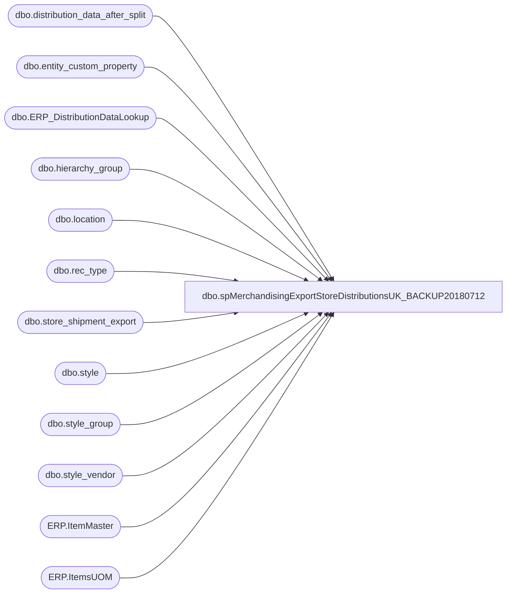

# dbo.spMerchandisingExportStoreDistributionsUK_BACKUP20180712

**Database:** me_01  
**Server:** bedrockdb02  

## Architecture Diagram



## Table Dependencies

| Referenced Table |
|---|
| dbo.distribution_data_after_split |
| dbo.entity_custom_property |
| dbo.ERP_DistributionDataLookup |
| dbo.hierarchy_group |
| dbo.location |
| dbo.rec_type |
| dbo.store_shipment_export |
| dbo.style |
| dbo.style_group |
| dbo.style_vendor |
| ERP.ItemMaster |
| ERP.ItemsUOM |

## Stored Procedure Code

```sql
CREATE proc [dbo].[spMerchandisingExportStoreDistributionsUK_BACKUP20180712]

as

-- =====================================================================================================
-- Name: spMerchandisingExportStoreDistributionsUK
--
-- Description:	Exports UK Distros to CSV, generates shipment number, inserts into store_shipment_export table
--				 
-- Revision History
--		Name:			Date:			Comments:
--		Dan Tweedie		03/25/2015		Created proc.
--		Tim Callahan	10/19/2017		Remarked Outline in @seed variable that specifies a warehouse code
--										Beginning 10/16/2017 this was causing the same (shipment) document numbers to be used for different DCs and stores
--										This will cause store shipment data to reject when it flows back from the 3PLS as store shipment document numbers must be unique
--		Dan Tweedie		2018-07-02		Updated For Dynamics
-- =====================================================================================================

set nocount on

declare @seed bigint
select @seed = max(document_number) from store_shipment_export
--where warehouse = '2970' Remarked out 10/19/2017 see note above

if (object_id('tempdb..##UKDistros') is not null) drop table ##UKDistros
;
with 
InventoryUnit as
(
	select 
		im.Entity,
		im.ItemNumber,
		right(im.ItemNumber,6) as StyleCode,
		im.InventoryUnitSymbol,
		cast(uom.Factor as int) as Factor 
	from [stl-ssis-p-01].IntegrationStaging.ERP.ItemMaster im 
	join [stl-ssis-p-01].IntegrationStaging.ERP.ItemsUOM uom 
		on im.Entity = uom.Entity 
		and im.PRODUCTNUMBER = uom.PRODUCTNUMBER
		and im.INVENTORYUNITSYMBOL = uom.FROMUNITSYMBOL
		and uom.TOUNITSYMBOL = 'wmea'
	where left(ItemNumber, 1) in ('M', 'S')
)
select	ddas.id as id,
		ddas.destid as destid,
		ddas.rec_type,
		rt.message,
		ddas.style_code, 
		case when substring(hg.hierarchy_group_code,7,2)='60'
			then	ecp.custom_property_value * ddas.quantity
			else	ddas.quantity * s.distribution_multiple
		end as quantity, 
		convert(varchar, ddas.release_date,101) as release_date,
		ddas.distribution_number, 
		ddas.ref_field_1,
		s.short_desc,
		@seed + DENSE_RANK() OVER (ORDER BY ddas.destid, ddas.rec_type) as document_number
into ##UKDistros
from	distribution_data_after_split ddas with (nolock)
join rec_type rt with (nolock) on ddas.rec_type = rt.rectype
join location l with (nolock) on ddas.destid = l.location_code
join style s with (nolock) on ddas.style_code = s.style_code
join style_group sg with (nolock) on s.style_id = sg.style_id
join hierarchy_group hg with (nolock) on sg.hierarchy_group_id = hg.hierarchy_group_id
join style_vendor sv with (nolock) on s.style_id = sv.style_id
	and sv.primary_vendor_flag = 1
left join entity_custom_property ecp with (nolock) on s.style_id = ecp.parent_id
	and ecp.custom_property_id = 2
	and ecp.parent_type = 1
where	ddas.sourceid = 2970
and		ddas.released is null
AND NOT EXISTS (select ddl.OrderID from ERP_DistributionDataLookup ddl with (nolock) where ddl.OrderID = ddas.distribution_number) --EXCLUDES DYNAMICS DISTROS
UNION --ADD DYNAMICS DISTROS
select	ddas.id as id,
		ddas.destid as destid,
		ddas.rec_type,
		rt.message,
		ddas.style_code, 
		ddas.quantity * isnull(uom.Factor,1) as quantity, --converts from staged unit to wm eaches
		convert(varchar, ddas.release_date,101) as release_date,
		ddas.distribution_number, 
		ddas.ref_field_1,
		ddl.ShortDescription as short_desc,--NEED TO GET FROM LOOKUP
		@seed + DENSE_RANK() OVER (ORDER BY ddas.destid, ddas.rec_type) as document_number
from distribution_data_after_split ddas with (nolock)
inner join rec_type rt with (nolock) on	ddas.rec_type = rt.rectype
join ERP_DistributionDataLookup ddl with (nolock) 
	on ddas.distribution_number = ddl.OrderID
	and ddas.style_code = ddl.ItemNumber
	and ddas.sequencenbr = ddl.SequenceNumber
	and case 
		when ddas.sourceid in ('0980', '0960') then '1100'
		when ddas.sourceid in ('2970') then '2110'
		else '3001'
	end = ddl.Entity
left join InventoryUnit uom on 
	case 
		when ddas.sourceid in ('0980', '0960') then '1100'
		when ddas.sourceid in ('2970') then '2110'
		else '3001'
	end = uom.Entity
	and ddas.style_code = uom.StyleCode 
where	ddas.sourceid = 2970
and		ddas.released is null


if (select count(*) from ##UKDistros) > 0

BEGIN

		---INSERT INTO STORE_SHIPMENT_EXPORT TABLE
		insert store_shipment_export
		select distribution_number, 
			   document_number, 
			   ref_field_1 as distribution_line_number,
			   '2970' as warehouse,
			   left(destid,4) as location_code,
			   rec_type,
			   left(message, 20) as rec_label,
			   style_code, 
			   quantity,
			   getdate() as release_date,
			   short_desc,
			   NULL as vendor_style,
			   NULL as color_code,
			   NULL as exported,
			   NULL as expected_ship_date,
			   NULL as Cancelled
		from ##UKDistros

		--UPDATE DISTRIBUTION_DATA_AFTER_SPLIT TO SET THE RECORDS AS EXPORTED
		update distribution_data_after_split
		set released = 1
		where id in (select id from ##UKDistros)
		OR 
	(
		ID is NULL 
		and distribution_number in  (select distribution_number from ##UKDistros) 
		and sourceid = '2970'
	)


		--OUTPUT CSV FILE 
		declare @counter int,
				@shipment varchar(20),
				@location varchar(4),
				@rectype int,
				@query varchar(1000),
				@date varchar(52),
				@file_name varchar(100),
				@file_location varchar(100),
				@server varchar(20),
				@database varchar(20),
				@bcp varchar(1000)

		select @counter = count(distinct document_number) from ##UKDistros

		while @counter > 0

			begin
				select @shipment = max(document_number) from ##UKDistros
				select @location = max(destid) from ##UKDistros where document_number = @shipment
				select @rectype = max(rec_type) from ##UKDistros where document_number = @shipment

				set @query = 'set nocount on select document_number, destid, rec_type, message, style_code, quantity, convert(varchar, getdate(), 101), distribution_number, ref_field_1 from ##UKDistros where document_number = ' + @shipment + 'order by style_code'
				select @date = replace(replace(replace(replace(convert(varchar, getdate(), 121), ' ', ''), '-', ''), ':', ''), '.', '')
				set @file_location = '\\kermode\FileRepository\MERCHANDISING\UK_DISTRO\OUTBOUND\'
				set @file_name = 'DISTRIBUTION_UK_' + cast(@rectype as varchar) + '-' + @location + '.' + @date + '.csv'
				set @server = 'bedrockdb02'
				set @database = 'me_01'
				set @bcp = 'bcp "' + @query + '" queryout "' + @file_location + @file_name + '"  -T -t, -c -S' + @server 

				exec master..xp_cmdshell @bcp

				delete from ##UKDistros where document_number = @shipment
				select @counter = count(distinct document_number) from ##UKDistros

				if @counter < 1

				break
			else
				continue

			end


END
```

