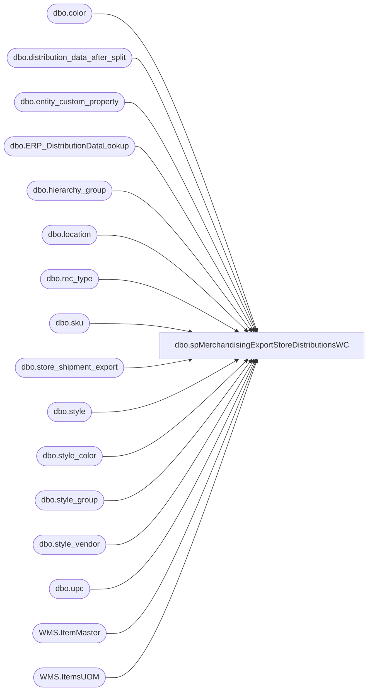

# dbo.spMerchandisingExportStoreDistributionsWC

**Database:** me_01  
**Server:** bedrockdb02  

## Architecture Diagram



## Table Dependencies

| Referenced Table |
|---|
| dbo.color |
| dbo.distribution_data_after_split |
| dbo.entity_custom_property |
| dbo.ERP_DistributionDataLookup |
| dbo.hierarchy_group |
| dbo.location |
| dbo.rec_type |
| dbo.sku |
| dbo.store_shipment_export |
| dbo.style |
| dbo.style_color |
| dbo.style_group |
| dbo.style_vendor |
| dbo.upc |
| WMS.ItemMaster |
| WMS.ItemsUOM |

## Stored Procedure Code

```sql
CREATE proc [dbo].[spMerchandisingExportStoreDistributionsWC]

as

-- =====================================================================================================
-- Name: spMerchandisingExportStoreDistributionsWC
--
-- Description:	Exports WC Distros to CSV, generates shipment number, inserts into store_shipment_export table
--				 
-- Revision History
--		Name:			Date:			Comments:
--		Dan Tweedie		03/25/2015		Created proc.	
--		Dan Tweedie		05/13/2016		added 3970 to seed query
--		Tim Callahan	10/19/2017		Remarked Outline in @seed variable that specifies a warehouse code
--										Beginning 10/16/2017 this was causing the same (shipment) document numbers to be used for different DCs and stores
--										This will cause store shipment data to reject when it flows back from the 3PLS as store shipment document numbers must be unique
--		Dan Tweedie		2018-07-02		Updated For Dynamics
--		Dan Tweedie		2018-07-12		Updated document number generation logic, we found that multiple locations were assigned to a single shipment document number, this cannot happen
--		Lizzy Timm		2020-07-23		Updated time logic from 18 to 16:30 per SR 27924
-- =====================================================================================================

set nocount on

declare @seed bigint
select @seed = round(max(document_number), 0) from store_shipment_export -- i had to round because a ton of 960 shipments have decimal, for example 2800034326.000000000
--where warehouse in ('0960', '3970') Remarked out 10/19/2017 see note above

if (object_id('tempdb..##WCDistros') is not null) drop table ##WCDistros
;
with 
InventoryUnit as
(
	select 
		im.Entity,
		im.ItemNumber,
		right(im.ItemNumber,6) as StyleCode,
		im.InventoryUnitSymbol,
		cast(uom.Factor as int) as Factor 
	from [stl-ssis-p-01].IntegrationStaging.WMS.ItemMaster im 
	join [stl-ssis-p-01].IntegrationStaging.WMS.ItemsUOM uom 
		on im.Entity = uom.Entity 
		and im.PRODUCTNUMBER = uom.PRODUCTNUMBER
		and im.INVENTORYUNITSYMBOL = uom.FROMUNITSYMBOL
		and uom.TOUNITSYMBOL = 'wmea'
	where im.NecessaryProductionWorkingTimeSchedulingPropertyId in ('Merch','Supplies')
),
DistroData as
(
select		ddas.id,
			case when rec_type = 3
				then ddas.destid + 'B'
			when rec_type = 7
				then ddas.destid + 'C'
			when rec_type = 8
				then ddas.destid + 'D'
			when rec_type = 9
				then ddas.destid + 'E'
			else ddas.destid
			end as destid,
            ddas.rec_type,
            rt.message,
            ddas.style_code, 
            case when substring(hg.hierarchy_group_code,7,2) <> '60'
		then ddas.quantity * s.distribution_multiple 
		else ddas.quantity * ecp.custom_property_value
		end as quantity, 
            convert(varchar, ddas.release_date,101) as release_date,
            ddas.distribution_number, 
            ddas.ref_field_1,
            s.short_desc,             
            sv.vendor_style,
            c.color_code,
            case when substring(hg.hierarchy_group_code,7,2) <> '60'
		then s.distribution_multiple 
		else ecp.custom_property_value
		end as distribution_multiple
		--@seed + DENSE_RANK() OVER (ORDER BY ddas.destid, ddas.rec_type) as document_number
from  distribution_data_after_split ddas with (nolock)
join rec_type rt with (nolock) on ddas.rec_type = rt.rectype
join location l with (nolock) on ddas.destid = l.location_code
join style s with (nolock) on ddas.style_code = s.style_code
join style_group sg with (nolock) on s.style_id = sg.style_id
join hierarchy_group hg with (nolock) on sg.hierarchy_group_id = hg.hierarchy_group_id
join style_vendor sv with (nolock) on s.style_id = sv.style_id and sv.primary_vendor_flag = 1
left join entity_custom_property ecp with (nolock) on s.style_id = ecp.parent_id
	and ecp.custom_property_id = 2
	and ecp.parent_type = 1
join upc u with (nolock) on '000000'+s.style_code = u.upc_number
join sku sk with (nolock) on u.sku_id = sk.sku_id 
join style_color sc with (nolock) on sk.style_color_id = sc.style_color_id
join color c with (nolock) on sc.color_id = c.color_id
where		ddas.sourceid = 960       
and			(cast(rt.rectype as int) >= 50
-- or			(cast(rt.rectype as int) < 50 and datepart(hh,getdate()) >= 18)) -- Usual time filter
or			(cast(rt.rectype as int) < 50 and convert(varchar, getdate(), 108) >= '16:30:00') -- Updated from 18 to 16:30, SR 27924
--or ddas.id IN (SELECT DISTINCT id FROM distribution_data_after_split WHERE destid IN ('0072','0133','0149','0192','0193','0313','0367','0446','0454','0457') AND release_date > DATEADD(day,-14,getdate()) AND LEFT(distribution_number,2) NOT IN ('TO','SO','PO')) --Include specfic locations
)
and ddas.released is null
and quantity <> 0
AND NOT EXISTS (select ddl.OrderID from ERP_DistributionDataLookup ddl with (nolock) where ddl.OrderID = ddas.distribution_number) --EXCLUDES DYNAMICS DISTROS
UNION --ADD DYNAMICS DISTROS
select		ddas.id,
			case 
				when rec_type = 3
					then ddas.destid + 'B'
				when rec_type = 7
					then ddas.destid + 'C'
				when rec_type = 8
					then ddas.destid + 'D'
				when rec_type = 9
					then ddas.destid + 'E'
				else ddas.destid
			end as destid,
            ddas.rec_type,
            rt.message,
            ddas.style_code, 
            ddas.quantity * isnull(uom.Factor,1) as quantity, --converts from staged unit to wm eaches
            convert(varchar, ddas.release_date,101) as release_date,
            ddas.distribution_number, 
            ddas.ref_field_1,
            ddl.ShortDescription as short_desc,  
            ddl.VendorStyle as vendor_style, 
            ddl.ColorCode as color_code, 
            ddl.DistributionMultiple as distribution_multiple
		--@seed + DENSE_RANK() OVER (ORDER BY ddas.destid, ddas.rec_type) as document_number
from distribution_data_after_split ddas with (nolock)
inner join rec_type rt with (nolock) on	ddas.rec_type = rt.rectype
join ERP_DistributionDataLookup ddl with (nolock) 
	on ddas.distribution_number = ddl.OrderID
	and ddas.style_code = ddl.ItemNumber
	and ddas.sequencenbr = ddl.SequenceNumber
	and case 
		when ddas.sourceid in ('0980', '0960') then '1100'
		when ddas.sourceid in ('2970') then '2110'
		else '3001'
	end = ddl.Entity
left join InventoryUnit uom on 
	case 
		when ddas.sourceid in ('0980', '0960') then '1100'
		when ddas.sourceid in ('2970') then '2110'
		else '3001'
	end = uom.Entity
	and ddas.style_code = uom.StyleCode 
where		ddas.sourceid = 960       
and			(cast(rt.rectype as int) >= 50 --ADD BACK IN FOR GO-LIVE
-- or			(cast(rt.rectype as int) < 50 and datepart(hh,getdate()) >= 18)) -- Usual time filter
or			(cast(rt.rectype as int) < 50 and convert(varchar, getdate(), 108) >= '16:30:00') -- Updated from 18 to 16:30, SR 27924
--or ddas.id IN (SELECT DISTINCT id FROM distribution_data_after_split WHERE destid IN ('0072','0133','0149','0192','0193','0313','0367','0446','0454','0457') AND release_date > DATEADD(day,-14,getdate()) AND LEFT(distribution_number,2) = 'TO') --Include specfic locations
)
and ddas.released is null
and quantity <> 0

)
select *, @seed + DENSE_RANK() OVER (ORDER BY destid, rec_type) as document_number
into ##WCDistros
from DistroData 


if (select count(*) from ##WCDistros) > 0

BEGIN

		---INSERT INTO STORE_SHIPMENT_EXPORT TABLE
		insert store_shipment_export
		select distribution_number, 
			   document_number, 
			   ref_field_1 as distribution_line_number,
			   '0960' as warehouse,
			   left(destid,4) as location_code,
			   rec_type,
			   left(message, 20) as rec_label,
			   style_code, 
			   quantity,
			   getdate() as release_date,
			   short_desc,
			   NULL as vendor_style,
			   NULL as color_code,
			   NULL as exported,
			   NULL as expected_ship_date,
			   NULL as Cancelled 
		from ##WCDistros

		--UPDATE DISTRIBUTION_DATA_AFTER_SPLIT TO SET THE RECORDS AS EXPORTED
		update distribution_data_after_split
		set released = 1
		where id in (select id from ##WCDistros)
		OR 
	(
		ID is NULL 
		and distribution_number in  (select distribution_number from ##WCDistros) 
		and sourceid = '0960'
	)

		--OUTPUT CSV FILE 
		declare @query varchar(1000),
				@date varchar(52),
				@file_name varchar(100),
				@file_location varchar(100),
				@server varchar(20),
				@database varchar(20),
				@bcp varchar(1000)

				set @query = 'set nocount on select document_number, destid, rec_type, message, style_code, quantity, convert(varchar, getdate(), 101), distribution_number, ref_field_1, short_desc, vendor_style, color_code from ##WCDistros order by document_number, style_code'
				select @date = replace(replace(replace(replace(convert(varchar, getdate(), 121), ' ', ''), '-', ''), ':', ''), '.', '')
				set @file_location = '\\kermode\FileRepository\MERCHANDISING\WC_DISTRO\OUTBOUND\'
				set @file_name = 'DISTRIBUTION_WC.' + @date + '.txt'
				set @server = 'bedrockdb02'
				set @database = 'me_01'
				set @bcp = 'bcp "' + @query + '" queryout "' + @file_location + @file_name + '"  -T -c -S' + @server 

				exec master..xp_cmdshell @bcp


END
```

